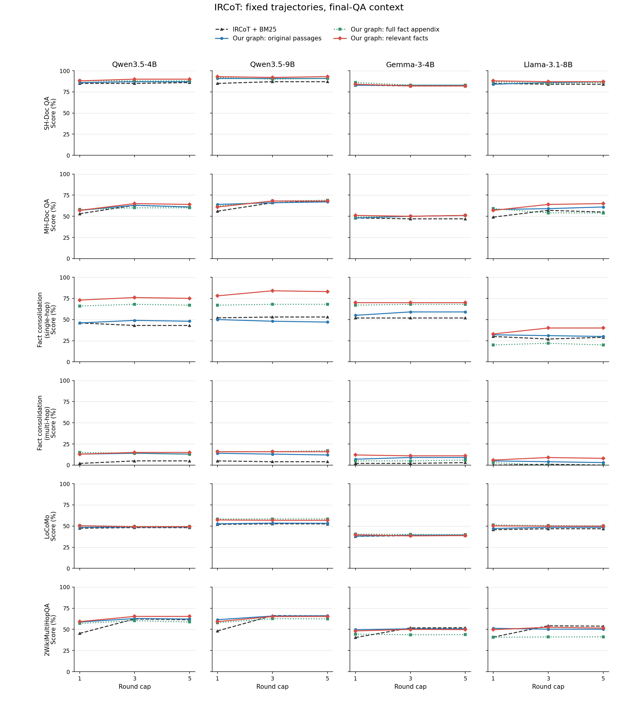

# 实验结果与消融

更新：2026-09-20。算法、代码与贡献解释见 [novelty.md](novelty.md)。本文件维护实验事实与必要的运行状态。

## 当前结果：单次与固定轨迹多轮主表已齐

### 单次 QA：同一配置在四个 reader 均达到至少 5/6

图、来源检索、窗口、OpenIE 和向量不变；保留完整原文，只将原先全量事实附录换成问题相关的十条事实。固定十条和相似度选择沿用 KAPING 组件检验，不按任务或 reader 调参，也不是完整 KAPING 复现。后续三个 reader 直接读取与 Llama 相同的上下文文件，没有重新选择事实。

四组新方法及对应原生九 baseline 均已完成，沿用六任务全部 100/100/100/100/1986/1000 题、原生提示和评分。每格为“新方法 / 九项原生最佳”，百分制；不跨不同指标求平均：

| 任务 | Qwen3.5-4B | Qwen3.5-9B | Gemma-3-4B | Llama-3.1-8B |
|---|---:|---:|---:|---:|
| SH-Doc QA | 93 / 85 | 92 / 88 | 89 / 84 | 87 / 89 |
| MH-Doc QA | 59 / 55 | 63 / 62 | 54 / 50 | 60 / 56 |
| FactConsolidation-SH | 74 / 55 | 81 / 66 | 68 / 60 | 39 / 34 |
| FactConsolidation-MH | 15 / 5 | 17 / 5 | 11 / 6 | 5 / 2 |
| LoCoMo | 49.74 / 50.55 | 56.04 / 54.65 | 38.41 / 40.87 | 49.46 / 48.00 |
| 2WikiMultiHopQA | 59.34 / 49.81 | 59.11 / 52.35 | 49.19 / 44.35 | 50.63 / 42.07 |
| 严格胜出任务数 | 5/6 | 6/6 | 5/6 | 5/6 |

**单次 QA 的四 reader 目标已经达到。** 新的固定轨迹 IRCoT 三档曲线也已齐全，见下方；独立的每轮在线增强实验尚未结束。这是反复使用测试集开发、单 seed 的本地比较，不是全领域 SOTA，也不是独立泛化证据；Qwen9 的单次 MH 仅领先一点，未证明统计显著。

相对各自旧完整方法，Qwen4/Gemma 均为 5 胜 1 负，Qwen9/Llama 均为 4 胜 1 平 1 负。四组 LoCoMo 都有回退：Qwen4 50.15 -> 49.74，Qwen9 57.62 -> 56.04，Gemma 40.00 -> 38.41，Llama 49.57 -> 49.46。Llama 的 QA 输入为 8172137 tokens，旧版为 10491829；质量改善不是所有任务都成立。

各 reader 的 QA 成本如下，均为同一批六任务全部 3386 题的实际 token 累计，不比较不同 tokenizer 的绝对长短。固定原检索来源并保留原文，减少的是事实附录；表中不包含原图构建、查询检索及事实相似度选择成本，因此不是端到端加速结果。

| Reader | 旧版输入 tokens | 新版输入 tokens | 输入减少 | 旧版输出 tokens | 新版输出 tokens |
|---|---:|---:|---:|---:|---:|
| Qwen3.5-4B | 11283658 | 9136162 | 19.03% | 23745 | 22501 |
| Qwen3.5-9B | 11283658 | 9136162 | 19.03% | 28677 | 27849 |
| Gemma-3-4B | 11102210 | 9072131 | 18.29% | 19781 | 20148 |
| Llama-3.1-8B | 10491829 | 8172137 | 22.11% | 32081 | 32648 |

数据来自各 reader 完整 `comparison.json` 的逐任务 QA 计数：三个迁移 reader 对应 `qa_scores_and_costs`，原生对照对应 `qa_costs.optimized_graph`；Llama 新版为 `scores.optimized_graph`，旧版为同环境重排试验中的 `scores.optimized_graph[*].original_cost`。不将压缩率作为新的任务评分，也不掩盖 LoCoMo 的代价。

**同组件补充对照不能省略：** Llama 加同样事实补充后的 BM25 在 FC-SH 为 42，HippoRAG 2 在 SH 为 88，均高于我们；对二者逐任务最佳我们为 4 胜 2 负。因此主表的胜出数明确指九项原生 baseline，不是所有已测配置都占优，也不把本次上下文改动的全部收益归给构图。

Llama 完整产物为 `optimization_fact_context_seed42_20260920/source_and_fact_context/main/meta-llama_Llama-3.1-8B-Instruct`，其余三个为 `optimization_source_fact_transfer_seed42_20260920/main/<reader>/comparison.json`。三组迁移预检 `6540880` / `6540882` / `6540884`、全量 `6540928` / `6540929` / `6540931` 及同环境汇总 `6540932` / `6540934` / `6540936` 均已完成。Qwen9 原生对照 `6540673` 为 `COMPLETED 0:0`，用时 1:18:43。原生对照和迁移的四个一次性脚本分别与 `code_6540673.zip`、`code_6540929.zip` 逐字节核对、检查归档完整性后删除，完整预测、输入和代码归档保留。

获胜操作已加入普通查询接口 `optimization/retriever/query_fact_context.py`，尚未更改默认方法。CPU 预检 `6540993` 在 FC-SH 因误用底座 recognition 缓存而停止，没有静默退回 dense。修正为旧优化图对应的独立缓存副本后，`6541003` 完成六任务、15 组、30 题预检。**全量重放 `6541021` 也已通过全部 3386 题**：100/100/100/100/1986/1000，全部 15 组的原检索结果及上下文文本、分数、元数据完全一致，零新增编码和识别调用。这验证实现重现性，不是新增 QA 成绩或独立泛化证据。两个一次性重放文件与 `main/code_6541021.zip` 逐字节核对、归档完整性检查通过后已删除，结果与缓存保留。

模块验证结束后，原 one-shot 事实补充的 `run_fact_context.py` / `.sbatch` 也与 `optimization_fact_context_seed42_20260920/source_and_fact_context/main/code_6540635.zip` 逐字节核对后删除。完整输入、预测、负结果和归档保留；reader 迁移只读输入，不依赖被删除文件。

下一项 IRCoT 使用同一事实补充操作，仍固定既有轨迹、原文条数和顺序，只改最终 QA 上下文；按原问题选择十条事实，不使用答案或新增子问题。CPU 预检 `6541026` 和全量准备 `6541194` 均成功，后者用时 3 分 16 秒。四 reader 的 GPU 接口预检 Llama/Qwen4/Qwen9/Gemma `6541029` / `6541031` / `6541036` / `6541037` 已全部通过，各为三档轮数、六任务、90 条 QA。按同一设置提交四组全量 `6541203` / `6541210` / `6541220` / `6541221`，各新增 10158 条 QA，合计 40632 条。Llama/Gemma 使用 `gpu`，Qwen4/Qwen9 使用 `gpu-he`；均为 L40S、单 CPU、48 GB、4 小时上限。对照复用已完成且 reader 环境一致的 BM25 原文、图原文及全量附录条件，实际 token 长度先检查，超长报错不删题。目录 `optimization_ircot_fact_context_seed42_20260920`；尚无完整效果结论。

### 固定轨迹 IRCoT：完整四模型曲线

四组全量均已正常结束，共 40632 条新增 QA；统一使用 one-shot 已冻结的相关事实选择配置，不按 reader、任务或轮数选择开关。以下为对同环境 IRCoT + BM25 的胜 / 平 / 负，每格涵盖六个完整任务：

| Reader | 1 轮 | 3 轮 | 5 轮 |
|---|---|---|---|
| Qwen3.5-4B | 6 / 0 / 0 | 6 / 0 / 0 | 6 / 0 / 0 |
| Qwen3.5-9B | 6 / 0 / 0 | 5 / 0 / 1 | 4 / 1 / 1 |
| Gemma-3-4B | 6 / 0 / 0 | 3 / 1 / 2 | 3 / 1 / 2 |
| Llama-3.1-8B | 6 / 0 / 0 | 5 / 0 / 1 | 5 / 0 / 1 |

合计 72 个任务/reader/轮数组合为 61 胜 3 平 8 负。它是条件比较计数，不是问答准确率，也不是把不同任务分数平均得到的新指标。三轮的 Qwen9/Llama 仍在 2Wiki 落后；Gemma 三轮和五轮的 LoCoMo、2Wiki 仍落后。所有曲线共同展示，不逐任务挑轮数拼主表。

[矢量 PDF](figures/ircot_context_curves.pdf)。每行是一个任务，每列是一个 reader；四条曲线分别为 BM25、图原文、完整事实附录和相关事实。分数沿用各任务原生指标，纵轴统一为 0--100。图中增强仅用于固定轨迹的最终 QA，不是每轮推理增强；输入 token 成本不相同，详见各 reader 的结果。汇总 `6542355` 核对全部完成标记、每任务题数及 reader 元数据后生成，未新增 QA。

四组执行脚本 `run_fact_context.py` / `.sbatch` 与最后一组的 `code_6541220.zip`、绘图脚本与 `report_code_6542355.zip` 逐字节核对并检查归档完整性后删除。完整输入、预测、成本、代码归档和图均保留；独立在线实验不依赖这些脚本。

### 新事实补充的 IRCoT：Qwen9 全量结果

`6541220` 为 `COMPLETED 0:0`，用时 1:22:19，三档共 10158 条 QA。对自身图原文的 18 个任务/轮数组合为 14 胜 4 负。三轮详情如下，百分制：

| 任务 | BM25 原文 | 图原文 | 图加完整附录 | 图加相关事实 |
|---|---:|---:|---:|---:|
| SH-Doc QA | 87 | 91 | 90 | 92 |
| MH-Doc QA | 66 | 66 | 68 | 68 |
| FactConsolidation-SH | 53 | 48 | 68 | 84 |
| FactConsolidation-MH | 4 | 13 | 16 | 16 |
| LoCoMo | 52.66 | 53.47 | 58.45 | 56.84 |
| 2WikiMultiHopQA | 66.20 | 65.71 | 62.55 | 65.09 |

三轮 QA 输入为图原文 7095588、完整附录 24701114、相关事实 18135638 tokens。相关事实恢复了部分 2Wiki 分数，但三轮和五轮仍低于 BM25；三档 LoCoMo 均低于完整附录，五轮 MH 与 BM25 持平。完整结果为 `optimization_ircot_fact_context_seed42_20260920/main/Qwen_Qwen3.5-9B/comparison.json`。这些代价与其他 reader 的收益一并报告。

### 新事实补充的 IRCoT：Llama 多轮恢复到多数任务领先

`6541203` 为 `COMPLETED 0:0`，用时 1:06:09，每档覆盖六任务全部 3386 题，三档共 10158 条 QA。对同环境 BM25，1 轮为 6 胜，3/5 轮均为 5 胜 1 负；相对图原文的 18 个任务/轮数组合为 15 胜 1 平 2 负。三轮的六项都高于图原文，详情如下，百分制：

| 任务 | BM25 原文 | 图原文 | 图加完整附录 | 图加相关事实 |
|---|---:|---:|---:|---:|
| SH-Doc QA | 84 | 86 | 85 | 87 |
| MH-Doc QA | 57 | 59 | 54 | 64 |
| FactConsolidation-SH | 27 | 31 | 22 | 40 |
| FactConsolidation-MH | 1 | 4 | 0 | 9 |
| LoCoMo | 46.84 | 48.50 | 50.55 | 49.93 |
| 2WikiMultiHopQA | 54.18 | 50.19 | 40.98 | 52.46 |

这修复了完整附录的大部分退步，但三轮/五轮的 2Wiki 仍低于 BM25，且三档的 LoCoMo 均低于完整附录版本。三轮 QA 输入为图原文 6522947、完整附录 22044505、相关事实 15518335 tokens；新配置比完整附录短，仍比图原文长，不能称为等成本收益。完整表和成本为 `optimization_ircot_fact_context_seed42_20260920/main/meta-llama_Llama-3.1-8B-Instruct/comparison.json`。

该实验固定原 IRCoT 轨迹，只改变最终 QA；独立在线实验尚未结束，不能将上述收益记到每轮推理上。四个 reader 的完整曲线见上表，不按 reader 或轮数切换配置。

### 新事实补充的 IRCoT：Qwen4 三档均胜过 BM25

`6541210` 为 `COMPLETED 0:0`，用时 45 分 47 秒，每档覆盖六任务全部 3386 题，三档共 10158 条 QA。对同环境 BM25，1/3/5 轮均为 6 胜；相对图原文，18 个任务/轮数组合为 16 胜 2 平，无回退。三轮详情如下，百分制：

| 任务 | BM25 原文 | 图原文 | 图加完整附录 | 图加相关事实 |
|---|---:|---:|---:|---:|
| SH-Doc QA | 85 | 87 | 88 | 90 |
| MH-Doc QA | 63 | 63 | 60 | 65 |
| FactConsolidation-SH | 43 | 49 | 68 | 76 |
| FactConsolidation-MH | 5 | 14 | 14 | 15 |
| LoCoMo | 48.21 | 48.91 | 49.59 | 49.23 |
| 2WikiMultiHopQA | 62.26 | 62.77 | 60.30 | 65.29 |

三轮 QA 输入为图原文 6975688、完整附录 24247107、相关事实 17798720 tokens。相对完整附录，LoCoMo 仍下降；相对图原文虽然没有任务回退，但仍付出了更多 QA 输入成本。该结果只涉及固定轨迹后的最终回答，不代表在线子问题生成或检索改善。完整三档及成本位于 `optimization_ircot_fact_context_seed42_20260920/main/Qwen_Qwen3.5-4B/comparison.json`。

Qwen4 的收益与下方 Gemma 的回退同时保留，不按 reader 选择上下文开关；不能用 Qwen4 的全胜替代四 reader 的完整表。

### 新事实补充的 IRCoT：Gemma 多轮仍有回退

`6541221` 为 `COMPLETED 0:0`，用时 38 分 7 秒，每档轮数覆盖六任务全部 3386 题，1/3/5 轮共 10158 条 QA 已逐题重评分。沿用 one-shot 的同一事实补充模块，固定原 IRCoT 轨迹，只改变最终 QA 上下文。对 BM25，1 轮为 6 胜，3/5 轮均为 3 胜 1 平 2 负；不能用一轮结果代表完整曲线。

三轮结果如下，百分制、各任务原生指标：

| 任务 | BM25 原文 | 图原文 | 图加完整附录 | 图加相关事实 |
|---|---:|---:|---:|---:|
| SH-Doc QA | 82 | 83 | 83 | 82 |
| MH-Doc QA | 47 | 50 | 50 | 50 |
| FactConsolidation-SH | 52 | 59 | 68 | 70 |
| FactConsolidation-MH | 2 | 9 | 5 | 11 |
| LoCoMo | 38.72 | 39.28 | 40.10 | 38.39 |
| 2WikiMultiHopQA | 51.69 | 50.58 | 43.59 | 49.92 |

相关事实相对图原文在全部 18 个任务/轮数组合中为 9 胜 2 平 7 负。它改善事实整合，但三轮和五轮的 LoCoMo、2Wiki 仍低于 BM25；相对完整附录恢复部分 2Wiki 分数，不等于解决多轮差距。三轮 QA 输入为图原文 6613683、完整附录 22862162、相关事实 17004248 tokens，不能称为等 token 比较或多轮整体压缩已成功。

完整三档和逐任务成本位于 `optimization_ircot_fact_context_seed42_20260920/main/google_gemma-3-4b-it/comparison.json`。四 reader 的固定轨迹实验均已完成，独立在线增强仍在运行。主表使用同一个事实补充配置，同时报告 Gemma 的回退；不按 reader/轮数切换方法。one-shot 的四 reader 结果不因该回退而改写。

### 四 reader 的完整附录增强已全部结束，不作为统一主方法

四个作业均为 `COMPLETED 0:0`，六任务全量、1/3/5 轮、三条件，共 121896 条 QA。下表全部对本批原生 IRCoT + BM25，单元格为胜 / 平 / 负，不平均不同任务的评分：

| Reader | 图原文：1 轮 | 图原文：3 轮 | 图原文：5 轮 | 增强：1 轮 | 增强：3 轮 | 增强：5 轮 |
|---|---|---|---|---|---|---|
| Qwen4 | 5 / 1 / 0 | 5 / 1 / 0 | 5 / 1 / 0 | 6 / 0 / 0 | 4 / 0 / 2 | 4 / 0 / 2 |
| Qwen9 | 5 / 0 / 1 | 3 / 1 / 2 | 4 / 0 / 2 | 6 / 0 / 0 | 5 / 0 / 1 | 5 / 0 / 1 |
| Gemma | 4 / 2 / 0 | 5 / 0 / 1 | 5 / 0 / 1 | 6 / 0 / 0 | 5 / 0 / 1 | 5 / 0 / 1 |
| Llama | 5 / 0 / 1 | 5 / 0 / 1 | 5 / 0 / 1 | 4 / 0 / 2 | 2 / 0 / 4 | 2 / 1 / 3 |

Qwen9 三轮 BM25 / 图原文 / 增强的六项成绩依次为：SH 87 / 91 / 90，MH 66 / 66 / 68，FC-SH 53 / 48 / 68，FC-MH 4 / 13 / 16，LoCoMo 52.66 / 53.47 / 58.45，2Wiki 66.20 / 65.71 / 62.55。Qwen9 增强相对图原文在三档共 12 胜 1 平 5 负，但 2Wiki 三档均退；三轮 QA 输入从 7095588 增到 24701114 tokens。不能按 reader 挑原文或增强拼统一方法，也不能据 Qwen9/Gemma 的结果推断 Llama 同样受益。

这组实验固定中间轨迹，结论只涉及最终 QA。Qwen9 的完整表位于 `optimization_ircot_context_seed42_20260920/main/Qwen_Qwen3.5-9B/results.md`。Llama/Qwen9/Qwen4/Gemma 作业用时分别为 2:27:58、2:47:17、1:37:47、1:16:47。完成后的 `run_context_qa.py` 和 `run_context_qa.sbatch` 与 `code_6538590.zip` 逐字节核对后已删除，代码归档、缓存、完整预测和全部曲线保留；运行中的在线实验只读取结果，不依赖被删脚本。下方各 reader 的先前进度表述按历史记录保留。

### 最新完整结果：Llama 最终 QA 增强明显回退

`6538590` 已生成完整成功标记，三条件、1/3/5 轮、每条件 3386 题，共 30474 条 QA。对本批 BM25，图原文在三档均为 5 胜 1 负；增强上下文分别为 4 胜 2 负、2 胜 4 负、2 胜 1 平 3 负。三轮详情如下，百分制、各任务原生指标：

| 任务 | BM25 原文 | 图原文 | 图增强上下文 |
|---|---:|---:|---:|
| SH-Doc QA | 84 | 86 | 85 |
| MH-Doc QA | 57 | 59 | 54 |
| FactConsolidation-SH | 27 | 31 | 22 |
| FactConsolidation-MH | 1 | 4 | 0 |
| LoCoMo | 46.84 | 48.50 | 50.55 |
| 2WikiMultiHopQA | 54.18 | 50.19 | 40.98 |

增强相对图原文在 18 个任务/轮数组合中为 5 胜 13 负；不能用 LoCoMo 的收益掩盖其他任务回退。三轮 QA 输入分别为 BM25 5779040、图原文 6522947、图增强 22044505 tokens。该完整增强不作为统一主方法；在线增强属于另一个已启动的独立条件，不能预定其会修复这些问题。完整三档在 `optimization_ircot_context_seed42_20260920/main/meta-llama_Llama-3.1-8B-Instruct/results.md`。本批原文控制与前一重排批次略有分差，分别保留，不据此推断具体硬件或缓存的因果影响，也不拼表取较高分。

### 补齐其余 reader 的同环境原生对照

Llama 已完成当前 vLLM 环境的九项原生 baseline；Qwen4/Qwen9/Gemma 当前仍主要引用历史单次 QA 批次。为避免把环境变化混入方法比较，新增三项固定对照预检 `6540655` / `6540656` / `6540657`，每个 reader 十种方法（九 baseline 加旧完整方法）、六任务各来源组两题，共 300 条 QA。数据、方法、QA 提示与指标均不变，不加重排器、不重新抽取或检索。预检通过后再跑每模型 33860 条全量 QA；完整检索输入只作文件引用。目录 `optimization_native_readers_seed42_20260920`。尚无新分数，不将旧双 6/6 自动当成本批结论。

三项预检随后均完整通过，共 900 条 QA。全量按相同配置提交 Qwen4 `6540672`、Qwen9 `6540673`、Gemma `6540691`，各为 `gpu-he`/L40S、单 CPU、48 GB、8 小时上限；合计新增 101580 条 QA。不是重新搜索 baseline 超参数，也不是用预检分数挑模型或配置，旧缓存和历史结果保留。

### 在线上下文增强：预检通过，Llama 全量已提交

Llama `6540321` 已正常结束，用时 9 分 23 秒。六任务各首组两题的实际在线 IRCoT、1/3/5 轮最终 QA 和原控制器串行重放检查全部通过。区别于下方固定轨迹实验：增强文本也用于每轮推理提示，因而后续子问题和检索结果可能变化；最终 QA 同样使用旧冻结上下文。原文 ID、原生检索过滤和去重不变，取消的只是增强显示的 350 词截断，不宣称等 token 预算。复用旧 OpenIE/图/向量，允许新子问题的编码及识别；费用记录在逐轮轨迹。辅助接入仅给 `optimization/ircot.py` 的最终上下文增加一个默认不启用的转换入口，其余实验默认行为不变。

预检还暴露了必须报告的限制：现有 `GenerationSlot` 仍调用官方 `fit_prompt_into_given_limit`，按 GPT-2 tokenizer 的 8000-token 上限，先移除示例，仍超长时从提示开头删行。实际日志已出现后一种警告，因此不能声称全部增强文本进入每轮 LLM，也不能将重放检查通过误写成上下文完整保留。该原生规则没有为我们单独调大；最终 QA 仍走各任务原生提示及实际 reader 的 32768 上限，两者预算不同。在线全量 `6540627` 已按同一规则提交，仅 Llama，`gpu-he`/L40S、单 CPU、48 GB、12 小时上限。保留六任务全量及三档轮数，对照同环境原生 BM25、图原文和仅最终 QA 增强；尚无在线全量涨分结论。

### 最新完整结果：十条事实替代原文不采用

`6540287` 正常结束，用时 12 分 27 秒。三个方法各完成六任务全部 3386 题，共 10158 条 QA，并逐条重评分。Llama 的结果如下，百分制：

| 任务 | 原完整方法 | 只给十条事实 | 九项原生最佳 |
|---|---:|---:|---:|
| SH-Doc QA | 87 | 70 | 89 |
| MH-Doc QA | 56 | 45 | 56 |
| FactConsolidation-SH | 32 | 2 | 34 |
| FactConsolidation-MH | 0 | 0 | 2 |
| LoCoMo | 49.57 | 39.46 | 48.00 |
| 2WikiMultiHopQA | 43.94 | 38.89 | 42.07 |

对原生九 baseline 六项均负，对我们原文为五负一平，不采用、不扩展其他 reader。QA 输入从 10491829 降到 1947468 tokens，但不能据此把显著质量回退解释成有效压缩。该结果只说明本次事实替代配置无效，不能概括为 KAPING 原论文无效，也未单独证明某种信息丢失就是全部回退的原因。完整缓存与预测在 `optimization_fact_context_seed42_20260920/main/meta-llama_Llama-3.1-8B-Instruct`。

下一项只改事实使用方式：保留检索原文和我们原有的窗口，去掉原先全量事实附录，将同一批问题相关事实作为补充。不更改事实数、来源检索或任务参数，直接复用刚完成的选择结果；对 BM25/HippoRAG 2 同样保留各自原文并补充其已选事实。独立输出为该目录根下 `source_and_fact_context`。CPU 接口预检 `6540619` 和 GPU 预检 `6540621` 已全部通过，三方法、六任务共 90 条 QA。按同一设置提交全量 CPU `6540634` 与 GPU `6540635`，新增三方法各 3386 条 QA；尚无该修正版全量分数。

### 最新完整结果：Qwen4 的增强只在一轮全部领先 BM25

`6538609` 已生成完整成功标记，三条件、1/3/5 轮、每条件全部 3386 题，共 30474 条 QA。图原文对同批 BM25 在三档均为 5 胜 1 平；图增强上下文分别为 6 胜、4 胜 2 负、4 胜 2 负。三轮详情如下，沿用各任务原生指标，百分制：

| 任务 | BM25 原文 | 图原文 | 图增强上下文 |
|---|---:|---:|---:|
| SH-Doc QA | 85 | 87 | 88 |
| MH-Doc QA | 63 | 63 | 60 |
| FactConsolidation-SH | 43 | 49 | 68 |
| FactConsolidation-MH | 5 | 14 | 14 |
| LoCoMo | 48.21 | 48.91 | 49.59 |
| 2WikiMultiHopQA | 62.26 | 62.77 | 60.30 |

三轮和五轮增强均使 MH/2Wiki 低于 BM25；不能只取一轮六项胜出来代表完整曲线。三档结果保存在 `optimization_ircot_context_seed42_20260920/main/Qwen_Qwen3.5-4B/results.md`。增强仍仅作用于固定轨迹的最终 QA，不是每轮在线推理增强；Llama/Qwen9 全量尚未完成。

### 十事实替代原文：执行记录，最终结论见上

借用 KAPING 的问题与事实相似度排序及固定十事实设置，保留原检索来源、OpenIE、Qwen 查询和事实向量，不重新抽取或训练。对 BM25/HippoRAG 2 使用原 OpenIE 事实，对我们使用冻结的保留事实；各自只从已经检索到的来源及既有窗口中选择。QA 改为事实文本，原生问题、提示和指标不变，不称为保持文本证据不变或完整 KAPING 复现。原生九 baseline 仍是主比较，三项同组件比较只是补充。

六任务、15 组各两题的 CPU 预检 `6540260` 因完成标记父目录未创建而失败，未执行 QA；修复输出目录创建后重提 `6540267`，其成功后才启动 Llama GPU 预检 `6540268`。输出位于 `optimization_fact_context_seed42_20260920`，新提取及新编码均禁止，筛选耗时单独记录。预检不是效果筛选，不按样例得分调整十事实设置；完整路径通过前不启动全量。

预检随后完整通过：三方法、六任务共 90 条 QA，缓存来源检查和零新增编码/抽取检查通过。全量按同一配置提交 CPU `6540286` 与依赖它成功的 GPU `6540287`，每方法 3386 题，共新增 10158 条 QA。原文对照及原生九 baseline 使用已有同环境结果；此时尚无全量事实上下文效果结论。

### 最新完整结果：Llama 单次 QA 重排不采用为统一主方法

`6537744` 已生成完整成功标记和逐题核对后的比较表：每条件覆盖六任务全部 3386 题，十项原生条件加三项重排，共 44018 条 QA。本次 L40S/vLLM 同环境结果如下，百分制；不同任务仍使用各自原生指标。

| 任务 | 我们原排序 | 我们加重排 | 九项原生 baseline 最佳 |
|---|---:|---:|---:|
| SH-Doc QA | 87 | 85 | 89 |
| MH-Doc QA | 56 | 61 | 56 |
| FactConsolidation-SH | 32 | 29 | 34 |
| FactConsolidation-MH | 0 | 0 | 2 |
| LoCoMo | 49.57 | 48.53 | 48.00 |
| 2WikiMultiHopQA | 43.94 | 43.85 | 42.07 |

原排序对九项原生最佳为 2 胜 1 平 3 负，新增重排后为 3 胜 3 负，仍未达到 5/6。重排相对我们本次原排序为 1 胜 1 平 4 负；与同样重排的 BM25/HippoRAG 2 的逐任务最佳相比为 2 胜 2 平 2 负。不能将只赢重排后的部分 baseline 写成赢完整九项原生 baseline。该组件不升级为统一 one-shot 主方法，不据 MH 单项提升扩展四 reader。IRCoT 的独立完整比较见下一节。

此前旧版 Llama 的 3 胜 1 平 2 负来自历史推理批次，本次同环境原排序为 2 胜 1 平 3 负；保留两份结果并明确环境差异，不将旧成绩与本轮 baseline 拼表。上述差异也不能仅归因于某一种硬件或推理库。完整产物为 `optimization_context_reranking_seed42_20260920/one_shot/main/meta-llama_Llama-3.1-8B-Instruct/comparison.json`。

### 最新完整结果：Llama IRCoT 重排没有修复多轮 2Wiki

`6537747` 正常结束，1/3/5 轮、两个后端、原排序/重排、六任务均完整，共 40632 条 QA。与 one-shot 一样，只改变固定轨迹最终 QA 的证据顺序，不是在线检索重跑。胜/平/负均按六项任务的原生指标计算：

| 轮数上限 | 图原排序 vs BM25 原排序 | 图重排 vs BM25 原排序 | 图重排 vs BM25 重排 |
|---|---|---|---|
| 1 | 5 / 1 / 0 | 6 / 0 / 0 | 5 / 0 / 1 |
| 3 | 5 / 0 / 1 | 5 / 0 / 1 | 4 / 0 / 2 |
| 5 | 5 / 0 / 1 | 5 / 0 / 1 | 4 / 0 / 2 |

一轮重排后对原生 BM25 的 6/6 保留报告，但不据此丢弃三轮、五轮或同组件对照。图方法相对自身原排序在 18 个任务/轮数组合中为 6 胜 3 平 9 负。2Wiki 答案 F1 的图原排序 / 图重排 / BM25 原排序分别为：一轮 51.33 / 48.73 / 40.75，三轮 50.19 / 49.51 / 53.89，五轮 49.64 / 49.21 / 53.18。重排没有修复多轮 2Wiki 差距，也没有形成对旧方法的统一改善，不升级为统一主方法或扩展四 reader；其他条件仍完整保存。

两项重排全量作业均由 Slurm 确认 `COMPLETED 0:0`，one-shot 用时 1:38:34，IRCoT 用时 1:54:46。`run_context_reranking.py`、`reranker.py`、`run_context_reranking.sbatch` 与 `one_shot/main/meta-llama_Llama-3.1-8B-Instruct/code_6537744.zip` 逐字核对后已从活动实验目录删除。归档、全部预测、评分缓存与对照保留，正在运行的压缩实验仅只读复用结果，不依赖这些脚本。

### 完整结果：Llama 默认 LLMLingua-2 压缩不采用

`6539257` 已生成完整成功标记。三个方法各 3386 条压缩 QA 完成，共新增 10158 条；原文对照逐任务输入与 reader 元数据完全一致后只读复用，九项原生 baseline 未改动。我们原文 / 压缩后的成绩如下：

| 任务 | 原文 | 默认压缩 | 九项原生最佳 |
|---|---:|---:|---:|
| SH-Doc QA | 87 | 85 | 89 |
| MH-Doc QA | 56 | 50 | 56 |
| FactConsolidation-SH | 32 | 27 | 34 |
| FactConsolidation-MH | 0 | 2 | 2 |
| LoCoMo | 49.57 | 42.08 | 48.00 |
| 2WikiMultiHopQA | 43.94 | 46.45 | 42.07 |

对九项原生 baseline 为 1 胜 1 平 4 负，对自身原文为 2 胜 4 负，不采用、不扩展四 reader，也不按任务挑是否压缩。虽然对同样压缩后的 BM25/HippoRAG 2 最佳为 5 胜 1 平，但这不能代替完整原生 baseline 主比较。我们方法的 QA 输入从 10491829 降至 6043170 tokens；三方法联合缓存中新增压缩 17224 段、复用预检 390 段，压缩计算约 799.43 秒，不含模型加载和 QA。节省输入不能抵消当前准确率回退，亦不能据此声称端到端加速比。目录 `optimization_context_compression_seed42_20260920/main/meta-llama_Llama-3.1-8B-Instruct`。

Slurm 确认该作业 `COMPLETED 0:0`，用时 35 分 46 秒。两个临时文件 `run_context_compression.py` / `run_context_compression.sbatch` 与 `code_6539257.zip` 逐字节比对后已删除，完整归档、压缩缓存、预测和负结果保留。

### 完整结果：Gemma IRCoT 上下文增强有收益也有代价

Gemma 的 `6538610` 已生成全部 30474 条 QA 的成功标记，其他 reader 仍独立运行。对同环境 BM25，图原文在 1/3/5 轮分别为 4 胜 2 平、5 胜 1 负、5 胜 1 负；增强上下文分别为 6 胜、5 胜 1 负、5 胜 1 负。保留全部轮数，不只展示一轮全胜。三轮详细结果如下：

| 任务 | BM25 原文 | 图原文 | 图增强上下文 |
|---|---:|---:|---:|
| SH-Doc QA | 82 | 83 | 83 |
| MH-Doc QA | 47 | 50 | 50 |
| FactConsolidation-SH | 52 | 59 | 68 |
| FactConsolidation-MH | 2 | 9 | 5 |
| LoCoMo | 38.72 | 39.28 | 40.10 |
| 2WikiMultiHopQA | 51.69 | 50.58 | 43.59 |

相对图原文，增强在 FC-SH/LoCoMo 提升，但 FC-MH/2Wiki 下降。三轮图方法 QA 输入由 6613683 增至 22862162 tokens，BM25 为 5844631；不称等 token 成本。完整 1/3/5 表保留于 `optimization_ircot_context_seed42_20260920/main/google_gemma-3-4b-it/results.md`。这是固定轨迹最终 QA 的变化，不能解释成在线检索能力改善；统一方法是否采用增强，仍需等其余 reader 完整结果。

### 先前执行记录

最新目标已由用户更新为：one-shot 同一配置在四个 reader 上分别至少 5/6 任务严格领先，并为 IRCoT 补上上下文增强；先优化完整方法，稳定后再回顾和设计系统性消融。旧版 Llama 仍为 3 胜、1 平、2 负，尚未满足新目标。下方此前“多数条件”“三个 reader”等表述均为历史门槛，不能当作本轮完成依据。

新提交的上下文增强预检为 Llama `6538388`、Qwen9B `6538389`、Qwen4B `6538390`、Gemma `6538391`，输出 `optimization_ircot_context_seed42_20260920`。它们直接将旧版已冻结的事实附录和相邻原文接到 IRCoT 最终 QA，固定图、候选、原始证据顺序和推理轨迹；对照为 BM25 原文与我们原文，全部保留 1/3/5 轮。预检每条件覆盖六任务 15 组各两题，不是全量效果结果。共用 reader 新增无生成的 token 长度检查接口，语法与原 tokenization 路径检查通过；实际模型预检正在进行。增强文字不用于宣称原文精确匹配的检索指标变化，输出单独报告 QA 分数和实际 token 成本。它还不是每轮在线上下文增强，后者需要重新运行 IRCoT。

旧完整方法仍作为主方法和固定参照。单次 QA 相对九项 baseline 的严格胜出数为 Qwen4B 6/6、Qwen9B 6/6、Gemma 5/6、Llama 3/6。旧图加 BM25 的 IRCoT 在统一三轮时为 19 胜、2 平、3 负；这是多数任务收益，不是全面胜出或构图独立归因。具体分数见下方“旧图加 BM25”及模块消融；未融合旧图不能混称为同一版本。

上下文增强更新：Llama 与 Qwen9B 预检已生成完整成功标记，实际 reader 的长度检查和三个条件、1/3/5 轮 QA 均通过。全量已提交 `6538590` / `6538593`，每组 3386 题乘三条件乘三轮上限，共 30474 条 QA；资源为 `gpu-he`/L40S、单 CPU、48 GB、4 小时上限。Qwen4B/Gemma 尚待各自预检完成。这里只确认运行路径通过，不据预检宣布涨分，尚无全量比较结果。

后续进展：Qwen4B / Gemma 也已通过完整预检，其全量分别提交为 `6538609` / `6538610`，设置与另外两个 reader 相同。四组全量均已提交，尚未形成完整成绩表。Llama 增强上下文预检的 18 个任务/轮数组合最高输入为 15641 tokens、无超长题；这是预检范围的长度检查，不代表全量不会超长。

全量长度检查随后全部通过：四个 reader、三档轮数、三个条件、六任务共 216 份长度记录，合计 121896 次实际提示检查，最高输入 21591 tokens，计入回答预算后超长题数为零。此数是生成前的检查次数，不是已完成 QA 数。`optimization/ircot.py` 仅保留已通过四模型实测的 `check_context` 接口，原 tokenization 与聊天模板参数不变；另通过输入长度边界测试。先前未启用、未验证的 BM25 缓存复用草稿分支已移除，现有运行与缓存不受影响。

暂停探索与清理：`optimization_fact_sources_seed42_20260920` 的 CPU 预检 `6537106` 正常结束，后续全量与 QA 作业均已取消，没有完整 QA 效果结论。此分支在恢复旧完整方法优先级时暂停，不记为负结果。闲置的 `run_fact_sources.py` 与 `run_fact_sources.sbatch` 已与 `pilot/code_6537106.zip` 逐字核对后删除；运行代码归档、缓存及日志保留。

上下文压缩候选：`6538983` 开始预检官方 LLMLingua-2 已发布 mBERT 权重及默认 0.5 保留率，无新训练或任务专属规则。BM25、HippoRAG 2、我们各比较原文/压缩，全部沿用原生 QA；每条件六任务 15 组各两题，共 180 条 QA。目录 `optimization_context_compression_seed42_20260920`，代码和启动脚本语法检查通过，实际模型预检尚未完成。这里只是第三方压缩组件的候选检验，不是已取得涨分结果，也不是新的图算法；主比较仍需完整九 baseline。来源与边界见 [research_plan.md](research_plan.md)。

压缩预检已成功完成：390 段不同文本、180 条 QA，未根据样例分数调整比例。全量 `6539257` 已提交并依赖 `6537744` 成功结束；三种方法各全量 3386 题，新增 10158 条压缩 QA。原文对照和完整九项原生 baseline 复用相同 reader 设置的已完成结果，额外验证原文输入完全一致。此处尚无全量压缩分数，不宣布采用该候选。

当前新实验使用 Qwen3-Reranker-0.6B 已缓存官方权重（版本 `e61197ed45024b0ed8a2d74b80b4d909f1255473`），仅重排既有证据，不改变内容和数量。按用户澄清后的协议，单次保留九项 baseline 与我们的完整原生排序，只给 BM25/HippoRAG 2/我们增加重排补充控制；IRCoT 对同次融合版的 BM25/图后端在 1/3/5 轮同样处理。重排器不读取答案，不训练参数；最终 QA 都在相同 Llama/vLLM 设置重新运行。原生完整系统比较、自身新增模块消融、相同外接组件的控制分开报告，不把新增模型收益全部归给图，也不把三项重排控制称为九项全量重排比较。

Llama one-shot 预检为 `6537471`，IRCoT 预检为 `6537413`，均使用 `gpu-debug` 的 L40S、单 CPU、48 GB、55 分钟。原来只覆盖 BM25 的单次预检 `6537412` 已取消；扩大为九项 baseline 后重新预检。通过前不启动全量，不以 30 题预检预测涨分。输出为 `optimization_context_reranking_seed42_20260920`。IRCoT 当前只改最终 QA 的证据顺序，不是重跑在线控制器；后续在线实验须单独验证。各方法既有上下文预算仍不同，不称为等 token 预算实验。

用户随后明确：公平不等于强制替换各方法原生 reranker。上面统一外接重排的两项预检保留为补充控制，未扩展九 baseline 全员重排；主结果仍保留各算法完整原生流程。当前接入代码中，HippoRAG 2/CatRAG 的 DSPy 筛选针对三元组，CatRAG 另有查询相关图边调整；AnchorMem 的 `rerank_facts` 实际为向量 top-k 后展开出处；它们不能统称为 Qwen 段落重排。新增 reranker 的成本与收益须单独报告，不能归给改图。

两项预检随后均成功结束，分别耗时 7 分 48 秒与 7 分 29 秒，原六任务、15 组各两题的所有条件共 960 条 QA 均完整；原题和完整文件覆盖也已核对。没有据小样本分数选择参数。全量 one-shot `6537744`（`gpu`/L40S，十种原生排序加三项重排，共 44018 条 QA）与固定轨迹 IRCoT `6537747`（`gpu-he`/L40S，共 40632 条 QA）已启动评分准备，各单 CPU、48 GB、4 小时上限。报告单列原生九项 baseline 最佳与已重排的两项 baseline 最佳，避免混淆比较范围；记录各条件实际 QA 输入/输出 token 与证据条数。暂不报告新方法涨分或 Llama 达标。

交接更新（2026-09-19 晚）：四 reader 新事实图 IRCoT 已生成完整 `results.md` / `comparison.json`，gold-only 的四 reader、每条件 1000 题也已生成 `main/complete.json`。下面“尚无结果”等文字是先前时间点的记录，不代表最新状态。主实验共享入口见 [peer_handoff.md](docs/peer_handoff.md)；按用户要求，共享目录不包含消融、gold-only 或其他诊断，这些原始产物仍保留。未重新解释为全面 SOTA，也未修改原始成绩。

最新目标：用户允许单次与多轮实验在多数条件下领先，不再要求所有单元格全胜。多轮报告 1、3、5 轮曲线，已跑的 7 轮保留为补充；事后选择主表轮数须说明，逐任务最佳轮数单列且允许 baseline 在同一范围选择。不删历史结果，不把任务平局计作严格获胜，保留 test-as-dev 声明。报告入口改为逐模型列胜、平、负及完整覆盖状态；原指标、原分数和缺失处理不变。保留旧完整方法并检查追加上下文选择的收益，见 [research_plan.md](research_plan.md)；下面的既有实验不改名为新算法结果。

### 吸收随机游走排序：全量完成，不采用

最新结论：两个 reader、五条件、六任务全部完成，共 33860 条预测。CPU 汇总 `6532670` 成功（39 秒），逐题核对原生指标、题目与上下文，另行核对先前完整九项 baseline。对比先前逐任务最佳，事实图吸收排序在 Gemma 为 3 胜 3 负、Qwen4B 为 2 胜 4 负；这些 baseline 是跨批次参考，不冒充同批生成。**不采用该排序，不扩展到另外两个 reader 或 IRCoT。** 此结论不意味着原 GRASSHOPPER 摘要方法无效。

下表为同批事实图原排序 / 吸收排序，百分制：

| 任务 | Gemma | Qwen4B |
|---|---:|---:|
| SH-Doc QA | 84 / 86 | 84 / 84 |
| MH-Doc QA | 53 / 53 | 59 / 58 |
| FactConsolidation-SH | 48 / 51 | 50 / 48 |
| FactConsolidation-MH | 4 / 5 | 3 / 4 |
| LoCoMo | 38.27 / 38.65 | 45.32 / 44.76 |
| 2WikiMultiHopQA | 50.30 / 48.89 | 57.89 / 57.26 |

相对原排序，Gemma 为 4 胜 1 平 1 负，Qwen4B 为 1 胜 1 平 4 负。2Wiki 段落 Recall@5 从 81.80% 降至 81.175%，两个 reader 的答案 F1 同时下降。完整五条件及九 baseline 表见实验目录 `main/results.md`，逐题核对与用量见 `main/comparison.json`。方法、测试与临时入口已保存到校验通过的 `rejected_method.zip` 后从活动目录删除，所有原始缓存与结果保留。下方提交及预检状态为历史记录。

六任务检索均已完成，2Wiki 作业 `6532527` 用时 50 分 48 秒、1000 题及 2000 次旧检索重放通过，零 recognition 缓存缺失。其排序变化题数为原 HippoRAG 61/1000、事实图 585/1000，包含只换顺序的情况。查询缓存作业 `6533630` 已正常结束，临时生成脚本与 ZIP 逐字核对一致后删除，缓存、原始输出及归档保留。

依据 [GRASSHOPPER](https://aclanthology.org/N07-1013/) 比较五项：BM25，以及原 HippoRAG 图和事实图各自的 PPR / 吸收排序。图内固定查询候选、筛选、起点、damping=0.5、五条原文及原生 QA；只让原文成为输出和吸收状态是本项目的适配，不是论文完整复现。第一条证据保持不变，无新训练、重新抽取或 generator 调用。

CPU 预检 `6532329` 在 `batch` 运行。其三项测试已通过：论文矩阵公式与稀疏解一致、图转移与 igraph 稳态一致（含自环和孤立节点）、仅原文可选且首条不变。接下来核对六任务 15 组共 30 题的旧检索重放、候选及起点一致性，记录求解残差和耗时。尚无完整检索或 QA 结论。

Gemma 预检 `6532330` 在 `gpu-debug`，Qwen4B 预检 `6532331` 在 `gpu`；均依赖 CPU 成功、各一张 L40S/单 CPU/48 GB 内存/55 分钟，依赖失败则取消。两项 QA 分别使用独立结果目录，复用同一冻结检索输出。产物为 `optimization_absorbing_ranking_seed42_20260919`，脚本仅放 scratch，主方法默认配置及 peer share 未改。预检通过后才做全部六任务，不用 30 题分数选择设置。

全量已预先提交依赖链，不表示已经通过预检或得到成绩。两项 QA 预检均成功后，六个 `batch` 作业分别执行 SH `6532522`、MH `6532523`、FC-SH `6532524`、FC-MH `6532525`、LoCoMo `6532526`、2Wiki `6532527`；每项保持完整任务、单 CPU、48 GB、4 小时上限。任务间输出目录不同，共享原始索引只读。六项全部成功后，Gemma `6532539`（`gpu-debug`，55 分钟）与 Qwen4B `6532540`（`gpu-he`，2 小时）各运行全部五条件 QA。依赖失败取消，不重复提交同一实验。

本轮缓存复用针对抽取、向量、recognition、已完成检索及 QA 条件；没有改变原生生成温度或跨方法拼接历史答案。MAB 温度为 0.7，LoCoMo 为 0.4，2Wiki 为 0；固定 seed 不保证不同批次生成逐字一致。未来如引入请求级答案缓存，需单独记录执行协议及实际新增调用成本，不能默认为本轮已经实现。

预检现已完整成功：CPU `6532329` 用时 3 分 15 秒，Gemma `6532330` 用时 2 分 24 秒，Qwen4B `6532331` 用时 4 分 30 秒。六份检索完成文件合计 30 题、60 次原检索重放、零 recognition 缓存缺失。候选和起点完全相同；吸收排序改变原 HippoRAG 的 1/30 个结果、事实图的 19/30 个结果，计数包含仅顺序改变的情况，不等于新增证据或 QA 改善。

下表为预检原生 QA，百分制；每格是“原排序 / 吸收排序”。MAB 每项仅 2 题，LoCoMo 20 题，2Wiki 2 题，不用于方法选择或完整任务胜负计数。

| 任务 | Gemma HippoRAG | Gemma 事实图 | Qwen4B HippoRAG | Qwen4B 事实图 |
|---|---:|---:|---:|---:|
| SH-Doc QA | 50 / 50 | 50 / 50 | 100 / 100 | 100 / 100 |
| MH-Doc QA | 50 / 50 | 0 / 0 | 50 / 50 | 50 / 50 |
| FactConsolidation-SH | 50 / 50 | 50 / 50 | 50 / 50 | 50 / 50 |
| FactConsolidation-MH | 0 / 0 | 0 / 0 | 0 / 0 | 0 / 0 |
| LoCoMo | 31.29 / 29.21 | 24.06 / 25.12 | 30.87 / 30.87 | 18.30 / 17.49 |
| 2WikiMultiHopQA | 75 / 75 | 75 / 25 | 100 / 100 | 100 / 100 |

2Wiki 两题中，四个图条件的段落 Recall@5 均为 100%，Gemma 事实图 QA 仍下降。这只是预检现象，不证明排序是唯一原因，也不支持根据这两题改算法。六任务全量依赖条件已满足，参数不变。自动汇总 `6532670` 依赖两个全量 reader 成功，复用 `experiments/report_fact_graph.py` 的 `components` 入口，核对逐题原生评分和上下文身份，分别报告同批五条件与先前九项 baseline 参考，不将后者冒充同批生成。

全量检索阶段：四项 MAB 已完整完成，共 400 题、800 次旧检索重放，零 recognition 缓存缺失；LoCoMo / 2Wiki 在最近一次核对时仍运行，未取消或重复提交。单独的查询编码缓存准备 `6533630` 已提交到 `gpu-he`，不改变这些作业。产物另存 `optimization_query_embeddings_seed42_20260919`，需全量原检索重放通过才采用；目前不声称已提速或与 CPU 编码数值相同。只增加向量缓存读写接口，未改检索公式或模型参数。

LoCoMo 检索随后成功（27 分 54 秒），加四项 MAB 共 2386 题、4772 次原检索重放，零 recognition 缓存缺失；2Wiki 继续。为重叠 CPU 检索与 GPU QA，Gemma `6533725`、Qwen4B `6533726` 先评测这五项完整任务；原 QA `6532539` / `6532540` 改为分别依赖对应五项 QA 和 2Wiki 检索 `6532527`，随后跳过已有完成条件、补齐 2Wiki 并生成六项完整标记。每个 reader 的写入串行，两个 reader 独立，不把五任务标记当作六任务完成。模型、原生生成参数和题目均不变；每个任务内五条件使用同一引擎，任务间会重新加载 reader，执行成本分别保留。

查询缓存全量验证现已完成：`optimization_query_embeddings_seed42_20260919/complete.json` 覆盖全部六任务、15 组、3386 题。五项测试通过，序列化前后向量精确相同，配置及维度不匹配会拒绝加载。清空内存查询表、加载 GPU 批量缓存并禁止新编码后，原 HippoRAG 的五条证据与顺序逐题重放一致，零 recognition 缓存缺失。累计 GPU 编码 5.7829 秒、检索重放 302.0463 秒，均不含模型和索引加载；不声称向量与历史 CPU 结果逐位相同或端到端只需上述时间。当前吸收排序主实验仍使用原 CPU 编码路径，未中途切换。

Gemma 前五项完整 QA 已完成，事实图原排序 / 吸收排序为：SH 84/86、MH 53/53、FC-SH 48/51、FC-MH 4/5、LoCoMo 38.27/38.65。虽有局部提高，LoCoMo 仍低于同批原 HippoRAG 的 40.05；2Wiki 尚未补齐，不作六任务胜负结论或最终方法选择。

### Propositionizer：生成兼容性修复，未采用

新预检 `6534297` 使用作者发布的同一模型及原 30 条源文本，在已有 Transformers 4.51.0 环境完成生成；没有新训练、问题或答案输入。两批生成分别用时 8.33 / 2.17 秒，包含加载的脚本总用时 29.29 秒。仅 22/30 条输出是完整 JSON：LoCoMo 20/20、2Wiki 2/2；四项 MAB 的各两条均达到作者示例的 512 输出 token 上限，缺少结束标记。作业因此在最后的完整性检查失败，不能将生成已执行写成预检通过。

手工对照也发现语义错误：LoCoMo `locomo-conv-26` 的第二条原文是 Melanie 对 Caroline 说对方热心帮助孩子，输出却将热心帮助孩子归给 Melanie；该条还新增了原文未明确给出的平等对待内容。这只是所检查样例，不是全语料错误率。输出上限不兼容和语义失真是两类问题，不归为同一个失败原因。不修补 JSON、不删掉失败输入、不启动全库生成或 QA，也不能由这项 30 条检查断言原论文方法普遍无效。

原始文本、生成结果、环境和代码归档保留在 `optimization_propositions_seed42_20260919/transformers4`。前置 `6534251` 缺少 SentencePiece 的失败及更早 `6525097` 的配置断言失败也保留；已结束的临时入口清理，模型权重与原有环境不动。

### Gold-Only QA：四 Reader 已完成

用户澄清的问题是“正确 evidence 不保证 reader 答对”，不是仅指模块数量。新增诊断固定四个 reader 的原生 QA，比较 2Wiki 标注支持段落、冻结 BM25、当前无相似边事实图三种证据。标注段落沿用原加载器顺序，不改问题、答案、提示或 F1；三项同次重算，全部覆盖 HippoRAG 发布的 1000 题。gold-only 是使用测试标注的 oracle 条件，不是方法成绩或严格上限；段落数量不同，不能单独解释成噪声或顺序的因果效应。

预检 `6525861` 与全量 `6525863` 已完成，`optimization_gold_evidence_seed42_20260919/main/complete.json` 确认四 reader、每条件 1000 题，共 12000 条预测。一张 L40S、单 CPU，reader 串行。下表为同次运行的答案 F1，百分制；其他五任务的主实验范围不变，不额外制造证据标注。

| Reader | Gold-only | BM25 | 无相似边事实图 |
|---|---:|---:|---:|
| Qwen3.5-4B | 70.68 | 42.64 | 58.14 |
| Qwen3.5-9B | 72.15 | 45.31 | 57.38 |
| Gemma-3-4B | 61.66 | 39.36 | 50.11 |
| Llama-3.1-8B | 68.14 | 38.58 | 50.53 |

四 reader 均表现为 gold-only 高于事实图、事实图高于 BM25。说明标注证据条件下仍有改进空间，但不能只凭这张表把差距归因于图、噪声或 reader，也不把 gold-only 当作可部署方法成绩。本次重算和其他批次存在小幅生成差异，因此对照使用本表同批结果，不拼接不同批次的最佳分数。

### LLM 事实筛选消融：Gemma 六任务已完成

最新状态：`exact_context` 全量作业 `6525600` 已完成，五项各覆盖全部 3386 题。来源为 `optimization_recognition_ablation_seed42_20260919/exact_context/main/google_gemma-3-4b-it/complete.json`。下表使用各任务原生 QA 指标，百分制。

| 任务 | BM25 | HippoRAG 2 | HippoRAG 2 去筛选 | 事实图 | 事实图去筛选 |
|---|---:|---:|---:|---:|---:|
| SH-Doc QA | 77 | 84 | 83 | 83 | 78 |
| MH-Doc QA | 43 | 50 | 47 | 53 | 46 |
| FactConsolidation-SH | 51 | 45 | 48 | 48 | 58 |
| FactConsolidation-MH | 3 | 3 | 2 | 4 | 4 |
| LoCoMo | 34.52 | 39.98 | 38.48 | 38.38 | 37.57 |
| 2WikiMultiHopQA | 39.35 | 44.37 | 42.83 | 50.30 | 46.64 |

**结论：不采用全局删除事实筛选。** 在当前事实图上，删除后为 1 胜、1 平、4 负；FC-SH 提高，但文档 QA、LoCoMo、2Wiki 回退。这里仅验证 Gemma，不外推其他 reader；不据此添加按任务启用筛选的规则。下面保留预检与失败过程，其中“尚无成绩”是历史状态。

新增固定抽取和 reader 的五项对照：BM25，原 HippoRAG 2 与当前事实图各自保留/去掉 LLM 事实筛选。沿用 [HippoRAG 2 表 4 的去掉 filter 对照](https://arxiv.org/html/2502.14802v2#S6.SS1)，直接保留相同的五个向量候选，不添加新打分、数据规则或生成模型。原图与事实图还包含既有起点差异，不称为纯拓扑比较；去掉筛选也改变空筛选时的 dense fallback。

首个预检 `6525392` 因目录名与原任务名混用，在配置解析处失败，未检索；依赖全量 `6525399` 自动取消。已改用已有任务名映射，六任务配置解析与筛选开关检查通过，替代预检 `6525421` 已提交。计划先通过 15 组共 30 题的两项旧检索重建、候选一致性和五项原生 QA 检查，再执行全部 3386 题。输出为 `optimization_recognition_ablation_seed42_20260919`，目前没有新 QA 成绩，不能据此宣布删除筛选无损。

替代预检的 `pilot/retrieval_complete.json` 已确认六任务、30 题检索完成，60 次旧检索的证据与分数重建通过，开关筛选前候选一致，零 recognition 缓存缺失。QA 预检尚未确认完成。全量 `6525517` 依赖预检全部成功，不依赖样例 QA 分数是否上升。

后续状态：`6525421` 完整成功（3 分 26 秒），五项原生 QA 预检通过。`6525517` 全量失败（1 分 21 秒），原因不是 QA 回退：在 FC-SH 核对旧检索得分时，一项相差约 `3.19e-9`，超过原脚本容差，五条原文及顺序仍完全一致。新运行 `exact_context` 不放宽容差或声称分数一致，而是严格核对原文和顺序、保存所有内部得分差异；原生 QA 不使用这些分数。新预检 `6525598` 与依赖全量 `6525600` 保持同一检索方法和原生评分，旧目录保留。目前仍无本消融的全量 QA 结论。

固定多轮查询的 CPU 回放检查也已开始，仅核对已有 Gemma/BM25 六任务、三个轮数的轨迹，不换检索器、不生成新答案。首个 `6525576` 因未设置现有 HF 缓存路径，在初始化 tokenizer 时失败；补充缓存路径后的替代作业为 `6525607`。该检查不作为新方法效果结果。

替代回放已成功（6 分 3 秒）：3386 题、10158 个检查点的原查询和最终证据完全一致，原轨迹共有 9913 次检索请求，零新增 LLM 调用。产物 `optimization_ircot_fixed_query_replay_seed42_20260919/verification.json`；两份临时脚本已核对 ZIP 归档并删除。这不是替换图后的效果结果。

另一个 Propositionizer 预检已暂停：准备 `6525095` 成功，GPU `6525097` 在生成配置属性断言处失败，尚未产生文本。这是执行预检失败，不是该方法质量差的证据。未重新抽取全库；两份脚本核对 ZIP 归档后删除，缓存、权重和日志保留。原四模型 IRCoT 作业未修改。

### Gemma 新图 IRCoT：六任务已完成

作业 `6520055` 成功（4 小时 35 分），三后端、1/3/5 轮、全部六任务均完成，每个条件 3386 题。已核对所有 54 个 QA 完成记录的题数、原生评分与完整状态。其他三个 reader 尚未全部完成，因此不据此宣布四模型结果或最终方法选择。

下表每格为“BM25 / 保留相似边的事实图 / 删除相似边的事实图”，百分制。各任务仍用各自原生指标，不跨任务求平均。

| 任务 | 1 轮 | 3 轮 | 5 轮 |
|---|---:|---:|---:|
| SH-Doc QA | 83 / 79 / 81 | 83 / 75 / 78 | 83 / 75 / 78 |
| MH-Doc QA | 48 / 56 / 54 | 45 / 54 / 54 | 45 / 54 / 54 |
| FactConsolidation-SH | 51 / 36 / 45 | 53 / 36 / 43 | 53 / 36 / 43 |
| FactConsolidation-MH | 2 / 4 / 4 | 2 / 4 / 4 | 3 / 4 / 4 |
| LoCoMo | 38.01 / 39.13 / 38.81 | 38.74 / 39.37 / 39.64 | 38.86 / 39.29 / 39.78 |
| 2WikiMultiHopQA | 40.29 / 48.83 / 49.04 | 51.44 / 52.24 / 51.43 | 51.77 / 51.82 / 50.65 |

保留相似边的事实图对 BM25 在三个轮数均为 4 胜 2 负；删边版分别为 4 胜 2 负、3 胜 3 负、3 胜 3 负，按未四舍五入分数计数。2Wiki 的 3 轮删边版为 51.426588，对 BM25 51.438926，不能将显示精度接近当作平局或获胜。两图的完整轨迹分别生成，差异包含后续查询变化，不是固定查询下的纯检索差异；该结果也不能自动归因于 reader。

### 新事实图的 IRCoT 与九项 Baseline QA

新图多轮预检已全部成功：Gemma `6519803`（9 分 33 秒）、Qwen4B `6519913`（13 分 12 秒）、Qwen9B `6519917`（10 分 27 秒）、Llama `6519918`（12 分 34 秒）。每个 reader 先在全部 15 组上，对保留/删除相似边的图各重放前两题，共 60 次单次检索，与既有缓存的材料及分数一致，零 recognition 缓存缺失。然后在六任务各第一组前两题检验三后端、三个轮数，共 54 项原生 QA；官方控制器重放检查全部通过。LoCoMo 的多轮预检只取第一组两题，不能作为该任务全量结果。

三后端为官方 Elasticsearch BM25、事实均匀起点图、删除相似实体边的事实均匀起点图。每轮取 6 条、累计上限 15 条、最多 5 轮，从同一轨迹报告 1、3、5 轮，保持官方提前停止规则，各上限用原任务 QA 提示与指标重新生成并评分。没有融合、相邻窗口或事实附录。新子问题使用本地 Qwen3-30B-A3B recognition，原抽取、向量与缓存复用；失败中止，不静默降级。它是 IRCoT 检索接入六任务原生 QA，不是声称六任务均为官方完整 IRCoT 问答复现。

预检还检查了同一 vLLM 引擎上 16 个 reasoning 请求的串行与批量执行，清空缓存并预热后的时间如下。只表示该小批次，不是完整运行加速比；控制器等价是重放等价，不能据此宣称生成逐字不变。

| Reader | 串行秒 | 批量秒 | 文字完全相同 |
|---|---:|---:|---:|
| Gemma | 8.26 | 4.20 | 16/16 |
| Qwen4B | 9.65 | 6.67 | 15/16 |
| Qwen9B | 18.64 | 8.87 | 15/16 |
| Llama | 17.14 | 9.24 | 13/16 |

全量作业已提交：Gemma `6520055`、Qwen4B `6520056`、Qwen9B `6520057`、Llama `6520060`，目录为 `optimization_ircot_fact_graph_seed42_20260919`。各 reader 内三后端使用同一 L40S/vLLM 设置重新运行轨迹与 QA，不复用旧图分数，目前尚无完整结果。误重复提交的 4B 预检 `6519915` 在未分配节点、零运行时间时取消，没有参与结果。

单次九项 baseline 加新候选的 QA 重算沿用 `optimization.report_results.BASELINES` 的九个完整缓存路径，每项保留原检索输出和条数，先核对六任务全部题目一致，再用相同 reader 的原生 QA 评测。不因某项缺失而缩减任务或 baseline，也不复用历史 QA 分数。四个预检均成功：Gemma `6520078`（2 分钟）、Qwen4B `6520284`（3 分 17 秒）、Qwen9B `6520285`（3 分 32 秒）、Llama `6520286`（2 分 5 秒）；每项 30 题、每个 reader 60 项原生 QA 核对通过。Gemma 全量为 `6520283`，其余三个全量为 `6520643`、`6520646`、`6520647`，目录为 `optimization_fact_graph_main_qa_seed42_20260919`，尚待完整结果。

上述单次全量现已全部成功，Gemma、Qwen4B、Qwen9B、Llama 分别耗时 24 分 53 秒、36 分 37 秒、67 分 3 秒、53 分 13 秒。CPU 汇总 `6520819` 成功（45 秒），重新核对四模型、十方法、六任务的全部 135440 条预测，包括原题顺序、证据、原生评分与 token 用量。完整表在输出目录的 `results.md`，机器可读结果在 `comparison.json`。前段的提交状态为历史记录，当前以本段为准。

后三个单次 reader 的预检最初受 `gpu-he` 的 `QOSMaxGRESPerUser` 限制，未运行时改到用户账户允许的普通 `gpu` / `norm-gpu`，全量最初同样覆盖分区与 QOS；Gemma 保持 `gpu-he`。Gemma 完成后，仍排队的 Llama 全量改回 `gpu-he`，未重启运行中作业。所有作业保持 L40S、单 CPU、同一模型版本和原生推理配置，不因分区调整更改评测条件。

下表每格为“新事实图 / 九项 baseline 中最佳分数”，百分制。胜平负按未四舍五入分数计算，不混入旧完整方法的历史 QA。

| 任务 | Qwen4B | Qwen9B | Gemma | Llama |
|---|---:|---:|---:|---:|
| SH-Doc QA | 84 / 86 | 85 / 89 | 84 / 85 | 83 / 89 |
| MH-Doc QA | 59 / 55 | 62 / 62 | 53 / 50 | 60 / 55 |
| FactConsolidation-SH | 50 / 53 | 47 / 66 | 48 / 60 | 28 / 35 |
| FactConsolidation-MH | 3 / 5 | 7 / 5 | 4 / 6 | 2 / 2 |
| LoCoMo | 45.33 / 50.80 | 47.51 / 54.77 | 38.32 / 40.82 | 43.58 / 47.82 |
| 2WikiMultiHopQA | 57.89 / 49.98 | 57.12 / 51.97 | 50.30 / 44.37 | 50.28 / 42.06 |
| 胜 / 平 / 负 | 2 / 0 / 4 | 2 / 1 / 3 | 2 / 0 / 4 | 2 / 1 / 3 |

四模型对 BM25 均为 5 胜 1 负，但这不等于对九项 baseline 或全领域 SOTA。2Wiki 的收益跨四个 reader 出现，SH、LoCoMo 则全部落后于最佳 baseline；不能将当前图定为通用更优方法。多轮作业仍在运行，CPU 汇总 `6520821` 依赖四项全部成功后才生成完整曲线。

初步人工检查了 Gemma FC-SH 中按原始顺序最早两道“新图失败、LightMem 成功”的题（`factconsolidation_sh_262k_no0`、`no2`）。两题的新图原文里均含目标答案及旧值，所以这两例不属于完全未召回答案文本。第一题 LightMem 同时回答两个大学，因包含目标答案而获得原生 substring EM 满分；该分数不证明它选出了唯一正确的最新值。第二题 LightMem 只回答目标国家。这里仅是两个例子，不是全量失败归因，不修改指标或用枚举答案提高分数。

#### 单次失败诊断与上下文对照

CPU 诊断 `6522293` 已成功（16 秒），复用已有原生评分与 `experiments.analyze_failures.benchmark_category_scores`，没有模型调用或新增题型。产物为同目录 `failure_analysis.json`：四个 reader、全部六任务的逐题胜平负及原始顺序中最早两个胜例、负例；比较对象明确选为各任务本轮最佳 baseline，仅用于描述性分析。LoCoMo 另外保留所有十项方法的官方题型分数。

下面每格为“新图 / 该 reader 的 LoCoMo 最佳 baseline”，使用原有 F1；Qwen4B/9B、Llama 对照 AnchorMem official，Gemma 对照 CatRAG。

| LoCoMo 原生题型 | 题数 | Qwen4B | Qwen9B | Gemma | Llama |
|---|---:|---:|---:|---:|---:|
| 多跳 | 282 | 26.82 / 40.67 | 28.70 / 40.32 | 26.64 / 31.00 | 26.93 / 41.39 |
| 时间 | 321 | 33.51 / 38.14 | 35.84 / 42.19 | 33.43 / 37.03 | 31.30 / 37.99 |
| 开放域 | 96 | 16.47 / 17.46 | 13.44 / 16.96 | 6.89 / 9.16 | 16.94 / 12.34 |
| 单跳 | 841 | 42.60 / 60.75 | 43.71 / 61.62 | 37.22 / 44.18 | 42.90 / 59.60 |
| 对抗 | 446 | 76.91 / 54.71 | 82.29 / 68.16 | 58.07 / 50.22 | 69.96 / 44.39 |

损失不只来自时间题；单跳、多跳均低于对应 baseline。对抗题分数较高也不能代替可回答问题的表现。因而文档 MH 与 2Wiki 的局部优势不能概括为所有多跳问题都更好。例子中既有答案证据未能正确使用，也有回答更冗长造成 F1 较低，不能把所有逐题负例当成语义回答错误。

另核对到一个既有流程差异：`optimization/ircot.py` 的 `load_backend` 移除了 `compiled_source_file`，返回原始段落；单次旧完整方法则包含已整理的事实、来源信息及相邻上下文。因此单次完整方法成绩与 IRCoT 中图后端成绩并不对应完全相同的上下文模块。这个实现差异不是已验证的回退原因。

据此提交 Gemma 六任务预检 `6522450`：旧检索与新检索，各搭配原文或旧版已冻结上下文，组成四格；输出为 `optimization_graph_context_seed42_20260919`。所有来源 ID、排序和分数在同一检索流程内固定，复用全库既有上下文文件，不新增抽取或手写规则。旧检索还含候选筛选与 RRF，因此两个检索流程之间不是纯图结构消融；这是对已有模块的诊断，不宣称新方法成立。原生 QA 设置和指标不变，格式化后原生精确文本段落指标不可比，不将其用作图召回结论。全量须待预检通过后启动，尚无结果。

该预检随后完成：15 组、30 题、四种配置共 120 条原生 QA 核对通过；全量输入的来源映射、旧上下文精确重建和每个流程内来源顺序一致性均在加载模型前检查。LoCoMo 20 题 F1 的旧原文/旧上下文/新原文/新上下文分别为 24.12/22.72/24.06/23.25，2Wiki 两题答案 F1 为 75/100/75/25，不能据此认定上下文模块有效。未按预检分数调参，已提交全量 `6522517`，四种配置各覆盖全部 3386 题，同一 Gemma/L40S 原生批量 QA，不复用旧答案。

全量 `6522517` 已成功（23 分 42 秒），四格各完成 3386 题，原生逐题评分核对通过。下表全部为同次运行结果，不拼接历史答案：

| 任务 | 旧检索＋原文 | 旧检索＋旧上下文 | 新检索＋原文 | 新检索＋旧上下文 |
|---|---:|---:|---:|---:|
| SH | 84 | 82 | 83 | 85 |
| MH | 52 | 53 | 53 | 53 |
| FC-SH | 50 | 63 | 48 | 56 |
| FC-MH | 7 | 8 | 4 | 3 |
| LoCoMo | 38.20 | 40.12 | 38.33 | 39.57 |
| 2Wiki | 49.89 | 45.65 | 50.40 | 43.50 |
| QA 输入 token | 3591353 | 11102210 | 3674887 | 11249619 |
| QA 输出 token | 21261 | 19820 | 21308 | 19693 |

恢复旧上下文相对原文，在旧检索为 4 胜 2 负，在新检索为 3 胜 1 平 2 负；两者的 2Wiki 均回退，且 QA 输入约增加至三倍。固定旧上下文后，新检索对旧检索仅 1 胜 1 平 4 负，不能认为新图替换已经成功。这里的旧检索包含 RRF、候选筛选等，与新检索的差异并不只有图结构。当前不采用“新图直接加旧上下文”的组合，不按任务选择上下文格式，也不把这个单次 QA 对照写成新的 IRCoT 结果。

两个已完成的上下文脚本共 144 行，已与 `main/code_6522517.zip` 逐字节核对后从活动目录删除。全部预测、图、原文与已整理上下文保留。

#### PCST 准备

第一版接口：源码构建 `6523923` 成功（15 秒），NumPy 2.4.6 下的上游复现例和连接小图通过检查。检索预检 `6523947` 完成 30 题、15 组，Gemma `6523988` 完成五配置共 150 条原生 QA 预测。25/30 题的 PCST 原文集合与 dense 前三条相同，因此增加 dense 前三条对照，补充预检 `6524109` / `6524110` 通过。全量 `6524127` 随后在 MH 的 `ruler_qa2_421K_no37` 失败：子图含 6 条原文，超过自定的五条上限。依赖 QA `6524128` 未执行并已取消；不是有效的 QA 负面结果。所有旧记录保留。

当前版本遵循 PCST 的可变子图大小，另存 `native_subgraph`，返回全部选中的原文，不截断、不补齐、不调奖励或边代价。六配置预检 `6524329` / `6524330` 通过，Gemma 共完成 180 条原生 QA 预测；全量检索 `6524409` 成功（5 分 48 秒），3386 题全部覆盖，返回 1–6 条原文。Gemma 全量 QA `6524417` 已成功（15 分 15 秒），六配置各 3386 题，共 20316 条预测，原生输入与评分检查通过。只比较原生答案指标，另外保留实际原文数和 token 用量，不声称等预算，也不混合不同 k 的段落指标。

Gemma 完整六任务结果如下，全部为同次运行的原生答案分数（百分制），不是检索 F1：

| 任务 | BM25 | dense 前五条 | dense 前三条 | 上一版事实图 PPR | 原文起点 PPR | 原文起点 PCST |
|---|---:|---:|---:|---:|---:|---:|
| SH | 77 | 54 | 34 | 84 | 40 | 37 |
| MH | 43 | 35 | 33 | 53 | 31 | 30 |
| FC-SH | 51 | 26 | 27 | 48 | 23 | 27 |
| FC-MH | 3 | 4 | 3 | 4 | 6 | 3 |
| LoCoMo | 34.49 | 39.14 | 39.14 | 38.38 | 38.99 | 38.78 |
| 2Wiki | 39.40 | 41.03 | 40.18 | 50.30 | 47.88 | 38.97 |
| QA 输入 token | 3333450 | 3388498 | 2421498 | 3674887 | 3514810 | 2659050 |
| QA 输出 token | 21322 | 21375 | 20915 | 21339 | 21317 | 20600 |

不采用该版本。PCST 对 BM25 为 1 胜 1 平 4 负，对上一版事实图 PPR 和同样原文起点的 PPR 均为 1 胜 5 负，对 dense 前三条为 1 胜 2 平 3 负。另核对前一轮九项 baseline 的完整 Gemma 参考值，模型修订、推理库版本、seed、batch size 与生成设置均一致，PCST 对其逐任务最佳为 0/6；该九项来自前一轮评测，不称为本轮重跑。没有扩大到其他 reader 或 IRCoT，也不按任务选版本。输入更短但准确率明显回退，不是成功的等效压缩。

同样原文起点下的 PCST 也未改善多数任务，不能把问题统一归因于 PPR 算子。原文起点与上一版事实图配置还存在 recognition、奖励和边权等区别，不能把差距全部归因于某一项。结论只针对当前原文奖励适配，不是对完整 G-Retriever 的否定。两份评测脚本共 206 行与 `native_subgraph/main/code_6524417.zip` 逐字节核对后删除，完整输入、预测、协议和依赖保留。

全量中仅 45/3386 题的子图包含事实节点，但不能据此认为模块无用。CPU 删除事实节点的消融 `6524655` 已完成（1 分 33 秒），仍使用相同的 dense 前三条奖励、边代价和全部原文输出规则：

| 任务 | 题数 | 删除前后检索记录完全相同 | 发生变化 |
|---|---:|---:|---:|
| SH | 100 | 63 | 37 |
| MH | 100 | 51 | 49 |
| FC-SH | 100 | 100 | 0 |
| FC-MH | 100 | 100 | 0 |
| LoCoMo | 1986 | 1984 | 2 |
| 2Wiki | 1000 | 559 | 441 |
| 合计 | 3386 | 2857 | 529 |

删除后索引为 159985 个节点、245801 条边。未选入输出的节点也可能影响求解结果，因此不能从前述 45 题的数量直接推断可删除；529 题的原文集合实际发生变化，不只是排序变化。该消融没有新增 QA，不能宣称性能不变或改善。两份脚本共 107 行与 `without_fact_nodes/code_6524655.zip` 逐字节核对后删除，完整检索结果和比较记录保留。

准备记录：作业 `6523352` 退出成功（45 秒），依赖安装到独立目录，官方实现固定为 G-Retriever 提交 `315b0ff8a206536067602fb97e77c10f4d646d5d`。小图检查漏查索引唯一性；真实图预检 `6523769` 失败，诊断 `6523812` 返回的 5 个节点索引均为 2973、4 个边索引均为 4311，属于无效求解输出，不能计算算法成绩。上游有相同的 [NumPy 兼容问题报告](https://github.com/fraenkel-lab/pcst_fast/issues/23)。首次源码构建 `6523856` 因安装命令参数错误退出，修正后才完成上述构建。准备脚本共 73 行、构建文件共 47 行均已归档核对后删除，依赖、官方代码和失败记录均保留。补充 dense 前三条前，原五配置预检记录另存 `initial_pilot_before_dense_top3.zip`；两个新检索器继承自 dense 的耗时已更正为缺失，不报告未测量的检索成本。协议见 `research_plan.md`，产物目录为 `optimization_pcst_seed42_20260919`。

清理记录：四模型九项 baseline 加事实图的单次 QA 完成后，再次检查四份全量标记，均覆盖六任务、每配置 3386 题。`evaluate_all_baselines.py` 与 launcher 共 109 行和 `code_6520647_main.zip` 逐字节核对后删除；归档、输入和全部预测保留。

### 旧图加 BM25：四模型 IRCoT 已全部完成

汇总 `6508961` 已成功（报告作业耗时 1 分钟，不是推理总成本）。`optimization_ircot_hybrid_seed42_20260918/comparison.json` 的完整性与逐题分数重算标记均为真。每个 reader、每个后端覆盖全部 3386 题，包含四个统一轮数上限。每格为相对同次 IRCoT + BM25 的“胜 / 平 / 负”，按未四舍五入的原生分数计算，不跨任务平均。

| Reader | 上限 1 | 上限 3 | 上限 5 | 上限 7 |
|---|---:|---:|---:|---:|
| Qwen3.5-4B | 6 / 0 / 0 | 6 / 0 / 0 | 4 / 1 / 1 | 4 / 1 / 1 |
| Qwen3.5-9B | 5 / 0 / 1 | 4 / 0 / 2 | 4 / 0 / 2 | 3 / 1 / 2 |
| Gemma3-4B | 3 / 2 / 1 | 4 / 1 / 1 | 4 / 1 / 1 | 4 / 1 / 1 |
| Llama3.1-8B | 5 / 1 / 0 | 5 / 0 / 1 | 5 / 0 / 1 | 5 / 0 / 1 |

下面以统一 3 轮展示任务分数，各格为“BM25 / 旧图加 BM25”，百分制。此轮数为查看完整曲线后的展示选择；上表保留所有轮数，未按任务选择最优。

| 任务 | Qwen4B | Qwen9B | Gemma | Llama |
|---|---:|---:|---:|---:|
| SH-Doc QA | 85 / 86 | 87 / 92 | 82 / 82 | 84 / 87 |
| MH-Doc QA | 62 / 63 | 66 / 68 | 47 / 50 | 56 / 59 |
| FactConsolidation-SH | 43 / 49 | 55 / 49 | 53 / 58 | 23 / 31 |
| FactConsolidation-MH | 5 / 14 | 4 / 13 | 2 / 9 | 1 / 4 |
| LoCoMo | 48.04 / 48.98 | 52.73 / 53.79 | 38.59 / 39.16 | 46.87 / 48.48 |
| 2WikiMultiHopQA | 61.96 / 63.32 | 66.28 / 65.45 | 51.84 / 50.46 | 53.94 / 50.24 |

因此，旧方法在统一 3 轮时，四个 reader 都有多数任务优于 BM25；不必用逐任务选轮数得到这一结论。不过，9B 的 FC-SH 以及 9B/Gemma/Llama 的 2Wiki 仍回退。该结果仅支持对 IRCoT + BM25 的比较，不是对所有多轮方法的 SOTA；也不能区分改图与排名融合的贡献。两后端在各自 reader 内使用相同硬件重新运行，但 reader 间硬件不相同，不能据运行时间作跨模型加速结论。以下阶段记录保留为历史，当前完成状态以本节为准。

未融合版的四模型汇总 `6510847` 也已成功（报告耗时 1 分 1 秒），六任务、四轮数完整且原生分数已重算。下表为其对同次 BM25 的胜 / 平 / 负，不与融合版跨运行拼接：

| Reader | 上限 1 | 上限 3 | 上限 5 | 上限 7 |
|---|---:|---:|---:|---:|
| Qwen4B | 5 / 0 / 1 | 2 / 0 / 4 | 3 / 0 / 3 | 3 / 0 / 3 |
| Qwen9B | 4 / 0 / 2 | 5 / 0 / 1 | 4 / 1 / 1 | 4 / 1 / 1 |
| Gemma | 4 / 0 / 2 | 4 / 0 / 2 | 4 / 0 / 2 | 4 / 0 / 2 |
| Llama | 5 / 1 / 0 | 5 / 0 / 1 | 5 / 0 / 1 | 5 / 0 / 1 |

原始分数和曲线位于 `optimization_ircot_batched_seed42_20260918/{comparison.json,results.md,figures}`。这仍是旧图与候选索引的整体比较，未融合不等于换回 HippoRAG 原图，也不是移除了图。

### 多轮失败诊断：证据召回与答案质量不能等同

CPU 作业 `6511179` 已完成，耗时 28 秒。覆盖已全部结束的 Qwen4B/Gemma、六任务、两后端和四个上限，共 54176 条预测；逐条用现有 `_score` 重新评分，核对原始题目、证据原文及任务汇总。无新模型调用，不改旧结果。

下面只列有原生段落标注的 2Wiki。找齐题数指原生 passage Recall@15 为 1 的题数，不是平均召回率；QA 为原生 answer F1 百分制。每行均为全部 1000 题。

| Reader / 上限 | BM25 找齐题数 | 图找齐题数 | BM25 QA | 图 QA | 图 QA 较低题数 | 其中图已找齐证据 |
|---|---:|---:|---:|---:|---:|---:|
| Qwen4B / 1 | 369 | 711 | 45.40 | 57.26 | 75 | 38 |
| Qwen4B / 3 | 938 | 937 | 61.99 | 61.84 | 97 | 84 |
| Qwen4B / 5 | 950 | 956 | 61.16 | 61.31 | 92 | 86 |
| Gemma / 1 | 369 | 713 | 39.96 | 47.40 | 125 | 87 |
| Gemma / 3 | 714 | 851 | 51.84 | 48.73 | 177 | 140 |
| Gemma / 5 | 723 | 853 | 51.90 | 48.84 | 175 | 138 |

这不支持把多轮回退统一解释为图漏检证据。尤其 Gemma 在后续轮数的证据找齐题数明显更多，QA 却更低，下一步需要固定候选材料，比较选择与排序，而不是只增大图召回。现有对比尚未隔离上下文噪声、证据顺序、回答采样和推理轨迹，不能宣称任一因素已被证实为原因。其他五任务没有在现有原生评分中提供段落召回，不用自造标签补齐。

完整四上限、逐题胜/平/负及按原数据顺序保留的失败例子位于 `optimization_ircot_batched_seed42_20260918/failure_analysis.json`。临时分析脚本及 sbatch 归档到同目录 `failure_analysis_code.zip`，不留在活动脚本目录或 git。

### 新方向的索引与对照准备

#### 实体到原文直连与相似实体边

预检 `6517772` 与全量 `6517828` 成功，分别耗时 4 分 33 秒、27 分 57 秒。固定事实节点、主体/客体/全部出处连接、原向量与 recognition、事实均匀起点、原 PPR 和五条原文 QA，按已存储的边来源分别删除两类继承连接。四种图组成完整两因素对照，额外保留 BM25 和 HippoRAG 2。所有配置均无新抽取、关系归一、候选过滤、额外原文起点、融合或上下文附录；空 recognition 仍走原 dense fallback。

15 组图共 350330 个节点，三类边为事实连接 579843、实体到原文直连 245801、相似实体边 2495217。原图共 3320861 条边；删除直连后为 3075060，删除相似边后为 825644，同时删除后为 579843，减少约 82.5%。全部节点、事实及剩余权重不变。四格预检与完整数据的边来源检查通过，无 recognition 缓存缺失或新调用，新旧起点逐题相同；六项各完成全部 3386 题且原生逐题评分核对通过。

同次 Gemma/L40S 的百分制结果：

| 配置 | SH | MH | FC-SH | FC-MH | LoCoMo | 2Wiki |
|---|---:|---:|---:|---:|---:|---:|
| BM25 | 77 | 43 | 51 | 3 | 34.57 | 39.35 |
| HippoRAG 2 | 84 | 50 | 45 | 3 | 39.90 | 44.35 |
| 两类边均保留 | 83 | 54 | 49 | 4 | 38.10 | 49.33 |
| 删除实体到原文直连 | 81 | 53 | 49 | 5 | 38.05 | 49.22 |
| 删除相似实体边 | 84 | 53 | 48 | 4 | 38.34 | 50.40 |
| 同时删除两类边 | 83 | 54 | 50 | 6 | 38.23 | 49.64 |

同时删除相对两类均保留为 4 胜 2 平，对 HippoRAG 2 为 4 胜 2 负，对 BM25 为 5 胜 1 负。单独删除直连、相似边相对两类均保留分别为 1 胜 1 平 4 负、3 胜 1 平 2 负，因此不能把联合效果归因于某一类边。四种图在 2Wiki 上的 Recall@5 依次为 0.8005、0.81075、0.818、0.8235，答案 F1 并不按召回率同序。LoCoMo 变化小，没有多种子证据，不称为显著提升。

按表顺序，QA 输入 token 为 3333450、3597480、3695331、3739249、3674887、3684653，输出为 21345、21541、21338、21127、21352、21112。仍是同五条上限而非严格等 token。边数减少不是端到端加速结果，复制与删除边的计时不包含加载、既有抽取和建库。完整产物为 `optimization_graph_edges_seed42_20260919`，脚本与依赖 ZIP 保存在 `code_6517828_evaluate_main.zip`；两个已完成脚本共 283 行核对归档后从活动目录删除。

Qwen4B、Qwen9B、Llama 使用同一批冻结的六项检索继续 QA，作业 `6518378`、`6518379`、`6518380` 均成功，分别耗时 26 分 20 秒、44 分 3 秒、36 分 37 秒。各自先在 15 组前两题预检，再完整评测，不新增检索或调参。每个 reader 的六项均为 3386 题，原生逐题评分核对通过。产物为 `optimization_graph_edge_readers_seed42_20260919/<model>`。

| Reader / 配置 | SH | MH | FC-SH | FC-MH | LoCoMo | 2Wiki |
|---|---:|---:|---:|---:|---:|---:|
| Qwen4B / BM25 | 80 | 44 | 50 | 4 | 42.91 | 42.56 |
| Qwen4B / HippoRAG 2 | 86 | 55 | 39 | 2 | 48.60 | 49.84 |
| Qwen4B / 两类均保留 | 84 | 62 | 44 | 4 | 45.59 | 56.57 |
| Qwen4B / 删除直连 | 84 | 63 | 40 | 5 | 44.76 | 56.43 |
| Qwen4B / 删除相似边 | 84 | 59 | 50 | 4 | 45.33 | 57.99 |
| Qwen4B / 同时删除 | 84 | 59 | 47 | 3 | 44.69 | 57.25 |
| Qwen9B / BM25 | 79 | 49 | 50 | 4 | 47.42 | 45.41 |
| Qwen9B / HippoRAG 2 | 88 | 62 | 42 | 5 | 50.98 | 51.92 |
| Qwen9B / 两类均保留 | 83 | 65 | 51 | 7 | 47.78 | 56.80 |
| Qwen9B / 删除直连 | 83 | 66 | 52 | 6 | 47.47 | 57.45 |
| Qwen9B / 删除相似边 | 85 | 62 | 47 | 7 | 47.50 | 57.39 |
| Qwen9B / 同时删除 | 85 | 62 | 46 | 7 | 47.58 | 57.06 |
| Llama / BM25 | 79 | 48 | 34 | 0 | 41.37 | 38.57 |
| Llama / HippoRAG 2 | 84 | 55 | 26 | 1 | 46.57 | 42.60 |
| Llama / 两类均保留 | 83 | 57 | 28 | 1 | 43.46 | 47.96 |
| Llama / 删除直连 | 83 | 57 | 31 | 2 | 43.27 | 48.23 |
| Llama / 删除相似边 | 83 | 59 | 31 | 3 | 43.44 | 50.04 |
| Llama / 同时删除 | 83 | 59 | 27 | 2 | 43.07 | 50.00 |

跨 reader 后，Gemma 的同时删除无回退没有复现到所有模型。按未四舍五入分数统计：

| Reader | 同时删除 vs 两类保留 | 删除相似边 vs 两类保留 | 删除相似边 vs HippoRAG 2 | 删除相似边 vs BM25 |
|---|---:|---:|---:|---:|
| Qwen4B | 2 / 1 / 3 | 2 / 2 / 2 | 4 / 0 / 2 | 4 / 2 / 0 |
| Qwen9B | 2 / 1 / 3 | 2 / 1 / 3 | 3 / 1 / 2 | 5 / 0 / 1 |
| Gemma | 4 / 2 / 0 | 3 / 1 / 2 | 4 / 1 / 1 | 5 / 0 / 1 |
| Llama | 3 / 1 / 2 | 4 / 1 / 1 | 4 / 0 / 2 | 5 / 0 / 1 |

删除相似实体边在四个 reader 的 2Wiki 均提高答案 F1，但在其他任务并非一致提升。因此暂选“删除相似边、保留实体到原文直连”作为下一轮统一候选，而不是宣布所有旧边都无用，更不按 reader 挑选配置。该选择已参考全部四模型，属于 test-as-dev；不把之后复用这些问题的评测写成独立测试。候选包含 825644 条边，较两类均保留减少约 75.1%，仍保留 245801 条直连。这是成本与效果的候选取舍，不是统计显著性或最优性结论。

所有 QA token、配置和逐题预测保存在各模型的原生结果中。由于原生生成包含随机采样与执行数值差异，同一冻结检索的重复 QA 会略有不同；上表只用本轮同次对照，不挑此前更高的重复分数。三个 reader 的脚本分别保存在各自 `code_<job>_main.zip`，与活动脚本核对后移除两个文件共 110 行。当前只比较 BM25/HippoRAG 2，不是全部 baseline 的 SOTA；新图的多轮实验尚未运行。

#### 固定起点的 PPR 排序对照

预检 `6516389` 和全量 `6516411` 均成功，分别耗时 3 分 14 秒、31 分 11 秒。只改变最终原文排序：保持同一图、相同 recognition、相同语义和 dense 原文起点、相同 PPR，比较总分与减去初始直接贡献后的游走分数。两者的关系来自原 PPR 固定点，不新增混合权重，也不是新的数学公式或已发表 QA 方法的复现。数值测试包括带权图、孤立节点以及没有原文起点时仅共同缩放而不改变排序的情况。

30 题预检覆盖全部 15 个原来源组，旧检索重放和八项原生 QA 核对通过，未新增 recognition 调用。27 个非空 recognition 样例中，实体/事实新配置仍只返回原 dense 五条的数量分别为 14/7；其余样例开始选出其他原文。LoCoMo 样例 F1 为 28.29/28.17，低于 HippoRAG 2 的 30.87；2Wiki 样例为 25/0，低于 HippoRAG 2 的 75。仅说明实现改变了证据选择，不能据此断言 QA 改善。未根据这些样例调参，全量继续沿用预检配置，产物目录为 `optimization_ppr_readout_seed42_20260919`。

八项各完成六任务全部 3386 题，原生逐题评分核对通过。新旧配置逐题 recognition、全部语义和原文起点一致，无缓存缺失或新 recognition 调用。同次 Gemma/L40S 的百分制结果：

| 配置 | SH | MH | FC-SH | FC-MH | LoCoMo | 2Wiki |
|---|---:|---:|---:|---:|---:|---:|
| BM25 | 77 | 43 | 51 | 3 | 34.68 | 39.26 |
| HippoRAG 2 | 84 | 50 | 45 | 3 | 40.01 | 44.27 |
| 实体均匀起点 | 82 | 56 | 45 | 4 | 37.52 | 49.47 |
| 事实均匀起点 | 83 | 54 | 49 | 4 | 38.10 | 49.33 |
| 实体与原文起点，总分 | 51 | 32 | 25 | 4 | 39.91 | 39.62 |
| 事实与原文起点，总分 | 50 | 32 | 25 | 4 | 40.31 | 40.25 |
| 实体与原文起点，游走分数 | 78 | 41 | 37 | 3 | 40.55 | 41.08 |
| 事实与原文起点，游走分数 | 85 | 37 | 34 | 2 | 40.73 | 40.74 |

事实游走配置对 HippoRAG 2 为 2 胜 4 负，对 BM25 为 3 胜 3 负；实体游走配置分别为 1 胜 1 平 4 负、3 胜 1 平 2 负。两者相对各自直接用总分的配置均为 5 胜 1 负，但仍不足以采用。特别是事实配置虽修复 SH、略提高 LoCoMo，却失去了无原文起点时的 MH、事实整合和 2Wiki 优势；不按任务拼接配置。

3068 个非空 recognition 问题中，仍只返回原 dense 五条的数量为实体配置 1655、事实配置 1651，而总分配置为 3067/3068；其余 318 题仍为原生空 recognition fallback。这证实初始直接项会影响最终材料集合，但不证明它是 QA 回退的唯一原因。2Wiki 的实体/事实游走配置 Recall@5 为 0.72425/0.69175，明显低于不加原文起点时的 0.7895/0.8005，不能把恢复图扩展等同于找到了所需证据。

八配置按表顺序的 QA 输入 token 为 3333450、3597480、3736313、3695331、3391854、3391889、3439326、3427359；输出 token 为 21310、21591、21222、21359、21428、21321、21435、21365。均为五条原文，不是严格等 token 比较。完整结果、逐题记录和代码保留在该目录；`code_6516411_evaluate_main.zip` 已与运行脚本逐字节核对，两个临时脚本共 393 行从活动目录删除。当前不采用该排序改动，不继续调混合系数。

#### 原文起点与跨 Reader 检查

原文起点预检 `6514606` 和全量 `6514609` 已成功，分别耗时 3 分钟、26 分 30 秒。固定上一项的显式事实图、原向量和 recognition，在实体/事实均匀起点中分别加入同样的 dense 前五条原文，统一在全部唯一起点上均分初始概率。另列两个不加原文的均匀配置、BM25、HippoRAG 2，共六项。没有新的可调混合系数，但节点数量决定各类起点的总概率；这不是两类总概率固定的对照。仍使用原 PPR、五条输出原文、原生 QA，空 recognition 和缓存缺失处理不变。产物为 `optimization_passage_seeds_seed42_20260919`。

新增两配置的 recognition 事实与原文起点逐题一致；预检中的原 HippoRAG 2 和两种无原文起点检索重放通过。六项各覆盖全部 3386 题，原生逐题评分重算通过，无 recognition 缓存缺失或新调用。同次 Gemma/L40S 的百分制结果：

| 配置 | SH | MH | FC-SH | FC-MH | LoCoMo | 2Wiki |
|---|---:|---:|---:|---:|---:|---:|
| BM25 | 77 | 43 | 51 | 3 | 34.56 | 39.35 |
| HippoRAG 2 | 84 | 50 | 45 | 3 | 39.97 | 44.27 |
| 实体均匀起点 | 82 | 56 | 45 | 4 | 37.49 | 49.47 |
| 事实均匀起点 | 83 | 54 | 49 | 4 | 38.25 | 49.32 |
| 实体与原文均匀起点 | 51 | 32 | 25 | 4 | 39.92 | 39.62 |
| 事实与原文均匀起点 | 50 | 32 | 25 | 4 | 40.31 | 40.25 |

加入原文后的事实配置对 HippoRAG 2 为 2 胜 4 负，对 BM25 为 3 胜 3 负；实体配置分别为 1 胜 5 负、3 胜 3 负。两项相对各自未加原文的配置，均仅 LoCoMo 提升、FC-MH 相同、其余四项下降。因此不采用这个直接混入原文的版本，也不按任务切换配置。2Wiki passage Recall@5 从无原文起点的 0.7895/0.8005 降到两项均为 0.687，precision 均为 0.3222。

| 配置 | QA 输入 token | QA 输出 token |
|---|---:|---:|
| BM25 | 3333450 | 21351 |
| HippoRAG 2 | 3597480 | 21541 |
| 实体均匀起点 | 3736313 | 21164 |
| 事实均匀起点 | 3695331 | 21338 |
| 实体与原文均匀起点 | 3391854 | 21490 |
| 事实与原文均匀起点 | 3391889 | 21390 |

后续 CPU 检查 `6516229` 已成功，耗时 11 秒，没有模型调用。在 3068 个非空 recognition 问题中，事实与原文配置的最终五条出处在 **3068/3068** 题都等于五条 dense 原文的集合；实体与原文配置为 **3067/3068**。其余 318 题原本就因空 recognition 使用 dense fallback。顺序相同的非空题分别只有 119、112 题，所以不能说 QA 输入与 dense baseline 完全相同，但图几乎没有选入 dense 集合之外的新出处。这解释了该版本实际退化为主要重排 dense 候选的行为，不单独证明所有分数变化的原因。

诊断完整计数在 `passage_seed_audit.json`。下一项拟固定图、全部起点、PPR 和证据数量，仅比较总 PPR 分数与去掉初始直接贡献后的分数，检验起点的直接得分是否压制了其他证据。依据是已有 PageRank 固定点分解，不是新数学公式；尚未运行，不能称为已验证修复。也不能据上述集合重合就宣称节点度数偏差或其他原因已经得到验证。

**冻结配置的其他三个 reader 已完成。** Qwen4B `6514597`、Qwen9B `6514598`、Llama `6514599` 均先通过六任务预检，再完成五项各 3386 题的全量原生 QA，作业分别耗时 24 分 5 秒、38 分 24 秒、32 分 29 秒。只换 reader，不重新检索、不调方法；使用各自独立 L40S/单 CPU 作业。输出在 `optimization_seed_reader_transfer_seed42_20260919` 的各模型目录，百分制结果如下：

| Reader / 配置 | SH | MH | FC-SH | FC-MH | LoCoMo | 2Wiki |
|---|---:|---:|---:|---:|---:|---:|
| Qwen4B / BM25 | 80 | 44 | 48 | 4 | 43.06 | 42.96 |
| Qwen4B / HippoRAG 2 | 86 | 55 | 40 | 2 | 48.52 | 49.76 |
| Qwen4B / 原混合起点 | 86 | 58 | 41 | 2 | 48.37 | 51.16 |
| Qwen4B / 实体均匀起点 | 83 | 61 | 45 | 5 | 44.94 | 54.79 |
| Qwen4B / 事实均匀起点 | 84 | 61 | 44 | 4 | 45.53 | 56.38 |
| Qwen9B / BM25 | 79 | 49 | 50 | 4 | 47.49 | 45.55 |
| Qwen9B / HippoRAG 2 | 88 | 61 | 42 | 5 | 51.04 | 51.98 |
| Qwen9B / 原混合起点 | 88 | 61 | 41 | 4 | 50.95 | 53.54 |
| Qwen9B / 实体均匀起点 | 84 | 64 | 48 | 7 | 47.51 | 56.40 |
| Qwen9B / 事实均匀起点 | 83 | 65 | 50 | 7 | 47.75 | 56.87 |
| Llama / BM25 | 79 | 48 | 34 | 0 | 41.49 | 38.90 |
| Llama / HippoRAG 2 | 84 | 56 | 27 | 1 | 46.65 | 42.14 |
| Llama / 原混合起点 | 83 | 54 | 28 | 1 | 46.64 | 43.34 |
| Llama / 实体均匀起点 | 79 | 56 | 31 | 2 | 42.97 | 46.89 |
| Llama / 事实均匀起点 | 83 | 57 | 29 | 2 | 43.40 | 48.02 |

结合首次冻结配置的 Gemma 运行 `6514394`，事实均匀起点的胜 / 平 / 负如下。每个 reader 只对比其同次运行内的 baseline，不使用新增原文配置的 Gemma 重跑分数替换旧表：

| Reader | 对 BM25 | 对 HippoRAG 2 | 对实体均匀起点 |
|---|---:|---:|---:|
| Qwen4B | 4 / 1 / 1 | 4 / 0 / 2 | 3 / 1 / 2 |
| Qwen9B | 5 / 1 / 0 | 4 / 0 / 2 | 4 / 1 / 1 |
| Gemma | 5 / 0 / 1 | 4 / 0 / 2 | 3 / 1 / 2 |
| Llama | 5 / 0 / 1 | 4 / 0 / 2 | 4 / 1 / 1 |

四个 reader 相对 HippoRAG 2 都在同样四项获胜、同样两项 SH/LoCoMo 回退。这说明收益和代价并非只出现在 Gemma，但不能称为相对全部 baseline 的 SOTA，也尚未证明在 IRCoT 中有效。这些结果属于未加入原文起点的配置，不能混报为新增配置的跨模型验证。

reader 扩展的完整逐项 token 用量在各 `main/complete.json`，没有新检索或抽取调用。事实配置的 QA 输入 token 对 Qwen4B/Qwen9B/Llama 分别为 3778797/3778797/3582360，HippoRAG 2 分别为 3679248/3679248/3484080；依然是五条原文上限，不是逐题等 token。对应输出为 24772/29038/33336，对照为 24684/30086/32202。

四个 GPU 运行和 CPU 诊断均完成归档检查，归档内脚本与活动脚本逐字相同。已完成的六个临时 Python/sbatch 文件随后删除，所有图、向量、检索、起点记录和预测保留，生产代码未改。

#### 从事实还是实体开始传播

预检 `6514393` 已成功（3 分 11 秒），全量 `6514394` 也已成功（23 分 41 秒）。复用上项的显式事实图和原事实索引，比较原混合起点、实体均匀起点、事实均匀起点，另列 BM25 和原 HippoRAG 2。后两项新配置的 recognition 事实逐题一致；它们取消相似度加权、按出处数量缩放、额外原文起点和第二次实体 top-k，只在选中事实或其全部唯一端点上均匀分配初始概率。两个新配置之间只改变起点类型；它们与旧混合起点之间则有多项差别，不能混为一种消融。

沿用原 PPR damping 和收敛计算、前五条原文、原生 loader/prompt/metric。合法空 recognition 仍使用底座 dense fallback，逐题记录为空起点；缓存缺失立即报错，不冒充空 recognition。使用 [NodeRAG 已介绍的标准均匀 personalization](https://arxiv.org/html/2504.11544v1)，但不使用其浅层两次迭代、抽取和多类入口，因此不称为 NodeRAG 复现或新的数学方法。产物目录为 `optimization_fact_seeds_seed42_20260919`。

预检的 43 项既有测试通过、3 项旧产物依赖测试跳过，额外均匀起点检查通过，包括区分同一对实体的不同关系、重复事实去重、未知事实报错。15 组、30 题的旧图结果重放通过，五项 QA 原生评分核对通过。30 题中 3 题是空 recognition；其余 27 题的两类起点均不同且互不相交，27 题的分数不同、21 题的出处排序不同，因此不是两配置误用同一检索结果。

以下是 30 题接口预检，LoCoMo 为 20 题、其余各 2 题，百分制，不能据此判断六任务的总体效果：

| 配置 | SH | MH | FC-SH | FC-MH | LoCoMo | 2Wiki |
|---|---:|---:|---:|---:|---:|---:|
| BM25 | 100 | 50 | 50 | 0 | 15.87 | 0 |
| HippoRAG 2 | 50 | 50 | 50 | 0 | 30.87 | 75 |
| 显式事实图、原混合起点 | 50 | 50 | 50 | 0 | 29.13 | 75 |
| 实体均匀起点 | 50 | 0 | 50 | 0 | 24.54 | 0 |
| 事实均匀起点 | 50 | 50 | 50 | 0 | 24.54 | 0 |

新两项在两题 2Wiki 的 passage Recall@5 为 0.75、precision 为 0.3，原两图为 1 和 0.4。这个样例不支持已经改善证据选择；全量仍保持相同规则，不根据预检调参数。

全量五项各完成六任务全部 3386 题，原生逐题评分重算通过，两种新配置的 recognition 事实在各组核对一致，无 recognition 缓存缺失或新模型调用。同次 Gemma/L40S 结果如下，百分制：

| 配置 | SH | MH | FC-SH | FC-MH | LoCoMo | 2Wiki |
|---|---:|---:|---:|---:|---:|---:|
| BM25 | 77 | 43 | 51 | 3 | 34.56 | 39.35 |
| HippoRAG 2 | 84 | 50 | 45 | 3 | 40.11 | 44.37 |
| 显式事实图、原混合起点 | 84 | 51 | 44 | 3 | 39.85 | 45.24 |
| 实体均匀起点 | 82 | 56 | 45 | 4 | 37.48 | 49.57 |
| 事实均匀起点 | 83 | 54 | 49 | 4 | 38.30 | 49.43 |

按未四舍五入分数，事实均匀起点对 HippoRAG 2 为 **4 胜 2 负**，对 BM25 为 **5 胜 1 负**；实体均匀起点对 HippoRAG 2 为 3 胜 1 平 2 负，对 BM25 也是 5 胜 1 负。两项新配置相对原混合起点均为 4 胜 2 负，但事实起点对实体起点仅为 3 胜 1 平 2 负：SH、FC-SH、LoCoMo 上升，FC-MH 相同，MH、2Wiki 下降。不能将与原混合起点的全部提升归因于直接从事实出发，也不能据此宣称相对全部 baseline 的 SOTA。事实起点在 SH、LoCoMo 仍落后 HippoRAG 2，FC-SH 仍落后 BM25。

2Wiki 的 passage Recall@5 依次为 0.65825、0.74975、0.77125、0.78950、0.80050，precision 依次为 0.3106、0.3544、0.3664、0.3860、0.3896。事实起点的召回高于实体起点，答案 F1 略低，再次说明出处召回不能代替 QA 结果。

| 配置 | QA 输入 token | QA 输出 token |
|---|---:|---:|
| BM25 | 3333450 | 21339 |
| HippoRAG 2 | 3597480 | 21576 |
| 显式事实图、原混合起点 | 3550427 | 21466 |
| 实体均匀起点 | 3736313 | 21240 |
| 事实均匀起点 | 3695331 | 21353 |

仍是五条原文上限，不是逐题等 token；事实起点的总输入比 HippoRAG 2 多约 2.72%。同配置重新 QA 的一些成绩有小幅变化，例如显式事实图的 SH 从上一轮 85 到本轮 84；只报告本次内的对照，不混用不同运行的最优数值。没有重新构图或更新向量，缓存前置成本不记作方法总成本为零。运行代码在 `code_6514394_evaluate_main.zip`，ZIP 和活动脚本一致性已核对，两个临时入口随后删除；图、检索、逐题起点和预测保留，生产代码未改。

后续控制原文起点是否存在：在相同均匀分配规则下，分别为事实/实体起点加入同一组 dense 原文候选。它用来区分原文信号与权重规则的影响，当前已提交预检，不能预先宣称能够消除 LoCoMo 回退。

#### 图结构与事实向量：四组交叉对照

预检 `6514243` 已成功，耗时 3 分 29 秒。原图/显式事实节点图分别搭配原向量/已缓存的出处上下文化向量，另列 BM25；只改变上述两个因素，不加来源筛选或上下文扩展。事实节点初始权重为零；在同一种向量设置内换图不改变原实体与原文起始权重，但跨向量设置可能改变候选、recognition 输出和实体起始权重，不能称为全部起始数值固定。保留全部事实的出处，不使用旧方法的关系归一和图投影。原图两项在 15 组、30 题中重放通过：出处顺序完全相同，数值检查通过；新图的 recognition 只用已有缓存，缓存缺失为零。43 项测试通过，3 项旧产物依赖测试跳过。

这是已有构图实现与已发表向量更新方法的交叉检验，不是新主算法或 NodeRAG 完整复现。五项 QA 使用同次 Gemma/L40S，均通过原生评分核对。下面仅为固定 30 题的接口预检，LoCoMo 为 20 题、其他各 2 题；百分制，不能据此报告六任务效果。

| 配置 | SH | MH | FC-SH | FC-MH | LoCoMo | 2Wiki |
|---|---:|---:|---:|---:|---:|---:|
| BM25 | 100 | 50 | 50 | 0 | 15.87 | 0 |
| 原图、原向量 | 50 | 50 | 50 | 0 | 31.29 | 75 |
| 原图、上下文化向量 | 50 | 50 | 50 | 0 | 28.97 | 25 |
| 显式事实节点、原向量 | 50 | 50 | 50 | 0 | 29.13 | 75 |
| 显式事实节点、上下文化向量 | 50 | 50 | 50 | 0 | 28.97 | 25 |

四图配置在两题 2Wiki 的 passage Recall@5 均为 1、precision 均为 0.4。预检未显示明确改进，不能据答案差异宣称召回问题已解决。

全量 `6514252` 已成功（25 分 28 秒），未根据预检改变设置。五项各覆盖六任务全部 3386 题，原生评分重算通过，recognition 缓存缺失为零，无新增 recognition 模型调用。同次 Gemma/L40S 的百分制结果：

| 配置 | SH | MH | FC-SH | FC-MH | LoCoMo | 2Wiki |
|---|---:|---:|---:|---:|---:|---:|
| BM25 | 77 | 43 | 51 | 3 | 34.62 | 39.35 |
| 原图、原向量（HippoRAG 2） | 84 | 50 | 45 | 3 | 40.16 | 44.37 |
| 原图、上下文化向量 | 81 | 45 | 44 | 4 | 40.87 | 45.37 |
| 显式事实节点、原向量 | 85 | 51 | 44 | 3 | 39.83 | 45.24 |
| 显式事实节点、上下文化向量 | 83 | 45 | 43 | 4 | 40.88 | 46.75 |

按未四舍五入分数，显式事实节点配原向量对 BM25 为 4 胜 1 平 1 负、对 HippoRAG 2 为 3 胜 1 平 2 负；配上下文化向量对 BM25 为 5 胜 1 负、对 HippoRAG 2 为 3 胜 3 负。组合版在 2Wiki 比单独上下文化多 1.38 个百分点，但 LoCoMo 只多约 0.012 个百分点，FC-SH 反而再降 1 分；不能将全部微小差异称为稳定收益，更不能据此宣称普遍互补或 SOTA。尚不扩展此版本到其他 reader，也不按任务选择四格中的赢家。

2Wiki 的 passage Recall@5 依次为 0.65825、0.74975、0.76375、0.77125、0.78750，precision 依次为 0.3106、0.3544、0.3596、0.3664、0.3716。组合的出处召回及答案 F1 同时上升，但这不单独证明因果关系。固定事实向量后换图的差异可以检验拓扑作用；跨向量比较仍同时改变候选和初始分数。

| 配置 | QA 输入 token | QA 输出 token |
|---|---:|---:|
| BM25 | 3333450 | 21360 |
| 原图、原向量 | 3597480 | 21566 |
| 原图、上下文化向量 | 3601086 | 21341 |
| 显式事实节点、原向量 | 3550427 | 21437 |
| 显式事实节点、上下文化向量 | 3553242 | 21286 |

五项是相同出处条数上限，不是逐题等 token。原图各项虽复用相同检索、同一 seed 和模型设置，重新运行的部分 QA 分数仍与上轮略有差异，本表只作同次运行内比较，不与旧表拼接选优。向量更新和原始抽取成本属于前置成本，不能因为缓存重用将方法总成本记为零。

15 组图新增 190345 个事实节点，总计 350330 个节点、3320861 条边；构图函数累计 8.56 秒，不含模型/原索引加载、原始抽取或上轮向量更新。输出为 `optimization_graph_index_factorial_seed42_20260919`。图、全部检索及预测保留；运行代码位于 `code_6514252_evaluate_main.zip`，已检查 ZIP 完整性和两个活动脚本的逐字一致性，临时 Python / sbatch 随后删除。生产算法代码未改。

#### 根据出处调整事实向量：全量对照

`6513673` 成功（3 分 23 秒）。按 [Retrofitting](https://aclanthology.org/N15-1184/) 作者实现的固定等权更新和 10 次迭代，将事实向量与其出处向量通过二部图关联；按事实、原文顺序更新后归一化，只替换在线事实索引。原图、原文向量、recognition、PPR、QA 和原生评分均不改。这里是对词向量方法的输入适配，不是官方完整复现或新优化公式，也没有重做 OpenIE。

同次 Gemma/L40S 的固定 30 题，LoCoMo 为 20 题，其他各 2 题，百分制：

| 配置 | SH | MH | FC-SH | FC-MH | LoCoMo | 2Wiki |
|---|---:|---:|---:|---:|---:|---:|
| BM25 | 100 | 50 | 50 | 0 | 15.87 | 0 |
| HippoRAG 2 | 50 | 50 | 50 | 0 | 31.29 | 75 |
| 上下文化事实索引 | 50 | 50 | 50 | 0 | 28.97 | 25 |

结果不积极，但样例不足以估计全量幅度。2Wiki 两图配置的 passage Recall@5 均为 1、precision 均为 0.4，不能将答案下降直接解释为漏掉标注段落。批量计算与逐节点参考更新的数值检查通过，15 组离线索引完整保存。

全量 `6513732` 已成功（38 分 18 秒），三项各覆盖全部 3386 题，未根据上述 30 题改变设置。相同 Gemma/L40S、原生题目、指标、提示和五条出处上限，百分制：

| 配置 | SH | MH | FC-SH | FC-MH | LoCoMo | 2Wiki |
|---|---:|---:|---:|---:|---:|---:|
| BM25 | 77 | 43 | 51 | 3 | 34.59 | 39.35 |
| HippoRAG 2 | 84 | 50 | 45 | 3 | 40.15 | 44.25 |
| 上下文化事实索引 | 81 | 45 | 44 | 4 | 40.85 | 45.37 |

新索引对 BM25 为 5 胜、1 负，对 HippoRAG 2 为 3 胜、3 负。2Wiki passage Recall@5 从 0.74975 提高至 0.76375，precision 从 0.3544 到 0.3596；同时观察到检索与 QA 变化，但尚未隔离检索变化对 QA 的因果作用，不能据此声称差异显著。SH/MH/FC-SH 回退，不采纳为主方法；这次只比较两个基线，不是对全部 baseline 或四个 reader 的 SOTA 结论。

| QA 配置 | 全量输入 token | 全量输出 token |
|---|---:|---:|
| BM25 | 3333450 | 21352 |
| HippoRAG 2 | 3597480 | 21582 |
| 上下文化事实索引 | 3601086 | 21348 |

原索引与新索引输入总量接近，但具体段落、顺序和逐题长度不同，不称为严格等 token 对照。全量的两个图后端合计新增 recognition 调用 3302 次，输入 9670999 / 输出 189718 token，provider 调用累计 985.86 秒，无失败或缺失 usage；均使用本地 Qwen30B。记录没有按两个图配置拆分，不能将这笔成本全部归给新索引，也不能把 provider 时间当作总运行时间。

构建得到 15 组、190345 个归一化事实、14362 段原文、199330 条唯一出处连接，向量更新计算合计 16.35 秒，不含加载、原始 OpenIE 与编码；全量复用预检阶段构建的索引。归一化事实数不同于保留原始字符串的 SQLite 索引，不混报。输出为 `optimization_contextual_index_seed42_20260919`，包含全部三项预测、实际新向量、识别缓存和成本。执行代码在 `code_6513732_evaluate_main.zip`，ZIP 检查通过、与活动脚本逐字一致后，临时 Python / sbatch 已删除。主算法代码未改。

#### 全量模式与名称覆盖检查

固定提示的解析 `6512502` 已完成全部 3386 题，耗时 41 分 21 秒；结构检查 `6512775` 成功，耗时 37 秒，没有新增模型调用或使用答案。下表的“缺少对应位置名称”只统计格式合法的模式，要求已知名称在该来源组的主体或客体位置出现，沿用已有文本归一化。

| 任务 | 全部问题 | 合法模式 | 空或非法模式 | 缺少对应位置名称 | 不连通模式 | 简单图会覆盖条件 |
|---|---:|---:|---:|---:|---:|---:|
| SH-Doc QA | 100 | 99 | 1 | 46 | 0 | 3 |
| MH-Doc QA | 100 | 87 | 13 | 34 | 13 | 1 |
| FactConsolidation-SH | 100 | 100 | 0 | 2 | 0 | 0 |
| FactConsolidation-MH | 100 | 98 | 2 | 2 | 0 | 1 |
| LoCoMo | 1986 | 1759 | 227 | 371 | 28 | 91 |
| 2WikiMultiHopQA | 1000 | 998 | 2 | 295 | 476 | 0 |

空/非法模式共 245 题，另外 750 个合法模式缺少指定位置的同名节点。因此至少 995/3386 题无法完成当前严格名称匹配；这不是 QA 错误率，reader 仍可能靠参数知识回答，也不代表原文中没有答案。其余结构检查可相互重叠，不能把各列直接相加。简单图覆盖条件包括重复条件，不都代表不同语义关系被删除；完整计数和逐题记录分别在解析目录的 `structure_summary.json`、`structure_cases.jsonl`。

这给出了下一步检验语义实体候选的依据，尚不证明它能提升 QA。现有全量检索 `6512715` 已运行，当时的 44 项测试中 41 项通过、3 项跳过，并通过六任务题目、顺序和原生基线检查；Gemma QA `6512717` 仍等待其成功完成。此前已完成的解析及结构检查脚本已归档删除，缓存和原始响应保留。

语义实体接口的 CPU 预检 `6512895` 已成功（31 秒）：43 项通过、3 项旧产物依赖测试跳过。15 组共 145623 个实体均可复用已有 1024 维归一化向量，无缺失；没有重新编码整个实体库。这里验证的是接口和缓存准备，不是检索正确率或 QA 改进。

#### 语义实体候选的 QA 预检

`6512931` 成功完成（4 分 15 秒）：同次 Gemma/L40S、原生单次 QA 五条出处上限、固定 30 题。LoCoMo 为 20 题，其他各 2 题，分数均为百分制。这里的 BM25 来自原单次 QA 缓存，不是前面六条上限的 IRCoT/Elasticsearch 排名；两批分差不能解释为纯证据数量效应。

| 后端 | SH | MH | FC-SH | FC-MH | LoCoMo | 2Wiki |
|---|---:|---:|---:|---:|---:|---:|
| 原 BM25 | 100 | 50 | 50 | 0 | 15.87 | 0 |
| HippoRAG 2 | 50 | 50 | 50 | 0 | 30.87 | 75 |
| 严格实体匹配 + 关系距离 | 50 | 50 | 100 | 0 | 21.46 | 75 |
| 语义实体候选 + 节点/关系距离 | 0 | 0 | 100 | 0 | 21.46 | 50 |

语义候选将有完整匹配的题目从 23/30 增至 26/30，但没有提高任何任务的样例 QA，SH、MH、2Wiki 回退；不能把覆盖增加当作质量提升，也不能据这 30 题推断全量幅度。此版本暂不扩展全量，不称为主方法。生成有效匹配与选中正确实体/关系仍是两回事。

本次 GPU 新编码 31557 条文本，记录的纯编码时间为 21.08 秒，不含加载、数据库提交、检索和 QA；包含各来源组关系向量，不能将其全部算作每题在线成本或直接与不同文本批次的 CPU 时间比较。既有实体向量和 CPU 查询/关系缓存复用，未重新跑 OpenIE。代码、缓存与全部预测保存在 `optimization_semantic_fact_search_seed42_20260919/pilot`；launcher 已归档删除。

严格匹配全量 CPU 作业 `6512715` 随后在编码阶段收到中断，Slurm 为 `FAILED / 0:2`，不是算法运行成功：保留完整 SH 输出、已提交向量及用量（运行 30 分 7 秒，新增编码 18491 条，记录编码时间 1714.49 秒）。未开始的依赖 QA `6512717` 已取消。GPU 恢复 `6513034` 另存到 `optimization_fact_search_gpu_seed42_20260919`，读取 CPU 已提交缓存和上述 GPU 缓存，保持原四项对照、六任务、五条出处上限；编码和 Gemma QA 顺序执行，不覆盖或混报 CPU 结果。

#### 固定图模式的六任务全量结果

`6513034` 已成功完成（13 分 22 秒），Gemma、L40S、seed=42，四项对照均使用原生单次 QA 提示及五条出处上限。全部 3386 题保留，空匹配不剔除。MAB 四项各 100 题，LoCoMo 1986 题，2Wiki 为发布子集全部 1000 题；指标沿用原生 substring EM / F1，不跨任务平均，以下为百分制。

| 后端 | SH | MH | FC-SH | FC-MH | LoCoMo | 2Wiki |
|---|---:|---:|---:|---:|---:|---:|
| BM25 | 77 | 43 | 51 | 3 | 34.56 | 39.35 |
| HippoRAG 2 | 84 | 50 | 45 | 3 | 40.01 | 44.37 |
| 整条三元组评分 | 32 | 30 | 41 | 5 | 23.46 | 43.66 |
| 单独关系评分 | 30 | 31 | 53 | 14 | 23.56 | 43.83 |

关系评分相对 BM25 为 3 胜、3 负，相对 HippoRAG 2 为 2 胜、4 负；远未满足目标。两项事实整合有正面结果，但不能据此掩盖文档 QA 与 LoCoMo 的大幅下降。这个无后备检索的版本不采用为主方法，不继续靠局部调评分宣布成功。

完整匹配题数（整条评分 / 关系评分）依次为 51/51、41/39、98/98、95/95、1143/1160、653/662；没有完整匹配就使用空证据。因此还需区分图证据本身的效果与缺失覆盖带来的损失。已提交 CPU 回放 `6513113`：只按关系检索是否为空选择原证据或统一后备检索，分别检查 BM25、HippoRAG 2 后备，不看答案或任务名称。它复用现有完成输出，只是下一步决策的估算，不是重新生成的端到端成绩。

该回放已成功，全部 10158 条原始预测（关系检索、BM25、HippoRAG 2 各 3386 条）重新核对原生分数、题目及原文。按“有图证据就用图，否则后备检索”选择已有预测，得到以下估算；**不是新 QA 运行，不纳入主结果**：

| 统一后备方法 | SH | MH | FC-SH | FC-MH | LoCoMo | 2Wiki |
|---|---:|---:|---:|---:|---:|---:|
| BM25 | 67 | 48 | 53 | 14 | 33.07 | 47.81 |
| HippoRAG 2 | 72 | 51 | 54 | 14 | 34.38 | 48.83 |

两项回放分别对各自后备方法为 4 胜、2 负，但 SH 和 LoCoMo 仍落后。对照历史九项 baseline 表，HippoRAG 2 后备这一项也只超过其中三个任务的最好成绩；历史表的运行条件不完全相同，这只是筛查，不是新的 SOTA 比较。原始回放、逐题路由和代码保存在 `backoff_replay.json`、`backoff_replay_cases.jsonl`、`backoff_replay_code.zip`。下一项应固定检索来源，检查将已选三元组显式交给 QA 的作用；不能仅凭后备恢复覆盖就把收益都归因于新图。

恢复复用了已存 CPU/GPU 编码，本次另编码 5464 条查询文本，记录编码时间 90.59 秒。CPU 中断、语义预检与恢复用量分别保留，13 分 22 秒不是从零构图的总成本。CPU 已完成的 SH 100 题与恢复输出逐题比较，事实 ID、出处及匹配状态完全一致；没有声称所有跨设备浮点值完全相同。launcher 已归档删除。

#### 固定原文的三元组附录对照

`6513407` 已成功（5 分 4 秒）：Gemma、L40S、seed=42，先做 30 题接口预检，再对全部 3386 题同时重新评测“原文”和“原文加已选三元组”。固定上述关系检索结果，保留全部空匹配，不增加后备检索、不改解析或评分。三元组只附在其原始出处后，不声称是真值。该项检验 reader 输入，既不是新图，也不是最终主实验。

| 输入 | SH | MH | FC-SH | FC-MH | LoCoMo | 2Wiki |
|---|---:|---:|---:|---:|---:|---:|
| 原文 | 30 | 30 | 53 | 14 | 23.75 | 43.91 |
| 原文加已选三元组 | 30 | 28 | 53 | 13 | 24.13 | 43.12 |

附录为 1 胜、2 平、3 负，不采纳。LoCoMo 只增加约 0.38 分，不足以恢复该候选相对 BM25 的明显差距。原文组与先前运行的 MH、LoCoMo、2Wiki 分数也有小幅变化，故仅以本次成对结果判断，不将 seed=42 当作严格确定性或显著性证明。两组 2Wiki 的 passage Recall@5 均为 0.588、precision 均为 0.6255；只改变 reader 输入，没有改变检索指标。

全量原文组输入 1560957 / 输出 20633 token；附录组输入 1635450 / 输出 19865 token。输入增加 74493 token，不含 30 题预检，也不包含此前解析与索引成本；这不是等预算比较。接口测试 49 项中 46 项通过、3 项旧产物依赖项跳过，验证了原始出处、生成设置、LoCoMo 选项顺序与原生段落评分。

产物独立位于 `optimization_fact_context_seed42_20260919`，保留两组全部预测、附录组实际生成请求及输入文件。执行代码与测试在 `code_6513407.zip`，已检查 ZIP 无错误。失败模块不进入主代码：本轮临时 QA 接口和专用测试已移除，相关临时 Python / sbatch 也已归档删除；旧共享评测路径恢复为实验前版本。上一项已完成的 `evaluate_fact_search.py` 同样核对归档逐字一致后删除，不删除缓存或实验结果。

查询模式首轮试验 `6511524` 已完成（1 分 43 秒）：六任务共 30 题，19 题能连接事实、9 题无匹配、2 题模式格式无效。**能连接不代表语义正确，更不是 QA 分数。** 人工检查发现已知实体变量化、关系方向错误、把比较条件写成事实等失败；因此尚不具备进入全量主实验的依据。代码、原始模型响应、模型用量和逐题输出完整保存在 `optimization_fact_join_pilot_seed42_20260919`。后续 `6511739` 单 CPU 试验改用统一的实体/变量约束，并比较独立检索和已知实体约束下的检索；严格相等与现有文本归一化分开报告，输出另存，不覆盖首轮。

`6511739` 随后完成全部 30 题；40 项单元测试通过，3 项旧产物依赖测试跳过。相同新解析下，独立检索与严格字符串约束的 beam search 均为 21 题匹配、8 题无匹配、1 题格式无效；沿用已有文本归一化的 beam search 为 23/6/1。归一化带来的额外匹配不计作搜索算法收益。已知实体约束仍会把国籍关系匹配为出生日期，匹配数量不足以判断优劣，尚无 QA 成绩。完整逐题事实、原文出处和解析缓存保存在 `optimization_bound_fact_join_pilot_seed42_20260919`；这是负面诊断与候选预检，不是主实验。

CPU `6511351` 已成功：新事实索引覆盖原六任务 15 组，保留 14362 段原文、按组去重后 190667 个三元组及 199351 条三元组出现记录。全部组通过从 SQLite 精确重建原三元组序列与出处的核对，没有重新 OpenIE，也没有读取评测问题。38 项单元测试通过，另 3 项依赖旧完整实验产物的测试跳过。原始字符串不同的事实不合并，不做时间冲突识别；这些是表示层核对，不是 QA 收益。产物位于 `optimization_fact_index_seed42_20260919`。

固定 cap=3、固定已有轨迹的四项 QA 对照为：原顺序全部材料、重排全部材料、原顺序前 6 条、重排前 6 条。官方 BM25 与图后端都测，均沿用现有最终 QA；使用本地 Qwen3-Reranker-0.6B，通用官方指令，不训练权重。原顺序对照在本次同一硬件重新作答，而不是直接把旧硬件成绩当对照。这些最终材料处理不是新的在线 IRCoT 轨迹。脚本与产物位于 scratch，协议与实现细节见 `research_plan.md`。

该试跑随后迁至 `gpu-he` 的同型 L40S，`6511321` 成功结束，耗时 4 分 18 秒。六任务 30 题均完成两后端四处理的原生 QA。原文评分 574 对、154371 个输入 token，记录的纯模型 forward 时间为 3.60 秒，不含模型加载、tokenization、CPU 准备和 QA，不能当作整次运行时间。LoCoMo 的 20 题上，图后端原顺序全部材料 F1 31.80、重排全部材料 38.20、原顺序前六条 33.92、重排前六条 37.92；其余任务各只有两题，不能据此选最优配置。尤其 2Wiki 的图后端重排截前六条为 25，其他三项为 75，即使原生段落召回全部为 1，QA 仍不同。

全量固定轨迹对照与事实连接预检现已完成，分别报告如下，不与旧图主表拼接。

#### 事实连接候选的真实 QA 预检

关系评分 QA `6512188` 已成功完成（1 分 45 秒）。固定解析、实体约束、搜索宽度、出处上限和同次 Gemma/L40S，只有图评分不同；BM25 同次重新 QA。LoCoMo 为 20 题，其余各 2 题，均为原生 QA 百分制：

| 评分/后端 | SH | MH | FC-SH | FC-MH | LoCoMo | 2Wiki |
|---|---:|---:|---:|---:|---:|---:|
| 整条三元组 | 100 | 50 | 50 | 0 | 17.12 | 75 |
| 单独关系 | 50 | 50 | 100 | 0 | 21.46 | 75 |
| BM25 | 0 | 50 | 50 | 0 | 23.52 | 0 |

单独关系评分改善了部分样例，但 SH 回退，LoCoMo 仍不及 BM25；不能声称全面改善。该项不使用重排器，原排序对照复现上一项样例分数；不将两题任务的分差外推到全量。完整结果位于 `optimization_relation_scoring_qa_seed42_20260919`，临时脚本已归档并删除。

关系评分准备 `6512008` 已完成，30 题旧候选全部重放一致，新关系评分仍为 23/6/1（匹配/无匹配/解析无效）；不能从此计数判断 QA 收益。不是重新生成解析，不新增抽取，也不是完整 SimGRAG 复现。

融合预检 `6512301` 已成功完成（2 分 27 秒）。固定上述候选，比较 BM25、两种图评分及各自与 BM25 的标准 RRF 融合，常数仍为已有的 60、输出上限仍为六条。各对照在同次 Gemma/L40S 重新 QA，不按任务调参，检索阶段不增加模型调用。仍为 30 题预检，LoCoMo 为 20 题，其他各 2 题：

| 评分/后端 | SH | MH | FC-SH | FC-MH | LoCoMo | 2Wiki |
|---|---:|---:|---:|---:|---:|---:|
| BM25 | 0 | 50 | 50 | 0 | 23.52 | 0 |
| 整条三元组 | 100 | 50 | 50 | 0 | 17.12 | 75 |
| 单独关系 | 50 | 50 | 100 | 0 | 22.83 | 75 |
| 整条三元组 + RRF | 100 | 0 | 50 | 0 | 26.02 | 25 |
| 单独关系 + RRF | 50 | 0 | 50 | 0 | 26.02 | 25 |

融合改善了 LoCoMo 样例，但降低 MH 和 2Wiki，不能视为统一改进，也不能按任务手动切换图与融合。两题 2Wiki 的图和融合都找齐标注段落，答案 F1 仍由 75 降至 25。该预检不足以认定原因或决定最终方法。关系单独评分的 LoCoMo 在两次 QA 中为 21.46 和 22.83；检索文件逐字一致，代码也对每个请求设置 seed=42，但输出仍有变化，原因未确定。因此保留两次结果，不宣称单 seed 完全可复现或小幅差异显著。

保存的 IRCoT 排名不带原始 BM25 分数；融合接口允许没有分数的有效排名，不伪造分数，明确非正 BM25 分数仍排除。旧在线 BM25 的有分数路径不变。CPU 检查 `6512339` 成功，41 项通过、3 项旧产物依赖测试跳过。RRF 是已有方法，不作为 novelty。输出为 `optimization_fact_fusion_pilot_seed42_20260919`，运行代码和 launcher 归档保留。

`6511851` 已成功完成，耗时 2 分 31 秒，40 项测试通过、3 项旧产物依赖测试跳过。下表是同次 L40S、Gemma3-4B、相同 30 道问题的原生 QA 分数，百分制；LoCoMo 为 20 题，其余各 2 题。不能将这些样例成绩当成六任务全量或 SOTA。全部八种处理均报告，没有将空匹配问题剔除。

| 候选与选择方式 | SH | MH | FC-SH | FC-MH | LoCoMo | 2Wiki |
|---|---:|---:|---:|---:|---:|---:|
| BM25 | 0 | 50 | 50 | 0 | 23.52 | 0 |
| BM25 重排 | 50 | 0 | 50 | 0 | 21.15 | 0 |
| 独立事实检索，原排序 | 50 | 50 | 50 | 0 | 19.19 | 50 |
| 独立事实检索，事实重排 | 50 | 50 | 50 | 0 | 17.08 | 50 |
| 独立事实检索，原文重排 | 50 | 50 | 100 | 0 | 18.08 | 50 |
| 实体约束检索，原排序 | 100 | 50 | 50 | 0 | 17.12 | 75 |
| 实体约束检索，事实重排 | 100 | 50 | 50 | 0 | 19.35 | 75 |
| 实体约束检索，原文重排 | 100 | 50 | 100 | 0 | 19.35 | 50 |

事实重排对完整事实组合评分，原文重排对其出处组合评分；两者都使用同一官方相关性模型。QA 始终读取原文，不直接把三元组作为答案。候选不足、模式无效或无完整连接的题保留空上下文，无 fallback。预检存在 SH/2Wiki 的正面样例，但全部事实候选在 LoCoMo 上仍低于 BM25，且关系误匹配没有消失；尚无依据把此版本升为主算法或扩大为全量实验。相同实体约束下挑出的事实与候选来源已经变化，不能用这张表单独归因于连接顺序。已完成脚本归档为同目录 `launcher_6511851.zip`，随后从活动目录删除；全部输出、模型调用成本和候选缓存保留。

### 固定证据的全量 QA 对照（已完成）

`6512216` 已完成六任务全部八项处理，恢复作业耗时 37 分 8 秒。各格为同次 Gemma/L40S 的 BM25 / 旧图；固定已有 cap=3 轨迹，不改变中间推理。四项 MAB 各 100 题，指标为 substring EM；LoCoMo 全部 1986 题，指标为原生 F1；2Wiki 为已有 HippoRAG 发布子集的全部 1000 题，指标为 answer F1，不称为原始 2Wiki 全集。均为百分制，不跨任务求平均。

| 任务 | 原顺序全部 | 重排全部 | 原顺序前六条 | 重排前六条 |
|---|---:|---:|---:|---:|
| SH-Doc QA | 82 / 77 | 84 / 81 | 84 / 80 | 86 / 83 |
| MH-Doc QA | 47 / 49 | 50 / 51 | 48 / 46 | 43 / 50 |
| FactConsolidation-SH | 52 / 65 | 53 / 66 | 52 / 62 | 52 / 64 |
| FactConsolidation-MH | 2 / 6 | 5 / 7 | 2 / 10 | 4 / 9 |
| LoCoMo | 38.79 / 40.00 | 37.96 / 40.85 | 37.93 / 39.95 | 38.90 / 40.72 |
| 2WikiMultiHopQA | 51.59 / 48.62 | 51.07 / 48.88 | 40.39 / 48.25 | 49.91 / 50.56 |

这些结果支持排序会影响 QA，但不支持重排在两后端、所有任务上都更好，也不证明来源于新图。旧图的 SH 在四种同处理比较中均落后。LoCoMo 小样本上约 6 分的图重排涨幅，在全量上为 0.85 分；不能用预检增幅推算完整收益。这里保留统一处理的四列，不按任务挑列组成主结果；单 seed 不提供显著性保证。

统一使用“重排前六条”时，旧图对同处理 BM25 为 **5 胜、1 负**，SH 为 83 对 86。若改与未处理的 BM25 比，虽也为 5 胜、1 负，但落后任务变成 2Wiki（50.56 对 51.59）；不能混用两个比较。若允许 BM25 按任务在四种处理里选最好，图的统一重排前六条只有 3 胜、1 平、2 负。以上均为旧轨迹上的最终 QA 对照，不是新图主结果、重新运行的在线 IRCoT 或全领域 SOTA。

缓存恢复载入 28226 条已提交分数，并核对已存检索文件完全一致。原作业 `6511907` 中断于共享盘重复查询，运行 15 分 23 秒，记录 28230 对、7353289 输入 token、纯模型 forward 100.18 秒；恢复作业另记录 35305 对、7578034 输入 token、forward 168.12 秒。评分对数均包含各次四对检查，不将中断前成本清零，也不把 forward 时间当作端到端时间。全部结果位于 `optimization_evidence_selection_seed42_20260919/main/google_gemma-3-4b-it`。

六任务全部 3386 题的固定查询解析 `6512502` 已完成，复用 30 题缓存，失败不剔除，完整覆盖检查见上表。其产物只是检索组件输入，不是 QA 结果；查询模型成本完整计入，不把预计算当作免费离线索引。

全量单次检索与 Gemma QA `6513034` 已完成，结果见上面的六任务表；不把六条预算的预检、旧轨迹重排或缓存回放结果与它拼接。具体协议见 `research_plan.md`。

### 新增候选：在 IRCoT 中复用排名融合模块

目标仍是同一方法在单次与多轮检索上的完整效果，不因当前事实整合涨分而改成单类任务目标。第一项调整复用已有 `HybridGraphMemory` / RRF，允许注入官方 Elasticsearch BM25。IRCoT 的图和 BM25 各检索 6 条，按固定 RRF 常数 60 合并返回 6 条；其余控制器、原文格式、累计 15 条上限、1/3/5/7 轮上限、seed=42、reader 和原评分不变。窗口与事实附录不加入本轮，单次 QA 默认代码路径不变；不按任务选择后端或调整参数。

新目录为 `optimization_ircot_hybrid_seed42_20260918`；运行入口是 `optimization/ircot.py --graph-retrieval hybrid --output-root <新目录>`。通过独立服务目录复用原 Elasticsearch 索引和识别服务，不重做 OpenIE、图或向量；新生成推理轨迹和 QA，不与未融合图的结果混用。RRF 本身是已发表方法，不是新贡献，也不据恢复该模块就声称图算法已全面改进。

CPU 检查 `6508567` 全部 35 项测试通过，包括默认接口、注入词法后端、完整方法重建和全量消融输入检查；六任务准备 `6508568` 成功。后续安排如下，提交不等于完成：

| Reader | 六任务真实试跑 | 全量运行，依赖该试跑成功 |
|---|---|---|
| Qwen4B | `6508955`，L40S，已通过 | `6508958` |
| Gemma | `6508570`，已通过 | `6508603` |
| Qwen9B | `6508571`，已通过 | `6508658` |
| Llama | `6508572`，已通过 | `6508673` |

各 GPU 作业单 CPU、一张 GPU、64 GB；试跑上限 2 小时，全量上限 24 小时。4B 原 B200 试跑 `6508569` 因图后端环境不支持该 GPU 的 CUDA 内核而失败，不是算法效果失败；其全量 `6508600` 与汇总 `6508683` 已取消。失败产物保留在 `pilot/Qwen_Qwen3.5-4B.failed_b200_6508569`，未改共享环境或复用失败试跑的部分结果。改用 L40S 的独立试跑 `6508955` 已成功，耗时 8 分 26 秒；其余三个 reader 仍申请 H100。试跑覆盖六任务、两后端和四个上限，并用官方控制器重放检查。新全量汇总 `6508961` 依赖表中四项全量作业成功，在新目录输出各任务原始分数和曲线。每个 reader 的两后端使用同一硬件并重新生成；不把之前 H100 的 4B 或 L40S 的 Llama 未融合图结果当作同硬件消融，也不据跨硬件时间差声称加速。试跑通过不等于六任务正式成绩。

四模块单次 QA 消融仍针对已冻结完整方法，单独报告，不把新融合候选和旧结果拼成主表。4B 的未融合 IRCoT `6505212` 因组间显存问题失败，其模块 QA `6505934` 及模块汇总 `6505970` 被依赖取消；恢复 IRCoT 为 `6508525`，恢复模块 QA 为 `6508680`，后者依赖 `6508525` 成功。检索已完成并通过全量检查，不重新生成。

9B 的旧执行版本 `6505316` 随后也在切换来源组时显存不足，运行 1 小时 45 分 2 秒后失败；其模块 QA `6505935`、未融合 IRCoT 汇总 `6508718` 及四模型模块汇总 `6509014` 被依赖取消。用已有组间资源释放修复恢复为 `6509111`，仍使用同一 H100、模型与算法设置；完整来源组和已完成 QA 复用，未完成组重新运行。恢复模块 QA 为 `6509112`。当前未融合 IRCoT 汇总为 `6509113`，依赖 `6508525/6507920/6509111/6505323` 成功。

后续 Llama 旧执行版本 `6505323` 也在来源组切换时 CUDA OOM，运行 2 小时 55 分 43 秒后失败；其汇总 `6509113` 被依赖取消。恢复为 `6510846`，仍为同一 L40S、单 CPU、64 GB、24 小时上限，使用已有资源释放修复并复用完整落盘结果。新的未融合汇总为 `6510847`，只依赖尚未完成的 9B `6509111` 和 Llama `6510846`；已成功结束的 4B/Gemma 仍由报告代码检查六任务完整产物。

四模块消融已扩展到 Gemma/Llama，不只检查 Qwen。首次四模型报告预检 `6508841` 因只查找 Qwen baseline 目录而失败，其依赖作业 `6508843/6508848/6508854` 均取消；Gemma/Llama 的完整九项 baseline 实际位于 `optimization_full_index_local_readers_seed42_20260918`。报告入口现支持显式补充 baseline 根目录，按目录顺序选择包含完整六任务的同一方法结果，并逐题检查，不按分数选择、不跨目录拼接任务；实际来源写入 `baseline_sources`。预检 `6509004` 成功，35 项测试通过，四个 reader 的完整方法及九项 baseline 均通过全题覆盖和已存逐题指标与汇总一致性检查。

当前模块 QA 为 4B `6508680`、9B `6509112`、Gemma `6509008`、Llama `6509009`；后两项依赖上述预检成功，不等待 IRCoT，不新增检索或抽取。四模型最终汇总为 `6509165`，依赖这四项 QA 成功。原两 Qwen 汇总 `6508716` 已取消并由四模型汇总替代，避免同时写报告。当前没有据此产生新的模块效果结论。

随后解除 4B `6508680` 和 9B `6509112` 对 IRCoT 的非必要调度依赖；四模型输入检查已通过。尝试改为已完成预检作业的依赖时，Slurm 拒绝该依赖更新，随后直接清空旧依赖，已确认两项均为 `Dependency=(null)`、等待 GPU 调度。没有重提相同 QA 或修改输入、模型及生成设置。新报告展示的检查 `6510039` 已成功，37 项测试通过；只检查报告行为及已有产物，不重跑 QA。

#### 融合版的阶段曲线

Gemma 的旧融合候选现已完成全部六任务。下表各格为同次 H100 运行的 BM25 / 图加 BM25；四项 MemoryAgentBench 为 substring EM，LoCoMo 与 2Wiki 为原生 F1，均为百分制。每列都是固定统一轮数，不逐任务挑选；问题数依次为 100、100、100、100、1986、1000。

| 任务 | 上限 1 | 上限 3 | 上限 5 |
|---|---:|---:|---:|
| SH-Doc QA | 83 / 83 | 82 / 82 | 82 / 82 |
| MH-Doc QA | 48 / 48 | 47 / 50 | 47 / 51 |
| FactConsolidation-SH | 52 / 55 | 53 / 58 | 52 / 58 |
| FactConsolidation-MH | 2 / 7 | 2 / 9 | 3 / 9 |
| LoCoMo | 37.96 / 37.95 | 38.59 / 39.16 | 38.71 / 39.29 |
| 2WikiMultiHopQA | 39.96 / 49.45 | 51.84 / 50.46 | 51.90 / 50.68 |

按未四舍五入分数，上限 1 为 3 胜、2 平、1 负；上限 3 和 5 均为 4 胜、1 平、1 负。后两档仍在 2Wiki 落后，不能说六项全胜。这是旧图融合方法对 BM25 的完整比较，不是新事实连接算法的结果，也不是对全部 baseline 或全领域 SOTA 的证明。原始 7 轮结果同样保留。来源为该 reader 的 `complete.json` 和全部任务 `qa_complete.json`；正式任务入口已用原生逐题评分核对任务成绩。

截至本次核对，下列 reader/任务组合的双后端均已完整评测，每项 100 题；各格为同一次新运行的官方 BM25 / 图加 BM25，substring EM 百分制。四个上限全部列出，不按最高分选择。

| Reader / 任务 | 上限 1 | 上限 3 | 上限 5 | 上限 7 |
|---|---:|---:|---:|---:|
| Qwen4B / SH-Doc QA | 84 / 86 | 85 / 86 | 87 / 86 | 87 / 86 |
| Gemma / SH-Doc QA | 83 / 83 | 82 / 82 | 82 / 82 | 82 / 82 |
| Gemma / MH-Doc QA | 48 / 48 | 47 / 50 | 47 / 51 | 47 / 51 |
| Qwen9B / SH-Doc QA | 87 / 92 | 87 / 92 | 87 / 92 | 87 / 92 |
| Qwen9B / FactConsolidation-SH | 53 / 49 | 55 / 49 | 55 / 48 | 55 / 48 |

来源为 `optimization_ircot_hybrid_seed42_20260918/main/<reader>/cap_<cap>/<backend>/<task>/qa_complete.json`，原 QA 入口已重算任务评分。Gemma 的 SH 不再低于同次运行的 BM25，MH 在后续轮次领先；4B 的 SH 曲线存在交叉，7 轮仍未领先。4B 新运行使用 L40S，不能将它与旧 H100 的绝对分差解释为纯融合收益；Gemma 新旧运行均为 H100，但只有完整对照才能形成全任务结论。尚不报告四模型六任务胜出数，也不将这些阶段结果当作新图对原图的独立贡献证明。

9B 的融合版在 SH 明显领先同次运行的 BM25，但 FCSH 在全部四个上限落后。不能只引用 SH 收益而省略 FCSH 回退，也不能据此按任务切换融合与未融合版本。相同模型的新旧 BM25 分数也有变化，当前单 seed 结果不提供显著性保证。

#### 官方原文长度处理检查

日志中的超长段落丢弃来自官方 `RetrieveAndResetParagraphsParticipant` 默认规则：按 `split(" ")` 计数，超过 600 词则不加入证据；推理提示另由官方 `para_to_text` 保留每段前 350 词。CPU 作业 `6509530` 对全部语料按相同分词方式计数，结果保存在未融合 IRCoT 目录的 `source_length_check.json`：

| 任务 | 原文数 | 超过 600 词 | 超过 350 词 |
|---|---:|---:|---:|
| SH-Doc QA | 412 | 0 | 351 |
| MH-Doc QA | 875 | 0 | 272 |
| FactConsolidation-SH | 537 | 0 | 77 |
| FactConsolidation-MH | 537 | 0 | 77 |
| LoCoMo | 5882 | 0 | 0 |
| 2WikiMultiHopQA | 6119 | 8 | 121 |

因此，600 词过滤不能解释前五任务的回退。350 词计数仅描述原始语料中可能受推理截断影响的段落，不是实际检索命中数或错误归因。最终 QA 使用已选中的完整原文；350 词截断和 8000 token 提示处理作用于中间推理阶段。本次不修改原文切分、任一阈值、指标或基准协议；一次性检查脚本运行完成后删除，保留结果和日志。

### IRCoT 的固定候选图替换对照

已为同一 IRCoT 入口增加 `--graph-root`，复用四模块构建的 `without_graph` 产物。它只换回 HippoRAG 原图及权重，保留完整方法的候选索引和本轮官方 BM25/RRF 设置；不改变在线控制器或新增参数。输出为 `optimization_ircot_hybrid_original_graph_seed42_20260919`，与新图融合实验分开。默认图目录不变；更换图时禁止写入默认服务输出目录，已有输出协议也必须一致。

CPU 检查 `6509354` 已成功，37 项测试通过；新增测试覆盖两种图目录在未融合及融合模式下的实际加载参数、权重文件、候选索引和移除原文增强元数据的行为，以及独立输出目录要求。既有实际产物检查同时核对 15 组原图对照保留完整方法的候选索引。六任务准备 `6509356` 已成功，核对全部 3386 题。两项均单 CPU、8 GB、20 分钟上限，复用现有 launcher；当前尚无该消融的 GPU 试跑、轨迹或正式分数，不将入口实现当作构图收益证明。

### 当前执行协议：官方 BM25 与批量 IRCoT

以下安排取代后文所有旧的三后端、10 轮和串行 Transformers 运行安排。旧结果与运行记录保留，不混入新实验。

- 四个 reader、六任务全部 3386 题不变，只比较官方 Elasticsearch BM25 与主方法的图加候选索引；不再跑独立 HippoRAG 原图主实验。
- seed=42，最大 7 轮，保留官方提前停止。保存每轮原始响应和证据，分别运行 1、3、5、7 上限的最终 QA，按任务画曲线。
- 复用 OpenIE、冻结图及 Qwen3-Embedding-0.6B 向量；不复用旧 reader 推理轨迹或 QA 答案。新输出为 `optimization_ircot_batched_seed42_20260918`，代码为 `optimization/ircot.py`。
- 新 reader 使用 vLLM、批量大小 16、前缀缓存。官方检索/推理/停止参与模块不变，预检独立调用官方控制器核对批处理轨迹。尚未测得吞吐提升，不能把实现完成当作加速证据。
- Elasticsearch 7.10.2、client 7.9.1 的官方索引和检索代码已接入。安装准备 `6504397` 与六任务索引 `6504508` 成功；服务作业为 Elasticsearch `6504444`、事实识别 `6504445`。初次索引 `6504446` 因 client 使用 NumPy 2 删除的 `np.float_` 失败；仅删除与 `np.float64` 重复的别名，补丁保存于 `requirements/elasticsearch_numpy2.patch`，不改 BM25。
- 四项首次 reader 预检 `6504519/6504520/6504521/6504522` 启动失败，尚无推理结果：Qwen 缺少独立生成配置文件，Gemma/Llama 的未指定配置在新版 Transformers 中为 `None`。现按 Transformers 原有配置回退及默认值规则修复，先提交 4B 重试 `6504770`。不得将这些失败计作模型成绩或已通过预检。
- 4B 重试 `6504770` 缺少多模态预处理配置；CPU 准备 `6504871` 从同一固定模型版本补齐两个小 JSON 后成功。随后 `6504872` 进入 vLLM 内核初始化，但 worker 的 `PATH` 缺少已有 `ninja`，再次失败。现为 worker 加入其环境的 `bin`，显式使用文本模式及 tokenizer 的 token-list 返回值；新试跑为 `6504923`。同时补装曲线汇总依赖的 CPU 作业为 `6504931`。均不修改模型权重、图或评测参数；仍未通过真实试跑，完整重跑尚未启动。
- 旧 IRCoT 作业已按用户要求取消，旧执行代码归档到 `optimization_ircot_canonical_seed42_20260918/ircot_legacy_before_batched_restart.zip` 后删除旧入口。缓存、旧结果和失败日志保留。

4B 试跑 `6504923` 已通过 SH-Doc 两后端的官方控制器重放和四个上限的最终 QA，尚不是完整六任务预检或正式成绩。其余三个 reader 的新预检为 9B `6505033`、Gemma `6505037`、Llama `6505039`。Matplotlib 准备作业已正常完成安装和输入检查；尚无完整吞吐对比。

上述四项预检随后全部通过六任务、两后端和四个上限的 QA 与官方控制器重放。4B 预检首次 16 请求测速为 vLLM 串行 6.709 秒、批量 6.219 秒，后者含首次批量内核编译，不能当作稳定加速倍数；13/16 条贪心回答一致，说明批量形状会改变部分生成结果，不能主张与串行逐字等价。正式运行另记首次与预热后的测速，两后端使用相同批处理实现。

全量作业已提交：Qwen4B `6505212`、Gemma `6505234`、Qwen9B `6505316`、Llama `6505323`，每项单 CPU、一张 H100，最长 24 小时，复用图和向量但重新生成轨迹与各上限 QA。汇总 `6505324` 依赖四项成功退出，重新检查完整预测后生成分任务曲线。提交不等于已完成，尚无新全量成绩。

为缓解 H100 排队，Llama `6505323` 在启动前改为 `gpu` / `norm-gpu` / 一张 L40S；保留原作业编号、24 小时时限和全部算法、模型及评测设置，现已在 `gpu2709` 启动并生成正式结果。其余三个 reader 仍为 H100。同一 reader 的两个后端使用相同硬件，不能用不同 reader 的运行耗时声称算法加速。

全量入口中的预热测速已得到：相同 16 条真实提示词，4B 串行 6.657 秒、批量 2.223 秒（约 2.99 倍）；Gemma 串行 4.413 秒、批量 1.689 秒（约 2.61 倍）。每次测量前均清空前缀缓存，首次耗时另存，均为同一 vLLM 引擎内比较，不是 Transformers 对比或完整 IRCoT 端到端加速。生成文本分别有 13/16、15/16 完全一致，不以此主张数值等价。原记录位于新输出目录的 `main/<reader>/batch_benchmark.json`。

Gemma `6505234` 运行 58 分 15 秒后失败：切换 LoCoMo 来源组时，重新加载 embedding 模型触发 CUDA OOM；日志显示 reader 约占 68.26 GiB、图后端进程约占 10.79 GiB。组间仅调用 `close()` 没有释放所有对象引用。现于每组结束后清除 pipeline 和 memory 引用，调用已有垃圾回收及 CUDA 缓存释放函数，并记录剩余分配；不改模型、检索或生成设置。恢复作业 `6507920` 仍用 H100，复用完整落盘组和已完成 QA；保留首次代码、reader 元数据及测速，另存恢复作业代码与 reader 元数据。语法检查通过，恢复后首个完整来源组 `locomo-conv-44` 清理后的图后端 CUDA 分配为 33554432 字节；仍需等待全量运行结束。原全量汇总 `6505324` 因依赖失败被取消，后续由恢复汇总 `6508718` 接替，不把旧阶段结果视为新全量完成。

#### 新批量运行的阶段分数

以下只列两个后端均完整结束的任务，使用固定上限 7 轮，不是从 1/3/5/7 中选最高值。每格为官方 Elasticsearch BM25 / 我们的图与候选索引，指标为 substring EM（百分制），每项 100 题。来源为新输出目录的 `main/<reader>/cap_7/<backend>/<task>/qa_complete.json`，均已调用原任务评分重算；全部四个上限的曲线待全量结果完成后汇总。

| 任务 | Qwen4B | Qwen9B | Gemma |
|---|---:|---:|---:|
| SH-Doc QA | 88 / 84 | 87 / 88 | 82 / 77 |
| MH-Doc QA | 61 / 60 | 66 / 66 | 47 / 50 |
| FactConsolidation-SH | 43 / 64 | 53 / 61 | 53 / 65 |
| FactConsolidation-MH | 5 / 15 | 4 / 14 | 3 / 8 |

Llama 的对应四项现已完整结束，依次为 SH 83 / 85、MH 54 / 60、FCSH 27 / 45、FCMH 0 / 4。LoCoMo 也已有两项完整双后端对照，指标为原类别 F1：4B 48.3471 / 48.1129，Gemma 38.7366 / 40.4039。2Wiki 尚未形成完整双后端对照，不计胜负、不补零。目前增益最一致的是事实整合任务，普通文档 QA 和长对话记忆则有持平或退步；多跳事实整合的绝对分数仍低。这是阶段观察，不是六任务全面领先或模块必要性结论。

#### Gemma 未融合版六任务完成

恢复作业 `6507920` 已成功退出，恢复阶段耗时 1 小时 20 分 18 秒；完整标记覆盖 3386 题、两后端及全部四个上限。下表为官方 BM25 / 图与候选索引，未加入 RRF，各任务沿用原指标，百分制。它不是新融合候选的结果。

| 任务 | 上限 1 | 上限 3 | 上限 5 | 上限 7 |
|---|---:|---:|---:|---:|
| SH-Doc QA | 83 / 80 | 82 / 77 | 82 / 77 | 82 / 77 |
| MH-Doc QA | 48 / 45 | 47 / 49 | 47 / 50 | 47 / 50 |
| FactConsolidation-SH | 52 / 63 | 53 / 65 | 53 / 65 | 53 / 65 |
| FactConsolidation-MH | 2 / 11 | 2 / 7 | 3 / 8 | 3 / 8 |
| LoCoMo | 37.9317 / 40.1043 | 38.6473 / 40.0494 | 38.7366 / 40.4026 | 38.7366 / 40.4039 |
| 2WikiMultiHopQA | 39.9560 / 47.3996 | 51.8438 / 48.7266 | 51.8973 / 48.8416 | 51.8973 / 48.8416 |
| 胜 / 平 / 负 | 4 / 0 / 2 | 4 / 0 / 2 | 4 / 0 / 2 | 4 / 0 / 2 |

每个上限都为 4 胜、2 负，但获胜任务不完全相同：2Wiki 首轮领先，后续轮次落后；MH 则从首轮落后转为领先。因此不能把各任务最佳上限拼为六任务全胜。这里只与官方 BM25 的 IRCoT 对照，不是与单次 QA 九项 baseline 的 SOTA 计数；四模型最终汇总与独立重评分仍等待其余作业。

#### Qwen4B 未融合版六任务完成

恢复作业 `6508525` 成功，恢复阶段耗时 1 小时 44 分 6 秒，完整标记覆盖 3386 题、两后端及全部四个上限。下表同样为官方 BM25 / 图与候选索引，没有 RRF，不与 L40S 融合版混合比较。

| 任务 | 上限 1 | 上限 3 | 上限 5 | 上限 7 |
|---|---:|---:|---:|---:|
| SH-Doc QA | 86 / 82 | 88 / 84 | 88 / 83 | 88 / 84 |
| MH-Doc QA | 54 / 56 | 64 / 59 | 62 / 60 | 61 / 60 |
| FactConsolidation-SH | 45 / 62 | 43 / 64 | 43 / 64 | 43 / 64 |
| FactConsolidation-MH | 2 / 18 | 5 / 15 | 5 / 15 | 5 / 15 |
| LoCoMo | 47.5634 / 47.9451 | 48.5470 / 48.1845 | 48.3471 / 48.1229 | 48.3471 / 48.1129 |
| 2WikiMultiHopQA | 45.4039 / 57.2641 | 61.9922 / 61.8378 | 61.1635 / 61.3066 | 61.1635 / 61.3066 |
| 胜 / 平 / 负 | 5 / 0 / 1 | 2 / 0 / 4 | 3 / 0 / 3 | 3 / 0 / 3 |

4B 首轮检索优势较广，但随着 BM25 的后续检索改进，3 轮时仅两项领先，5/7 轮为三胜三负。2Wiki 后两档优势仅约 0.14 分，不能称为显著改进。放宽为多数条件领先后也仍需完整报告这些回退，不能只报告首轮 5/6。

#### 四模块消融进度

**已完成。** 最终汇总 `6509165` 成功（34 秒），四个删除版本的 `variant_status.complete` 均为真；四模型、六任务、每配置全部 3386 题。边界见 [novelty.md 第 5.6 节](novelty.md#56-按四个模块组织主方法消融)。下表是原生指标百分制，完整方法复用已核对输入的冻结结果，各删除版本使用原 Transformers QA；不混入 vLLM 的新候选成绩。

| Reader | 配置 | SH | MH | FC-SH | FC-MH | LoCoMo | 2Wiki |
|---|---|---:|---:|---:|---:|---:|---:|
| 9B | 完整方法 | 91 | 63 | 68 | 11 | 57.57 | 57.75 |
| 9B | 不做事实整理 | 91 | 63 | 61 | 6 | 57.79 | 57.50 |
| 9B | 换回 HippoRAG 原图 | 93 | 61 | 62 | 4 | 57.57 | 50.07 |
| 9B | 恢复完整候选索引 | 91 | 63 | 65 | 11 | 57.05 | 57.92 |
| 9B | 不做证据上下文整理 | 90 | 60 | 61 | 13 | 51.01 | 60.92 |
| 4B | 完整方法 | 90 | 62 | 61 | 12 | 51.01 | 56.40 |
| 4B | 不做事实整理 | 88 | 63 | 55 | 5 | 51.41 | 56.72 |
| 4B | 换回 HippoRAG 原图 | 87 | 54 | 63 | 5 | 50.76 | 48.86 |
| 4B | 恢复完整候选索引 | 90 | 62 | 61 | 9 | 50.81 | 56.60 |
| 4B | 不做证据上下文整理 | 87 | 57 | 64 | 15 | 47.33 | 58.18 |
| Gemma | 完整方法 | 85 | 54 | 63 | 7 | 40.17 | 45.90 |
| Gemma | 不做事实整理 | 84 | 49 | 54 | 3 | 39.86 | 45.40 |
| Gemma | 换回 HippoRAG 原图 | 83 | 51 | 60 | 4 | 39.86 | 38.93 |
| Gemma | 恢复完整候选索引 | 85 | 54 | 64 | 6 | 40.44 | 45.59 |
| Gemma | 不做证据上下文整理 | 84 | 50 | 67 | 12 | 39.88 | 49.37 |
| Llama | 完整方法 | 89 | 55 | 31 | 1 | 50.08 | 43.60 |
| Llama | 不做事实整理 | 86 | 53 | 18 | 0 | 49.35 | 44.12 |
| Llama | 换回 HippoRAG 原图 | 88 | 50 | 34 | 0 | 50.25 | 38.54 |
| Llama | 恢复完整候选索引 | 89 | 54 | 33 | 1 | 50.00 | 43.65 |
| Llama | 不做证据上下文整理 | 85 | 56 | 47 | 4 | 47.02 | 51.10 |

换回原图后，2Wiki 分别下降 7.68、7.53、6.97、5.05 分，支持新构图组合在此任务上的作用，不证明所有任务都受益或某个投影公式单独有效。事实整理对四模型的 FC-SH 都有正面作用；候选筛选的收益较小且不一致。证据上下文整组移除提高所有 reader 的 2Wiki，却降低所有 reader 的 LoCoMo，不能将这一整组称为普遍必要，更不能按任务拼接赢家。

特别注意：`without_graph` 保留 HippoRAG 原图和其余模块；`without_evidence_context` 同时移除 BM25/RRF、相邻原文与事实附录，不是只删窗口或只删附录。后者还大幅改变输入长度。完整原始分数、差值及逐任务 token 用量保存在 `optimization_module_ablation_seed42_20260918/{comparison.json,results.md}`。以下提交、恢复和首批结果为历史记录，完成状态以上述完整汇总为准。

CPU 作业 `6505149` 在 `optimization_module_ablation_seed42_20260918` 重建完整方法及四个删除版本，并检查完整图与冻结结果一致、模块边界未越界；构建未修改 IRCoT 使用的冻结图。

`6505149` 已完成上述构建及实际缓存检查：六任务、15 组、五种配置共 75 组产物。初始单元测试 31 项通过，实际缓存测试在构建后另行通过；完整方法的节点、边、权重、候选顺序与证据上下文均与冻结结果对齐。

检索准备作业为 `6505551`（单 CPU、L40S），先按历史原请求配置加载已关闭的识别缓存，用 `CacheMissGuard` 禁止新调用和静默 fallback。先重跑完整方法并逐题对齐全部 3386 题的原 QA 输入，再运行四个整块删除配置。缓存源只复制数据库，不改 key、不重映射 endpoint；若配置不一致或缓存缺失则失败。该阶段仍无模块 QA 分数，不以构图或接口通过宣称模块必要。
该作业启动测试为 33 项通过、1 项待完整检索后执行。随后完整方法六任务全部 3386 题检索结束，实际产物的两项集成检查均通过：重建图及模块边界、全量原题顺序及 QA 提示词/生成设置一致；新增识别调用为零。`6505551` 已成功退出，耗时 36 分 21 秒；四项删除版本各有六任务、3386 题完成记录，新增识别调用均为零，尚无新 QA 分数。

补充 CPU 检查 `6507401` 首次被 Slurm 因用户环境加载失败挂起，释放同一作业后成功，五项测试全部通过。新增检查逐题确认四个删除版本保留完整方法的原题对象、分组、顺序、top-k 和检索配置；连同完整图重建与 QA 输入检查、报告测试一起执行。这里允许检索证据随模块删除而变化，不要求删除版本的 QA 文本与完整方法相同。

模块 QA 已提交：4B `6505934` 依赖检索 `6505551` 与其 IRCoT `6505212` 成功，9B `6505935` 依赖 `6505551` 与 `6505316` 成功。各用一张 H100、单 CPU、64 GB、12 小时上限，六任务各评四个模块删除版本。沿用冻结单次 QA 的 Transformers 实现、原题顺序、seed=42、提示词、生成设置及指标；完整方法旧预测经全量输入核对后复用，不重跑或以 vLLM 结果替换。

汇总入口 `optimization/report_results.py --reference-dir <完整方法目录>` 新增完整方法原分数和逐任务百分点差值。CPU 检查 `6505963` 已成功：两项报告测试通过，4B/9B 的完整方法及九 baseline 均通过全题覆盖和逐题已存指标与汇总一致性检查。最终汇总 `6505970` 依赖该检查和两个 QA 成功，输出到 `optimization_module_ablation_seed42_20260918/{comparison.json,results.md}`。缺失分数显示未完成，不补零；当前提交状态不等于效果实验完成。

#### 完整方法的首批模块 QA

4B 作业 `6508680` 已开始；下列四项各 100 题已写出完整 QA 汇总，LoCoMo、2Wiki 及其他 reader 尚未形成这组完整消融。分数为原 substring EM 百分制，完整方法采用已核对输入的冻结结果。

| 配置 | SH | MH | FCSH | FCMH |
|---|---:|---:|---:|---:|
| 完整方法 | 90 | 62 | 61 | 12 |
| 不做事实整理 | 88 | 63 | 55 | 5 |
| 换回原图 | 87 | 54 | 63 | 5 |
| 不筛候选索引 | 90 | 62 | 61 | 9 |
| 不做证据整理 | 87 | 57 | 64 | 15 |

新图相对原图在 MH/FCMH 上领先，但 FCSH 不占优；整块取消证据整理提高 FCSH/FCMH，同时降低 SH/MH。这些是给定其他模块时的条件效应，不支持每个模块都普遍必要，也不支持把不同删除版本逐任务拼接。阶段汇总检查 `6510850` 已成功，37 项测试通过，并核对已完成任务全题覆盖、逐题已存指标与汇总；每个删除版本当前均为 4/6 任务完成，未完成任务保持缺失。正式四模型汇总仍为 `6509165`。

### 日志、脚本和缓存清理

按用户要求，清理作业 `6505250` 将 home 顶层 1470 个 `.out`（234612333 字节）压缩并校验后删除。私有归档为 `home_out_20260918.tar.gz`，33800914 字节，权限 600；不加入合作者共享包。当前作业日志继续保留在各 scratch 输出目录。

已删除被现有 launcher 替代的 `optimization/build_graph.sbatch`、`optimization/run_graph.sbatch`，它们原先仍向 home 写日志。清理作业 `6505310` 删除 home 下旧的 vLLM `torch_compile_cache` 和 `flashinfer_autotune_cache`；当前 IRCoT 使用作业本地 `/tmp` 缓存。临时清理脚本已删除。模型权重、原始数据、冻结图、向量、OpenIE、关系归一、预测与有效 baseline 缓存未删；`short_sum_cache` 指向 CatRAG baseline 的实际结果，保留。

合作者需要的缓存范围与迁移限制已写入 `novelty.md` 第 7.1 节。共享位置和权限尚待确认，未上传数据或开放目录权限。

### 主方法选择与此前运行记录

用户已确认恢复含关系归一与候选筛选的旧完整版本作为四模型统一主算法：`statement_projection_loop_free_retained_index_rrf_window`。这不是新成绩或逐任务选择，复用下文已完成的全量结果。

| Reader | 完整版主方法 | 简化版消融 |
|---|---:|---:|
| Qwen3.5-9B | 6/6 | 6/6 |
| Qwen3.5-4B | 6/6 | 5/6 |
| Gemma-3-4B-it | 5/6 | 4/6 |
| Llama-3.1-8B-Instruct | 3/6 | 3/6 |

该选择已经参考新增模型结果，仍属于 test-as-dev。完整版本并非每项任务分数都优于简化版，也不证明关系归一和候选筛选分别不可缺少。

执行顺序改为：先完成完整版本的四模型 IRCoT，再补该主方法下缺失的消融。新目录为 `optimization_ircot_canonical_seed42_20260918`，复用 `optimization_retained_fact_index_seed42_20260914` 的冻结图与索引，不重新 OpenIE 或生成关系 schema。CPU 检查 `6494721` 已成功：27 项构图测试、六任务全部 3386 题输入、官方控制器接口及 token 记录测试通过。已有部分完整任务的 IRCoT 成绩，见下方阶段结果；六任务总表尚未完成。

简化版检索 `6484109/6484134/6487098/6487099`、其后续 QA 和汇总、旧识别服务 `6483797` 已按新优先级取消；四个检索作业及旧服务的终止状态已核验。原产物完整保留，不作为完整版结果。仍使用识别服务 `6487096` 完成新预检，之后全量作业等待自己的新服务 ID，避免读取旧端点。

| 阶段 | Gemma | Llama | Qwen4B | Qwen9B |
|---|---|---|---|---|
| H100 真实预检 | 6494752 | 6494760 | 6494761 | 6494762 |
| 全量检索，依赖预检成功与新服务启动 | 6494786 | 6494787 | 6494788 | 6494789 |
| QA，依赖对应检索成功 | 6494791 | 6494792 | 6494793 | 6494794 |

四项预检已全部成功退出，共 72 个组合均有证据与答案，实际检索 2 至 10 轮，推理调用数与检索轮数一致。这不是 benchmark 成绩。新识别服务 `6494780` 和四项全量检索已启动；不再使用的识别服务 `6487096` 已发出取消。新服务时限 26 小时，检索每模型 24 小时，QA 每模型 12 小时，各单 CPU、一张 H100。四模型汇总 `6494797` 依赖四项 QA 成功，尚无完整 QA 结果。

允许复用简化版运行中已完整结束的 BM25/原始 HippoRAG 来源组，但必须逐组核对原图路径、完整原题对象及顺序、reader 版本、原控制器配置、停止和检索上限。只复用这两个未改变的后端，不复用我们方法的轨迹或未完成组；保留原调用成本，并写出复用来源。新图与候选索引的轨迹重新生成。运行代码存于新目录的 `ircot_execution_code_20260918.zip`。

下一轮消融以完整版为参照：优先补缺失的“固定候选索引只替换图”多轮对照及完整版本下尚未验证的模块；关系归一与候选筛选的四模型四格单次 QA 已完成，不重复跑。简化版下的参数或模块结论不能直接当成完整版本下的必要性证据。

剩余范围进一步区分如下，待 IRCoT 主实验完成后执行，不新增数值搜索：

| 问题 | 已有证据 | 尚需补充或核对 |
|---|---|---|
| 关系归一和候选筛选分别影响什么？ | 四模型、六任务四格均完成 | 复用已有完整结果，不重跑 |
| 图侧筛选与候选筛选是否必须一起用？ | 不做关系归一时的 Qwen 四格完成；共同筛选不稳定最优 | 固定关系归一后，补“不筛图、筛候选”一格；核对其余三格的固定上下文设置。这不是上一行的四格 |
| 候选内容和相似度缩放谁造成差异？ | 简化版已有固定候选与 recognition 的缩放对照 | 完整版需相同条件的检查，不能直接套用简化版结果 |
| 多轮收益来自图还是图与候选的组合？ | 完整版三后端 IRCoT 正在运行 | 补同一候选索引下的图替换对照；原 baseline 全量轨迹核对后可复用 |
| 哪些主模块需要保留？ | 完整版有关系归一、额外直连、窗口、事实附录的相关删除实验；简化版有更广的模块消融 | 先核对旧实验与主算法的其余设置，再只补缺失项，不直接把简化版的模块结论当成完整版结果 |

恢复关系归一后的无图侧筛选/完整候选图，现有缓存为 `optimization_construction_h100_controls_seed42_20260914/statement_projection_loop_free_rrf_window`；固定候选后有图侧筛选的图为同目录 `statement_projection_loop_free_refined_rrf_window`。已检查对应 `settings.json` 与图元数据：均使用归一 schema、无 `retained_fact_keys_file`，不能误记为“不筛图、筛候选”。

### 缓存复用与并行执行

用户要求提高缓存复用和并行度。四个完整版本检索作业保持原配置和运行状态，不因这次调度调整重启，不减少六任务范围。

- 已复用 79 个完整 baseline 来源组，原始题目、模型与控制器协议核对后复制，保留原调用成本；这些不是新生成的轨迹。
- 新增 `evaluate-ready` 阶段，调用同一个原 QA evaluator，只选择三个后端均已完成检索的完整任务。原 evaluator 在每个任务正式生成前重设 seed=42，因此保留任务内题序和生成设置，不依赖其他任务先运行。仅写 `qa_ready_complete.json`，不冒充六任务完成。
- 提前 QA 为 Llama `6500614`、Gemma `6500615`、Qwen4B `6500616`、Qwen9B `6500617`。最终 QA `6494792/6494791/6494793/6494794` 各自同时依赖原检索和对应提前 QA 成功，避免并发写同一结果。最终阶段重核已有完整任务并跳过生成，补齐剩余任务后才写 `qa_complete.json`。
- 由于 H100 排队，八项尚未运行的 QA 作业已统一改为 `gpu` / `norm-gpu` / 一张 L40S / 单 CPU / 64 GB；本次四模型、三个后端的最终 QA 均用 L40S，IRCoT 推理与检索仍用 H100。Llama、Gemma 提前 QA 已确认运行，两个 Qwen 提前 QA 排队。当前可并行四项 H100 检索、一个 H100 识别服务和两项 L40S QA；不将跨硬件耗时差异当算法加速。单次 QA 历史结果仍用其原硬件，不能声称与本次多轮实验构成严格同硬件的跨流程比较。
- 缓存只按底座原始键共享，不改缓存键或服务地址。该键包含请求、生成参数及 endpoint，不能把不同服务端点的旧响应强行映射为新请求命中。检查 `6500714` 成功；实际共享 `6500786` 成功，在 43 个已有缓存库中补入 16848 条缺失记录，跳过 144 个响应内容冲突的键。沿用原数据库文件锁及 `INSERT OR IGNORE`，不覆盖已有条目，不创建尚未初始化的缓存库。
- 共享记录是当前缓存快照，不是未来命中次数或已省调用数。记录位于 `cache_sharing_check.json`、`cache_sharing_applied.json`；继续报告实际新增 provider 调用和独立的推理/QA token，不用不同缓存冷热状态推导算法层面的成本优势。

本轮只改变执行安排与精确缓存复用，没有修改图、候选集合、IRCoT 控制器、提示词、评测题目或指标。运行代码单独保存在 `ircot_cache_parallel_code_20260918.zip`，保留此前启动版本。全量 QA 和新消融仍未完成。

### IRCoT 轮数上限实验

用户将后续多轮实验改为统一的最大轮数 **1、3、5、7**，比较 BM25、HippoRAG 原图、我们图与候选索引的效果曲线。这里是一轮检索尝试加一步推理，沿用 IRCoT 原来的答案结束与空输出提前停止；上限不是强制轮数。实际检索调用可能少于迭代次数，另行记录。四个 reader、六个原任务和原评分保持不变，各任务分别作图，不混合不同指标求均值，也不按任务选择最有利的 cap。

官方实现中，`max_num_sentences` 只控制停止，不进入提示词。现有轨迹已经保存逐次查询、返回来源顺序、推理句子和 reader usage，可以通过原控制器重放，而不是自行实现证据合并或截断最终答案。每条轨迹先在原 10 轮上限下核对全部查询、最终来源顺序及原 QA 证据，再以较小上限重放。仅导出已经完整落盘的来源组；较小 cap 下的最终 QA 仍需使用相应证据单独评测。

- CPU 检查 `6503889` 成功：四 reader、六任务、三后端的 72 条真实预检轨迹在原上限下恢复一致，1/3/5/7 轮上限及提前停止检查通过。没有新增 LLM 调用，这不是 benchmark 分数。
- 全量 CPU 导出 `6503924` 已提交，逐条验证当前已完成组后，写入 `optimization_ircot_canonical_seed42_20260918/round_caps/max_rounds_<cap>/`。缺失来源组不填补、不视作任务完成。
- 7 轮真实 H100 预检 `6503944` 已提交，四个 reader 串行验证全部六任务、三个后端，每个组合一题；独立目录为 `optimization_ircot_max7_pilot_seed42_20260918`。仍使用同一冻结图和识别服务 `6494780`。验证通过后再迁移尚未完成任务，当前 10 轮作业尚未取消。
- 尚未实施 vLLM reader 切换。只改停止上限，避免同时改变引擎与预算后难以解释差异。

成本限制：旧 trace 能准确保留前缀的 reader 输入/输出 token，但旧事实识别日志只按题记录，无法可靠分配到各轮；截断后的识别成本与完整 wall time 记为缺失，不填零或按比例估算。可以报告 QA 分数随 cap 的变化，以及明确注明仅包含 reader 推理/QA 的 token 曲线；没有额外准确记录前，不能称为全流程 token 成本曲线。

### IRCoT 10 轮上限的阶段结果

以下仅列三个后端均已完成 QA 的整任务，不是抽取部分题目的估计。每项 MAB 任务均为 100 题，LoCoMo 为 1986 题；逐项 audit 均确认完整覆盖、按原指标重评分、输入与生成设置匹配。数字为百分数，MAB 为 substring EM，LoCoMo 为原类别 F1，不跨指标求平均。

| Reader | 任务 | IRCoT + BM25 | IRCoT + HippoRAG 原图 | IRCoT + 我们的图与候选索引 |
|---|---|---:|---:|---:|
| Gemma-3-4B | SH-Doc | 78 | 79 | 77 |
| Gemma-3-4B | MH-Doc | 44 | 52 | 48 |
| Gemma-3-4B | FC-SH | 51 | 44 | 65 |
| Gemma-3-4B | FC-MH | 5 | 3 | 7 |
| Llama-3.1-8B | SH-Doc | 81 | 81 | 81 |
| Llama-3.1-8B | MH-Doc | 58 | 62 | 64 |
| Llama-3.1-8B | FC-SH | 26 | 23 | 39 |
| Llama-3.1-8B | FC-MH | 1 | 1 | 3 |
| Llama-3.1-8B | LoCoMo | 44.98 | 47.84 | 47.52 |
| Qwen3.5-4B | SH-Doc | 81 | 85 | 85 |
| Qwen3.5-4B | MH-Doc | 59 | 60 | 60 |
| Qwen3.5-4B | FC-SH | 49 | 38 | 63 |
| Qwen3.5-4B | FC-MH | 4 | 2 | 17 |

在这些已完成任务上，相比 BM25，我们分别为 Gemma 3 胜 1 负、Llama 4 胜 1 平、Qwen4B 4 胜；相比原 HippoRAG 图，分别为 2 胜 2 负、3 胜 1 平 1 负、2 胜 2 平。事实整合任务收益最明显，但 Gemma 的 SH/MH 和 Llama 的 LoCoMo 没有超过原图，因此不能写成多轮检索全面提升。这里同时替换图和候选索引，不是纯图侧因果证据；BM25 使用项目后端，不是复现 IRCoT 论文的 Elasticsearch 原始分数。

产物位于 `optimization_ircot_canonical_seed42_20260918/<reader>/<backend>/<task>/<reader>_audit.json`，预测在各任务的 `evaluations/`。暂缺 Gemma 的 LoCoMo/2Wiki、Llama 的 2Wiki、Qwen4B 的 LoCoMo/2Wiki，以及 Qwen9B 的全部 QA 对照；不填零、不根据已完成任务外推六任务胜率。

运行记录：提前 QA `6500614/6500615/6500616` 均成功。Qwen9B `6500617` 在 gpu2708 上初始化 CUDA 驱动失败，尚未生成正式答案；依赖它的最终 QA `6494794` 和汇总 `6494797` 随之取消。保持模型、代码、图与评测设置不变，排除该节点后重新提交提前 QA `6503594`、最终 QA `6503596`、四模型汇总 `6503601`。最终 QA 依赖原检索 `6494789` 和新提前 QA 成功，其他三个 reader 的原最终 QA 保持不变。失败日志保留。

下文记录此前各阶段，凡称“当前简化版”“不恢复”等均为当时决策；最新主算法身份以本节为准。

### 最新目标

用户追加目标：继续争取 Gemma/Llama 单次 QA 领先，并将 IRCoT 扩展到 Gemma、Llama、Qwen3.5-4B、Qwen3.5-9B，全部覆盖原六任务。单次 QA 与九 baseline 的逐任务最佳值比较；当前 IRCoT 设计比较同一控制流程下的 BM25、HippoRAG 原图和我们的图，不把这三组的最优直接称为全领域 SOTA。

已完成的冻结配置作为不可覆盖的对照保留。若根据新增 reader 结果选择后续方法，需报告其参与开发，不再将最终结果称为未参与选参的跨模型验证；不能按任务或 reader 拼接配置。后续候选仍须统一评测，不改数据、评分或只为我们放宽解码设置。

最新资源安排：用户授权在其可访问的 `gpu-he`、`gpu` 资源中自行调配，不再限制为三张 H100。账号实际限额为 `gpu-he` 最多六张 GPU、`gpu` 的 `norm-gpu` 最多两张 GPU，单作业仍单 CPU。Gemma/Llama 补充消融已完成，原有 IRCoT 检索未被中断。Qwen 先完成 L40S 预检并开始检索，随后在空闲 H100 上完成同协议预检；当前全量运行统一改为 H100，从头重跑，旧 L40S 记录保留、不拼接进正式结果。硬件与模型元数据均保存，不以跨硬件耗时差异主张算法加速。

### 已完成的简化版主实验

Gemma/Llama 的九 baseline 加冻结方法已全量完成，QA `6482984` / `6482985` 及汇总 `6483363` 均成功。每 reader 十种方法、六任务、33860 条预测，共 67720 条；其中已有三种 baseline 仅按整任务精确匹配复用，其余正式 QA 新运行。两个 reader 完成标记均确认原分数已重算。

| Reader / 方法 | SH-Doc | MH-Doc | FC-SH | FC-MH | LoCoMo | 2Wiki | 严格胜出 |
|---|---:|---:|---:|---:|---:|---:|---:|
| Llama / 我们 | 88 | 56 | 25 | 1 | 49.48 | 43.97 | 3/6 |
| Llama / 九 baseline 最佳 | 89 | 54 | 34 | 2 | 47.92 | 42.04 | 参照 |
| Gemma / 我们 | 85 | 54 | 64 | 5 | 39.73 | 45.65 | 4/6 |
| Gemma / 九 baseline 最佳 | 84 | 49 | 62 | 6 | 41.21 | 44.78 | 参照 |

原始逐方法比较和成本在 `optimization_full_index_local_readers_seed42_20260918/comparison.json`，逐任务预测和 audit 位于同目录。不能称跨模型全面胜出；该轮图、索引、RRF 与上下文参数在新增 reader 评测前固定，未按上述结果改动。

### 当前多步检索安排

最新下游安排：用户已明确停止 A-MEM，专注单次 QA 与 IRCoT 多步检索 QA。A-MEM 构建 `6482973`、查询准备 `6482974`、生成服务 `6482343` 已取消；图接口预检 `6483506` 在取消前已成功，但不是正式 QA。缓存、失败记录和未完成产物保留，后文 A-MEM/LightMem 接入安排均为历史记录，不再作为待完成实验。
Gemma/Llama 的单次 QA 主实验已完成，不因这次调整重跑或改参。IRCoT 官方版本为 `3c1820f698eea5eeddb4fba3c56b64c961e063e4`。当前全量实验复用官方控制流程，比较 BM25、HippoRAG 原图、我们的图，六任务共用同一配置，保留原 loader 与 QA 评分。
IRCoT 准备与接口检查 `6483684` 已通过：15 组、14362 条原来源和 3386 题顺序与现有实验一致，选用官方 `ircot_codex_2wikimultihopqa.jsonnet` 的检索流程，再接项目原 QA。每次检索 6 条、累计最多 15 段、最多 10 个推理句子均来自该官方配置或类默认值，不按任务调参。官方提示词读取逻辑在 8000-token 设置下保留 11/20 个示例；沿用其选择，不按评测表现筛示例。
接口测试直接运行官方参与模块及控制器，用合成语料、固定响应检验答案结束、十轮上限和空输出三种情形，分别产生 2/10/1 次检索；不调用真实 LLM，不计作 benchmark 成绩。适配器仅替换检索与模型传输接口，使用来源顺序编号作为检索接口的标题标签、保留原文文本，不用相似度猜来源。
初次真实预检 Gemma `6483798`、Llama `6483800` 均在创建 `reader.json` 时失败：模型目录未创建，尚未进入检索。已补充目录创建并将元数据写入纳入 reader 关闭保护，未改实验设置；失败日志保留。替代预检为 Gemma `6484052`、Llama `6484053`。事实识别服务为 `6483797`，仍最多三张 H100。
替代预检均成功：六任务各一题、三后端、两模型共 36 个组合，全部进行了 2 至 8 轮检索，无空证据上下文，最终 QA 非空，推理调用次数与 usage 条数一致。两个 `pilot_complete.json` 各记录 18 个组合并标注非 benchmark 结果。
全量检索 Gemma `6484109`、Llama `6484134` 已运行，各三后端、每后端 3386 题。最终 QA `6484135` / `6484140` 分别依赖相应检索成功，汇总 `6484141` 再依赖两个 QA 成功。产物为 `optimization_ircot_transfer_seed42_20260918`；运行代码与预检配置保存在其中的 `ircot_execution_code_20260918.zip`。当前无全量 IRCoT QA 成绩，不以预检输出估计方法胜出数。
推理使用官方补全文本格式、贪心生成、最多 300 token 与换行停止，保留其逐句处理和 prompt 长度限制；最终 QA 使用项目原提示词与解码。reader 在原 runner 环境中运行，图后端与官方控制器在独立 IRCoT 环境中运行，同步调用并核对模型版本，不升级现有实验环境。全量入口按完整来源组续跑，未完成组的中间文件先归档，不按题挑选结果；图构建、索引和参数均保持冻结。
三组沿用上游超过 600 词的段落过滤及每段最多 350 词的推理展示规则，属于该下游算法的既有处理，不作为我们的构图创新。最终 QA 读取所选原文段落；实际长度与成本分别记录，不宣称不同轨迹具有相同实际 token 数。
Qwen 真实预检已出现上游 prompt 过长警告。核对 `fit_prompt_into_given_limit`：它先删除示例；若仅当前问题、证据与推理仍超出 8000 GPT-2 token，则从开头逐行移除文字。这不是 CUDA OOM，也不代表跳过了题目，但推理模型可能看不到部分证据。保留官方行为和原检索记录，不为个别模型或后端放宽限制；最终 QA 仍读取所选原文，推理与最终 QA 的上下文不能混为一谈。

Qwen 扩展准备：`run_ircot.py` 已支持 4B/9B，配置检查 `6484247` 成功，四模型本地 config/tokenizer 均可读取，模型版本与上下文限制写入 `reader_preflight.json`。这是 CPU 检查，不是 benchmark。已有 Gemma/Llama 汇总仍只要求原两个 reader；四模型汇总须显式指定四个模型并等待各自全量 QA。

资源授权后，4B/9B 首次真实预检 `6484343` / `6484344` 解除依赖并改用 L40S，均在权重加载后、模型版本断言处失败，尚未进入检索。检查本地 Transformers 加载器发现，复合配置可被替换为文本子配置，不能依赖模型配置对象始终保留顶层版本字段。worker 已改为按预检中的版本加载现有本地 snapshot，再核对元数据；不跳过版本检查、不重新下载模型、不改提示词。初始化失败也会关闭模型进程。

第二次预检 `6485821` / `6485822` 已验证模型在 L40S 上加载成功，但导入上游模块时，其共享 HOME 下的 SQLite 缓存报 `locking protocol`，两项均失败退出。现有 launcher 为后续 pilot/retrieve 设置作业独立的节点本地 HOME，并先测试上游缓存模块导入；HF 模型与 NLTK 数据仍使用原绝对路径，不删除共享缓存、不改官方控制器，也不影响正在运行的 Gemma/Llama。重试 4B `6486091`、9B `6486092` 均已成功完成，各使用一张 L40S、单 CPU、64 GB 内存。核对六任务各一题乘三后端、两模型的 36 条实际轨迹：全部有证据与 QA 答案，实际检索 2 至 10 轮，119 次推理调用与检索调用数一致，36 次 QA 均有输入/输出 token 记录。这只是接口与运行预检，不是 benchmark 成绩。旧失败日志保留，修复代码保存在 `ircot_local_cache_code_20260918.zip`。

首次 Qwen 全量检索 `6486206` / `6486207` 使用 L40S。完成的 SH-Doc/BM25 各 100 题中，4B 的总检索用时 746.40 秒、其中 reader 推理 737.47 秒；9B 分别为 933.50、922.55 秒。该样本提示主要耗时在 reader，而非图遍历，不据此推断所有任务的占比。

H100 硬件预检 `6486909` / `6486911` 已成功：模型版本、软件环境、图、提示词和解码不变，仍为每模型六任务各一题乘三后端。36 条记录全部有证据、QA 答案与完整调用记录。reader 推理用时如下；4B 工作量略有差异，因此不把比值当作固定工作量下的精确加速比，更不是算法加速结果。

| Reader | L40S 推理调用 / 秒 | H100 推理调用 / 秒 | 18 条轨迹的核对 |
|---|---:|---:|---|
| Qwen4B | 59 / 244.65 | 57 / 160.45 | 17 条推理与来源相同，18 条最终答案相同 |
| Qwen9B | 60 / 231.00 | 60 / 147.07 | 18 条推理、来源和最终答案均相同 |

因此选择空闲 H100 运行新的完整对照，而不是逐题混用硬件。已确认 L40S 检索 `6486206` / `6486207` 及专用识别服务 `6486201` 终止，原后续 QA `6486213` / `6486214` 和汇总 `6486215` 同时取消。旧目录完整移入 `l40s_runs`：4B 已完成 500 条、9B 400 条问题/后端检索组合，未完成组及缓存也保留；不计为正式全量成绩。H100 预检记录移入主目录对应 Qwen 子目录，正式检索从头开始。独立输出目录功能是本轮唯一运行器改动，父子进程使用同一目录；未改方法或评分。

当前 Qwen 作业：识别服务 `6487096` 使用相同 Qwen3-30B-A3B、一张 H100、单 CPU、128 GB、13 小时；4B 检索 `6487098`、9B 检索 `6487099` 各一张 H100、单 CPU、64 GB、12 小时，分别覆盖三后端、每后端 3386 题。QA `6487101` / `6487104` 分别依赖对应检索成功；四模型汇总 `6487118` 依赖原 Gemma/Llama 汇总及两个 Qwen QA 成功。代码和预检配置保存在 `optimization_ircot_h100_pilot_seed42_20260918/ircot_h100_pilot_code_20260918.zip`。

Gemma/Llama 仍连接原识别服务 `6483797`，其端点记录保存在 `recognition_service_6483797.zip`；原作业未中断。启动新检索时仍须通过模型服务健康检查，不因服务未就绪改用其他算法。当前尚无四模型 IRCoT 全量 QA 结果。

汇总检查 `6492231` 已成功。原始事实识别日志已有 provider token，但汇总此前只输出调用数，现补充实际 prompt/completion/total token 与缺失用量调用数。只汇总本次实际 provider 调用；空调用集合为零，存在缺失或不完整用量时 token 合计为未知值，不估算缓存命中的历史生成成本。四项用量检查及原官方控制器的答案结束、十轮上限、空输出检查均通过；同时再次核对六任务 3386 题。仅修改报告与检查入口，不改正在运行的检索、QA 或评分；代码及检查记录保存在 `ircot_reporting_code_20260918.zip`。

### 新增回答模型的构图消融

Gemma `6484209`、Llama `6484210` 均已成功完成，各一张 H100、单 CPU。只评测已有 `graph_retained_index_all` 与 `original_graph` 两组，六任务每组 3386 题；固定完整候选索引、排名融合、原文窗口、事实附录和 QA 设置，不做新的构图或抽取。24 个任务结果均通过完整性、原评分重算、输入文本与长度、原生成设置核对。

复用 scratch 中 `raw_module_controls.py` / `run_module_ablation.sbatch`，只扩展模型选择和已有变体选择；未新增脚本或数据处理规则。入口核对本地模型与主实验版本，再由现有评测代码检查原始题序、实际输入长度、解码设置与评分，并对新运行任务执行真实 pilot。完整方法已逐任务精确匹配并复用主实验 QA，不混合逐题结果。产物位于 `optimization_full_index_module_ablation_seed42_20260917` 对应变体下的 reader 子目录。

六任务完整结果如下。这里是新图与原图的受控比较，不是与九 baseline 最佳值比较：

| 任务 | Gemma 新图 / 原图 | Llama 新图 / 原图 |
|---|---:|---:|
| SH-Doc | 85 / 85 | 88 / 89 |
| MH-Doc | 54 / 50 | 56 / 53 |
| FC-SH | 64 / 62 | 25 / 33 |
| FC-MH | 5 / 2 | 1 / 0 |
| LoCoMo | 39.73 / 40.65 | 49.48 / 51.03 |
| 2Wiki | 45.65 / 38.87 | 43.97 / 38.54 |

Gemma 为 4 胜、1 平、1 负，Llama 为 3 胜、3 负。2Wiki 分别提高 6.79 和 5.44 分，支持构图在这一多跳问答设置中的作用，但不能将差值单独归因于投影公式。Llama FC-SH 的原图对照达到 33，而新图为 25；LoCoMo 上两个 reader 的新图均低于原图。因此不能把差距全部归给模型能力或输出上限，也不能声称新图对所有 reader 和任务一致更好。

### 简化前后的跨模型对照

旧完整版本 QA：Gemma `6484256`、Llama `6484258` 均成功完成。复用 `optimization_retained_fact_index_seed42_20260914/statement_projection_loop_free_retained_index_rrf_window` 的完整检索记录，不重新构图或抽取；12 个任务结果均通过完整性、原评分、输入文本/长度和生成设置核对。

| 旧完整版本 | SH-Doc | MH-Doc | FC-SH | FC-MH | LoCoMo | 2Wiki | 严格胜出九 baseline 最佳 |
|---|---:|---:|---:|---:|---:|---:|---:|
| Gemma | 85 | 54 | 63 | 7 | 40.17 | 45.90 | 5/6 |
| Llama | 89 | 55 | 31 | 1 | 50.08 | 43.60 | 3/6 |

相比冻结简化版，Gemma 的胜出数由 4/6 变为 5/6，Llama 仍为 3/6；Llama SH 的 89 是平局，不算胜出。旧版对部分任务有改善，但并非逐任务都更好，也未解决两个 reader 的全部差距。它同时恢复关系归一与候选筛选，不能据此认定两项都不可删除；目前不恢复主算法代码或按模型选择版本。

中间版本已完成：Gemma `6486230`、Llama `6486231` 使用现有入口 `--reference raw-retained` 评测 `optimization_retained_index_raw_relations_seed42_20260916/statement_projection_loop_free_raw_relations_retained_index_rrf_window`，各一张 H100、单 CPU、六任务共 3386 题。两项成功退出，12 个任务结果的完整性、原评分、输入及生成设置核对全部通过；不做关系归一、仍过滤候选，结果如下。

| 无关系归一、保留候选筛选 | SH-Doc | MH-Doc | FC-SH | FC-MH | LoCoMo | 2Wiki | 严格胜出九 baseline 最佳 |
|---|---:|---:|---:|---:|---:|---:|---:|
| Gemma | 85 | 54 | 62 | 6 | 39.43 | 45.66 | 3/6 |
| Llama | 88 | 57 | 31 | 2 | 49.97 | 43.95 | 3/6 |

相对当前完整候选版，恢复候选筛选使 Gemma 的胜出数由 4/6 降到 3/6，Llama 保持 3/6。它提高 Llama 的 FC-SH 等任务，但不足以超过对应最佳 baseline；Gemma FC-SH 与 FC-MH、Llama FC-MH 的平局均不计胜出。因此不能说该机制完全无用，也没有依据直接将它恢复为默认。

CPU 检查 `6486245` 已成功完成：中间版与冻结版的 15 组图节点及顺序、边及顺序、权重、原来源索引、排名融合设置和证据文本全部精确一致，前者包含候选过滤清单而后者不包含。结果在同一目录的 `candidate_index_graph_comparison.json`，执行代码保存在 `reader_candidate_ablation_code_20260918.zip`。这使候选筛选的比较不混入额外的构图或上下文改动；但候选筛选本身也会改变 recognition 输入和相似度归一化，不能将其解释为只移除语义错误的信息。

最后一格也已完成：保留关系归一、使用完整候选。现有缓存位于 `optimization_construction_h100_controls_seed42_20260914/statement_projection_loop_free_refined_rrf_window`，此前 Qwen9B/4B 为 5/6、6/6。结构检查 `6486285` 已成功，15 组图与证据组织均与归一化候选筛选版精确一致；结果位于 `optimization_retained_fact_index_seed42_20260914/candidate_index_graph_comparison.json`。Gemma `6486286`、Llama `6486287` 均成功退出，12 个任务结果的原评分、输入、生成设置与完整性核对全部通过。只评测已有版本，不重新抽取或构图；代码保存在缓存目录上一级的 `reader_normalization_ablation_code_20260918.zip`。

| 保留关系归一、完整候选 | SH-Doc | MH-Doc | FC-SH | FC-MH | LoCoMo | 2Wiki | 严格胜出九 baseline 最佳 |
|---|---:|---:|---:|---:|---:|---:|---:|
| Gemma | 85 | 54 | 64 | 6 | 40.44 | 45.59 | 4/6 |
| Llama | 89 | 54 | 33 | 1 | 50.00 | 43.65 | 2/6 |

四格现在都有四个 reader 的六任务结果：

| 关系归一 | 候选筛选 | Qwen9B | Qwen4B | Gemma | Llama |
|---|---|---:|---:|---:|---:|
| 保留 | 保留 | 6/6 | 6/6 | 5/6 | 3/6 |
| 保留 | 删除 | 5/6 | 6/6 | 4/6 | 2/6 |
| 删除 | 保留 | 5/6 | 6/6 | 3/6 | 3/6 |
| 删除 | 删除，当前方法 | 6/6 | 5/6 | 4/6 | 3/6 |

当前决定：不恢复两项已删除机制，也不按任务或 reader 选择版本。恢复整套旧机制虽提高 Qwen4B/Gemma 的胜出数，但没有解决 Llama 的差距；单独恢复任何一项均不能稳定增加四个 reader 的胜出数。保留简化版是复杂度与已达到的 Qwen 至少双 5/6 门槛之间的取舍，不是声称它在所有分数上最优或这些模块完全无用。新增模型全面领先仍未达到；后续等待已启动的 IRCoT 全量结果，不用四格中的逐任务最优值拼出主结果。

### Llama FC-SH 初步错误分析

核对上述主实验中完整且按题序一致的 100 条预测：我们与 BM25 都对 15 题、仅我们对 10 题、仅 BM25 对 19 题、都错 56 题。因此是 25 对 34，不是 BM25 全面覆盖我们的正确题。所有计数沿用已保存的原 substring EM，未新增评分规则。

同一官方 10-token 回答上限下，我们 60/100 条输出达到上限，BM25 为 30/100；仅 BM25 答对的 19 题中，我们有 12 条达到上限。例 `no15` 的输出止于 `The religion that Albert of Saxony is affiliated with`，尚未给出宗教名称。达到上限不等于放宽后必然正确，当前不据此改上限或给预测补答案。

按原题序检查的首题 `factconsolidation_sh_262k_no0` 中，Llama 回答旧值 University of Florida；正确的新值 Federal University of Rio de Janeiro 已在第二条检索证据中。事实附录分别保留了 `was educated at` 和 `educated at` 两种关系写法，旧值未被同关系筛选排除。该例 BM25 也答错，说明它是共同失败案例，不是净差 9 分的直接解释。这是可检查的关系表示与上下文冲突问题，不足以从一题推断总体原因。该任务没有提供 gold passage 列表，不用答案字符串命中伪造检索 recall。

后续候选选择须结合完整六任务与四个 reader，不能只修这些错误题。重复运行尚未提交；已有结果仍为单 seed，不将 1 分左右差异解释为稳定优势。

### 六任务错误汇总与 Gemma LoCoMo

CPU 作业 `6484302` 成功，复用现有 `experiments/analyze_failures.py` 的 `analyze_task`，覆盖十种方法、六任务、Gemma/Llama 两个 reader；检查每项题数、题目编号与 reader 完整性。结果保存在主实验目录的 `failure_analysis.json`。仅汇总原答案分数和 benchmark 自带类别，不新增错误分类规则。加工后的上下文不等于原始 passage 字符串，因此该分析不输出基于字符串全等的 passage 诊断，不能将其零值解释为没有检索到证据。

Gemma 在 LoCoMo 的原始五类分数如下。CatRAG 是该模型在 LoCoMo 上的最佳完整 baseline；类别不用于路由或选参。

| 原类别 | 题数 | 我们 | CatRAG |
|---|---:|---:|---:|
| multi-hop | 282 | 30.16 | 31.87 |
| temporal | 321 | 35.55 | 36.94 |
| open-domain | 96 | 8.70 | 10.62 |
| single-hop | 841 | 56.31 | 44.45 |
| adversarial | 446 | 24.22 | 50.67 |

单跳类别有明显优势，但 adversarial 类的差距抵消了这一收益。按官方评分，该类别要求识别对话未提供答案，不能把其保存的干扰答案当成正确答案。现有记录中可看到模型选择干扰项的失败例；类别分数本身不证明原因是图、原文窗口或回答模型。下一步结合已排队的原图与旧完整版本对照解释，不按类别更换方法，也不将此分析转换为新的 benchmark 分数。

## 评测协议

- 六个 task settings，来自三个 benchmark suite：SH/MH Doc QA、FactConsolidation-SH/MH 各 100 题；LoCoMo 1986 题；2Wiki 1000 题。每 reader 共 3386 题。
- MAB 使用既定四个发布配置；LoCoMo 使用 locomo10 全五类；2Wiki 使用 HippoRAG 发布子集及 6119 段语料，不是原始数据全集。
- 原 loader、分片、问题顺序及指标不变：MAB substring exact match；LoCoMo 原类别评分/F1；2Wiki answer F1。各指标单列，不求混合总分。
- seed=42；MAB temperature=0.7，Doc 最大 50、FC 最大 10 token；LoCoMo temperature=0.4、top_k=10、top_p=0.9、最大 50；2Wiki temperature=0、最大 2048。
- test set 用于开发与配置选择。结果不是独立测试泛化或统计显著性证明；同上下文也出现采样答案差异。
- Qwen 主目标为 4B、9B，统一方法与配置覆盖全部六任务。2B 旧结果保留，不继续优化。
- “6/6”指严格超过下列九项完整本地 baseline 的逐任务最高值，平局不计；不是全领域 SOTA。不同方法的证据预算不完全相同。

## 消融与运行记录

以下保留各阶段的配置、取舍与失败记录；其中“待运行”等描述仅表示当时状态。最新主实验、IRCoT 与补充消融状态以上文为准，旧 A-MEM/LightMem 计划已停止。

### 2026-09-17 消融窗口

当前状态：raw 四格、raw 模块删除、种子归一化、all-support 模块删除、来源连接联合删除及 all-support 固定读出的原图对照均已完成。
完整三元组清单下的八配置、两个模型、六任务 QA 已完成，共 96 个结果格。
2026-09-18 已删除候选清单过滤并切换构建/检索默认入口，算法入口与加载代码净减 29 行，连同测试调整净减 35 行。
验证作业 `6482036` 已成功结束：25 项构图测试及 15 组独立重建通过，3386 题普通接口检索全部一致。
六任务的 `loaded_graph_verified.json` 分别记录 100/100、100/100、100/100、100/100、1986/1986、1000/1000，均未使用保存的查询种子替代普通检索。
旧实现保存在 Git 及 scratch 的 `retained_candidate_implementation_377f0b7.zip`，旧图、结果与缓存未删除；新入口明确拒绝旧过滤索引，避免悄悄换成完整索引。
验证范围为现有单元测试、15 组图/权重/原文清单/证据文本精确重建、3386 题普通接口检索。新产物目录为 `optimization_full_index_implementation_check_seed42_20260918`。
相邻原文范围敏感性检查已完成，共 60 个完整任务结果，覆盖 33860 个配置/模型/问题组合；每路候选数量的两个 reader QA 及完整汇总也已完成。
本轮新增查询 embedding 复用检查共 84 次独立重编码精确匹配，缓存覆盖 3374 个不同问题文本；问题条数仍是每配置 3386，不因文本重复删题。

相邻原文前后各取 1/2/3/4/5 条时，LoCoMo 的 9B F1 为 55.9669/56.5742/57.3952/57.3186/57.7761，4B 为 50.1373/50.5976/50.4626/50.4380/50.8124。
其他五项输入不变，按整任务精确匹配复用 QA。9B 各设置均为 6/6；4B 取 1 条时为 4/6，取 2 至 5 条时为 5/6。
保留原设置 3，不宣称其唯一最优或不可替代。结果位于 `optimization_window_sensitivity_seed42_20260917`；全部任务 audit 均标记完整，默认范围的 15 组证据文本与原产物精确一致。

后续主实验顺序保持为：完成剩余参数检查与代码删除验证，冻结方法，再进行本地 Gemma-3-4B-it、Llama-3.1-8B-Instruct 的九 baseline 加最终方法、六任务全量 QA。
候选数 10、20 的六任务结果在两个 reader 上均为 4/6，不能采用。配置冻结为完整候选索引、每路候选数 5、RRF 常数 60、相邻原文范围 3，不再扩展配置搜索。
主实验准备 `6482980` 依赖消融汇总 `6482770` 与完整实现验证 `6482036` 成功；准备入口另逐任务检查普通接口验证的题数和匹配数，不接受未完成方法。
Llama 主实验 `6482984`、Gemma 主实验 `6482985` 均依赖准备成功，各一张 H100，仍最多两张 QA GPU 加一张记忆生成 GPU。输出为 `optimization_full_index_local_readers_seed42_20260918`，每 reader 为十种方法、六任务、33860 条预测；现有三项 baseline 仅在整任务输入、模型版本及协议精确匹配时复用。
准备已完成，两个 QA 作业均已运行；汇总 `6483363` 依赖两者成功，并再次要求两个 reader 的完整完成标记。复用原 launcher 的 `--report` 入口，未新增 launcher 文件。
Agentic memory 接入方法确定为 [A-MEM，NeurIPS 2025 正式论文](https://proceedings.neurips.cc/paper_files/paper/2025/hash/19909c36f51abc4856b4560aff3d36d6-Abstract-Conference.html)，依据其[论文实验代码](https://github.com/WujiangXu/A-mem)检查实现与评测。
对照为 A-MEM 原检索、接入 HippoRAG 原图、接入我们图三组，共用下述结构化输出适配及相同的记忆写入与演化机制。仅在最终检索阶段接入图，不能让完整离线图向较早的记忆更新泄漏未来资料。
六任务范围不变，接口不兼容时明确报告；记忆生成预检已通过，图接入和正式 QA 尚无结果，不能把普通多轮 RAG 计为该实验。
2026-09-18 运行准备：A-MEM 官方版本 `0c8039f` 已通过依赖和 embedding 检查，原 loader 输出与既有图的来源文本一致；这不等于图接入或 QA 验证。
首次数据检查因两个环境的分片依赖版本不同而失败；随后在原 HippoRAG 环境运行原 loader，将其输出直接交给 A-MEM 环境，未另写 loader 或改动数据。
用户批准最多三张 H100：两张 QA，第三张用于本地 `Qwen/Qwen3-30B-A3B-Instruct-2507` 记忆生成，不调用外部付费 API。
生成服务 `6481993`、CPU 记忆预检查 `6482004` 已提交；后者等待前者开始，检查每个任务第一组的前六条来源记录，不计为 benchmark 结果。
CPU 接口检查 `6482121` 已完成（exit 0）：加载官方查询改写方法，相同记忆编号精确重现官方链接扩展及上下文，记忆未改变。测试使用合成输入与固定响应，不调用模型、不构成真实生成或 benchmark 验证。
真实预检查已补上官方查询改写和上下文一致性检查。完整记忆构建 `6482148` 依赖预检查成功，3386 题查询准备 `6482161` 再依赖完整构建成功；均为 batch 单 CPU，不增加 GPU。
生成服务 `6481993` 启动失败（exit 1）：FlashInfer 编译找不到 `ninja`。可执行文件已在原 vLLM 环境中，原因是绝对路径启动 vLLM 没有将其 `bin` 加入 `PATH`；现已修正启动路径，未重装依赖或改变模型、算法。失败日志保留。
旧 CPU 作业 `6482004` / `6482148` / `6482161` 已取消。替换链为生成服务 `6482343` → 真实预检查 `6482401` → 完整记忆 `6482575` → 查询准备 `6482667`，后两步仅在前一步成功后执行。
生成服务 `6482343` 已正常运行。真实预检查 `6482401` 随后失败：SH 首组只写入六条记录时，生成的链接含不存在的编号 7、12；日志另有一次 JSON 解析失败。完整构建和查询准备依赖预检查成功，因此未启动。
失败记录与 checkpoint 已移至 `optimization_amem_transfer_seed42_20260918/pilot_invalid_links`，不在原状态上修改链接或继续构建。[官方系统仓库的同类 ID 校验问题](https://github.com/agiresearch/A-mem/issues/11)作为实现背景记录，不冒充其官方修复。
补丁 `valid_memory_links.patch` 仅在官方 `suggested_connections` JSON schema 中枚举当次已提供的邻居编号，空邻居要求空数组。提示词、候选邻居、温度、1000-token 上限及原有解析失败处理不变；不增加重试选答案或丢弃记录规则。
三组 A-MEM 对照均使用该适配，明确区别于未经修改的官方实现。重新提交真实预检查 `6482875`，在预检查成功前未提交替代的完整构建。
真实预检查 `6482875` 已成功（exit 0）：六任务各六条记忆，全部原内容一致、链接有效；每任务一次官方查询改写，同编号上下文精确一致，读取未修改记忆。此时尚未测试图检索或 QA。
在确认预检查成功后提交完整记忆构建 `6482973`，查询准备 `6482974` 依赖其成功。首次提交完整构建时，Slurm 已不再接受已结束预检查的依赖编号；核实成功状态与完成文件后直接提交，构建入口仍强制检查六任务预检查和相同 schema 补丁。
查询准备缓存每题唯一一次改写，生成原版 A-MEM 上下文，供后续检索对照共用。当前尚无这些阶段的完整结果，不把依赖作业提交当作通过。
Agentic 对照保留官方 `retrieve_k=10`、链接扩展和上下文格式，仅替换记忆检索排序；不带入本项目 QA 的五条返回、RRF 或三元组附录。另保留同接口下的 HippoRAG 原图对照，以区分图构建与更换索引/检索器的效果。
图接入及 QA 入口已在 scratch 的 `run_amem.py` 中补齐并通过语法检查，尚未运行正式接入实验。图检索使用 HippoRAG 环境，记忆上下文使用 A-MEM 环境，QA 复用既有 reader/提示词/指标，并关闭生成记忆的 passage 指标。
实际图检索须先通过六任务小规模预检查，再进行全量；图输入须已有独立普通接口验证。任何问题、来源映射或输入长度不兼容均报错，不自动删题、截断或补空结果。
候选数量消融 `6479940`（9B）、`6479941`（4B）均已成功，汇总已写出三种候选数量、两个 reader 的六任务完整结果。Gemma/Llama 主实验保留上述依赖顺序，不跳过准备检查。
用户希望 2026-09-18 中午看到结果，按 America/New_York 的 12:00 理解（16:00 UTC）。这作为 Gemma/Llama 全量 QA 的执行目标，不作为全部作业必然完成的承诺。
A-MEM 真实记忆生成预检已通过，完整记忆构建正在运行；后续仍需全量查询准备、图接入预检和端到端评测。暂无可信的全部完成时间估计，不能将小样本检查或部分任务标成全量结果。
用户允许在 A-MEM 不适用时更换已发表方法，不要求继续修补其核心机制。备选为 [LightMem（ICLR 2026）](https://proceedings.iclr.cc/paper_files/paper/2026/hash/a05b72653ec5b473732129829ae04195-Abstract-Conference.html)：本地已有适配，但图与生成/合并记忆的对应关系尚未验证，不能直接以原文检索冒充 LightMem 图接入。是否切换依据运行可行性和接口兼容性，不依据接入后成绩；失败记录与六任务全量范围保留。当前未取消 A-MEM，也未启动 LightMem 接入实验。
备选代码检查发现：LightMem 的 `offline_update` 写入向量库的 payload 不包含 `source_id`，现有 SH 合并记录样本亦无该字段。因此不能直接假定已有图节点与生成记忆一一对应，也不使用语义相似度补猜映射。若采用 LightMem，应先验证在冻结生成记忆上构图的接口与成本；当前没有声称它可直接替换 A-MEM。

用户批准约 12 小时继续消融，目标由双 6/6 放宽为优先双 6/6、允许统一简化配置双至少 5/6。
最新优先级：仍力争最强结果，删除不重要的设计及遗留实现，不以双 5/6 达到下限为由继续牺牲效果。
旧 canonical 双 6/6、当前 raw 的 5/6 与 6/6、只筛图的 6/6 与 5/6、整链 all-support 双 5/6 均作为明确取舍保留。
不跨任务拼接配置；最终选择须同时考虑两个 reader 的逐任务表现和实际模块依赖，不能只最小化规则计数。
2026-09-17 用户再次批准继续 12 小时消融，并要求不围绕耗时汇报。先完成单项与联合删除，在最终候选上验证剩余机制，冻结简化方法后才进行 QA 主实验和 agentic 接入实验。
保留原目标及六任务全量范围；不因时间或已完成部分而缩小完成标准，不把同一机制换名打包算作简化。
不按任务选择配置，不新增补救 heuristic；统一配置不自动等于 self-adaptive。
规则计数分开报告：继承/标准参数、全任务统一设计、经验策略、逐数据集特化。
通用参数本身不算待删除 heuristic；重点检验策略与建模，不为压低清单数字强删合理参数。
冻结起点为 `6d0e433`，默认结果与缓存保持不变，临时脚本和产物在
`optimization_support_ablation_seed42_20260917`，结束后归档实验代码。

首批检验：固定无自环投影、去 synonym 和读出，独立切换图支持与候选支持；
整链取消 latest（图、候选、附录）；删除事实单元中的来源成员但保留额外直连；
最终配置取消 BM25/RRF；独立恢复 synonym；原图/新图的普通读出对照。
旧“无 refinement”还改变 synonym，不能直接作为只关闭支持筛选的控制。
记录实际候选、识别结果、PPR 种子和输入成本，不把候选归一化改变误归给图。
原 loader、划分、六任务全部 3386 题、两个 reader、指标和解码不变。
四格首轮固定五中心及读出规则，并非等输入 token；等预算控制须单独标注，不能悄悄截断证据。
仅整任务全部有序上下文及 case 协议一致时复用旧 QA，不按题拼接或按分数选择复跑。
消融差值与 baseline 胜出数分别报告；未完成实验不补零，不从模块删除失败推断内部常数必要。
构建作业 6461449 已成功，15 组默认图/读出精确重现；检索 6461501、其后 QA 6461527 已提交。
用户批准两个 reader 各一张 H100 并行后，尚未开始的 6461527 已取消。
新依赖链为检索 6461501 → batch 预算/机制预检 6461686 → 归一化检索 6461691 → 两个独立 reader QA。
两个 reader 作业分别为 6461692（9B）、6461693（4B），各单线程、单 H100，无 job array。
旧 canonical 检索、机制检查、预算准备及归一化检索均已成功；两个 reader 已完成干净四格、去 RRF、整链 all-support 的全量 QA。
用户要求优先测当前 raw 主方法的剩余模块后，6461692/6461693 于 08:07 UTC 左右取消；后续不完整任务保留，不计作完成结果。
归一化控制固定保留候选与识别结果，只让 PPR 的事实种子采用完整原索引的已有 min-max 归一化范围；
不改变识别排序、不添加新公式、不调用新 generator，区分候选选择与种子分数缩放的贡献。
已有 raw-relation 整链删除为 9B 5/6、4B 6/6，用户确认这已满足采用门槛；现已切换默认实现并删除关系归一代码。
两个关系归一模块、schema 作业入口及调用/过期测试已删除；跟踪代码净减少 377 行，另移除 60 行未跟踪的 schema 作业入口。
这是一组五项关系归一设置的实质删除，不把临时脚本清理计为主算法简化；6463598 已通过剩余 27 项测试，15 组图、索引、读出精确匹配已有 raw 产物。
raw 检索及普通接口重建验证 6463657 改为依赖原 9B 作业结束（afterany），其后 batch 检查 6463658。
另提交 raw 模块 CPU 构图 6463839、检索 6463841，后者同时依赖构图成功及旧 4B 作业结束。
用户明确最终顺序：先消融压缩并冻结方法，再跑 QA 主实验和 agentic 接入实验。
旧待运行 QA 6463659/6463660 已撤销，替换为去掉 token-budget QA 的 6463888（9B）和 6463891（4B）。
6463658 的新增构图测试因 QA 环境缺少 igraph 而失败，依赖作业被调度器撤销，未开始正式 QA。
改用既有 HippoRAG 环境的预检 6464206 已通过 27 项测试；四格及八模块全部六任务检索均已完成。
QA 已重新提交为 6464211（9B）和 6464212（4B），各单 H100、限 8 小时、并行；汇总为 6464213。
先做单项删除，再验证可删除项的联合配置，未完成联合验证不直接合并删除。
当前主版本新增八个对照：整链 all-support、删事实来源成员、删额外直连、删 BM25/RRF、
删窗口、删事实附录、同时删窗口与附录、恢复 synonym。只切换已有模块，不新增策略或按数据集调参。
上述对照全部保留六任务全量，并和 raw 主方法直接比较；可复用旧 QA 的前提仍是整任务输入精确一致。
曾为旧 canonical 版本准备独立的四格预算实验，但未完成 QA；用户澄清优先级后，当前 raw 队列不再准备或运行此项。
以下仅记录未采用的控制协议，不作为必要实验或主方法选择依据：所有任务/配置固定 4000 evidence-text token 上限，按检索顺序保留完整记录前缀，
遇到首个超限记录即停止，不截断问题、不按任务调上限、不补空白到固定长度。
参考 HyperGraphRAG 的 [text-unit 默认预算](https://github.com/LHRLAB/HyperGraphRAG/blob/main/hypergraphrag/base.py)
和 [whole-record prefix 实现](https://github.com/LHRLAB/HyperGraphRAG/blob/main/hypergraphrag/utils.py)，
使用实际 Qwen tokenizer，预检两个 reader 的证据 token 编码一致。
这是相同 token 上限，不保证实际长度相等；单列触发截断及空证据题数，全部题目仍按原指标评测。
预算实验不替换主榜，不与未匹配预算的九项 baseline 宣称公平胜出；准备完成不等于运行完成。

已完成的检索机制检查：四格全部 3386 题；固定候选索引时，切换图的识别结果、相似度范围和 PPR 种子完全一致。
完整索引中，被支持政策排除的事实进入识别输出的题数为 SH 1、MH 6、FCSH 47、FCMH 57、LoCoMo 1308、2Wiki 41；
这里的“排除”仅指政策成员资格，不等于事实错误或语义失效。LoCoMo 筛候选后无识别事实由 235 增至 317 题。
固定筛选后候选与识别，只恢复原完整索引的种子归一化，六任务共有 1134 题种子改变、43 题中心改变；
中心改变仅在 FCMH 2 题及 LoCoMo 41 题。不能仅凭中心变化量推断答案贡献，QA 尚在运行。
4000-token 控制在四格的四个 MAB 任务全部触发记录裁减，LoCoMo 均不触发；2Wiki 各为 92、92、90、88 题。
所有四格均无空证据题。预算相同而实际输入长度仍可不同。

raw-relation 最终候选四格的 CPU 构图预检 6462570 已成功：15 组默认 raw 图及读出精确重现；
产物位于 `optimization_raw_support_ablation_seed42_20260917`，检索与 QA 已安排，不宣称已验证最终版本机制。
6462497 在首份输出写入前因目录未创建而失败，未改动原缓存；修复仅为创建新输出目录，失败日志保留。

本轮要回答的研究问题（不预设结论）：

| 问题 | 对应证据 |
|---|---|
| 同一支持共同派生图与候选是否比只改一侧有用？ | 干净四格、相同候选时识别/种子一致性检查、原协议全量 QA |
| 被排除事实是否真的进入识别？是否只是种子缩放在起作用？ | 逐查询候选/识别记录、固定识别的完整索引归一化控制 |
| 来源参与事实建模的作用是否独立于读出增强？ | 删事实来源成员、原图/新图普通读出、已有窗口/附录删除 |
| 哪些策略可以整体删除，保留统一且简单的框架？ | 整链 latest 删除、raw relation、最终配置去 RRF/恢复 synonym，双 reader 全六任务验证 |

用户最终明确使用先前跑过的本地 Hugging Face Llama-3.1-8B-Instruct 和 Gemma-3-4B-it。
因此比较范围为 Qwen、Llama、Gemma 三个家族、四个 reader 配置（Qwen 保留 4B/9B）。
曾误将已有 Google API 凭据理解成本次推理方式，做过模型列表、token 计数及一次极小生成检查（11 输入、2 输出 token）。
Google 全量作业从未提交，API 方案停止，未提交脚本已归档移除；不使用 Gemma-4 或 Google API。
简化版冻结后，Llama/Gemma 各覆盖九项完整 baseline 加最终方法、全部六任务每方法 3386 题，合计 67720 条正式预测；
固定已有信息抽取、图和检索，只更换 reader，不按第三 reader 的分数回调方法。
记录本地模型 revision、输入/输出 token 和运行失败；旧结果只在完整任务的输入和协议均匹配时复用。
主实验预检 6463885 已完成，验证 10 方法、六任务的全部 case 顺序一致；正式 Llama/Gemma 队列 6463889/6463892 随最终顺序澄清撤销，未运行正式扩展 QA。
按照最新要求先完成 raw 模块消融和联合简化，再冻结主方法并重新准备 reader 扩展；现有准备目录只对应当前 raw，不自动代表最终方法。
Agentic 主实验明确为：将我们的图接入已有 agentic memory algorithm，对比该算法原始版本与接入版本；不是单独增加 A-MEM/APEX-MEM baseline，也不是以普通多轮 RAG 代替。
接入实现和正式评测在方法冻结后推进；目前只检查了 A-MEM 官方论文/代码，没有提交 agentic 实验，不宣称已有结果。
按用户要求清理本地遗留：57 个旧实验/适配文件共 3666 行，以及本轮 10 个停用脚本/launcher、11 个已结束日志已归档后删除。
归档为仓库外 `agent-memory-archives/support_ablation_20260917/retired_experiments.tar.gz` 和 `completed_launchers_logs.tar.gz`，内容对比通过；未删除数据、模型、缓存或预测。
这些本地遗留原本未跟踪，不计入主算法净减少行数；保留九 baseline 必要入口与当前消融依赖，现有测试加入 batch 预检 6463658。

当前 raw 的整链支持选择删除已完成逐任务输入和评分审计：9B/4B 均为 5/6，FCSH 为 58/51。
原 canonical 的 all-support 与此变体六任务输入完全一致，按预定整任务复用规则重用 QA，不能算作独立重复试验。
为验证更薄候选而非只验证旧组合，追加 all-support 下的模块删除：构图 6465063、检索 6465067、9B/4B QA 6465068/6465070。
变体仍为删来源成员、删额外直连、删 RRF、删窗口、删附录、普通读出、恢复 synonym，加 all-support 原样控制。
复用同一构图与评测入口，不新增算法策略；全六任务、原指标，GPU 依赖前序释放且最多两张。第二轮已完成，默认尚未修改。

#### 已完成的 raw 消融

6464211/6464212 及汇总 6464213 已成功。下表每格均为六任务全量、严格超过九 baseline 最佳的任务数，顺序为 9B / 4B：

| 配置 | 胜出数 | 主要取舍 |
|---|---|---|
| 图/候选都筛（当前 raw） | 5/6 / 6/6 | 9B FCSH 64 |
| 只筛图、不筛候选 | 6/6 / 5/6 | 9B FCSH 67；4B FCMH 4 |
| 只筛候选、不筛图 | 5/6 / 5/6 | 4B SH 86；9B FCSH 62 |
| 图/候选都不筛，附录仍筛 | 5/6 / 4/6 | 4B SH 86、FCMH 4 |
| 图/候选/附录都不筛 | 5/6 / 5/6 | FCSH 58/51，LoCoMo 58.51/51.60 |
| 删事实来源成员 | 4/6 / 6/6 | 9B MH 59 为持平，不算胜出 |
| 删额外直连 | 4/6 / 5/6 | 9B MH 59、FCSH 63 |
| 删 BM25/RRF | 3/6 / 4/6 | 未达共同最低门槛 |
| 删窗口 | 4/6 / 5/6 | LoCoMo 51.86/47.17 |
| 删事实附录 | 5/6 / 3/6 | FCSH 50/47；4B SH、LoCoMo 也回退 |
| 同时删窗口与附录 | 4/6 / 3/6 | LoCoMo 50.09/46.51 |
| 恢复 synonym | 4/6 / 5/6 | 2Wiki 52.44/52.22 |
| 固定候选/识别，恢复完整索引种子归一化 | 5/6 / 6/6 | 只改变 FCMH/LoCoMo 上下文；LoCoMo 57.04/50.87 |

这些结果不支持“共同筛选必然优于单侧”的强主张，也不支持把来源成员或直连在一个组合中的作用推广为所有组合的必要性。
raw 归一化控制改变 1072 题种子、44 题检索中心，四个任务的最终输入完全不变；QA 变化远小于删除候选筛选的变化。
现有证据支持经验性取舍，不证明语义冲突解决、全局最简或统计显著。更薄候选的联合删除尚待完成。
进一步的互补性检查沿用同一入口：同时删除事实来源成员和额外来源直连（6468431/6468434，QA 6468481/6468482），并在检索前验证来源节点确实隔离。
另固定 all-support 附录、窗口、完整候选、RRF，仅恢复 HippoRAG 原图（6469039/6469042，QA 6469044/6469045），避免将读出贡献归给新构图。
上述联合删除及原图控制均已完成，结果见下；不以单项删减结果代替联合结果。

#### 已完成的 all-support 联合简化对照

第二轮 6465068/6465070 的八配置、双 reader、全六任务均已完成，6465075 已生成完整审计汇总。
这里整链不筛支持是统一起点，各行仅关闭或恢复相应模块；不是当前 raw 配置的单项删除。

| all-support 下的配置 | 严格胜出 9B / 4B | 主要结果（9B / 4B） |
|---|---|---|
| 全部保留 | 5/6 / 5/6 | FCSH 58 / 51 |
| 删事实来源成员，保留额外直连 | 5/6 / 5/6 | FCSH 61 / 53 |
| 删额外直连，保留事实来源成员 | 5/6 / 5/6 | FCSH 62 / 54；LoCoMo 58.4949 / 52.5013 |
| 删 BM25/RRF | 3/6 / 3/6 | SH 87 / 86；FCMH 6 / 3 |
| 删窗口 | 4/6 / 4/6 | LoCoMo 52.7087 / 48.9609 |
| 删事实附录 | 4/6 / 4/6 | FCSH 53 / 51；LoCoMo 56.9916 / 50.0546 |
| 同时删窗口与附录 | 3/6 / 4/6 | LoCoMo 50.6950 / 47.1205 |
| 恢复 synonym | 4/6 / 5/6 | FCMH 4 / 2；2Wiki 52.2045 / 52.3341 |

两种来源连接可以分别删除，不代表可以同时删除。联合控制的全部来源节点隔离检查已通过，双 reader 全量 QA 已完成：
9B 为 86、49、51、3、57.43、45.61；4B 为 81、46、51、5、51.78、44.01（任务顺序同主表），均仅 1/6 胜出。
因此不能把两个单项删除各双 5/6 的结果相加推断联合删除安全。此证据支持来源连通的重要性，不证明两种连接都要保留。
上述更薄版本尚未恢复双 6/6，也未超过当前 raw 的 5/6 与 6/6，不仅因模块更少而取代默认。
原图与相同 all-support 读出的控制也已完成：9B 为 92、60、57、2、58.0880、49.5249（3/6），
4B 为 87、59、53、4、51.7600、47.4205（2/6）；新图完整组合在此固定读出下均为 5/6。
这说明新构图组合的作用不全由读出规则解释，但不是每项都提升，也不能把差值全部归给投影算子或声称等输入 token。
完整预测、输入成本及未舍入成绩位于
`optimization_all_support_deletions_seed42_20260917/results.md` 与同目录 `comparison.json`。
联合删除和原图对照分别位于 `optimization_all_support_without_source_edges_seed42_20260917`、`optimization_all_support_original_graph_seed42_20260917`。

下一项最终候选为保留图支持、恢复完整候选索引：已有全量成绩 9B 6/6、4B 5/6，与当前 raw 一样共 11/12 项胜出，但少一整个候选筛选模块。
为避免把旧组合中的必要性直接套用到新组合，沿用现有入口验证六项删除/恢复（来源成员、额外直连、RRF、窗口、附录、synonym）及固定同读出的原图对照。
候选本体仅在整任务实际输入和协议完全相同时复用四格结果；不修改抽取、参数或数据。
作业链为构图 6470617、检索 6470618、9B/4B QA 6470622/6470625、汇总 6470627；依赖原图对照完成释放资源，仍最多两个单 H100 QA 作业。
构图已完成；检索比先前轮次慢，运行中延长时限被集群拒绝，已接续 batch 作业 6471980（依赖 6470618 结束），并将两个待运行 QA 的依赖改为续跑成功。
续跑保留已完成任务，仅将未完成任务的整份检索、pilot 和 runtime 移入该任务 `interrupted_retrieval/` 后整任务重做，不从半份记录拼接结果；未启动任务不动。
该恢复操作已用临时目录检查完成/未开始任务保留、部分任务完整归档及拒绝覆盖旧失败记录，未留下测试脚本。当时 QA 尚未启动，不将排队当作完成。
6470618 随后达到时限，6471980 已成功保留完整任务并重跑被中断的 `without_direct/LoCoMo`。
排查确认各变体重新加载记忆后重复进行相同问题的 CPU embedding 编码；随后将该续跑替换为 6474299，并更新两个 QA 的依赖。
替换仅在临时检索入口跨变体共享底座现有 `query_to_embedding` 字典，要求 embedding 设置完全一致；每个加载实例首次命中时独立重算并要求向量精确一致。
`without_rrf/LoCoMo` 的被中断记录另行保留后整任务重跑，已完成任务不动。沿用原 recognition 缓存，不读取已存 PPR 种子来替代传播；新增复用仅为查询 embedding，主算法未增加查询特化逻辑。
6474299 已成功完成八配置、六任务检索；84 次独立重编码精确匹配，未调用新 recognition generator。
6470622/6470625 的双模型 QA 均已成功完成，逐任务输入、评分和 token 记录通过既有审计；产物为 `optimization_full_index_module_ablation_seed42_20260917`。

#### 完整三元组清单下的最终模块消融

各行是完整六任务结果，严格超过同一九 baseline 的逐任务最佳；平局不计赢。
除明确删除的步骤外，均使用保留最后来源的图和三元组附录。此表与前面的“全部事实出处都保留”实验不是同一配置。

| 配置 | 9B | 4B |
|---|---|---|
| 完整三元组清单，其余保持 | 6/6 | 5/6 |
| 不把原文作为三元组连接的成员 | 4/6 | 5/6 |
| 删除额外的实体到原文直连 | 4/6 | 4/6 |
| 删除关键词搜索与 RRF | 3/6 | 4/6 |
| 不添加相邻原文 | 5/6 | 4/6 |
| 不附三元组列表 | 5/6 | 2/6 |
| 恢复相似实体连接 | 4/6 | 3/6 |
| 换回 HippoRAG 原图 | 3/6 | 2/6 |

完整清单的 9B 六项为 92、63、67、10、57.3952、57.6555，4B 为 91、61、59、4、50.4626、56.2373。
换回原图的 9B 为 93、61、63、6、57.5405、49.9420，4B 为 89、54、58、4、51.4146、48.4178。
因此新构图在相同三元组清单及材料整理规则下有贡献，但并非每项提高：原图的 9B SH、两个模型的 LoCoMo 更高。
原图与新图的实际输入长度未固定一致；差值也包含连接权重和相似实体连接的变化，不能全部归因于投影公式。
删除三元组附录使 FCSH 从 67/59 降到 45/45；不添加相邻原文使 LoCoMo 从 57.3952/50.4626 降到 51.8893/48.2922。
当前证据支持删除候选过滤；其他单项改动均未同时满足两个模型至少 5/6。
候选过滤代码已删除，独立重建验证见文件开头。完整清单版本会让 4B FCMH 从旧版的 8 降到 4，低于最佳 baseline 的 5，不能称完全无损。

#### 相邻原文与候选数量检查

相邻原文范围检查为前后各 1、2、3、4、5 条，不改变图搜索结果、问题或评分。
准备作业 6479426 已成功：15 组默认内容精确重现，窗口 3 的全部 3386 题输入与参考相同。
其他窗口仅改变 LoCoMo 的 1986 题输入，另外五项整任务输入不变，按原规则复用 QA。
QA 6479441（9B）、6479442（4B）均已完成，全量结果及范围敏感性结论见文件开头。
产物为 `optimization_window_sensitivity_seed42_20260917`。
每路候选数检查为 5、10、20，最终仍返回 5 个结果；构建 6479858、检索 6479859 已完成。
要求候选数 5 精确重现全部参考 QA 输入；复用原查询向量和识别缓存，不改变原模型、划分或指标。
产物为 `optimization_rank_sensitivity_seed42_20260917`，QA 为 6479940（9B）、6479941（4B），原依赖为检索成功及对应窗口 QA 完成。
两个 reader QA 均已成功结束。候选数 10 的 MAB 结果为 9B 的 90/57/62/7，4B 的 89/56/60/5；任务顺序为 SH、MH、FCSH、FCMH。
9B 的候选数 10 六任务完整结果为 90/57/62/7/57.4134/55.9518，候选数 20 为 91/58/61/10/57.3571/54.5188，均为 4/6。十二个任务 audit 均确认全量题数、原评分、输入和生成协议一致；两种设置均不满足选用门槛。
4B 的候选数 10 六任务完整结果为 89/56/60/5/51.1320/53.0673，候选数 20 为 90/52/56/6/50.8993/51.7538，均为 4/6；十二个任务 audit 同样完整通过。
完整汇总位于该目录的 `results.md` 和 `comparison.json`：候选数 5 为 9B 6/6、4B 5/6，10 和 20 均为双 4/6。固定为 5，后续 reader 不再参与选参。
这两项都是现有参数检查，不新增选参规则。冻结方法路径已传给 Gemma/Llama 准备步骤；尚无新增 reader 主实验结果。

此前 Gemma-3/Llama-3 只与三个 baseline 比较的结果不替代本次范围。

#### RRF 常数检查

采用 [原 RRF 论文表 1](https://cormack.uwaterloo.ca/cormacksigir09-rrf.pdf) 的既有取值 `0,10,20,30,40,50,60,70,80,90,100,500`，不根据本地 QA 分数设计搜索范围。
当前每路前五、两路等权：枚举 5 种单路排名及 25 种双路排名模式，逐一比较 900 个模式对的大小和平局关系，精确分数运算与实际浮点比较一致。
除 0 外，表中全部取值与 60 的比较关系完全相同；0 改变其中 60 个有向比较关系。这些是代码性质检查的模式数，不是 benchmark 题数或新评测指标。
随后直接运行当前 `fuse_rankings` 函数，穷举 1546 种两个 top-5 列表的重合映射；11 个非零取值均返回相同的有序文本和 metadata，包括同分排序。
`compiled_item` 只根据文本选择原来源，`_answer_prompt` 不读融合分数，因此这些取值保持 QA 输入相同；未将同输入重新采样当成参数收益。
结论限定于当前候选窗口、两路等权和已检查常数；不外推到 `k=0`、其他候选数、加权融合或更多检索路数。保留原默认 60，不新增参数选择规则。
上述为轻量代码检查，没有运行新 QA 或留下新测试脚本；一次系统 Python 版本不兼容的导入失败后，使用既有 runner 环境完成实际函数检查。

当前实现：`statement_projection_loop_free_raw_relations_refined_rrf_window`，使用完整候选清单。以下成绩来自已完成的同配置消融；删除代码后的独立复现仍待验证。分数为百分制。

| Reader | SH | MH | FCSH | FCMH | LoCoMo | 2Wiki | 严格胜出 |
|---|---:|---:|---:|---:|---:|---:|---:|
| Qwen3.5-9B | 92 | 63 | 67 | 10 | 57.3952 | 57.6555 | 6/6 |
| Qwen3.5-4B | 91 | 61 | 59 | 4 | 50.4626 | 56.2373 | 5/6 |

旧 raw 候选过滤版 `statement_projection_loop_free_raw_relations_retained_index_rrf_window` 保留为对照：

| Reader | SH | MH | FCSH | FCMH | LoCoMo | 2Wiki | 严格胜出 |
|---|---:|---:|---:|---:|---:|---:|---:|
| Qwen3.5-9B | 92 | 63 | 64 | 12 | 57.2349 | 57.4395 | 5/6 |
| Qwen3.5-4B | 91 | 61 | 59 | 8 | 50.9295 | 56.0573 | 6/6 |

不按任务拼接旧/新版本。旧 raw 版的 9B 未超过最佳 baseline 的 FCSH（64 对 66）；完整清单版的 4B 未超过 FCMH（4 对 5）。
简化不是无损，也尚未恢复双 6/6。代码验证与 QA 成绩分别报告，不把新提交作业当新成绩。

以下为冻结的旧完整配置 `statement_projection_loop_free_retained_index_rrf_window`，作为关系归一消融参考，不再是默认：

| Reader | SH | MH | FCSH | FCMH | LoCoMo | 2Wiki | 严格胜出 |
|---|---:|---:|---:|---:|---:|---:|---:|
| Qwen3.5-9B | 91 | 63 | 68 | 11 | 57.5679 | 57.7539 | 6/6 |
| Qwen3.5-4B | 90 | 62 | 61 | 12 | 51.0135 | 56.3973 | 6/6 |

九项 baseline，单元格为 9B / 4B；严格比较使用未舍入原值：

| 方法 | SH | MH | FCSH | FCMH | LoCoMo | 2Wiki |
|---|---:|---:|---:|---:|---:|---:|
| BM25 | 81 / 82 | 47 / 43 | 48 / 48 | 3 / 4 | 47.4265 / 43.5583 | 45.1314 / 42.5527 |
| Dense | 53 / 50 | 43 / 37 | 19 / 22 | 3 / 0 | 49.7524 / 47.5976 | 48.8011 / 46.0157 |
| HippoRAG 2 | 88 / 89 | 59 / 54 | 36 / 39 | 4 / 2 | 50.4127 / 48.4493 | 51.8735 / 49.7646 |
| Mem0 | 85 / 86 | 50 / 51 | 60 / 47 | 4 / 5 | 53.7076 / 49.7135 | 43.5900 / 40.7367 |
| LightMem | 51 / 47 | 41 / 40 | 49 / 51 | 3 / 4 | 43.8833 / 40.6484 | 34.3407 / 32.8354 |
| LightMem offline | 51 / 47 | 40 / 38 | 44 / 48 | 3 / 4 | 43.7277 / 40.5892 | 34.3975 / 32.9132 |
| AnchorMem dense | 84 / 83 | 47 / 44 | 66 / 51 | 3 / 4 | 45.4302 / 43.6594 | 40.9879 / 39.2416 |
| AnchorMem official | 87 / 88 | 54 / 48 | 51 / 56 | 6 / 3 | 55.3736 / 50.3363 | 42.3081 / 41.9666 |
| CatRAG | 76 / 77 | 54 / 48 | 28 / 28 | 2 / 4 | 51.5556 / 48.5319 | 51.5200 / 48.0361 |

## 构图与索引对照

以下六组固定读出规则；前四组使用原完整事实候选，后两组使用保留事实候选。不是把各任务最优结果拼接为 Ours。

| 构图 / 候选 | Reader | SH | MH | FCSH | FCMH | LoCoMo | 2Wiki | 胜出 |
|---|---|---:|---:|---:|---:|---:|---:|---:|
| 原图 / 原候选 | 9B | 93 | 61 | 62 | 5 | 57.2890 | 50.0232 | 3/6 |
| 原图 / 原候选 | 4B | 87 | 54 | 62 | 3 | 51.5705 | 48.4706 | 2/6 |
| 旧 refinement / 原候选 | 9B | 94 | 58 | 63 | 9 | 57.1394 | 56.6652 | 4/6 |
| 旧 refinement / 原候选 | 4B | 91 | 59 | 60 | 9 | 50.7813 | 56.1370 | 6/6 |
| 新投影无 refinement / 原候选 | 9B | 92 | 60 | 64 | 4 | 57.2492 | 52.4801 | 4/6 |
| 新投影无 refinement / 原候选 | 4B | 86 | 56 | 62 | 2 | 51.0249 | 51.8742 | 4/6 |
| 新投影有 refinement / 原候选 | 9B | 91 | 63 | 65 | 11 | 57.0535 | 57.9152 | 5/6 |
| 新投影有 refinement / 原候选 | 4B | 90 | 62 | 61 | 9 | 50.8067 | 56.6039 | 6/6 |
| 旧 refinement / 保留候选 | 9B | 94 | 59 | 64 | 15 | 57.4063 | 56.6379 | 4/6 |
| 旧 refinement / 保留候选 | 4B | 91 | 59 | 61 | 12 | 50.4071 | 55.9104 | 6/6 |
| 新投影有 refinement / 保留候选 | 9B | 91 | 63 | 68 | 11 | 57.5679 | 57.7539 | 6/6 |
| 新投影有 refinement / 保留候选 | 4B | 90 | 62 | 61 | 12 | 51.0135 | 56.3973 | 6/6 |

新图在同索引对照的 MH、LoCoMo、2Wiki 更高，但 SH 和 9B FCMH 回退。候选筛选提高部分任务，但两 reader 的 2Wiki 小幅下降。不能写成逐任务支配或将所有采样分差归因于图。

## 已有删减证据

| 删除 / 替换 | 所属实验条件 | 9B / 4B 胜出 | 决定及局限 |
|---|---|---|---|
| 图与附录的 discourse 过滤 | 旧 refinement-only | 5/6、5/6 | 已删除；4B SH 回退，不是无损 |
| BM25/RRF | 旧 refinement-only | 5/6、4/6 | 当时保留；不是最终索引下的必要性证据 |
| 来源窗口 | 旧 refinement-only | 4/6、5/6 | 当时保留；LoCoMo 回退 5.26/3.44 点 |
| 事实附录 | 旧 refinement-only | 5/6、5/6 | 未采用；FCSH 回退 19/13 点 |
| 图侧 canonical | 旧 refinement-only | 4/6、6/6 | 只改图，reader 未删归一 |
| 图侧 latest | 旧 refinement-only | 4/6、6/6 | 只改图，不是完整删除支持政策 |
| 全部支持，仍去 synonym | 新无自环图、原候选 | 5/6、4/6 | 未采用 |
| 图侧 raw relation | 新无自环图、原候选 | 5/6、6/6 | 达到旧里程碑，但 FCMH 回退；reader 仍有 canonical |
| 删除额外来源直连 | 新无自环图、原候选 | 4/6、5/6 | 未采用；仍保留事实来源成员，不能叫无 provenance |
| 显式事实节点 / 含自环投影 | 各自有 refinement、原候选 | 均双 5/6 | 未采用；专用入口已归档删除 |

旧阶段还完成两项联合删除及多轮构图探索，完整预测和负结果未删除。不能把移除实验分支算成主算法删除 heuristic。

## 新 Reader 迁移

固定现有抽取、图、检索和原评测协议，仅更换 reader。每个模型完成四方法各 3386 题，共 **27088 次正式 QA**；另有 48 次 pilot。6458395 已逐条重评分，并核对输入来源、覆盖、生成设置、token 和汇总。比较仅含 BM25、Dense、HippoRAG 2，不等于 Qwen 的九 baseline 范围。单元格为 **Llama-3.1-8B / Gemma-3-4B**：

| 方法 | SH | MH | FCSH | FCMH | LoCoMo | 2Wiki |
|---|---:|---:|---:|---:|---:|---:|
| BM25 | 78 / 79 | 47 / 44 | 34 / 52 | 0 / 4 | 41.4861 / 34.5995 | 38.9383 / 39.1871 |
| Dense | 54 / 54 | 38 / 35 | 12 / 28 | 0 / 3 | 45.7518 / 39.2283 | 39.7607 / 40.3471 |
| HippoRAG 2 | 87 / 82 | 53 / 49 | 26 / 46 | 2 / 3 | 46.4510 / 39.9002 | 42.0355 / 44.7807 |
| 当前方法 | 89 / 85 | 55 / 54 | 31 / 63 | 1 / 7 | 50.0758 / 40.1672 | 43.5955 / 45.9012 |

严格胜出为 **Llama 4/6、Gemma 6/6**。Llama 的 FCSH 低于 BM25，FCMH 低于 HippoRAG 2；Gemma 的 LoCoMo 优势只有 0.2670 点，不作显著性主张。没有用新 reader 的成绩反向调图或修改 prompt、输出上限。完整模型 revision、逐题输入/输出成本及原始预测保存在 reader-transfer 产物目录。

## 2026-09-16 删除消融

四项均在最终保留候选索引条件下完成全部六任务、两个 reader，共 **27088 次 QA**；6459909 已逐条重评分并核对覆盖、实际读出、生成设置和 usage。严格胜出仍对九 baseline 的逐任务最佳值计算，平局不计。

| 删除项 | Reader | SH | MH | FCSH | FCMH | LoCoMo | 2Wiki | 胜出 |
|---|---|---:|---:|---:|---:|---:|---:|---:|
| 关系归一 | 9B | 92 | 63 | 64 | 12 | 57.2349 | 57.4395 | 5/6 |
| 关系归一 | 4B | 91 | 61 | 59 | 8 | 50.9295 | 56.0573 | 6/6 |
| 额外直连 | 9B | 92 | 59 | 63 | 16 | 57.2786 | 57.8022 | 4/6 |
| 额外直连 | 4B | 89 | 54 | 60 | 12 | 51.1831 | 56.5592 | 4/6 |
| 窗口 | 9B | 91 | 63 | 68 | 11 | 51.9118 | 57.7539 | 5/6 |
| 窗口 | 4B | 90 | 62 | 61 | 12 | 47.8834 | 56.3973 | 5/6 |
| 事实附录 | 9B | 90 | 62 | 44 | 10 | 55.9071 | 58.7431 | 5/6 |
| 事实附录 | 4B | 87 | 61 | 45 | 12 | 50.2552 | 58.3660 | 3/6 |

关系归一同时从图、候选及附录删除，不再读取 schema；其 15 组构建及 3386 题来源映射已独立核对。删额外直连保留事实来源成员、原候选与读出，只删除额外 passage-entity 直连，新增 recognition 为零。两项读出删除保持五中心、顺序、分数不变；窗口仅影响 LoCoMo。没有修改指标、数据、QA 设置或添加补救规则。

**当时决定：四项均不采用，保留双 6/6。** 这是 2026-09-16 的旧门槛；2026-09-17 用户允许至少双 5/6 后，关系归一删除已采用。其他负结果及旧实现保留；不能只报告删附录提升 2Wiki、删直连提升 9B FCMH，而省略其他任务回退。

运行问题均留痕：首次 reader 长度预检误计返回字段数，正式 QA 前已按 `input_ids.shape[-1]` 重验全部输入并核对 pilot 实际 usage；首次 raw 检索因本地鉴权变量不匹配被 guard 终止，补齐 `OPENAI_API_KEY` 后重跑。旧无效预检和失败作业均保留。删直连复现了旧运行 6387717 的同一条缓存事实解析警告，沿用原解析行为；缓存/provider guard 不代表所有返回文本都能解析。

## 成本与验证

- 当前候选正式检索新增 recognition 2168 次：输入 6323456、输出 102681 token；pilot 另有 4 次，输入 11708、输出 135。
- 每个 reader 的 QA 输入 11283658 token；9B/4B 输出 36061/31682，QA 调用秒数 2256.3/2652.2。不是总 wall time，也不含继承 OpenIE/schema 成本。
- 原候选 190345 条，保留 167074；原完整向量库仍加载，不称为等比例磁盘/内存压缩。
- 独立重建：15 组图、14362 来源、167074 候选匹配；3386 题普通接口检索一致，无保存 query resets。
- 发布代码 8624980、记录 bd0c866；29 项测试通过。干净提交审计 6390831 重评分 60948 条 baseline 与 40632 条构图/索引预测，核对实际输入、生成协议、usage 与原汇总。
- 本轮清理后测试 6459831 再次通过 29 项；reader 迁移审计 6458395 与删除消融审计 6459909 合计重评分 **54176 条新增正式预测**。运行时间和全部 token 成本在各实验 `comparison.json`，pilot 单列；不将它们混入默认配置成本。
- 单轮采样未提供多 seed 显著性证据。五中心加窗口不等于五段原文或等 token 比较；历史文本仍可能进入 reader。

## 原始产物

统一根目录：`/oscar/scratch/zliu328/agent-memory-outputs/`。各完整实验目录含 `comparison.json`、`results.md`、检索、预测、usage；这些生成报告不是仓库研究文档。

| 实验 | 根目录下的相对路径 |
|---|---|
| 当前六组完整对照 | `optimization_original_retained_fact_index_seed42_20260914` |
| 获胜索引原始运行 | `optimization_retained_fact_index_seed42_20260914` |
| 原候选同 H100 四格 | `optimization_construction_h100_controls_seed42_20260914` |
| 获胜配置独立重建 | `optimization_retained_index_selection_cleanup_seed42_20260914` |
| 旧阶段单项/联合消融 | `optimization_ablation_case_serialization_seed42_20260913` |
| 原候选下 raw relation | `optimization_statement_projection_raw_relations_seed42_20260914` |
| 原候选下删直连 | `optimization_loop_free_no_direct_seed42_20260914` |
| 原候选下全部支持 | `optimization_statement_projection_all_support_seed42_20260914` |
| 本轮整链 raw relation | `optimization_retained_index_raw_relations_seed42_20260916` |
| 最终索引下读出删除 | `optimization_retained_index_readout_deletions_seed42_20260916` |
| 最终索引下删除额外直连 | `optimization_retained_index_no_direct_seed42_20260916` |
| Llama / Gemma reader 迁移 | `optimization_reader_transfer_seed42_20260916` |

原 BM25/Dense/HippoRAG2/Mem0/LightMem 来自 `final_qwen3_30b_seed42_clean_20260910`；其余 baseline 路径在 [report_results.py](optimization/report_results.py)。HyperMem 未完成且已停止，不填零、不再纳入新实验。2B 的完整历史和失败尝试在归档中保留。

旧 10 份 MD（含未提交内容）完整保存在 `/oscar/home/zliu328/agent-memory-archives/retained_index_ablation_20260916/research_documents.zip`，已通过 ZIP 校验；改动前代码为同目录 `implementation_before_ablation.tar`，已逐文件比较。更早退役实现位于 `agent-memory-archives/construction_experiments_20260914/` 和 `refinement_only_20260914/`。不删除环境、数据、模型、缓存或实验结果。
本轮临时实现保存在同目录 `implementation_with_deletion_ablations.tar`，已逐文件比较；18 份实际 Slurm 作业定义（含失败作业）保存在 `submitted_experiments.zip`，已校验并逐字节比对。仓库不增加一次性实验脚本。
