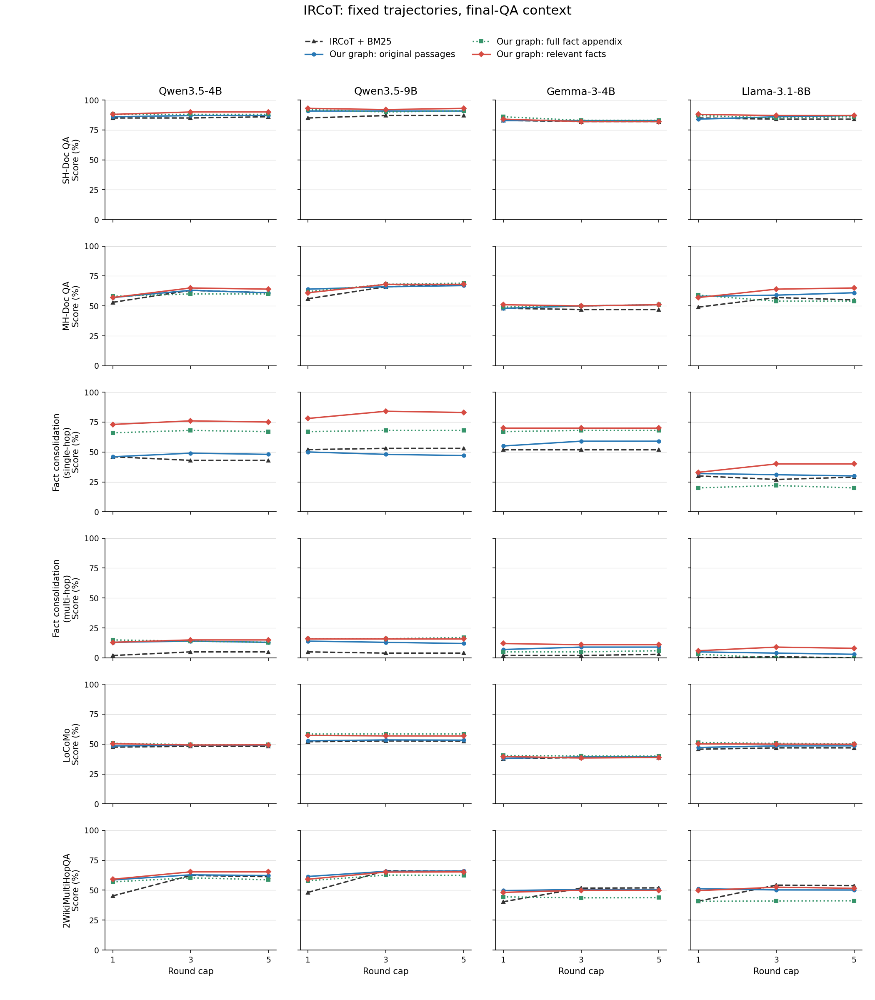

# 实验与消融结果

更新：2026-09-30。算法见 [algorithm.md](algorithm.md)，论文定位见 [story.md](story.md)。

## Recommendation-centered ACL analysis: completed evidence (2026-09-30)

The revised analysis has two distinct findings: (1) with recognized facts fixed, recommendation changes the additional sources that supply the requested property; (2) with a corrected assertion still present in the reader input, following the older accepted association can remove the evidence needed to use that correction. The section retains all six task settings, 3,386 questions, four readers, a native recommendation-effect table, an explanatory figure, and examples from four data origins. It occupies approximately 2.5 ACL pages including figures/tables. Source and supporting records are in `docs/memory_analysis/`.

A newly initialized GPT-6 reviewer, `acl_manuscript_review_03`, independently inspected the manuscript, primary literature, rendered layout, numerical tables, and local intervention traces and returned **ACCEPT as an ACL method-analysis section**. It did not read earlier reviews. Acceptance concerns the concrete empirical findings, not discovery of universal memory principles. Both final requirements, source/PDF synchronization and accurate reporting of the extra QA status, are fulfilled. The full critique is `docs/memory_analysis/reviews/round_03_review.md`.

Final rendering (`6878281`) has no overfull boxes or undefined references. `memory_recommendation_analysis.pdf` has the approximately 2.5-page analysis and references in the remaining third-page column; `weighting_control_results.pdf` is the one-page completed additional-results table. Both PDFs, the 37-file source/data archive, and the accepted review were submitted to zhenkeliu@163.com. The local SMTP server accepted the message for delivery with queue ID `6913fdVk2240225`; see `docs/memory_analysis/email_receipt.json` and `email_delivery.log` for the actual receipt.

### Exact published-operator comparison

All 3,386 graph selections were replayed with frozen recognition, query scores, graph connections, source texts, rank fusion, and source budget (`6873772`). Reciprocal directed arcs reproduce every original AMOR selection. The released CatRAG forward key-fact weighting operator was checked against its unmodified source block for every memory group; the paper's different multiplier/normalization is retained as a separate control. No new extraction or embeddings were made.

| 2Wiki condition, all 1,000 questions | Complete support@5 | Mean support Recall@5 |
|---|---:|---:|
| Unit weights | 63.5 | 84.775 |
| Unit + released key-fact boost | 63.7 | 84.850 |
| Unit + paper key-fact boost | 63.5 | 84.700 |
| AMOR | 68.9 | 87.400 |
| AMOR + released key-fact boost | 69.4 | 87.575 |
| AMOR + paper key-fact boost | 69.5 | 87.725 |

Released boost on unit weights gives seven completeness gains/five losses. AMOR versus that condition gives 54 gains/two losses; released boost on AMOR gives six gains/one loss. These exact constructions are complementary, and the transferred operator is not the full CatRAG system. They also differ in directionality, magnitude, and normalization, so this comparison does not isolate an abstract all-facts versus recognized-facts principle.

Context preparation (`6874293`) verified exact agreement with both current AMOR and the already evaluated unit-weight contexts on every question. The two released-operator controls then ran native pilots and full QA on all six tasks/four readers (`6874319`, `6874320`, `6874321`, `6874322`): **27,088 full QA answers plus 48 pilots**. The completed report (`6875681`) recomputed **40,632 native scores**, including the reused unit outputs. Full scores, paired changes, and identical-prompt variation counts are in `docs/memory_analysis/data/fact_weighting_answers.csv`, `fact_weighting_answer_pairs.csv`, and `fact_weighting_answer_verification.json`.

| 2Wiki native answer F1, all 1,000 questions | Qwen4 | Qwen9 | Gemma | Llama |
|---|---:|---:|---:|---:|
| Unit weights | 57.72 | 57.98 | 48.33 | 49.86 |
| Unit + released boost | 58.02 | 57.90 | 48.94 | 50.50 |
| AMOR | 59.14 | 59.23 | 49.15 | 50.62 |
| AMOR + released boost | 59.17 | 59.23 | 48.99 | 51.17 |

Retain the full six-task table rather than extrapolating the 2Wiki direction: some document/update/conversation comparisons are tied or negative. Native repeated generation can also change scores with identical inputs. For unit versus AMOR, 602 identical 2Wiki prompts have 7/7/1/8 score differences and 1,438 identical LoCoMo prompts have 41/43/11/51 differences. No outcomes were dropped, corrected, or converted into a new metric. The deterministic source-selection findings are separate from these answer variations.

`experiments/report_memory_findings.py` separately verified the existing main and intervention evidence: **152,156 native scores** over all 3,386 questions. Full protocol, failure preservation, benchmark scope, and literal source references are in `docs/memory_analysis/protocol.md`. The invalid tuple-normalization replay from job `6873706` remains preserved in its explicitly invalid directory and is excluded from every result above.

## Cross-task memory failure mining (2026-09-30)

### Population evidence and the remaining causal question

The selected cases motivate hypotheses, not generally established principles. The following existing current-graph paired outcomes cover every question in each named evaluation set (100 per task), not the selected examples. Numbers are wrong-to-correct / correct-to-wrong using the unchanged native substring EM, read from `analysis/failure_outcomes.csv`. Readers are not independent replications of source selection.

| Fixed task and comparison | Qwen 4B | Qwen 9B | Gemma | Llama |
|---|---:|---:|---:|---:|
| FC-MH: full vs without recommendation | 9 / 0 | 12 / 0 | 6 / 0 | 5 / 0 |
| FC-SH: full vs without augmentation | 29 / 4 | 34 / 5 | 26 / 4 | 22 / 9 |
| MH-Doc: full vs without recommendation | 18 / 5 | 16 / 3 | 15 / 6 | 21 / 6 |

These are system-component intervention results, not counts of update, attribution or consistency failures. In particular, native EM does not label error mechanisms; a gold answer substring appearing somewhere in the context is not sufficient evidence of a correct supporting assertion. The FC-MH result supports a repeatable advantage from recommendation under the existing update task, but full scores remain 14/16/10/6 percent and do not establish general conflict resolution. The FC-SH result identifies a benefit of augmentation with fixed source selections, not specifically of a single replacement fact.

Targeted validation is complete. CPU preparation job `6872885` completed: all 200 current FC-MH/FC-SH contexts replay exactly, with zero new recognition calls and embeddings. Predeclared inputs and traces are under `analysis/memory_interventions/`. FC-MH varies all versus retained recognition candidates on all 100 questions while fixing the current graph and retained context facts; source sets change for 40 questions (order changes for 42). FC-SH varies all versus retained augmentation candidates on all 100 questions, preserving the same five source texts and top-ten fact budget; fact lists change for 90 questions. These are candidate-set interventions, not annotated counts of consistency failures.

Local interventions remove or replace one appended country assertion and restore it, or replace the accepted authorship at fixed fact confidence and restore it. The old authorship is the actual extracted `(James Joyce, is the author of, Dubliners)`, with reversed argument direction relative to the new triple; do not invent a forward old triple or claim this is a normal retrieval output. The all-candidate native recognition cache selects the old authorship in this example and drops the Eliot death source. Its retention/removal alone does not prove perfect relation normalization or update resolution. GPU job `6872907` completed 207 requests per model across four readers (828 total), using native prompts and substring EM; report job `6873195` completed paired verification. Current task-level comparisons remain on existing evaluation data, not independent held-out confirmation.

### Targeted quantitative and local intervention results

Each population row includes all 100 questions in the named task. The four reader scores are native substring EM percentages, not a new consistency metric. The current graph and all original source texts remain fixed. Recognition candidates are varied only for FC-MH, while augmentation candidates are varied only for FC-SH, with identical five selected sources and a top-ten fact budget. Population results describe these operations, not the prevalence of the selected failure mechanism.

| Task / condition | Qwen 4B | Qwen 9B | Gemma | Llama |
|---|---:|---:|---:|---:|
| FC-MH current AMOR | 14 | 16 | 10 | 6 |
| FC-MH all extracted recognition candidates | 11 | 12 | 9 | 3 |
| FC-SH current AMOR | 75 | 82 | 71 | 43 |
| FC-SH all extracted augmentation candidates | 60 | 68 | 56 | 26 |

Current-higher / current-lower counts against these controls: FC-MH 3/0, 4/0, 2/1, 4/1; FC-SH 16/1, 15/1, 18/3, 21/4, in the same reader order. Complete source/fact text is unchanged for 58 FC-MH and 10 FC-SH questions. FC-MH unchanged contexts have identical native scores in all readers; among FC-SH unchanged contexts, one Qwen4 score differs on repetition (all other readers zero). Preserve this generation variation rather than attributing every paired change to the intervention. The main AMOR rows reuse audited main predictions; controls are newly generated with the same native prompts, model revisions, seed, and decoding settings. Token counts and all per-question requests/responses are retained.

Local source-verified tests:

- Dubliners author/death: current and restored conditions return London in all four readers (4/4 native correct). Replacing only the accepted fact tuple with the actual older extracted authorship at the current matching confidence causes the Eliot death source to leave the context; all four answers fail. The current Eliot authorship is still present as the first source and last appended fact. Wrong answers are New York City, Manchester, George Eliot, and 422. Do not claim they consistently answer the old author's death location. This supports a local mechanism in which using the wrong association changes which further memory is supplied, even though the corrected assertion itself is still supplied.
- Witches country: current and restored conditions score 4/4. Removing only the appended UK assertion yields USA-containing answers and zero scores in all four readers. Replacing that one appended assertion with the actual old USA assertion also scores 0/4; Llama is incomplete, not explicitly USA. All five original texts and the nine other appended facts stay fixed. Qwen9's current/restored output is "United Kingdom of Great Britain and Ireland", which receives native substring credit for "United Kingdom"; report native correctness rather than exact-answer equivalence. This isolates the contribution of the retained assertion in this case rather than treating all ten added facts as one intervention.

Files: `memory_interventions/design.json`, `prepared.json`, `traces.json`, `population_results.csv`, `local_results.csv`, and four model directories containing requests, predictions, token usage, revision metadata, and recomputed-score completion records. Local current/restored requests are identical; outputs match within each model. All populations and adverse outcomes are preserved. No newly generated extraction, embeddings, synthetic assertions, annotations, or model tuning. These results support candidate design principles about propagating updates into selection and preserving them in answer context; they do not establish general consistency guarantees or independent generalization.

Current simplified AMOR, seven existing external baselines, and the two current ablations were re-audited on all six task evaluation sets and four readers: 240 conditions and 135,440 native per-question scores. No new predictions, model training, annotations, data splits or scoring rules. `mine_cases --failure-mining --results ...` now replaces legacy AMOR entries with the current result manifest and excludes the obsolete projection ablation. Batch job `6872224` completed successfully. Nine manually selected cases were exported for all ten methods (`6872291`); these are illustrative selections, not an estimate of failure prevalence.

Root: `/oscar/scratch/zliu328/agent-memory-outputs/optimization_simplified_amor_seed42_20260929/analysis`.
Evidence: `failure_audit.json`, `failure_questions.jsonl`, `failure_candidates.json`, `failure_selection.json`, `cases/*.json`, `failure_review_notes.json`, and `memory_case_traces.json`.
Job `6872535` completed quote, source-presence/absence and fixed-selection checks for all nine reviews; `failure_review_evidence.json` links the verified excerpts to all four readers' native outcomes.
`analyze_geometry --memory-case-traces` replays the selected questions against the current graph and cached recognition/embeddings. All nine selections match exactly (`6872503`, zero new LLM calls and zero new embeddings); temporary runtime copies are removed automatically.

### Selected case outcomes

Each entry below counts correct native substring-EM answers among the same four readers for one question, not independent retrieval replications or a new aggregate task metric. All cases refer to their benchmark source text; FC facts are synthetic updates, not real-world factual claims.

| Method | MH-Doc Kirton population | FC-SH Witches country | FC-MH Dubliners author's death |
|---|---:|---:|---:|
| BM25 | 0/4 | 0/4 | 0/4 |
| Dense | 0/4 | 0/4 | 0/4 |
| HippoRAG 2 | 0/4 | 1/4 | 0/4 |
| CatRAG | 0/4 | 0/4 | 0/4 |
| Mem0 | 0/4 | 1/4 | 0/4 |
| LightMem with offline consolidation | 0/4 | 1/4 | 0/4 |
| AnchorMem official | 0/4 | 1/4 | 0/4 |
| AMOR | 4/4 | 4/4 | 4/4 |
| AMOR without recommendation | 0/4 | 3/4 | 0/4 |
| AMOR without context augmentation | 2/4 | 0/4 | 3/4 |

### Verified source and query traces

- `factconsolidation_mh_262k_no45`: assertion 4873 names James Joyce as Dubliners' author; 7516 replaces him with George Eliot; 13652 gives Eliot's death location as London. Only the Eliot authorship remains in retained triples. HippoRAG 2 and AMOR without recommendation both show assertion 7516 but not 13652. AMOR recognizes only `(dubliners, author, george eliot)`, assigns positive entity scores to both entities and selects the Eliot death source at graph/final rank 2. Full answers are London for all four readers. Without augmentation the two Qwens and Gemma still answer London; Llama is incomplete. This supports the finding that a correction changes the relevance of other memories, not just the requested final value.
- `factconsolidation_sh_262k_no12`: assertion 1836 says USA; 4787 replaces it with UK. The retained triple is UK only, and cached fact recognition accepts it. AMOR source ranks are replacement first, obsolete second; HippoRAG 2 reverses their order. AMOR without augmentation keeps exactly these same five sources but three readers answer USA and Llama is incomplete (all native scores zero). Full AMOR appends ten retained facts, ending with the UK assertion, and all four answer UK. Do not call this a one-tuple intervention or a guarantee of contradiction resolution. It shows why retaining the correct fact internally is insufficient when old original text is reintroduced downstream.
- `ruler_qa2_421K_no58`: HippoRAG 2 supplies Kirton End in the Boston district of Lincolnshire and a different Kirton's 2011 population of 1,146; 4B answers 1,146. The question asks for 2001. AMOR's fact filter rejects the candidate 2011 population fact and accepts Kirton End's location facts, assigning positive seeds to Boston district, civil parish of Kirton, Kirton End and Lincolnshire. Boston, Lincolnshire is graph rank 2/final rank 5 and states 35,124 for the 2001 town population (distinct from 66,900 for the borough in 2015). Its dated fact is also appended. AMOR still retains the wrong Kirton passage and fact, so do not claim it removes all inconsistent evidence. This is a concrete entity/date mismatch case, not just low similarity of a missing passage.

### Rejected or bounded interpretations

- SH-Doc `ruler_qa1_197K_no62`: Dense, HippoRAG 2 and CatRAG answer Robert from "Bohemond, Robert's son" when asked for his nephew; AMOR supplies the Tancred passage and succeeds across readers. Exact replay has no accepted facts and uses dense fallback plus BM25; recommendation ablation also succeeds. Keep as cross-domain attribution failure, not as a graph mechanism example.
- MH-Doc `ruler_qa2_421K_no76`: native substring EM credits Dense/Gemma's "Cannon" for gold "Ann". Native metrics are unchanged, but do not call that answer semantically correct in qualitative prose.
- The other five inspected candidates are retained with reasons for not promoting them in `failure_review_notes.json`. Candidate selection used native outcomes only; failure causes were manually checked against full contexts. Do not infer model internal beliefs or global consistency guarantees from the examples.

## 失败机制的进一步挖掘（2026-09-30）

### 从事实匹配到上下文推荐：出处核查与完整案例

`experiments.analyze_geometry --recommendation-cases` 增加全量出处核查及实际推荐列表重放。`6870426` 在比较 Python tuple 与已序列化 JSON list 时中止，没有改结果或跳过核对；比较双方统一为 JSON 数据结构后，batch 单 CPU `6870450` 完成，退出码 0。全部识别事实按原生 `text_processing` 与保留事实及出处对应，没有新增数据加载器、评分方法或 LLM 请求。

在 1,000 题中，56 题无接受事实并使用既有 dense fallback；剩余 944 题有 2,358 个 gold 支持段落 occurrence。已识别事实的保留出处集合包含其中 1,260 个。以下均为这 944 题，固定查询识别、向量、初始分数、PPR、BM25 和五篇预算：

| 图侧条件 | 入选且属于已识别事实出处的 gold occurrence | 入选但不属于已识别事实出处的 gold occurrence |
|---|---:|---:|
| 原始 HippoRAG 2 图（不是原生完整 pipeline） | 1258 | 436 |
| AMOR 连接、单位边权 | 1259 | 713 |
| AMOR | 1259 | 796 |

AMOR 相对单位边权新找回的 88 个 gold occurrence 全部不属于已识别事实的直接出处，反向丢失 5 个。已识别事实出处内的 gold 入选集合在每题上完全一致，不只是总数相同。说明此受控对照中，事实权重的净收益来自关联推荐的其他支持文本，而不是重新排序已匹配事实的出处。不能把这写成所有 796 条均由边权新增，或没有 BM25/原文初始分数参与；该归因来自固定其他组件只改边权的对照。`recommendation_source_coverage.json` 保存全部 944 题的出处与选文，另明确记录 56 题 fallback，不新增推荐模型或映射假定。

定性案例按原评测顺序选择第一道由单位边权不完整变为完整的 bridge-comparison 题，并保留所有两道完整性退步题，没有按 QA 答案效果挑例子。问题比较 God's Gift to Women 与 Aldri annet enn brak 的导演年龄。单位权重返回 Aldri annet enn brak、God's Gift to Women、Altid ballade、Edith Carlmar、Bedre enn sitt rykte；AMOR 返回 God's Gift to Women、Aldri annet enn brak、Edith Carlmar、Altid ballade、Michael Curtiz。最后一篇提供 Curtiz 的 1886 年出生信息，Carlmar 原文为 1911 年，因此支持 gold 答案 God's Gift to Women。没有把此原文推断伪装成新跑的 LLM 答案。

同一图的 58,760 个节点与 74,989 条边完全一致，实际重放核对初始分数、识别结果、最终五篇顺序及所有支持文本 graph ranks。Michael Curtiz 实体与传记连接的 AMOR 权重为 26，来自基础连接 1 加 50 条不同保留三元组各 0.5 的贡献；film 来源中的同实体连接权重为 1.5。这里统计保留三元组，不称其为 50 条独立、正确或 query-specific 的事实。所有案例种子与原文边权均用保留事实出处重算核对。案例及退步例完整原文和两个推荐列表保存于 `recommendation_cases.json`。

单条边权干预由 batch 单 CPU `6870478` 完成，退出码 0。不删除连接，也不改识别与初始分数。在完整 AMOR 中只把 Michael Curtiz 实体与传记的连接由 26 改为 1，该传记 graph rank 从 5 降到 7，退出最终五篇，完整支持从四篇降为三篇；在单位边权图中只将同一连接从 1 恢复为 26，graph rank 从 6 升至 5，进入最终五篇并补齐四篇。这是所选案例中的双向干预，不能外推为该单边对全体问题的必要充分性。干预的选文、名次及变更边保存在同一 JSON 的 `edge_weight_interventions` 中。两道退步例也全部重放和保留；没有生成新 QA 或按答案筛选案例。

独立复算 `recommendation_source_coverage.json` 全部 944 题：与单位边权相比，非直接出处支持 occurrence 为 88 gains / 5 losses，直接出处为 0 gains / 0 losses，且后者的入选集合逐题完全一致。论文可将此作为搜索与推荐分工的证据：查询匹配的事实不是最终能够提供支持的全部事实；事实关联的权重改变了其他支持出处能否进入推荐列表。不将 graph topology、初始实体识别或匹配事实本身当作本轮新增贡献，不宣称改进了逻辑一致性。

### 单位边权与事实贡献边权的逐题对照、覆盖曲线

在既有 `experiments.analyze_geometry` 中增加 `--weight-completion` 和 `--plot-depth`。只读取已完成的 CSV/逐题 JSONL，没有新模型调用、参数调整、数据转换或新增评测指标。按官方题型统计同一图连接、相同初始分数下，单位边权与 AMOR 边权的 Complete@5 转移。

| 官方题型 | 题数 | 单位边权完整题数 | AMOR 完整题数 | 新补齐 | 丢失完整覆盖 |
|---|---:|---:|---:|---:|---:|
| 全部 | 1000 | 635 | 689 | 56 | 2 |
| bridge_comparison | 235 | 53 | 85 | 32 | 0 |
| comparison | 244 | 233 | 235 | 2 | 0 |
| compositional | 413 | 284 | 299 | 17 | 2 |
| inference | 108 | 65 | 70 | 5 | 0 |

56 道新补齐题原来全部已有部分支持证据。32 道来自需要四篇支持文本的 bridge-comparison：Complete@5 从 22.55% 升至 36.17%。这是相同连接下的权重效应，不是发现新路径、增加篇数或改事实识别的结果。可解释为：有限篇数下，连接存在不等于支持文本获得足够排名；事实贡献边权改善多篇证据的共同入选。此结论只针对该受控对照，不声称优化了集合覆盖目标、不声称首创图推荐或保证跨任务收益。实体初始化消融解释系统依赖，不能作为新推荐算法的 novelty。

逐题汇总文件：`optimization_simplified_amor_seed42_20260929/analysis/weight_completion.csv`。图为同目录上级 `figures/retrieval_depth.pdf`，独立图例 `figures/legend_retrieval_depth.pdf`；PNG 用于视觉检查。左右两栏分别为 Recall 和 Complete，横轴返回 5/10/15 篇。包含完整的 BM25、重新评测 Dense、原生 HippoRAG 2、AMOR w/o recommendation 和 AMOR；CatRAG 不完整结果不绘制。沿用下文 Dense 重算与 AMOR 融合候选数的说明。所有方法扩大篇数后覆盖均提高，因此图只能支持“增加篇数仍未消除证据覆盖差距”，不能支持“更多文本降低效果”。

### 找到部分支持证据与补齐证据的区别

新增字段集成进现有 `experiments.mine_cases --evidence-recovery`，CPU batch `6870194` 完成，33 秒，exit 0。重新读取六个选文条件、四 reader 的原始 top-5，核对全部 1,000 个问题与官方标注，并确认 reader 间选文一致。没有新增推理、人工分类、重写数据或改变评测指标。

| 方法（原主实验的五篇选文） | 至少一条支持证据的题数 | 部分证据题数 | 完整证据题数 |
|---|---:|---:|---:|
| BM25 | 988 | 660 | 328 |
| Dense | 1000 | 625 | 375 |
| HippoRAG 2 | 1000 | 531 | 469 |
| CatRAG | 1000 | 567 | 433 |
| AMOR w/o recommendation | 1000 | 615 | 385 |
| AMOR | 1000 | 311 | 689 |

相对 Dense、HippoRAG 2、CatRAG、无 recommendation 版本，AMOR 新补齐的 328/237/277/313 题均原本已有部分支持证据，而不是原本完全没有证据。完整转不完整分别为 14/17/21/9 题。相对 BM25 的 369 道新增完整题中，366 道原本已有部分证据，3 道原本无支持证据。`evidence_recovery.csv` 增加 any/partial/no support 原始计数，`evidence_recovery_pairs.csv` 增加 partial/none-to-complete 计数；完整逐题选文与原评分仍保留。

可写 insight：**Finding relevant evidence is not the same as completing the evidence needed for an answer.** 在此子集，多个方法对每题均已命中至少一条 gold，但多数题仍缺完整支持；推荐收益主要表现为补齐缺失的支持文本。对后续设计的启示是关注已选上下文尚缺什么信息，而非仅提高单篇相似度或至少命中一篇的比例。AMOR 没有显式优化集合覆盖目标，不能据此说它实现了 conditional/set-wise recommendation，也不把该子集结果当成跨数据集普遍定律。

数据集选用理由：2Wiki 官方 supporting_facts 能按标题唯一对应原始段落，适合将检索内容直接与 passage-level gold 比较。LoCoMo 也有 evidence dialogue IDs，不能写“只有 2Wiki 有 retrieval ground truth”。这里只聚焦原始支持段落的覆盖与完整性，不宣称其他任务无任何证据标注。

### 原生 baseline 的返回篇数对照（2026-09-30 补充）

为检验增加篇数能否弥补证据缺失，新增 `experiments.analyze_geometry --baseline-depth`。固定全部 1,000 道 2Wiki 与原始支持段落标注，统计 5/10/15 篇的 Recall 和 Complete；无 QA 或上下文增强，不把证据覆盖结果称为答案收益或 token 等预算结果。

HippoRAG 2 使用原图、原生检索、缓存事实识别及冻结问题向量，`6869981` 完成，6:24，exit 0；全部 1,000 题 top-5 与主表逐题逐序完全一致，零新 LLM 与 embedding。Dense 使用原 HuggingFaceEmbedder 和 corpus 顺序重新编码，余弦相似度用 float64 向量计算，并在首题对全部文档与原 `_cosine` 实现逐项核对，保留同分时原文顺序。`6869993` 因发现 top-5 不完全复现而停止；没有修改排名去匹配旧结果，随后明确作为重新评测，`6870040` 完成剩余题，1:17，exit 0。

Dense 本轮相对主表有 202 题前五顺序不同，其中 84 题集合不同、3 题命中的 gold 集合不同；不能宣称精确复现，也未验证差异一定由浮点或设备导致。本表三个 cutoff 全部来自同一轮重算，不能把旧 68.825/37.5 与新 top-10/15 拼接。新 Recall@5 为 68.700、Complete@5 为 37.2。逐题结果与差异 ID 保存在 `analysis/depth_dense.*`，HippoRAG 结果为 `analysis/depth_hipporag2.*`。

| 方法 | Recall@5 | Complete@5 | Recall@10 | Complete@10 | Recall@15 | Complete@15 |
|---|---:|---:|---:|---:|---:|---:|
| BM25 | 65.825 | 32.8 | 70.650 | 40.2 | 72.450 | 43.3 |
| Dense（本轮重算） | 68.700 | 37.2 | 71.975 | 43.5 | 73.575 | 46.1 |
| HippoRAG 2（原生） | 74.975 | 46.9 | 78.625 | 53.3 | 80.275 | 56.0 |
| Dense + BM25（AMOR w/o recommendation） | 69.725 | 38.5 | 73.075 | 44.5 | 74.500 | 47.0 |
| AMOR | 87.400 | 68.9 | 91.300 | 77.4 | 91.800 | 78.6 |

BM25、AMOR 与 Dense+BM25 复用本轮之前已验证的 `retrieval_depth.csv`；AMOR 融合的两分支候选数和最终篇数同时改为 k，不是把固定 top-5 缓存裁成 top-15。新增 Dense/HippoRAG 的各 cutoff 则是相同完整排名的前缀。再次独立复算这两方法的全部 1,000 题三个 cutoff 与 CSV 完全一致。

CatRAG 未形成可报告的全量结果。`6869982` 因原生重载漏初始化 `ent_node_to_fact_ids` 失败；分析入口按其 build 路径初始化此映射后，`6870002` 的 CPU 重放因 NER 实体需额外 embedding 和 LLM 缓存缺失失败；其部分输出另存 `depth_catrag_incomplete_cpu.jsonl`，不纳入统计。改用原生 GPU embedding 的 `6870025` 仍在动态评分请求上缺两个 LLM cache 项，CacheMissGuard 拒绝 fallback 后终止。未把缓存不全伪装为 native baseline 的完整结果，亦未启动新的抽取/重建或 LLM 服务。后续如需 CatRAG 完整曲线，应恢复同配置生成器并单独验证重新评测，不能从旧 top-5 推算。Mem0/LightMem 的生成记忆没有本对照可直接采用的原文段落映射，不编造 passage Recall。

建议段落标题为 **Increasing context size does not close the evidence gap.** 各方法自身在增加篇数后覆盖均提高，因此不支持“more text reduces recall”或“more is never better”。支持的是：AMOR 五篇仍优于所报告三个外部 baseline 的十五篇，在此范围内更多文本不足以替代更有效的上下文选择。HippoRAG 2 在 k=15 的 Recall/Complete 仍比 AMOR k=5 低 7.125/12.9 个百分点。

### 已发表工作核对与进一步实验（已完成）

新目标：解释 context recommendation 在哪些条件下以及通过哪些组件改善证据选择，并补充低成本附录实验；不把有限任务上的结果写成 recommendation 普遍优于直接匹配的定理。继续使用当前简化图，未调算法参数、改原始数据或替换评分。

已核对正式发表版本，而非只依赖 arXiv：

- [HippoRAG 2, ICML 2025](https://proceedings.mlr.press/v267/gutierrez25a.html)：6.3 将 NQ/MuSiQue 按问题对应的 gold 与 distractor 文档分成四段，在固定一段的问题上逐步扩大语料；这是 corpus expansion 的模拟，不等于验证在线冲突更新。6.4/Table 7 在 MuSiQue 比较 GTE-Qwen2-7B、GritLM、NV-Embed-v2 下 dense 与 HippoRAG 的 Recall@5。附录还区分了事实识别成功但图搜索未取回支持文本的失败，不能把这个现象本身称为 AMOR 首次发现。
- [LinearRAG, ICLR 2026](https://proceedings.iclr.cc/paper_files/paper/2026/file/ee1955739b91db042e659b6f782a5e79-Paper-Conference.pdf)：附录 E 分别报告证据检索、参数、四种 sentence embedding 和大语料效率。模型替换实验需要同步文档、事实/实体及问题向量，不能只换 query embedding 后宣称完整 backbone robustness。
- [AnchorMem, Findings ACL 2026](https://aclanthology.org/2026.findings-acl.1736.pdf)：Table 3 分别移除原始 context、fact/context unit 和 event graph；Figure 4/Table 7 测试 retrieval top-k，另报告构建与在线阶段成本。
- [StructMem, ACL 2026](https://aclanthology.org/2026.acl-short.12.pdf)：Figure 3(c,d) 分别改变返回条数和 semantic seeds，区分更多候选与关联信息的作用；Table 2 比较 memory representation 与去掉 cross-event component。
- [LightMem, ICLR 2026](https://proceedings.iclr.cc/paper_files/paper/2026/file/a05b72653ec5b473732129829ae04195-Paper-Conference.pdf)：5.3--5.6 检查 compression、topic segmentation、buffer threshold 与 soft update。其保留历史的动机与我们的历史事件例有交集，因此该例解释 source context 的作用，不宣称 first preservation mechanism。
- [CatRAG, Findings ACL 2026](https://aclanthology.org/2026.findings-acl.290.pdf)：5.1/6.1 检查动态边权、关键事实增强及传播向高连接度节点偏移。AMOR 的区别应落实在离线实体/原文连接和事实贡献的固定构建及其控制结果，而不是新造“semantic drift”概念。

新增实验：

1. `experiments.analyze_geometry --recommendation-controls`，CPU batch `6862900`：全 1,000 道 2Wiki，固定当前图和缓存事实识别，分别清零实体初始分数或原文初始分数；无接受事实的问题保持相同 dense fallback。另用原有 BM25、dense、RRF 实现测试返回 5/10/15 条，两个融合分支均提供相同 k 个候选。报告原生支持段落 Recall 与 Complete，不伪装成已跑 QA 的结果。默认 k=5 逐题验证当前选文不变。输出 `analysis/recommendation_controls.*`、`analysis/retrieval_depth.csv`。
2. `experiments.mine_cases --context-components`：全 1,986 道 LoCoMo、四 reader，固定五条原文和已选择事实，新增仅邻接原文、仅附加事实两个条件，与已验证的完整/无增强结果形成四格。所有官方类别均保留，使用原生 prompt、原有随机选项顺序和评分，记录每题实际 token。作业 `6862861`--`6862864`，共 15,888 个新 QA 请求；两个机制案例已在同一执行路径各模型完成 pilot。新增请求不触发抽取、embedding 或方法调参。输出 `analysis/context_components/`。

存在可复用的 MiniLM 模型，但更换编码器还需重编码全部候选并重新识别不同的候选事实；本轮不把局部替换冒充完整鲁棒性实验。当前方法未实现增量构图，亦不以从全量图删节点来宣称 continual learning。优先完成上述可直接解释组件和证据预算的对照，再按结果判断是否需要新增成本。

`6862900` 已完成，exit 0，8 分 38 秒。全 1,000 题默认 AMOR 选文逐项一致，另独立核对 dense+BM25 在 k=5 的选文与当前主结果 w/o recommendation 的全部 1,000 题完全一致。纯 dense 对照使用 AMOR 的冻结向量，不能直接冒充独立 native Dense baseline（其 k=5 Recall 为 68.825，而这里为 68.700）。

| 相同 AMOR 图，改变初始分数组件 | Recall@5 | Complete@5 |
|---|---:|---:|
| AMOR | 87.400 | 68.9 |
| 清零实体初始分数，保留原文初始分数和传播 | 70.175 | 39.5 |
| 清零原文初始分数，保留实体初始分数和传播 | 87.100 | 68.9 |

这表明在 2Wiki 的当前配置下，事实提供的实体相关性是主要信号；单纯把原文相似度放进同一张图传播，并不能复现 AMOR 的覆盖。去掉原文初始分数后 Complete@5 相同，但 Recall 和逐题选文仍有变化，不能称两个算法完全等价；也不能据此删除所有任务的原文分数。

| 检索方法（均复用 AMOR 的原文、向量与 BM25） | Complete@5 | Complete@10 | Complete@15 |
|---|---:|---:|---:|
| BM25 | 32.8 | 40.2 | 43.3 |
| Dense | 37.2 | 43.5 | 46.1 |
| Dense + BM25 | 38.5 | 44.5 | 47.0 |
| AMOR | 68.9 | 77.4 | 78.6 |

对应 Recall@5/10/15：BM25 为 65.825/70.650/72.450；Dense 为 68.700/71.975/73.575；Dense+BM25 为 69.725/73.075/74.500；AMOR 为 87.400/91.300/91.800。无上下文增强或 QA，新 k 同时用于两个 RRF 分支的候选数量和最终返回数量，因此不是把固定 top-5 缓存伪装成 top-15，也不保证 RRF 跨 k 严格嵌套。AMOR 五段覆盖优于 direct matching 十五段，是证据预算的结果，不等于三分之一 QA token 或端到端成本。

追加 `6863553`：使用同一 PageRank 更新式，从相同 personalization 出发仅做 1/2/4 次更新，与 native igraph 的完整传播比较，固定图、BM25 和 top-5。包括 dangling mass 的相同 restart 处理，并用收敛后的迭代向量核对 igraph；不构造新检索方法、不重训模型。该实验检验更长传播是否必要，不能事先承诺更多步更好。输出 `analysis/propagation_steps.*`。

该作业已完成，exit 0，7 分 9 秒。完整传播逐题复现主结果。独立 CPU 作业 `6863696` 对真实 58,760 节点图（400 个孤立节点）的案例与均匀初始分数核对 100 次标准更新和 igraph PRPACK，最大绝对误差分别为 `3.82e-14`、`7.30e-16`。原 worker 的内嵌校验因第一题为 dense fallback 未执行，故使用该独立校验补足；源码现已改成在第一道非 fallback 问题执行校验，不重跑或替换已完成的选文结果。

| 同一图与初始分数，改变 PageRank 更新次数 | Recall@5 | Complete@5 |
|---|---:|---:|
| 1 | 85.70 | 65.50 |
| 2 | 85.85 | 65.90 |
| 4 | 86.85 | 67.80 |
| 完整传播 | 87.40 | 68.90 |

这里的次数是固定问题的 PageRank 更新次数，不是 IRCoT 轮数或问题所需的推理跳数。一次更新已获得较高覆盖，后续传播进一步提高 3.4 个 Complete@5 百分点；不能把整个收益解释成长路径推理，也不能把不同模型的增量相减当成独立可加的因果贡献。当前图只连接实体与原文，这与事实提供实体初始分数后向其出处传递相关性的机制一致。实例删除实验进一步区分了必要连接与仅在图上存在的路径。

2026-09-30 独立从逐题 JSONL 复算四组图/种子/步数对照的全部官方题型与总体 Recall、Complete，均与 CSV 一致；每组含 1,000 个唯一问题和相同 56 个 fallback。返回条数实验的全部 90 行分组结果亦复算一致，各条件有恰好 k 条互异选文。没有用 QA 分数倒推支持证据，也未补标或选择子集。

写作边界：LinearRAG 附录 E.2 已讨论实体信息为主要初始信号，因此不能把“实体分数重要”单独包装为首次发现。我们的分析应把固定事实识别后的构图干预、实体初始分数干预、实际连接删除和检索数量对照连起来，解释当前 AMOR 为什么能推荐到必要原文。

### LoCoMo 全量上下文组件对照（已完成）

四个 GPU 作业 `6862861`/`6862862`/`6862863`/`6862864` 全部 exit 0，分别用时 11:55、18:13、9:37、7:00。每个 reader 完成 1,986 题乘两个新增条件，共 15,888 条新答案；CPU 汇总作业 `6863775` 用时 20 秒，exit 0。完整和无增强条件复用主结果，两个新条件均保持原五条选文与原先挑选的事实不变，分别移除邻接原文或追加事实。只加事实条件仍使用原完整上下文中选定的事实，可能来自邻接轮次，不重新从五条中心文本中选事实。

`analysis/context_components.csv` 保存四条件、四 reader、全部五个原生类别及总体结果；`context_component_pairs.csv` 保存逐题得分的升/平/降数量；`context_component_audit.json` 列出所有原始文件。16 个模型/条件各有全部 1,986 题，原生评分逐条复算，无新语义评委、没有剔除 adversarial 类别、没有把事实摘要当成 gold 原文。

| 原有五条选文上的答案上下文 | Qwen4 | Qwen9 | Gemma | Llama |
|---|---:|---:|---:|---:|
| 仅五条原文 | 46.13 | 49.47 | 36.92 | 45.05 |
| 原文 + 选定事实 | 47.36 | 51.10 | 37.69 | 46.42 |
| 原文 + 邻接原文 | 49.81 | 55.47 | 38.79 | 48.67 |
| 完整 AMOR，两者均有 | 49.63 | 55.83 | 38.42 | 49.60 |

以上为与主实验相同的 LoCoMo 总体混合得分，不称为单一 F1。单跳类别（841 题，原生 F1）单列如下：

| 上下文 | Qwen4 | Qwen9 | Gemma | Llama |
|---|---:|---:|---:|---:|
| 仅五条原文 | 52.04 | 52.71 | 44.09 | 51.45 |
| 加选定事实 | 54.75 | 56.17 | 47.14 | 54.70 |
| 加邻接原文 | 67.44 | 67.19 | 55.14 | 65.96 |
| 完整 AMOR | 66.65 | 66.39 | 56.96 | 65.15 |

Adversarial 类别（446 题，原生拒答准确率）亦保留：

| 上下文 | Qwen4 | Qwen9 | Gemma | Llama |
|---|---:|---:|---:|---:|
| 仅五条原文 | 61.43 | 70.63 | 41.26 | 57.40 |
| 加选定事实 | 60.76 | 70.63 | 38.34 | 54.26 |
| 加邻接原文 | 42.60 | 65.92 | 19.51 | 39.01 |
| 完整 AMOR | 44.84 | 68.83 | 17.26 | 42.60 |

邻接原文相对仅加事实在四 reader 的总体得分均更高；单跳 F1 也都更高。结合下文 Nate 的抽取追踪、删除与恢复干预，可解释原文并非只是重复展示已保留事实，它还能保留事实筛选未留下的信息。不能把总体增益全部归给此单例，也不能声称追加事实与邻接原文对所有模型都具有正交且必需的贡献：完整 AMOR 在 Qwen4 和 Gemma 的总体分数略低于仅邻接原文。拒答能力的下降说明更多相关上下文不自动保证信息归属正确，当前算法没有实现或验证一致性保证。

### 新增正文与附录的组织建议

保留现有第一小节的证据覆盖、官方题型和电影案例。第二小节回答为什么识别正确事实后仍可能选错文本，避免再重复 native baseline 总表。正文用固定查询组件的图替换及种子干预支撑下面三段；邻接原文与事实的四格结果放附录，若正文仍有空间则用历史事件恢复案例解释原文的独立价值。

**Relevant facts must lead to their supporting text.**
We hold fact recognition, initial relevance scores, embeddings, BM25 fusion, and the five-passage cutoff fixed while replacing only the graph.
Complete@5 increases from 46.8% with the original HippoRAG 2 graph to 68.9% with AMOR.
Removing only the original graph's synonym edges reaches 66.7%, while assigning unit weights to AMOR's existing connections reaches 63.5%.
Thus, recognizing relevant facts does not by itself determine which text is selected: both the connections used for propagation and their weights affect evidence coverage.

**Fact-based initialization matters more than adding propagation to direct matching.**
On the same AMOR graph, removing entity initialization reduces Complete@5 to 39.5%, whereas removing passage initialization preserves 68.9%.
One PageRank update already reaches 65.5%, with full propagation improving coverage to 68.9%.
These controls indicate that transferring relevance from recognized facts to their source text is a major mechanism in this evaluation, rather than requiring long graph walks for every multi-hop question.
In the film example, removing the director's initial relevance or its connection to the biography removes the biography from the final five passages; removing the film-to-director connection does not.

**Increasing the number of direct matches does not close the evidence gap.**
Using the same text collection and embeddings, dense retrieval with BM25 fusion reaches 47.0% Complete@15, below AMOR's 68.9% Complete@5.
This comparison shows that AMOR's advantage is not reproduced simply by recommending more directly matching passages within the tested range.
The comparison concerns supporting evidence coverage, not equal token budgets or answer accuracy at the larger cutoffs.

上述原图行是固定 AMOR 查询组件后的干预，不是 native HippoRAG 2；不要拿它替换第一小节的 46.9% native baseline。二值图与当前图已直接核对有相同 58,760 个节点和 74,989 条边，二值边权全为 1，当前权重为 1.3333--36.5。电影案例移除实体初始分数后仍可能通过其他节点获得分数，表述为去掉 initial relevance，而不是删除实体。

附录可放三组低成本结果：返回条数 5/10/15、PageRank 初始分数与更新次数、LoCoMo 邻接原文/事实四格及官方类别细分。它们是已完成的实验，不是拟议计划。未运行编码器替换或在线学习实验，不声称对应鲁棒性。已发表文献、原始逐题输出和受控条件均保留；没有修改生产算法、基于结果挑新参数或生成新的独立 TEX/MD 文件。

### 全量固定图对照与案例干预

`6859470` 完成 1,000 题图对照，`6859671` 完成纯 synonym 边删除对照，均 exit 0。固定 AMOR 的保留事实、事实识别、实体和原文初始分数、embedding、阻尼、BM25 与 top-5，只替换图。当前 AMOR 五条选文与已发布结果逐题逐序一致，56 道无接受事实的问题沿用相同 dense fallback；零新增 LLM 调用和 embedding。这里的原图对照不是原生 HippoRAG 2 的完整 pipeline。

| 固定 AMOR 查询组件，替换图 | Recall@5 | Complete@5 |
|---|---:|---:|
| 原 HippoRAG 图 | 74.825 | 46.8 |
| 原图移除纯 synonym 边 | 86.200 | 66.7 |
| 保留事实的二值实体/原文图 | 84.775 | 63.5 |
| 旧完整投影图 | 87.425 | 69.1 |
| 当前 AMOR 加权实体/原文图 | 87.400 | 68.9 |

synonym 删除依据原图已有 `edge_kind == synonym`，没有调阈值或重新判定实体是否同义；其他边保持原样。这一干预支持在该评测集合与固定查询组件下，相似实体连接会降低证据覆盖，而不是“增加连接必然有益”。不能据此断言每条 synonym 边错误，也不能把全部收益归给权重。二值图到 AMOR 的 Complete@5 增幅为 5.4 点；旧完整投影到简化图仅差 -0.2 点，额外实体/实体和原文/原文连接并非取得当前结果的必要条件。完整分组结果、逐题选文与验证信息在 `analysis/graph_controls.*` 和 `analysis/synonym_controls.*`。

`6859612` 完成电影案例的实际边/种子删除，无新 QA。Albert S. Rogell 传记在 AMOR 的 graph rank 为 2；移除电影/导演边仍为 2，移除导演初始分数变为 38，移除导演/传记边变为 487。后两者在 BM25 融合后均不进入五条选文。原图同一初始分数下 rank 为 207，去掉全部纯 synonym 边后为 2，融合后为 3。原图的导演节点有 146 条边，其中 130 条为纯 synonym 边；导演/电影和导演/传记连接原本已经存在。

因此，图中存在的两边路径不能直接画成实际必要的推理路径。该案例的事实识别已直接初始化导演；实验支持导演初始相关性与其传记连接的作用，不支持必须先从电影沿边到导演。产物为 `analysis/2wiki_projection_1/counterfactual.json`。

### LoCoMo 的事实保留审计与干预设计

`6859688` 使用全部 1,986 题的原始 dialogue evidence ID，逐一追踪原始抽取、保留事实、当前图连接和选文。对可回答的类别 1--4，共 2,345 个可定位的 question/turn 标注出现项，其中 104 项的原始抽取事实全部被事实选择移除，当前图度数为零；23 项仍在中心选文，55 项出现在包含邻接原文的上下文。9 个无法按原始 ID 定位的标注另行记录，不补标、不修改评分；类别 5 单独统计，不能视为答案的正支持。标注的是原文轮次而不是具体三元组，不能把 104 项都称为“答案事实被删除”，也不能把它们全部归为历史事件替换。文件为 `analysis/locomo_support_retention*`。

两个此前人工核查案例运行 47 个条件：固定五条中心选文，分别开关邻接原文和附加事实，逐一移除全部额外邻接轮次；历史事件例还恢复一条原始 OpenIE 已抽出但被筛掉的事实，或仅恢复对应原文轮次。恢复条件是诊断性干预，不是可部署的 gold-aware 规则。使用原生 LoCoMo prompt、选项顺序、解码和评分；四 reader 均重新生成完整与无增强条件，不与旧答案拼接。

Qwen4/9、Gemma、Llama 作业 `6859660`、`6859661`、`6859662`、`6859663` 全部完成，exit 0，每个 47 条，共 188 条；所有分数以原生 evaluator 逐条复算。Llama 等待资源后转入 gpu-debug，并同步其 QOS，运行 3 分 6 秒，未重复提交。所有条件的真实上下文、答案与原生分数保存在 `analysis/context_controls/`。案例选择不估计总体失败率。

Nate 历史事件例的原生 F1（%）：

| 诊断条件 | Qwen4 | Qwen9 | Gemma | Llama |
|---|---:|---:|---:|---:|
| 五条中心原文 | 0.00 | 0.00 | 0.00 | 33.33 |
| 中心原文 + 当前附加事实 | 0.00 | 0.00 | 0.00 | 20.00 |
| 完整 AMOR | 80.00 | 80.00 | 75.00 | 80.00 |
| 完整 AMOR 移除获胜描述所在邻接轮次 | 0.00 | 0.00 | 0.00 | 40.00 |
| 中心原文 + 恢复一条被删的原始抽取事实 | 80.00 | 88.89 | 100.00 | 100.00 |
| 中心原文 + 仅恢复对应原文轮次 | 72.73 | 72.73 | 33.33 | 80.00 |

四 reader 在恢复三元组后都明确说出 video game tournament；Llama 的 `Won something.` / `Won.` 获得部分词面分，不能当成保留了完整答案。Gemma 仅恢复原文时回答 `Winning a tournament`，省略 video game，得 33.33；不把恢复原文宣称为所有模型满分。逐个删除 17 个额外邻接轮次，获胜描述所在轮次的删除使前三个模型降到 0，Llama 仅回答 `Won.`；Gemma 另有两个删除条件降到 33.33，其他细节保存在逐条输出。历史事实已被原始 OpenIE 抽出、随后被事实筛选移除，故此例说明原文可补偿构建阶段的信息损失，而非发现一个抽取失败。

Melanie 例中，中心原文及中心原文加事实两条件四 reader 均正确拒答，完整 AMOR 四 reader 均误用 Caroline 的画作灵感。逐个移除 20 个额外邻接轮次，只有移除 Caroline 明确说明灵感的发言使 Qwen4、Qwen9 和 Llama 恢复正确拒答；Gemma 在所有单轮删除条件下仍答错。仅加邻接原文、去掉附加事实时，Llama 正确拒答，另外三个仍错，显示错误并非跨模型统一由一个模块决定。完整增强对全 446 个 adversarial 问题的影响仍按下文总体结果报告，不以这两个案例估计发生率或声称 AMOR 已解决归属一致性。

面向正文的结论：识别出相关实体不保证能推荐到对应支持文本，必须区分事实识别、传播连接和最终选文；原文也不只是附加细节，它可恢复事实筛选丢掉的历史信息。相似实体边删除的全量结果与案例干预支持前者，原始抽取追踪及恢复实验支持后者。更广泛的“当前状态与历史事件应区别维护”是由此提出的设计启示，不是当前 AMOR 已实现的新模块。旧 John 编程案例只说明补回缺失回复，不再作为深入分析的主要证据。

### 固定事实识别与初始分数后的图结构案例重放

CPU batch 作业 `6857803` 在 66 秒内完成，exit 0；首次 `6857760` 在读取当前案例字段时因缺少 task 键退出，未产生结果，随后修复。入口为现有 `experiments.analyze_geometry --case 2wiki_projection_1 --results ... --output .../analysis`。当前简化图的五条中心原文与已发布结果逐条、逐序完全匹配；缓存保护确认零新增 LLM 调用、零新 embedding。没有重跑 QA 或修改方法。

The Circus Cyclone 案例中，已接受事实包括电影的导演、类型和发行公司，但不含导演的出生地。Albert S. Rogell 被作为实体种子。固定相同候选事实、初始分数、embedding、PageRank 阻尼后，导演传记在原 HippoRAG 图上的传播排名为 207，保留事实的二值实体/原文图为 2，当前加权实体/原文图也为 2；当前 BM25 融合后仍为 2，直接相似度排名为 271。这里原图对照使用 AMOR 初始分数，不是把该排名当作原生 HippoRAG 的完整运行结果。

这提供比“语义相似度遗漏答案”更明确的解释：识别相关中间实体与把相关性传到其原文是不同步骤；即使前一步相同，连接组织也能改变后一步。该案例支持基于事实连接的上下文推荐，但不证明加权优于二值连接，也不是全量总体效应。保存了完整节点分数、全部支持文本入边贡献、接受事实和初始实体分数，PageRank 分数按其稳态等式复核；不把稳态流量分解当作某一条推理路径的因果证明。

产物：`optimization_simplified_amor_seed42_20260929/analysis/2wiki_projection_1/geometry.json`。与下文官方题型统计合用：同样两个支持段落，compositional 收益远大于 comparison，避免把“多文本”本身当作推荐有效的充分条件。对话案例则显示命中标注轮次不保证话语内容自足，增强收益也不保证说话者归属正确。以上是本项目的可核查发现，不声称这些概念在整个领域首次提出。

入口 `experiments.mine_cases --memory-failures --results optimization_simplified_amor_seed42_20260929 --output optimization_simplified_amor_seed42_20260929/analysis`（使用绝对路径）。CPU batch 作业 6857318、6857377 分别在 38 秒、35 秒内完成，exit 0；首轮 6857152 遇到追加事实没有单一 source_passage 时停止，修正为只对中心原文与原始邻接轮次计算证据覆盖，不把追加事实伪装成原文。没有修改方法、重跑 QA 或新增模型调用。LoCoMo 40 个方法/reader 条件、79,440 条答案逐题重算原生指标，四模型全部 1,986 题均保留。

### 图推荐收益取决于问题的依赖结构，而不只是支持段落数量

按 2Wiki 原始 `type` 分组，不按问题措辞自定义类别。以下为 Complete@5，排除增强：

| 官方类型 | 题数 | 每题支持段落数 | HippoRAG 2 | w/o recommendation | AMOR |
|---|---:|---:|---:|---:|---:|
| compositional | 413 | 2 | 44.07 | 25.18 | 72.40 |
| comparison | 244 | 2 | 94.26 | 97.54 | 96.31 |
| bridge_comparison | 235 | 4 | 2.98 | 0.00 | 36.17 |
| inference | 108 | 2 | 46.30 | 39.81 | 64.81 |

同样是两个支持段落，compositional 与 comparison 的收益显著不同；这是描述性差异，不是显著性检验。支持更具体的研究解释：推荐主要帮助连接通过中间实体才能定位的证据，而不是所有多段落问题都需要图传播。`wiki_question_types.csv` 保存六方法的全量分组统计。不能将类型间差异直接作为独立因果估计。

### 历史事件可被事实选择移除，但邻接原文仍可恢复

LoCoMo `conv-42-141` 问：What did Nate do while Joanna was on her road trip? 官方仅标注 D17:2，该轮已在 AMOR 中心原文第一位，但只说 while you were winning。D17:1 明确说 I won my fourth video game tournament on Friday，未在中心五条中，增强时作为前一轮补入。

进一步核查原始 OpenIE：D17:1 已抽出 `(Nate, won, fourth video game tournament)`，并非抽取遗漏。关系 schema 中 won 仍映射为 won；当前 compiled source 在该来源只保留 `(photo of television screen, showed, trophy)`，后续 11 月 7 日来源保留 `(Nate, won, tournament)`。当前按 subject/relation 最后出现位置选择事实会移除早期独立事件。该题追加的十条事实也不含获胜事件，但邻接原文包含它。因此不能把原文增强理解为重复呈现已选事实，也不能把原始 gold 轮次命中当作语义上下文完整的保证。

四 reader 无增强 F1 为 0、0、0、0.3333；完整 AMOR 为 0.8、0.8、0.75、0.8。HippoRAG 2、CatRAG、Mem0、LightMem 在四 reader 均为 0。例子说明 source preservation 的价值，也暴露 latest-occurrence 选择对历史事件的边界；没有单独邻接/事实干预，不能仅凭这次对照估计邻接模块的独立因果效应。

### 上下文覆盖与事实归属不是一回事

LoCoMo `conv-26-172` 问 Melanie 的画作灵感，D9:16 实际是 Caroline 说自己画作来自 LGBTQ center 的启发。无增强四 reader 正确选择 No information available；增强后四 reader 都选择了 Caroline 的灵感作为答案。原始问题属于 category 5，保存的 adversarial_answer 是错误选项，不是标准答案；这是官方选项式拒答协议下的真实归属错误，不是从 token F1 推断幻觉。

全部 446 道 adversarial 题上，无增强到完整 AMOR 的拒答得分分别为：Qwen4 61.43→44.84、Qwen9 70.63→68.83、Gemma 41.26→17.26、Llama 57.40→42.60；有 21 题在四 reader 上都从正确拒答变为错误选项。尚未人工核查这 21 题是否全是相同归属机制，不把它们统称归属错误。与此同时，841 道 category 4 single-hop 问题的 F1 分别由 52.04→66.65、52.71→66.39、44.09→56.96、51.45→65.15。这支持讨论 answerability 的代价，不能声称推荐保证 consistency。

产物位于上述结果目录 `analysis/`：`locomo_failure_categories.csv`、`locomo_turn_coverage.csv`、`locomo_failure_questions.jsonl`、`locomo_failure_candidates.json`、`locomo_mechanism_examples.json`、`locomo_failure_audit.json`、`wiki_question_types.csv`。原生 evidence ID 有 9 题含无法精确解析/匹配的标注，已逐项记录，没有修复、补标或从 QA 分数中排除；扩展证据统计按官方 evaluator 的字面 ID 匹配方式处理，category 5 的 evidence 不代表问题可回答。完整逐题文件区分 reference answer 与 adversarial distractor，不混用。

## 简化 AMOR 的 context recommendation 分析（2026-09-30）

使用最终 `optimization_simplified_amor_seed42_20260929/` 结果，不修改算法或 Method。分析入口为 `experiments.mine_cases --evidence-recovery --results ...`，输出保存在该结果目录的 `analysis/`。全部 1,000 道 2Wiki、2,470 个官方支持段落出现项参与统计；四 reader 的选文逐题一致，证据统计不重复计四遍。只统计五个中心原文，不包含增强；QA 使用原生 answer F1 逐题重算。

| 对照 | 遗漏支持出现项 | AMOR 恢复 | AMOR 丢失 | 仅 AMOR 证据完整的题数 | 仅对照证据完整的题数 |
|---|---:|---:|---:|---:|---:|
| BM25 | 917 | 588 | 14 | 369 | 8 |
| Dense | 856 | 539 | 26 | 328 | 14 |
| HippoRAG 2 | 698 | 393 | 38 | 237 | 17 |
| CatRAG | 773 | 464 | 34 | 277 | 21 |
| w/o recommendation | 831 | 508 | 20 | 313 | 9 |

核心解释是通过事实关联补充直接匹配，不是保证事实一致性。相对无 recommendation 补齐证据的 313 道题上，四 reader 的平均 answer F1 分别提高 37.21、39.20、31.25、31.42 点；同一条件子集上也有答案下降，不能把证据补齐写成答对保证。这是按选文变化划分的描述性分析，不是独立的因果效应估计。

原始 AMOR query/passage embedding 保持不变。Dense 遗漏而 AMOR 恢复的 539 个支持出现项，其 AMOR embedding 直接相似度排名中位数为 340，未恢复的 317 项为 402。这些不是原生 Dense 排名：用 AMOR 缓存向量重算的 top five 仅在 916/1,000 题与原生 Dense 完全一致。初次核查因不一致主动失败，随后明确区分原生 Dense 选文与 AMOR 向量几何；没有改变 baseline、重新编码或调阈值。不能将原生 Dense 的排名标签套用到该几何分析，也不从 t-SNE 二维距离推出证据价值。

固定旧案例重新检查，而非为新版另挑赢家：2Wiki `fcdafe320bdb11eba7f7acde48001122`（The Circus Cyclone 导演出生地）中，电影描述的直接相似度排名为 1，导演传记为 271；简化 AMOR 将传记排第 2。四 reader 的完整/无增强版本 answer F1 均为 1，无 recommendation 均为 0。该例支持关联选文的作用。LoCoMo `conv-47-119`（John 的 siblings 编写何种 programs）中，完整和无 recommendation 四 reader 均得 1，无增强均得 0；答案 basic games and stories 由邻接上下文补入，不能把这个例子当作图 recommendation 的证据。

主要产物：`evidence_recovery_pairs.csv`、`support_similarity.csv`、`answer_support.csv`、`answer_support_transitions.csv`、`recommendation_analysis_audit.json`；`reviewed_cases.json` 保存原先两个案例的新旧方法上下文与答案供定性核查。不额外创建论文正文或 LaTeX 文件。后续可围绕关联选文、信息完整性、答案使用三个环节组织分析，但尚未声称覆盖所有失败的互斥 taxonomy。

辅助 t-SNE 已按简化版重新标注：`paper_costs_20260925/figures/context_tsne_compact.pdf` 和独立 `legend_context_tsne_compact.pdf`，一行比较 Dense、HippoRAG 2、AMOR。调用 `experiments.analyze_geometry --tsne --compact --results optimization_simplified_amor_seed42_20260929 --output paper_costs_20260925/analysis`，路径使用对应绝对路径。完全复用此前固定的共享坐标；没有重新拟合、选择 seed 或调用模型。简化版传记排名为 2，两条展示连接在 `without_projected_connections.pickle` 中验证，权重分别为 2.0 和 5.5。`context_tsne_compact_audit.json` 记录当前结果和图文件路径；旧八面板保留为历史版本，不能将其中 AMOR 的旧排名用于新稿。紧凑版隐藏生成记忆标记，但保留原共享坐标，不声称展示三个完整系统的向量空间差异。图只辅助完整案例表，不以二维距离证明高维相似度、必要性或因果解释。

论文排版：本轮表格浮动参数用 `[htbp!]`，单栏 `tabular` 外用 `\resizebox{\columnwidth}{!}{...}`，跨栏用 `\resizebox{\textwidth}{!}{...}`；案例正文优先于补充 t-SNE，不新建 `.tex` 文件。

## 简化 AMOR 全量验证（2026-09-29，已完成）

**最终状态：288/288 格通过逐题核验，0 缺项。** 四 reader、全部六任务的 one-shot 72 格和 IRCoT 216 格均完成；包括完整简化候选、w/o recommendation、w/o context augmentation。共有 162,528 条全量答案评分，八条独立 IRCoT 执行路径各生成 3,386 条新轨迹，共 27,088 条；caps 1/3/5 是同一轨迹的前缀，不作为独立随机实验。288 个对应 pilot 条件也全部通过。

最终核验作业 `6808641` 于 21:36 EDT 以 0:0 结束；核对原生指标、问题身份/数量、最终上下文、轨迹前缀、2Wiki 支持覆盖及推理/QA token。四 one-shot 和八 IRCoT 正式评测作业均成功。最后的 Llama 完整版 `6809178` 用时 4 小时 38 分 37 秒；Qwen9 完整版 `6809176` 用时 7 小时 14 分 52 秒。清理作业 `6808642` 正常结束并终止本轮共享服务；服务日志中的 CANCELLED 是预定资源释放，不是评测失败。用户队列已无本轮运行或排队作业。

| 完整简化候选相对对照：胜/平/负 | One-shot | IRCoT 1 | IRCoT 3 | IRCoT 5 |
|---|---|---|---|---|
| 每格最强原生 one-shot baseline | 21/0/3 | 不适用 | 不适用 | 不适用 |
| 原生 IRCoT BM25 | 不适用 | 24/0/0 | 21/0/3 | 20/0/4 |
| IRCoT BM25，同样上下文增强 | 不适用 | 20/2/2 | 17/2/5 | 19/1/4 |
| w/o recommendation | 22/0/2 | 22/0/2 | 15/1/8 | 15/1/8 |
| w/o context augmentation | 22/1/1 | 18/3/3 | 21/0/3 | 21/0/3 |
| 旧完整 AMOR | 10/5/9 | 10/6/8 | 11/3/10 | 10/4/10 |

IRCoT 对原生 BM25 总计 65 胜、0 平、7 负，对同增强 BM25 为 56 胜、5 平、11 负。旧完整 AMOR 对同一原生 BM25 为 61 胜、3 平、8 负，对同增强 BM25 为 59 胜、1 平、12 负；简化版本并非相对所有对照都增加严格胜出数量。新旧完整方法直接比较为 one-shot 10/5/9、IRCoT 31/13/28，不能表述为简化版全面优于旧版。这是同一开发期间评测的描述性比较，不是独立 held-out 或显著性结论。

| LLM | One-shot 胜最强 baseline | IRCoT 1 胜原生 BM25 | IRCoT 3 | IRCoT 5 |
|---|---:|---:|---:|---:|
| Qwen3.5-4B | 5/6 | 6/6 | 6/6 | 6/6 |
| Qwen3.5-9B | 6/6 | 6/6 | 6/6 | 5/6 |
| Gemma-3-4B-it | 5/6 | 6/6 | 4/6 | 4/6 |
| Llama-3.1-8B-Instruct | 5/6 | 6/6 | 5/6 | 5/6 |

两项消融在多数格体现贡献，但不是每项任务都必需。Recommendation 的 one-shot 优势为 22/24，IRCoT 随轮数增加变为 22/24、15/24、15/24；增强对应 22/24、18/24、21/24、21/24。不能把更多轮数、更多上下文或保留图传播直接等同于更好的答案。

### 支持证据与推理成本

One-shot 的四 reader 共用选文：简化完整方法的 2Wiki Recall@5 为 87.400%，完整支持率为 68.9%；无 recommendation 为 69.725%/38.5%。无增强保持相同选文，所以证据指标不变。IRCoT 统计至多 15 个累计原文，排除邻接文本和追加事实，不能与 one-shot 的 top-5 直接当作相同预算比较。

| LLM | IRCoT 1 Recall/完整支持率 | IRCoT 3 | IRCoT 5 |
|---|---|---|---|
| Qwen4 | 88.225/70.3 | 98.825/97.2 | 99.000/97.7 |
| Qwen9 | 88.375/70.5 | 99.175/98.0 | 99.300/98.4 |
| Gemma | 88.300/70.4 | 94.725/85.1 | 94.725/85.1 |
| Llama | 88.375/70.5 | 98.950/97.5 | 99.025/97.8 |

完整简化方法平均每题 reader 输入+输出 tokens 如下。One-shot 只计最终 QA；IRCoT 计当前轮数前缀的推理及最终 QA，按六任务全部 3,386 题加权，不跨任务平均 QA 分数。该表不计离线构建、embedding 或独立事实识别，不将复用轨迹的多个前缀累计值当作本次实际总计算量。

| LLM | One-shot | IRCoT 1 | IRCoT 3 | IRCoT 5 |
|---|---:|---:|---:|---:|
| Qwen4 | 2713.9 | 10773.7 | 25855.6 | 31823.1 |
| Qwen9 | 2715.5 | 10778.8 | 26630.0 | 33062.4 |
| Gemma | 2694.0 | 10518.9 | 23766.7 | 26797.2 |
| Llama | 2431.5 | 9966.0 | 23902.7 | 28252.6 |

逐条件 QA、推理 tokens 及观测到的事实识别调用另保存在 CSV。已观测识别调用没有 usage 缺失；缓存命中不计作新调用，不由此宣称识别免费。这里只重新评测，不重新抽取或关系归一，不能据此把方法原本的离线 LLM 成本写成零。

### 最终产物与核验

结果根目录为 `/oscar/scratch/zliu328/agent-memory-outputs/optimization_simplified_amor_seed42_20260929/`。

- `audit.json`：complete=true、conditions=expected=288、missing=[]。
- `qa_results.csv`：288 行；`component_comparisons.csv`：192 行；`baseline_comparisons.csv`：288 行，保留复用来源；`evidence_results.csv`：48 行。
- `one_shot/`、`ircot/`：完整输入、预测、原生评分、usage、模型元数据及新轨迹；旧目录不覆盖。
- `protocol.json`：四个固定模型 revision、六任务/题数、seed 42、三条件及三个轮数上限；`experiment_code.zip` 保存本轮代码，关键运行入口逐字节对照当前代码一致，没有使用哈希。
- 现有 41 项构图测试再次运行：38 通过，3 项因可选依赖跳过；真实数据另由完整逐题核验覆盖。`git diff --check` 通过。

算法与论文定位同步至现有 `algorithm.md` 和 `story.md`。本轮完成的是用户批准的简化候选全量验证，不覆盖旧主算法，也没有改写主图或自行推送 Git。

### 以下为执行记录

用户批准验证仅保留事实加权实体/原文连接的简化图，并重新运行 IRCoT。候选对应上一轮 `without_projected_connections`，不改变抽取、关系归一、事实选择、embedding、PPR 参数、BM25 融合或上下文增强。旧主算法和结果保留。

- 范围：四个原有 LLM、全部六任务及 3,386 题；one-shot 三条件共 72 格，IRCoT cap 1/3/5 三条件共 216 格，共 288 格。
- 条件：简化完整方法、w/o recommendation（dense 代替 PPR，保留 BM25/增强）、w/o context augmentation（同一选中文本及推理轨迹，仅删除邻接文本和事实附录，保留原文位置/时间标记，与已有消融一致）。
- One-shot 复用已核验的简化图选文及图无关的 dense 控制选文，三个条件的 QA 全部新运行；IRCoT 完整与无 recommendation 条件各自重新生成轨迹，不沿用旧 AMOR 轨迹。无增强只重跑最终 QA，不另生成会混淆比较的轨迹。
- 复用未改变的原生 baseline 结果，保留来源；不重新做 OpenIE 或关系归一。所有新 QA 使用原有模型 revision、原生提示词/指标、seed 42；先 pilot 再全量，不选择更有利任务或轮数。
- 输出：`optimization_simplified_amor_seed42_20260929/`；入口继续使用 `experiments/ablate_memory.py --simplified` 和原 sbatch，不新增 launcher、MD、LaTeX。完整分数、支持覆盖、QA 与推理 tokens 由 `report --simplified` 复核，未完成时只报部分状态，不填补缺失分数。

准备作业 `6807817` 后，在对齐旧 context ablation 时发现需保留原文位置/时间标记。已取消仍处模型加载阶段的 `6807853/6807861/6807869/6807876`；没有完成的 QA 条件被丢弃。修正后 `6808024` 逐题重放已有六任务无增强上下文并全部精确匹配，再准备新输入。41 项测试中 38 项通过、3 项因可选依赖跳过。

当前 one-shot QA 作业为 Qwen4 `6808082`、Qwen9 `6808083`、Gemma `6808084`、Llama `6808085`，均请求 L40S。IRCoT 共享识别服务 `6807822` 使用 H100；原生 BM25 服务 `6807821` 与语料准备 `6807834` 使用 batch CPU；原生 IRCoT 导入检查 `6807836` 已通过。服务就绪检查为 `6807835`。首两个新轨迹作业为 Qwen4 完整 `6808145` 与无 recommendation `6808146`，依赖识别服务就绪。后续作业与实测状态继续追加。

旧 Goal 最初占用目标槽位；用户端清除后，本轮新的全量验证 Goal 已成功创建，状态 active。不再要求预定的 hypergraph 优势结论，完成标准为本次批准的全部实验及核验。

八个新 IRCoT 轨迹作业均已提交：Qwen4 完整/无 recommendation 为 `6808145/6808146`，Qwen9 为 `6808584/6808585`，Gemma 为 `6808586/6808587`，Llama 为 `6808588/6808589`。完整条件同时评估相同轨迹的无增强最终回答。L40S 排队较长，gpu-he 作业允许已授权的 H100/L40S/Blackwell，每个方法/任务先运行 pilot；实际 GPU 写入 reader 元数据，不修改解码参数。四个 one-shot 模型的全部 18 项 pilot 均通过，已进入全量。

最终复核 `6808641` 依赖全部 12 个评测作业结束，检查 288 格、逐题评分、原文身份/顺序与 cap 对应轨迹；缺格时明确失败并保存缺项，不宣告完成。服务清理 `6808642` 依赖八个 IRCoT 作业结束后释放识别 GPU 和 BM25 CPU 服务。初次部分汇总 `6808251` 已通过，报告 3/288 格而非最终结果；后续重跑覆盖该部分汇总。运行代码快照保留为输出目录下单个 `experiment_code.zip`，没有新增永久测试脚本或 launcher。

重跑检查：首批已完成 one-shot 条件中，Llama FC-SH 从此前简化图的 45 降到 43，FC-MH 从 7 降到 6；Qwen4 FC-SH 从 76 到 75，Qwen9 从 81 到 82。已检查 Llama 对应任务的新旧完整输入、模型 revision、L40S 卡型、vLLM/Transformers/Torch、seed 与生成配置一致。差异题的回答有截断或不同采样输出；尚未单独定位数值/运行时非确定性的来源，不将同图重跑差异归因于构图。本轮统一使用新结果，不逐格保留较高值。最终 `baseline_comparisons.csv` 同时报 `previous_simple_AMOR_repeat`，并逐题检查新旧上下文完全一致；完整运行尚未结束。

硬件路径修复：`6808145/6808146` 在 Blackwell 上进入 IRCoT pilot 后失败，错误来自 embedding 子环境的旧 Torch，仅支持至 sm_90，不支持 sm_120；vLLM reader 本身初始化成功。没有全量 IRCoT 轨迹或 QA 条件产生。已取消同卡型仍在初始化的 `6808584/6808585/6808588`，未改动环境或模型。替换作业为 Qwen4 `6809174/6809175`、Qwen9 `6809176/6809177`、Llama 完整 `6809178`；Gemma `6808586/6808587` 与 Llama 无 recommendation `6808589` 保留，后者已在 L40S 启动。后续约束排除 Blackwell，允许旧 Torch 支持的 H100/L40S，以及同为 48GB 的 Ampere A6000/A40（依分区资源），每条新路径仍先 pilot。最终汇总 `6808641` 和清理 `6808642` 的依赖均已替换为上述新作业，共享服务不重启，one-shot 不受影响。

13:41 EDT 进展：Qwen4、Gemma 的 one-shot 三条件全部完成，Slurm 分别用时 26 分 28 秒、19 分 36 秒且退出码均为 0。部分核验 `6809746` 和 `6810258` 均成功；后者逐题核验 69/288 格（one-shot 57 格、IRCoT 12 格），包含全部 24 格简化完整方法的 one-shot。新完整方法仍超过论文七项原生 baseline 中的逐格最佳值 21/24 格，四 reader 依次为 5/6、6/6、5/6、5/6；未胜出的仍是 Qwen4/Gemma 的 LoCoMo 和 Llama 的 SH-Doc。这是本轮新答案的结果，不是沿用之前简化图的分数；其余消融及 IRCoT 未完成，不提前转移结论。

首批 IRCoT 核验覆盖 Qwen4 三条件及 Llama 无 recommendation 的 SH-Doc，均含 cap 1/3/5。汇总已检查新轨迹中的问题身份、每个 cap 的选文、完整/无增强共享轨迹与原文，以及推理和 QA tokens。Qwen4 两种轨迹及 Llama 无 recommendation 的全部六任务 pilot 已通过；Qwen9 完整和 Gemma 完整进入启动阶段，其余仍排队。日志中的 `Dropped 9 / 20 examples` 来自原生 IRCoT 的提示词示例长度处理，不是丢弃评测问题；任务完整性仍按原生问题 ID 和数量逐题核验。

### 简化候选 One-shot 最终结果

四个 one-shot GPU 作业全部以 0:0 结束；Qwen9 最后完成，用时 42 分 11 秒。`6811701` 在 batch CPU 逐题复核全部 72 个 one-shot 条件及当时已完成的 55 个 IRCoT 条件，共 127/288 格。下面均为本轮新生成的答案，不逐格选择新旧最高分。

| LLM | 条件 | SH-Doc | MH-Doc | FC-SH | FC-MH | LoCoMo | 2Wiki |
|---|---|---:|---:|---:|---:|---:|---:|
| Qwen4 | 完整简化候选 | 93.00 | 59.00 | 75.00 | 14.00 | 49.63 | 59.14 |
| Qwen4 | w/o recommendation | 84.00 | 46.00 | 71.00 | 5.00 | 51.51 | 45.86 |
| Qwen4 | w/o context augmentation | 89.00 | 57.00 | 50.00 | 12.00 | 46.13 | 57.88 |
| Qwen9 | 完整简化候选 | 93.00 | 63.00 | 82.00 | 16.00 | 55.83 | 59.23 |
| Qwen9 | w/o recommendation | 82.00 | 50.00 | 73.00 | 4.00 | 56.35 | 46.90 |
| Qwen9 | w/o context augmentation | 91.00 | 63.00 | 53.00 | 13.00 | 49.47 | 58.27 |
| Gemma | 完整简化候选 | 89.00 | 54.00 | 71.00 | 10.00 | 38.42 | 49.15 |
| Gemma | w/o recommendation | 79.00 | 45.00 | 70.00 | 4.00 | 37.96 | 38.98 |
| Gemma | w/o context augmentation | 85.00 | 52.00 | 49.00 | 8.00 | 36.92 | 48.74 |
| Llama | 完整简化候选 | 86.00 | 61.00 | 43.00 | 6.00 | 49.60 | 50.62 |
| Llama | w/o recommendation | 78.00 | 46.00 | 33.00 | 1.00 | 49.23 | 40.93 |
| Llama | w/o context augmentation | 85.00 | 57.00 | 30.00 | 2.00 | 45.05 | 51.57 |

完整简化候选对 w/o recommendation 为 22 胜、0 平、2 负，两个回退均在 Qwen 的 LoCoMo；对无增强为 22 胜、1 平、1 负，平局为 Qwen9 MH-Doc，回退为 Llama 2Wiki。与旧完整 AMOR 为 10 胜、5 平、9 负；与相同输入的上一轮简化候选重复实验为 5 升、12 平、7 降，后者不能解释为算法变化。

2Wiki 中心原文的 Recall@5/完整支持率分别为：完整简化候选 87.400%/68.9%，无 recommendation 69.725%/38.5%，无增强 87.400%/68.9%。该统计排除追加事实和邻居，四 reader 共享选文，不重复计为独立实验。原生任务分数、完整精度、QA tokens、比较来源分别保留在新输出目录的 `qa_results.csv`、`evidence_results.csv`、`component_comparisons.csv` 和 `baseline_comparisons.csv`；总 `audit.json` 仍为 incomplete，因 IRCoT 未齐。

运行说明：除提示词示例裁剪外，部分长 IRCoT 提示词触发原生 `fit_prompt_into_given_limit` 的从头逐行缩减规则。该规则在旧 BM25/AMOR 和本轮代码中相同，`GenerationSlot` 保留 8,000 的原有长度预算；实际发给 reader 的推理提示词保存于轨迹，不声称全部累计选文都完整出现在每轮推理 prompt。最终 QA 另行构造并检查长度，支持覆盖统计对应选中的原文而非推理 prompt 中的可见文本。

16:59 EDT IRCoT 进展：Qwen4 无 recommendation 作业 `6809175` 已完成全部六任务及 cap 1/3/5，以 0:0 结束，用时 3 小时 25 分 12 秒。其释放的 GPU 由 Llama 完整版 `6809178` 使用，后者已在 L40S 通过全部六任务 pilot 并进入全量。至此八条新 IRCoT 轨迹路径的 pilot 全部通过。`6818559` 和 `6824935` 两次部分汇总均成功，最新逐题核验 216/288 格（one-shot 72、IRCoT 144），包括首个完整六任务 IRCoT 条件的 2Wiki 支持覆盖、轨迹和 token 核验。仍有 72 格未完成，总目标保持 active；未重跑任何外部 baseline，未替换旧算法结果。

### 简化候选 IRCoT 首个完整模型（Qwen4）

Qwen4 完整作业 `6809174` 在 3 小时 52 分 38 秒以 0:0 完成，连同已完成的无 recommendation 条件，54 格 IRCoT 结果全部齐全。`6825855` 汇总以 0:0 结束，核验当时全套已完成的 238/288 格，包括 Qwen4 全部三条件、六任务和三档轮数。下表是完整简化候选相对各对照的胜/平/负，不是其他 reader 的结论。

| 轮数上限 | 原生 BM25 | 同增强 BM25 | w/o recommendation | w/o augmentation | 旧完整 AMOR |
|---|---|---|---|---|---|
| 1 | 6/0/0 | 5/0/1 | 5/0/1 | 4/2/0 | 2/2/2 |
| 3 | 6/0/0 | 5/0/1 | 4/0/2 | 6/0/0 | 3/1/2 |
| 5 | 6/0/0 | 5/0/1 | 4/0/2 | 6/0/0 | 2/1/3 |

同增强 BM25 的三个回退均为 LoCoMo，差距分别为 -0.325、-0.371、-0.158 点。Recommendation 在 LoCoMo 三档均回退，在 FC-SH cap 3/5 各回退 1 点，不宣称每项任务都获益。2Wiki 的累计选文（至多 15 段）Recall/完整支持率：完整简化候选三档为 88.225/70.3、98.825/97.2、99.000/97.7；无 recommendation 为 69.850/39.6、97.575/94.4、97.825/95.2。无增强与完整条件选文及这些证据指标相同。所有原生 baseline 和旧完整 AMOR 均复用已保存结果；新 IRCoT 轨迹只对应本轮简化候选及自身消融。

### 简化候选 IRCoT 第二个完整模型（Gemma）

Gemma 完整/无 recommendation 作业 `6808586/6808587` 分别用时 4 小时 2 分 36 秒、3 小时 26 分 15 秒，以 0:0 结束。Llama 无 recommendation `6808589` 同样成功结束，用时 4 小时 19 分。`6826446` 在 17:51 EDT 完成部分汇总，逐题核验 261/288 格，剩余 27 格主要为 Qwen9 及 Llama 完整版的 LoCoMo/2Wiki；后者仍运行，不作完整模型结论。Gemma 的胜/平/负如下。

| 轮数上限 | 原生 BM25 | 同增强 BM25 | w/o recommendation | w/o augmentation | 旧完整 AMOR |
|---|---|---|---|---|---|
| 1 | 6/0/0 | 5/0/1 | 5/0/1 | 5/1/0 | 3/1/2 |
| 3 | 4/0/2 | 3/1/2 | 4/1/1 | 4/0/2 | 4/1/1 |
| 5 | 4/0/2 | 4/0/2 | 4/1/1 | 4/0/2 | 3/1/2 |

该模型在较高轮数并非全面超过 BM25，且增强有两项回退；保留这些结果，不逐任务挑轮数。新旧图比较包含新轨迹及新答案，不能将全部差异精确归因于删除某条边。

## 最新分析图（2026-09-29）

### 投影贡献的核查与新增对照（2026-09-29）

`6790440` 已在 batch CPU 完成 15 组图的精确重建和 216 个已有条件的逐题原生评分复核，输出位于 `optimization_paper_ablation_seed42_20260927/construction_analysis/`。其中 `graphs.csv` 核验投影部分的加权度等于事实关联度；这是代码实现了 Kumar 等人的既有归一化性质，不是新增理论或 QA 保证。绝大多数有效 hyperedge 有三个成员，但不是全部：2Wiki 有 72,558 条三成员、93 条两成员、2 条四成员关联。因此不能声称所有超边都严格只有两个实体和唯一出处，或把当前图宣传为保留完整高阶信息的在线推理。

按原始数据集提供的四种 question type 汇总全部 1,000 道 2Wiki 问题，不新定义难度分箱或筛选成功案例。`native_question_types.csv` 报告全部类别及四 reader，`evidence_pairs.csv` 保留逐对恢复与损失。One-shot 来源排序已验证四 reader 完全相同，仅记作一次证据选择实验。结果如下：

| 原生类型 | 题数 | 无投影完整支持率 | 全拓扑二值边权完整支持率 | AMOR 完整支持率 |
|---|---:|---:|---:|---:|
| bridge_comparison | 235 | 22.553 | 29.787 | 36.170 |
| comparison | 244 | 95.492 | 96.721 | 96.311 |
| compositional | 413 | 68.765 | 70.218 | 72.639 |
| inference | 108 | 60.185 | 60.185 | 65.741 |
| 全部 | 1,000 | 63.500 | 66.100 | 69.100 |

相对无投影，AMOR 找回完整支持 58 题、丢失 2 题；bridge_comparison 对应 32/0，compositional 为 18/2。四 reader 的 bridge_comparison 和 compositional F1 均优于无投影及二值边权，但有很小的差距；comparison 的答案表现并非一致改善，inference 的 Qwen4 相对无投影退步。这是开发期间既有评测的事后诊断，不是独立验证或总体 SOTA 证据。原生类型依据 Ho 等 COLING 2020 数据集定义，不从预测结果重新标注。

新增四格构图对照只分离既有投影的两项贡献，不更改主算法：原始二值实体/原文连接和完整 AMOR 两格复用；新增 `without_projected_connections` 保留原始连接拓扑但使用 AMOR 的对应边权，`without_source_reweighting` 保留全部拓扑及新边权，但将原始连接的权重还原为 1。固定所有抽取、识别候选、识别缓存、初始向量、PPR 参数、RRF、上下文规则及 QA 协议。此处新连接主要为实体间连接，也保留实际存在的少量原文间连接，不错误地把所有新连接称作实体边。

结果目录为 `optimization_paper_ablation_seed42_20260927/connection_controls/`，范围是六任务全量、四 reader、两项新条件，先完成 one-shot，不按任务挑选版本。CPU 准备作业 `6790554` 至 `6790559`；四个 QA 作业依次为 Qwen4 `6790573`、Qwen9 `6790574`、Gemma `6790575`、Llama `6790576`，分别使用 gpu/gpu-he 的 L40S 或 H100，依赖全部准备成功。每个方法/任务先跑原生 pilot，检查上下文长度，再进入全量。最终核验作业 `6790577` 依赖四个 QA 成功；未完成前不写结论。首个分析作业 `6790404` 因未设置 HippoRAG 导入路径退出，修复后重提为上述 `6790440`，没有丢弃或改动任何预测。40 项构图测试中 37 项通过、3 项因可选依赖跳过；15 组真实缓存的矩阵重建另已全部通过。未新建 launcher、LaTeX 或正文草稿。

准备阶段全部成功结束：15 个来源组、3,386 题，完整 AMOR 上下文重放及初始向量逐题精确一致，准备阶段新增 LLM 和 embedding 调用均为零。四个 QA 作业随后均在 L40S 上完成，与历史 reader 的卡型一致；最终答案核验见下文。直接使用原生 passage Recall@5 从完整 1,000 题的准备输出核算：

| 四格条件 | Recall@5 (%) | 全部支持齐全 (%) |
|---|---:|---:|
| 二值实体与原文连接（已有无投影） | 84.775 | 63.5 |
| 仅新增连接，原有连接权重为 1 | 86.150 | 66.7 |
| 仅加强原有连接，不保留投影新增连接 | 87.400 | 68.9 |
| 完整 AMOR | 87.425 | 69.1 |

这支持事实决定的边权对该任务证据覆盖的贡献，但新增连接相对加权原有连接只提高 0.025 个 Recall 百分点和 0.2 个完整支持百分点，不据此宣称新增连接不可缺少。两项新条件来自 `connection_controls/inputs/<condition>/2WikiMultiHopQA/retrieval.jsonl`，只统计中心原文，排除追加事实和邻居，未改变 cutoff 或筛选问题。四 reader 共用这些 one-shot 来源，不能重复计作四次检索验证。

补查之前已经使用的配偶案例 `8e07f1f00bda11eba7f7acde48001122`（My Three Merry Widows），不是为本轮重新挑出的新例子：完整 AMOR 与仅加强原有连接的五条来源及顺序完全相同，导演 Fernando Cortes 传记都在第 3；无投影和仅新增连接均未返回该传记。这将该个例的选择变化定位到原有连接的权重贡献，不能再用它论证投影新增连接必不可少。证据来自四份原生 `retrieval.jsonl`，不是 t-SNE 距离或人工构造的路径。

#### 四格消融最终结果

四个 GPU QA 作业均以 0:0 结束；最慢的 Qwen9 用时 33 分 52 秒。`6790577` 完成 96 个条件的逐题核验，其中新增 48 个条件、27,088 条全量预测；另 48 个条件复用原有 AMOR 和无投影结果。`6790971` 进一步核对论文中七项原生 baseline 的既有汇总，条件、题数及来源均保持一致。全部 48 个 model/task/condition pilot 先通过后才运行对应全量数据。没有失败条件被排除，也未按结果调整算法。

| 完整 AMOR 相对控制 | 胜 | 平 | 负 |
|---|---:|---:|---:|
| 无投影，二值原有连接 | 11 | 3 | 10 |
| 仅加强原有连接 | 7 | 6 | 11 |
| 仅新增连接，原有连接权重为 1 | 9 | 9 | 6 |

| 四格条件 | 超过每格最强原生 baseline | 持平 | 低于 |
|---|---:|---:|---:|
| 无投影 | 21 | 0 | 3 |
| 仅加强原有连接 | 21 | 0 | 3 |
| 仅新增连接 | 20 | 1 | 3 |
| 完整 AMOR | 21 | 0 | 3 |

上述原生 baseline 范围与论文表一致：BM25、Dense、HippoRAG 2、CatRAG、Mem0、LightMem offline、AnchorMem official。这里是开发期间同一评测上的描述性比较，不是全领域 SOTA 或显著性结论。主表 21/24 的领先不能单独证明完整投影必要，因为无投影和更简单的加权图也保留相同胜出数量。

2Wiki 的四模型答案 F1（依次 Qwen4、Qwen9、Gemma、Llama）：

| 四格条件 | Qwen4 | Qwen9 | Gemma | Llama |
|---|---:|---:|---:|---:|
| 无投影 | 57.717 | 57.978 | 48.327 | 49.862 |
| 仅加强原有连接 | 58.887 | 59.169 | 49.194 | 50.821 |
| 仅新增连接 | 59.563 | 58.219 | 48.068 | 51.353 |
| 完整 AMOR | 59.337 | 59.111 | 49.187 | 50.634 |

可支持的结论是：在本次 2Wiki 评测中，按事实累积的连接权重改善了二值图的证据覆盖，完整投影相对无投影的答案 F1 四模型均提高；不能据此声称完整投影对所有任务必要，或其新连接优于仅对原有连接加权。新对照与完整 AMOR 的差距有些很小，且存在正负变化。理论上采用标准超图归约使同一事实的成员共同贡献边权，是构图定义及实现解释，不是高阶表达能力优于任意加权普通图的证明。

当前主算法保持不变。新的简化图尚未做对应 IRCoT 评测，不能把原 AMOR 的 IRCoT 结果直接转移到它。若将简化图升级为主方法，需明确变更并补相应验证；本轮不通过改名、隐藏对照或换算指标把混合结果改成全面优势。最终文件为 `connection_controls/qa_results.csv`、`evidence_results.csv`、`native_baseline_comparisons.csv`、`complete.json`，全部任务和控制保留；未创建新的 LaTeX 或 Markdown 文件。

#### 四格对照按全部官方问题类型汇总

`6791009` 在 batch CPU 用时 4 分 59 秒，以 0:0 完成；`construction_analysis/audit.json` 现覆盖 15 组图与 264 个条件，新增两项控制已纳入原有分析。没有新模型调用、参数选择或数据筛选。下面是 2Wiki 全部 1,000 题的 top-5 完整支持率（%），不是答案正确率：

| 官方问题类型 | 题数 | 无投影 | 仅加强原有连接 | 仅新增连接 | 完整 AMOR |
|---|---:|---:|---:|---:|---:|
| bridge_comparison | 235 | 22.553 | 36.170 | 31.064 | 36.170 |
| comparison | 244 | 95.492 | 96.311 | 95.902 | 96.311 |
| compositional | 413 | 68.765 | 72.397 | 71.186 | 72.639 |
| inference | 108 | 60.185 | 64.815 | 61.111 | 65.741 |
| 全部 | 1,000 | 63.500 | 68.900 | 66.700 | 69.100 |

完整 AMOR 相对仅加强原有连接的逐题配对结果：找回 7 个支持段落实例、丢失 8 个；完整支持的问题找回 7 题、丢失 5 题。bridge_comparison 的完整支持为 2 题找回、2 题丢失，compositional 为 3/2，inference 为 2/1，comparison 为 0/0。总段落实例净减少 1，但 mean Recall@5 增加 0.025 个百分点，是因为官方问题有不同数量的支持段落；不把 macro recall 与合并实例计数混为一个指标。

答案 F1 也不能由完整支持率直接推断。相对仅加强原有连接，完整 AMOR 在 bridge_comparison 的四 reader 均提高，依次为 1.277、1.135、0.851、0.851 个百分点；但 inference 四 reader 均下降，依次为 1.418、1.718、0.231、1.893 个百分点。comparison 为 1 胜 3 负，compositional 为 3 胜 1 负，其中 Gemma/Llama 的差距分别约 +0.011/-0.018 点。四 reader 顺序仍为 Qwen4、Qwen9、Gemma、Llama。不能只展示 bridge_comparison 并外推为整体优势，也不能将共享的检索结果当作四次独立证据。

本轮更明确的结论是：事实驱动的原有连接加权已恢复大部分覆盖收益，额外连接的作用随问题类型变化；支持覆盖增加不保证 reader 答案改善。全部类别的 F1、Recall 和配对恢复/损失分别保留在 `native_question_types.csv` 和 `evidence_pairs.csv`。`story.md` 已同步这一结论，主方法及论文图未改。

按最新要求统一为八幅 t-SNE：`context_tsne.pdf/png/svg` 现在为两行四列，比较同一题的 BM25、Dense、HippoRAG 2、CatRAG、Mem0、LightMem（含 offline）、AnchorMem（official）与 AMOR，已替换混合文字面板。使用全部 6,119 个原始段落向量、17 个生成记忆向量、问题向量与实体向量做一次共享投影，固定原有 t-SNE 参数与 seed=42；没有按方法分别拟合或选 seed。17 个生成记忆为 Mem0/LightMem 各自选中的五条、它们已保存但未选中的出生地记忆各一条，以及 AnchorMem 原生返回的五个 event，不能当作全部生成记忆库的分布。图中所有方法使用真实保存的返回结果；AnchorMem 保留其原生十条（五段原文与五个 event），不人为截为五条。生成记忆使用 SQLite 或 parquet 中的原生向量，按精确文本/ID 匹配，未映射到最近原始段落或补算新 embedding。单独的 `legend_context_tsne` 已同步更新。坐标缓存为 `analysis/fcdafe320bdb11eba7f7acde48001122_all_methods_tsne.npz`，向量对应在 `generated_case_vectors.json/npz`，完整绘图审计为 `context_tsne_audit.json`。CPU batch 作业 6788917 正常结束，后续只用缓存调整版面。

逐条核对原生 SQLite 存储及检索输出，Mem0、LightMem 都保存了 Oklahoma City，但其原生 top-5 均未包含该出生地记忆。因此此选例不是信息压缩丢失，而是有用信息未进入回答上下文。两者该题四个 LLM 的原生答案 F1 均为 0。审计见 `analysis/generated_memory_case_audit.json`，保留精确引文、完整 payload、实际检索文本及四模型得分。生成记忆没有可用的原始段落映射，未添加伪造的 passage recovery 行；图中金色方形是此个例中人工核对的对应记忆，不是数据集提供的 passage ID。

新增 `analysis/answer_comparisons.csv` 及 `answer_comparisons_by_model.csv`：对 2Wiki 全部 1,000 题、四个 LLM，以未舍入的原生答案 F1 计算 AMOR 高于/等于/低于各方法的次数。BM25 为 972/2668/360，Dense 为 901/2733/366，HippoRAG 2 为 777/2817/406，CatRAG 为 832/2779/389，Mem0 为 1071/2591/338，LightMem（含 offline consolidation）为 1449/2209/342，AnchorMem（official）为 1103/2523/374。每行共 4,000 个问题与模型组合，不是 4,000 个独立问题，不将分数改善称为语义纠错。此表补充原有支持段落表，二者指标不同；未创建永久 LaTeX 文件，未新增模型调用。

Prompt 附录已按后续澄清改为 AMOR 实际使用的完整流程，而不只是新增的关系命名和等价判断两段。抽取、事实识别、任务 QA 和 IRCoT 沿用模板的来源已在对话中的 LaTeX 片段注明；片段明确省略固定示例和事实识别的格式封装，不声称是完整运行请求。按要求仅在对话提供代码，生成的 `appendix_prompts.txt` 和 `appendix_demonstrations.txt` 已删除。`prompts.json` 与以下一页预览仍只对应此前核验的两段关系 prompt，不是新完整附录；`experiments/export_prompts.py` 仍是两段模板的核验工具，未重新执行生成文本。关系命名中的 cardinality/role 字段保留原文，但当前事实筛选不使用它们。

`analysis/appendix_prompts_preview.pdf` 在官方 ACL style 下通过 pdfLaTeX 双栏编译，共一页，prompt 框为单栏宽度，可自动折行及跨页，无 overfull 或 missing character。版面检查在 `prompt_layout_check.json`；临时 `.tex`、style 和日志自动清理，不往仓库增加稿件草稿。

最初四图版本使用同一 2Wiki 题 `fcdafe320bdb11eba7f7acde48001122`（The Circus Cyclone 导演出生地），现已被上述八图取代。Dense、HippoRAG 2、CatRAG 均覆盖 1/2 个 gold passages，AMOR 覆盖 2/2，导演传记位列第三。AMOR 虚线经实际图边及来源事实核验，其他方法的图边没有展示，不能据此推断它们没有这些边。旧四图坐标仅保留为历史缓存 `analysis/fcdafe320bdb11eba7f7acde48001122_tsne.npz`。

`figures/failure_cases.pdf/png/svg` 已替换为 LoCoMo `conv-47-119` 的连续对话与实际 F1：HippoRAG 2 选中 John 教手足编程的陈述，Dense/CatRAG 选中提问，却遗漏随后回答 “basic games and stories”。AMOR 通过相邻上下文补入回答；全版本四 LLM 均 F1=1，去 augmentation 均为 0。BM25、Dense、HippoRAG 2、CatRAG、LightMem、AnchorMem 均为 0；Mem0 的 “simple games and stories” 是合理改述，原生 F1=2/3，不归入语义错误。详情保留在 `conversation_context_audit.json`。

定量证据直接复用 `evidence_recovery_pairs.csv`，分别以各 baseline 为参照，不只比较 Dense。相对 HippoRAG 2 的遗漏 698 个支持段落实例，AMOR 找回 392、丢失对方已有的 38；CatRAG 对应 773、463、34。此处是全部 1,000 题的统计，不是上述人工选例的失败率。本次无新的 LLM 或 embedding 调用。

按用户要求删除分析目录的五个生成式 `.tex` 草稿，并移除两个分析脚本的 LaTeX 文件输出。历史记录中这些 `.tex` 路径已失效；今后正文、表格及 caption 在对话中提供可复制代码，PDF、CSV、JSON 和坐标缓存保留。

## 1. 评测范围与读表方式

| 任务 | 题数 | 答案指标 |
|---|---:|---|
| SH-Doc QA | 100 | Substring Exact Match |
| MH-Doc QA | 100 | Substring Exact Match |
| FactConsolidation-SH | 100 | Substring Exact Match |
| FactConsolidation-MH | 100 | Substring Exact Match |
| LoCoMo | 1986 | 原生类别评分后汇总的 F1 |
| 2WikiMultiHopQA | 1000 | Answer F1；另报 passage Recall@5 |

每条件共 3386 题。前四项为 MemoryAgentBench 既定发布配置；LoCoMo 使用 locomo10 的全部五类；2Wiki 使用 HippoRAG 发布的 1000 题子集及 6119 段语料，不是原始完整数据集。数据加载在 `dataset_loader/loader.py`，任务评分在 `experiments/runner.py` 和 `utils/*metrics.py`。

四个 reader 为 Qwen3.5-4B、Qwen3.5-9B、Gemma-3-4B-it、Llama-3.1-8B-Instruct。下表为百分制；不跨不同指标平均。胜/平/负按未舍入原生分数判断，不是回答正确率。

九项 baseline 配置：BM25、dense、HippoRAG 2、Mem0、LightMem、LightMem offline、AnchorMem dense、AnchorMem official、CatRAG。它们不是九个完全独立的算法。原生配置对照和添加相同上下文的补充对照分开报告。

**数据曾反复用于方法选择，seed=42。以下是本地 test-as-dev 结果，不是独立 held-out 验证、显著性结论或全领域 SOTA。** 四 reader 共用 one-shot 检索；这不是四次独立检索实验。当前整理没有改变数据、指标、预测、图或缓存。

## 2. 当前 One-shot 主结果

同一个 canonical 投影图、RRF、来源窗口及十事实配置用于四 reader。每格为“我们 / 九项原生 baseline 最佳”。

| 任务 | Qwen3.5-4B | Qwen3.5-9B | Gemma-3-4B | Llama-3.1-8B |
|---|---:|---:|---:|---:|
| SH-Doc QA | 93 / 85 | 92 / 88 | 89 / 84 | 87 / 89 |
| MH-Doc QA | 59 / 55 | 63 / 62 | 54 / 50 | 60 / 56 |
| FactConsolidation-SH | 74 / 55 | 81 / 66 | 68 / 60 | 39 / 34 |
| FactConsolidation-MH | 15 / 5 | 17 / 5 | 11 / 6 | 5 / 2 |
| LoCoMo | 49.74 / 50.55 | 56.04 / 54.65 | 38.41 / 40.87 | 49.46 / 48.00 |
| 2WikiMultiHopQA | 59.34 / 49.81 | 59.11 / 52.35 | 49.19 / 44.35 | 50.63 / 42.07 |
| 严格胜出任务数 | 5/6 | 6/6 | 5/6 | 5/6 |

相对旧完整附录版本，四 reader 的 LoCoMo 都下降：Qwen4 50.15 -> 49.74，Qwen9 57.62 -> 56.04，Gemma 40.00 -> 38.41，Llama 49.57 -> 49.46。不按任务更换版本。

Llama 的同组件补充对照中，BM25 加事实补充后 FC-SH 为 42，高于我们的 39；HippoRAG 2 加事实补充后 SH 为 88，高于我们的 87。对这两项增强对照的逐任务最佳，我们为 4 胜 2 负。不能将原生主表的 5/6 解读成对所有增强版本都领先。

### QA 输入成本

以下是每 reader 全部 3386 题的 QA token 总数，不含离线抽取、构图和在线检索成本；不同 tokenizer 的绝对数不横向比较。

| Reader | 旧版输入 tokens | 新版输入 tokens | 输入减少 | 旧版输出 tokens | 新版输出 tokens |
|---|---:|---:|---:|---:|---:|
| Qwen3.5-4B | 11283658 | 9136162 | 19.03% | 23745 | 22501 |
| Qwen3.5-9B | 11283658 | 9136162 | 19.03% | 28677 | 27849 |
| Gemma-3-4B | 11102210 | 9072131 | 18.29% | 19781 | 20148 |
| Llama-3.1-8B | 10491829 | 8172137 | 22.11% | 32081 | 32648 |

普通 `QueryFactContext` 接口已在全部 3386 题、15 个来源组精确重放检索结果与上下文，零新增编码/识别调用。这是实现重现检查，不是额外效果实验。

## 3. 当前 IRCoT 主结果

复用同环境的固定轨迹，比较 BM25 与图 + BM25；十事实及相邻原文只加入最终 QA，不重新生成中间推理。1/3/5 是最大轮数，允许原停止规则提前结束，不逐任务挑轮数。

### 对原生 IRCoT + BM25

| Reader | 1 轮 | 3 轮 | 5 轮 |
|---|---|---|---|
| Qwen3.5-4B | 6 / 0 / 0 | 6 / 0 / 0 | 6 / 0 / 0 |
| Qwen3.5-9B | 6 / 0 / 0 | 5 / 0 / 1 | 4 / 1 / 1 |
| Gemma-3-4B | 6 / 0 / 0 | 3 / 1 / 2 | 3 / 1 / 2 |
| Llama-3.1-8B | 6 / 0 / 0 | 5 / 0 / 1 | 5 / 0 / 1 |

合计 61 胜、3 平、8 负，共 72 个 reader/任务/轮数条件。Qwen9/Llama 的 2Wiki 三轮和五轮仍落后；Gemma 三轮/五轮的 LoCoMo 与 2Wiki 仍落后。



[矢量图](figures/ircot_context_curves.pdf)。曲线同时保留 BM25、图原文、旧完整事实附录和当前相关事实，不拼接不同配置。

### 对同上下文组件的 BM25

BM25 使用自身轨迹，补同一保留事实库、十事实选择、相邻原文及最终 QA 协议。

| Reader | 1 轮 | 3 轮 | 5 轮 |
|---|---|---|---|
| Qwen4 | 6 / 0 / 0 | 6 / 0 / 0 | 6 / 0 / 0 |
| Qwen9 | 5 / 0 / 1 | 5 / 0 / 1 | 5 / 0 / 1 |
| Gemma | 4 / 0 / 2 | 3 / 1 / 2 | 4 / 0 / 2 |
| Llama | 5 / 0 / 1 | 5 / 0 / 1 | 5 / 0 / 1 |

合计 59 胜、1 平、12 负。这说明差异不只是 baseline 没有附加上下文；它不是只改变图拓扑的对照，也不保证 token 相同。三轮总 QA 输入如下：

| Reader | 原生 BM25 | 同上下文 BM25 | 我们 |
|---|---:|---:|---:|
| Qwen4 | 6217525 | 17195131 | 17798720 |
| Qwen9 | 6375742 | 17502653 | 18135638 |
| Gemma | 5844631 | 16467131 | 17004248 |
| Llama | 5779040 | 14772286 | 15518335 |

当前增强上下文的输入约为图原文版本的 2.4--2.6 倍，不能声称无额外成本或端到端压缩。

### 未采用的每轮在线增强

另测过 Llama 在每轮及最终 QA 加入旧完整事实附录，重新生成轨迹。对 BM25 的 1/3/5 轮分别为 4/3/4 项胜出，不优于当前统一配置。三轮 FC-SH 为 17、FC-MH 为 0、2Wiki 为 40.87；当前最终 QA 十事实配置分别为 40、9、52.46。在线版本 LoCoMo 为 50.89，当前为 49.93，存在局部收益。

该负结果不代表所有在线增强无效，也不能被当前固定轨迹结果覆盖。产物在下方目录索引中保留。

## 4. 消融：完成范围

四 reader、六任务、one-shot 与 IRCoT 1/3/5 的计划条件已经完成。汇总共 96 个 reader/任务/流程单元、672 条条件记录，缺项为 0；包括复用条件，不能称为 672 次新运行。

完整矩阵及成本：
- [ablation_summary.json](/oscar/scratch/zliu328/agent-memory-outputs/optimization_method_analysis_seed42_20260921/ablation_summary.json)
- [全部条件表](/oscar/scratch/zliu328/agent-memory-outputs/optimization_method_analysis_seed42_20260921/ablation_summary.md)

| 对照 | 固定内容 | 改变内容 |
|---|---|---|
| 原图替换 | 候选索引、PPR、BM25、上下文政策、reader | 整个构图模块的连接及权重 |
| 图/候选筛选四格 | 投影与下游政策 | 两侧分别采用全部事实支持或筛选支持 |
| 无 RRF | 图、事实候选、上下文政策 | 删除 BM25 排名融合 |
| 原文/事实/邻居四格 | 检索来源、顺序、prompt、reader | 最终 QA 展示内容 |
| IRCoT 同上下文 BM25 | 各自已有轨迹、统一增强规则与 reader | 比较不同检索流程选出的材料 |

构图替换会改变取回的文本；上下文消融才固定同一份来源。不要混用两种因果归因。

### 主要结果

#### 按 LoCoMo 官方题型拆分

以下为原生 LightMem 对照与完整方法，不是同组件消融。每格为 LightMem / 我们，所有题均保留，不改变官方类别或评分：

| Reader | 多跳，282 题 | 时间，321 题 | 开放域，96 题 | 单跳，841 题 | 对抗/拒答，446 题 |
|---|---:|---:|---:|---:|---:|
| Qwen4 | 24.61 / 36.67 | 9.21 / 34.43 | 14.97 / 13.60 | 39.04 / 66.22 | 83.18 / 45.74 |
| Qwen9 | 27.47 / 36.71 | 12.55 / 39.20 | 14.97 / 16.44 | 40.15 / 66.67 | 90.13 / 68.83 |
| Gemma | 23.66 / 31.60 | 8.55 / 34.04 | 8.83 / 7.50 | 36.06 / 56.98 | 71.30 / 17.49 |
| Llama | 24.54 / 40.32 | 14.63 / 35.75 | 16.51 / 16.15 | 38.23 / 65.44 | 79.15 / 42.15 |

四个 reader 的单跳、时间和多跳均提高，拒答题均下降。这支持具体的收益和边界，不能概括成改善全部长期记忆能力。拒答分数仍采用既有原生规则，不把标注的干扰答案当作正确答案。此表本身不隔离组件作用；下方固定检索的相邻对话消融进一步检验了其中一个来源。

#### 固定检索，只移除事实附录

固定来源检索、顺序、原生 prompt 和解码，只删除相关事实附录：

| FC-SH，全部 100 题 | 完整方法 | 无事实附录 |
|---|---:|---:|
| Qwen4 | 74 | 49 |
| Qwen9 | 81 | 48 |
| Llama | 39 | 31 |
| Gemma | 68 | 49 |

该任务所有问题的相邻记录集合为空，因此此处没有同时删除额外原文。事实选择不重新计算；这是事实展示的介入，而非新检索或新构图。输入长度会改变，不能进一步声称排除了 token 数量或展示位置的作用。完整六任务及多轮结果均保留于 `ablation_summary.json`，此处只展示 FC-SH。

#### 固定当前上下文政策，取消图和候选两侧筛选

FC-SH 的完整方法 / graph_all_index_all：Qwen4 为 74 / 69，Qwen9 为 81 / 81，Gemma 为 68 / 71，Llama 为 39 / 39。四组均为完整 100 题。该对照保持投影、事实附录和其他组件，只改变图及识别候选采用全部支持还是筛选后支持。

这组联合介入不是全面有益的证据，也不说明单个筛选无作用；其余两格和六任务结果现已齐全。它限制了写作：不能声称两侧共同筛选对每个 reader 都必要，更不能把 FC-SH 的完整提升全部解释为筛掉旧事实。

#### 当前构图与原图：四个 reader 的完整任务结果

下面保持保留事实候选、PPR、BM25 融合、上下文组织政策、reader 和评分不变；仅换回原图。实际检索结果及其附录会随图改变，并非固定同一份 QA 输入。

| Reader | 2Wiki 原图 | 2Wiki 当前图 | FC-MH 原图 | FC-MH 当前图 |
|---|---:|---:|---:|---:|
| Qwen4 | 49.86 | 59.34 | 6 | 15 |
| Qwen9 | 49.72 | 59.11 | 8 | 17 |
| Gemma | 40.32 | 49.19 | 5 | 11 |
| Llama | 43.56 | 50.63 | 3 | 5 |

2Wiki 为全部 1000 题 answer F1，FC-MH 为全部 100 题 SubEM。四 reader 的 2Wiki 提升为 7.07–9.47 个点；相同检索经不同 reader 得到一致方向的答案变化。该对照是构图模块的受控介入，包含完整事实与出处的连接、相似边处理和相应边权，不能把整组效果单独归因于投影公式或任一边类型。共享检索 Recall@5 从 74.825% 到 87.425%，全部支持段落齐全的题数从 468 到 691。它与原生 HippoRAG 2 的 74.975% / 469 题是两个不同控制。

相反，在相同投影下取消两侧支持筛选，2Wiki 相对完整方法的差值只有 -0.35、+0.23、-0.01、-0.04 个点（依次 Qwen4/Qwen9/Gemma/Llama），LoCoMo 四个 reader 均略高于完整方法；FC-MH 则由 15/17/11/5 降至 6/11/9/4。筛选收益明显依赖任务，不能把所有图收益归于筛选。无 BM25 融合也存在取舍：Llama FC-SH 从 39 提高到 51，但 SH-Doc 从 87 降至 84。完整六任务结果保留，不逐任务重新选配置。

#### 相邻对话的收益和拒答代价

固定同一份来源检索、不提供事实附录，只增加既有相邻对话。LoCoMo 全部原生单跳题（841 题）和对抗/拒答题（446 题）的结果如下：

| Reader | 单跳：来源 / 加相邻对话 | 拒答：来源 / 加相邻对话 |
|---|---:|---:|
| Qwen4 | 51.97 / 67.29 | 62.78 / 42.38 |
| Qwen9 | 52.64 / 67.21 | 70.85 / 66.14 |
| Gemma | 44.15 / 55.26 | 41.03 / 18.83 |
| Llama | 50.88 / 65.61 | 57.17 / 39.24 |

这比完整方法对 LightMem 的观察更接近组件归因：来源和 reader 不变，展示相邻记录会同时产生收益和代价。仍不能拆分新增语义内容、token 长度与位置的独立影响，也不能声称所有拒答错误都来自这个组件。

#### BM25 获得相同上下文增强后的 IRCoT

BM25 复用自身原始轨迹，与我们采用完全相同的保留事实库、十事实选择、相邻原文及最终 QA 协议；没有改变其中任一方法的中间推理。四 reader、六任务、1/3/5 轮全部 72 个条件中，我们为 59 胜、1 平、12 负；原生 BM25 对照是 61 胜、3 平、8 负。完整矩阵和 token 量见 本文件第 3 节。这排除了“只是对方没有同一个上下文组件”的解释，但不意味着相同 token 预算或只改变拓扑，也不证明每个多轮任务改善。Qwen9/Llama 的 2Wiki 在三轮、五轮依然落后。

## 5. 定性分析

全量配对 `failures/summary.json` 包含 288 个任务/reader/流程/baseline 对照，`paired_scores.jsonl` 保存逐题分数，`case_index.json` 索引 278 个实际输入案例。案例按原题序取各结果类别的首例，不是新的评测子集，也不是总体发生率估计。

原生 HippoRAG 2 与我们在 2Wiki 分别有 469 和 691 题找齐支持段落，Recall@5 为 74.975% 和 87.425%。这是原生对照，勿与第 4 节保留我们候选索引的原图控制 468 题 / 74.825% 混淆。

### 案例与干预结果

### 找到更新记录后，如何呈现仍然重要

`case_015.json`，Qwen4，FC-SH，题目 `factconsolidation_sh_262k_no0`：询问 Adam Putnam 的大学。以任务提供的记录为准，后续记录给出的答案是 Federal University of Rio de Janeiro。

HippoRAG 2 返回包含 University of Florida 的早先记录，回答 Florida。我们的来源检索同时返回旧记录和后续的 Rio de Janeiro 记录；完整方法回答 Rio de Janeiro，而在相同来源上删除事实附录后，仍回答 Florida。

这给出两个可分开的观察：完整检索找到了 baseline 未返回的后续材料；相同来源下，事实展示也改变了答案。不能将成功简写为“图删除了旧事实”：实际事实附录仍包含两个大学，关系字符串分别为 educated at 与 was educated at。语义归一和最终判断并非绝对可靠。此次四格对照中，只有两侧均筛选的格子答对；但保留候选和上下文、换回原图也答对。因此该例不能证明新的图结构独自必要。

### 事实附录也可能强化抽取遗漏

`case_017.json`，Qwen4，FC-SH，题目 `factconsolidation_sh_262k_no2`：原始同一段落依次含 Sigur Ros 来自 Iceland 和 Israel 两条记录，任务答案为 Israel。

实际 OpenIE 对这个出处只抽取了 Iceland；保留事实和最终附录也只含 Iceland。两种方法都返回了这段原文，但 HippoRAG 2 回答 Israel，完整方法回答 Iceland。固定我们的检索，仅删除事实附录后，答案恢复为 Israel。

这是可核查的局部负例：错误并非未检索到正确原文；不完整的抽取表示和事实展示共同构成需要检查的失败路径。不能由此宣称所有失败都由抽取造成，也不能把图说成可以修复已经缺失的事实。

### 多跳支持材料改善与 reader 失败并存

`case_040.json`，Qwen4，2Wiki，题目 `a1cdb240085811ebbd5bac1f6bf848b6`：比较两部影片导演的年龄。

HippoRAG 2 的五段原文缺 Michael Curtiz 的出生信息，覆盖 3/4 标注段落；我们返回该导演原文，覆盖 4/4，并回答正确。已有 gold-only 条件在这题仍答错。当前受控结果进一步分清了两个环节：

| 条件 | 标注段落覆盖 | Qwen4 答案得分 |
|---|---:|---:|
| 完整方法 | 4/4 | 1 |
| 换回原图，其他政策不变 | 3/4 | 0 |
| 保留同一来源，只删除事实附录 | 4/4 | 0 |
| 同一投影，取消两侧筛选 | 4/4 | 1 |
| 删除 BM25 融合 | 4/4 | 1 |

该题在新构图下找齐证据；固定这些证据，事实展示又影响最终回答。它是两个具体介入均影响结果的正例，而不是“找齐就必然答对”或“筛选总是必要”的例子。

### FC-MH 答案得分提高不等于验证更新机制

`case_024.json`，Qwen4，`factconsolidation_mh_262k_no1`：询问 Karl Lueger 所属国家的宗教，发布标注是 atheism。我们的原文同时包含第 1219 条 Austria-Hungary 国籍、第 9973 条 Lordship of Ireland 国籍，以及第 11423 条 Austria-Hungary 与 atheism 的关系；事实附录也保留两个国籍。HippoRAG 2 回答 Lordship of Ireland，原生得分为 0；我们回答 atheism，得分为 1。

这个例子确实找到了组成标注答案的两条事实，但较晚的国籍记录并不是 Austria-Hungary。因此，单凭本题得分不能证明系统遵循了更新规则，更不能用它说明旧事实已被删除。此处保留发布标注和原生分数，不重标、不剔除；它只用于说明答案指标和具体机制需要分别验证。[官方任务及指标说明](https://github.com/HUST-AI-HYZ/MemoryAgentBench#-clarification-on-evaluation-metrics)

### Memory baseline：检索到了相关词，但不是对应事件

`case_036.json`，Qwen4，LoCoMo，`conv-26-3`：问题是 Caroline 研究了什么。LightMem 返回“之后会做研究”和“正在探索职业选项”等记忆，回答 career options；我们返回明确记载 Researching adoption agencies 的原始对话并答对。

这是实际返回内容的差异，不足以断言 LightMem 在构建时删除了 adoption 信息：尚未检查其整个记忆库。该例可以说明查询词相关不等于事件相关，不能用它攻击所有摘要式 memory 的信息完整性。当前全部构图和上下文消融条件在这题仍答对，故它不是某个新模块必要性的案例。

`case_014.json`，同 reader 的 MH-Doc QA，`ruler_qa2_421K_no6`：LightMem 返回其他人物和 consultant 的零散记忆，没有 Aladin 的对应人物；我们返回 Eenasul Fateh 的原文，以及 management consulting 的解释，答出名字。它说明本次检索支持的差异，不是对所有抽取式或压缩式 memory 的普遍反例。

### 我们也会遗漏多条历史事件

`case_037.json`，Qwen4，LoCoMo，`conv-26-18`：问题询问 Melanie 去过哪些地方露营。LightMem 返回山地和森林两类记忆，分数 2/3；我们的五个中心集中在森林露营及无关对话，回答只有 forest，分数 1/3。当前介入中，取消两侧筛选恢复 mountains, forest，得分 2/3；仅取消任一侧仍是 forest，得分 1/3。它支持联合筛选在此题有代价，但还没有把候选变化、PPR 起点、材料选择的中间效应单独分开，不能据此声称单一“最新事实”规则解释全部历史事件遗漏。

### 多轮答对不代表轨迹找齐了证据

`case_210.json`，Gemma，IRCoT 三轮，2Wiki `dcbee4b608b011ebbd85ac1f6bf848b6`：比较两部影片导演的去世先后。BM25 与图轨迹都没有找齐两名导演的标注材料；BM25 最终答对，而图方案和已有 gold-only 都答错。

逐轮缓存为 `optimization_ircot_hybrid_seed42_20260918/main/google_gemma-3-4b-it/traces/{optimized_graph,bm25}/2WikiMultiHopQA/hipporag-2wikimultihopqa.json`。图轨迹第三轮累计的 15 个 source index 与本例最终输入的 source_position 顺序完全一致。首轮两篇影片原文已说明导演分别是 Clarence Brown 和 Robert A. Stemmle，但混入的 John G. Adolfi 传记被模型用作推理首句；第二轮实际查询是 John G. Adolfi died in 1933，第三轮变为 Karl Gilg died in 1981。它说明错误生成会改变后续检索目标，不能解释为图缺少影片与导演的全部关联。

BM25 轨迹首轮同样错误生成 Fritz Genschow 为导演，后续查询又转向 Fritz Hippler；最终独立 QA 却答对。因此本例既不能解释成“BM25 检索更完整”，也不能证明最终答对来自正确的逐轮推理。这里只记录可见轨迹；未做替换中间查询的介入，不能给出这种偏移的总体发生率或独立因果效应。QA 结果、支持证据覆盖和轨迹行为分别报告。

## 6. 产物位置

以下路径相对于 `/oscar/scratch/zliu328/agent-memory-outputs/`。机器可读报告和逐题预测是完整结果来源，本文件不再保留过期排队日志。

| 内容 | 路径 |
|---|---|
| 原始 OpenIE、embedding、HippoRAG 图和基础 baseline | `final_qwen3_30b_seed42_clean_20260910/` |
| 当前关系归一缓存 | `optimization_canonical_schema_seed42_20260913/` |
| 当前构造图和保留候选索引 | `optimization_retained_fact_index_seed42_20260914/statement_projection_loop_free_retained_index_rrf_window/` |
| Llama 当前 one-shot | `optimization_fact_context_seed42_20260920/source_and_fact_context/main/meta-llama_Llama-3.1-8B-Instruct/` |
| 其他三 reader 当前 one-shot | `optimization_source_fact_transfer_seed42_20260920/main/<reader>/comparison.json` |
| 三 reader 同环境原生 baseline | `optimization_native_readers_seed42_20260920/` |
| Llama 原生 baseline 与旧完整版本 | `optimization_context_reranking_seed42_20260920/` 中原生条件，见各 comparison.json |
| IRCoT 当前 QA 主结果 | `optimization_ircot_fact_context_seed42_20260920/main/<reader>/comparison.json` |
| IRCoT 冻结检索轨迹 | `optimization_ircot_hybrid_seed42_20260918/main/<reader>/traces/` |
| IRCoT 旧附录在线增强 | `optimization_ircot_online_context_seed42_20260920/main/meta-llama_Llama-3.1-8B-Instruct/` |
| 完整机制消融、同上下文 BM25、案例 | `optimization_method_analysis_seed42_20260921/` |
| 当前消融运行代码归档 | 上一目录的 `report/code_6562268.zip` |
| Gold-only 诊断 | `optimization_gold_evidence_seed42_20260919/` |
| 历史尝试、旧文档及本次删除源码 | `code_cleanup_20260922/legacy.zip` |

baseline 的具体检索缓存路径还可查 `optimization/report_results.py:BASELINES`。历史事实图、查询模式搜索、reranker、压缩等正负结果仍在原 scratch 目录；没有为了让表格好看而删除失败预测。

### Peer 共享目录

入口：`/oscar/scratch/zliu328/agent-memory-share-zli532-20260919`，对 Oscar 用户只读，不仅限于 zli532。目录为 `baselines/`、`our_graph/`、`one_shot/`、`ircot/`；基础数据多为链接，不是独立可搬走的数据包。修改 SQLite/Qdrant/图前，应复制到接收者自己的 scratch。

**这是 9 月 19 日的旧事实图快照，不是当前十事实主方法。** 其中 our graph 为 `fact_graph_without_synonyms`；其旧 `load_fact_memory` 实现本次移出活动代码，可从上述 legacy.zip 或 Git 提交 `4ede17a91ac633d3b99feeedafbb990ad35145b5` 恢复。此次没有更新共享包或改动它依赖的数据，不将该包分数冒充最新结果。

## 7. 本次代码清理

删除 9 个已退役文件：

- `optimization/retriever/fact_incidence.py`
- `optimization/retriever/fact_join.py`
- `optimization/retriever/query_pattern.py`
- `optimization/retriever/reranker.py`
- `optimization/graph_construction/fact_index.py`
- `experiments/ablate_recognition.py`
- `experiments/run_fact_ircot.py`
- `experiments/report_fact_graph.py`
- `experiments/evaluate_gold_evidence.py`

同步移除这些分支的专用测试；保留当前图、RRF、来源上下文、错误处理、结果报告及完整缓存核对测试。baseline 的既有修改、未提交适配器和 launcher 未删，第三方子模块及其文档未改。项目自有文档仅保留 algorithm.md、results.md、story.md。

清理前完整源码/文档小归档已通过 ZIP 完整性检查，未复制模型、环境、大缓存或原始结果。清理只改变活动代码和文档，不代表新增效果实验。

清理后验证：35 项单元测试通过，3 项需要显式配置完整缓存的测试跳过；48 个自有 Python 文件通过语法解析，7 个 shell/Slurm 文件通过 bash 语法检查。构图、one-shot 和 IRCoT 的 CLI 帮助入口均正常；21 个文档本地链接有效；没有遗留对已删除模块的活动代码引用。未重跑 GPU QA。

## 8. 论文成本、检索指标与 IRCoT 图表（2026-09-25）

本次只整理已有完整实验，不调方法、不重跑生成，不改变题目或评分。绘图用 AMOR 表示当前方法，蓝色六边形；其余配色参照用户提供的论文图。保留六任务、四 reader、IRCoT 1/3/5 轮，不按任务挑轮数，不为单 seed 绘制误差条。One-shot 只展示七项 baseline：BM25、dense、HippoRAG 2、CatRAG、Mem0、LightMem offline、AnchorMem official。

### 写作入口

产物目录：[paper_costs_20260925](/oscar/scratch/zliu328/agent-memory-outputs/paper_costs_20260925)，没有复制图缓存、模型或原始逐题输出。

- `figures/`：仅保留 construction 柱状图、IRCoT 1/3/5 轮三张散点图和一张独立图例，各有矢量 PDF 和 PNG 预览，共 10 个文件。
- `tables/`：成本、Recall 的 LaTeX 表，以及图 caption 和英文分析初稿。
- `data/`：逐任务/模型/轮数的 CSV，每行保留来源路径；不是重新标注的数据。
- [paper_analysis.tex](/oscar/scratch/zliu328/agent-memory-outputs/paper_costs_20260925/tables/paper_analysis.tex)：Construction Cost、Cost--Performance Tradeoff、Evidence Retrieval、Iterative QA 四段英文初稿及评测范围说明。
- [figures.tex](/oscar/scratch/zliu328/agent-memory-outputs/paper_costs_20260925/tables/figures.tex)：四张保留图的 figure 环境和 captions，图片引用假定放入论文的 `fig/`。

2026-09-27 排版精简：方法名称统一为 `AMOR`。只保留 `legend_iterative.pdf`，列出 BM25、BM25 + context augmentation、AMOR without context augmentation、AMOR，三张 IRCoT 图共用。Caption 单独存于 `tables/captions.tex`；主图不嵌入图例和 caption。所有数值、任务和模型覆盖不变。

已删除本绘图目录中被替代的按任务拆分图、跨轮曲线图、one-shot 成本散点图、Recall 散点图、分阶段成本图、重复消融图和多余图例。仅删除生成的 PDF/PNG；所有 CSV、结果表、缓存及原始实验输出保留。旧 `paper_analysis.tex` 为历史草稿，其中对已删图的引用不再适用于当前排版。

按最大轮数拆分的主实验散点图为 `figures/ircot_cost_cap_1.pdf`、`ircot_cost_cap_3.pdf`、`ircot_cost_cap_5.pdf`，分别附 PNG 预览，均显示四种条件。每张图覆盖四个 LLM 和六任务，横轴为每题平均的推理与最终 QA 输入加输出 tokens（k），纵轴为任务 QA 分数；同一模型和任务在各轮数使用相同坐标范围。四条件的两个因素为原文选择方式（BM25 或图与 BM25 融合）和最终 QA 是否补充相关事实与相邻对话；相同补充规则不代表相同输入文本，同一方法的补充前后使用相同推理轨迹。主图不嵌入图例或 caption。离线建库、embedding 和单独的事实识别调用不计入横轴，因此不是完整 pipeline 的总成本。只使用现有 `data/ircot_cost.csv`，不重跑模型。

### One-shot 上下文消融附录

2026-09-27 IRCoT 轴标注与排版：各列明确标注前四任务的 Substring EM、2Wiki 的 Answer F1，以及 LoCoMo 的 F1 / accuracy；后者是非对抗题 token F1 与对抗题二元拒答正确率按题平均，caption 明示。横轴为每题平均 LLM 输入加输出 tokens（千），只累计中间推理与最终回答生成。行间轴框距离比原图减少约 55%，标题、模型标签、刻度和独立图例加粗；数据和跨轮坐标范围不变。

已从原始 predictions 和 QA usage 重新核验四模型、六任务、四条件共 96 格；完整条件的分数和 token 数与主表逐格一致。没有新增模型运行。产物均在本节的 `paper_costs_20260925` 目录：
- `tables/one_shot_context_ablation.tex`：可直接放入附录的结果表。
- `tables/one_shot_context_analysis.tex`：英文附录小节，包含表格引用。
- `data/one_shot_context_ablation.csv`：分数、QA token 用量及逐条件来源路径。

四条件为固定 AMOR 来源后的原文、原文加事实、原文加邻居、两者都加。完整方法相比原文为 22 胜 / 1 平 / 1 负，相比加事实为 4 / 20 / 0，相比加邻居为 20 / 1 / 3。所有对照保留原文 metadata；事实从完整来源及邻居集合中预先选定，删除邻居展示不重新选事实。因此它是展示消融，不是等 token 消融，也不是重新选取来源的对照。

待补项：已有完成矩阵没有 one-shot `BM25 + context augmentation`，故尚未具备与 IRCoT 相同的 BM25/AMOR × 增强开关四格。不得把上述展示消融当成该比较已经完成。后续若补此条件，应沿用 BM25 固定来源、既有增强过程、四模型六任务全量数据及原评分，不重建图、不重新调方法。

### 离线成本

正文展示改用 [construction_by_method.pdf](/oscar/scratch/zliu328/agent-memory-outputs/paper_costs_20260925/figures/construction_by_method.pdf)：横轴为六个需要 LLM 构建的方法，纵轴为六任务合计的离线构建输入加输出 LLM tokens（M），每份索引只计一次，方法配色与 QA 图一致。图按论文单栏尺寸绘制，坐标与数值使用 8--9 pt 字体。CatRAG 不带星号，数值仍为已记录的 38.49M tokens，不估算未记录用量；caption 统一说明统计 recorded usage。BM25/Dense 已从此图移除，但 CSV 和主实验中仍保留。数据另存 `data/construction_by_method.csv`，caption 在 `tables/captions.tex`。历史时长没有相同硬件/并发/缓存控制，暂不画跨方法 runtime 柱状图。

从实际抽取日志、两阶段关系归一的 `batches.jsonl` 和最终构图的 `construction.json` 汇总；关系归一包含日志中的重试响应，未使用缓存命中后的新增调用数冒充完整建图成本。

| 任务 | 共享抽取/索引 LLM tokens | 额外关系归一 tokens | 归一调用数 | 缓存后构图秒数 |
|---|---:|---:|---:|---:|
| SH-Doc QA | 1,142,908 | 1,189,119 | 437 | 6.09 |
| MH-Doc QA | 2,729,481 | 1,910,203 | 655 | 24.35 |
| FC-SH | 1,749,429 | 60,850 | 22 | 4.66 |
| FC-MH | 1,748,484 | 71,455 | 38 | 4.70 |
| LoCoMo | 5,450,231 | 1,262,998 | 532 | 8.86 |
| 2Wiki | 7,797,333 | 2,394,843 | 876 | 24.92 |
| 合计 | 20,617,866 | 6,889,468 | 2,560 | 73.59 |

额外归一 tokens 为共享抽取/索引的 **33.4%**；单任务比例从 FC-SH 的 3.48% 到 SH-Doc 的 104.04%，不能笼统说归一开销很小。最终 CPU 构图共 15 个来源组、14,362 条原文，额外 LLM 调用为 0；73.59 秒只包含已缓存抽取及归一后的构图阶段，不是从原文开始的总建图时间。历史阶段耗时的硬件、并发、缓存条件不同，不能直接作为等硬件吞吐对比。

[construction_cost.tex](/oscar/scratch/zliu328/agent-memory-outputs/paper_costs_20260925/tables/construction_cost.tex) 可用于正文；[offline_baseline_cost.tex](/oscar/scratch/zliu328/agent-memory-outputs/paper_costs_20260925/tables/offline_baseline_cost.tex) 汇总 baseline 离线调用，但 CatRAG 的续跑缓存覆盖不完整，表注明确其为 observed usage。Dense 的 0 LLM tokens 不等于没有 embedding 计算成本。失败构建尝试单独保留在 `construction_stages.csv`，未补成零、未计入成功构建时间。

AnchorMem 的 LoCoMo 当前构建复用了历史缓存，按 `settings.json` 的 `recover_from` 逐一追溯十组原始构建，补计 5,641 次调用、6,828,805 tokens；未将当前构建的零新增调用误记为零离线成本，也未重复计入缓存内的历史费用摘要。

### 在线成本边界

2026-09-26 成本口径更正：用户要求的是离线构建加 QA，不是仅 QA tokens。新增 [建图加 QA 成本图](/oscar/scratch/zliu328/agent-memory-outputs/paper_costs_20260925/figures/one_shot_construction_qa_cost.pdf) 和 `data/one_shot_construction_qa_cost.csv`。每个任务/模型面板按一次完整建图加该任务全部问题的 QA，再除以问题数量；不虚构未来查询量。每个 reader 是独立部署情景，不将四个面板的建图成本重复相加解释为实际执行总成本。CatRAG 保留缓存历史可能缺失的下界说明。该统计是离线加 QA 的未加权 LLM token 用量，不含在线事实识别、embedding 和 CPU 计算，不能当作等价 GPU 时间或美元。

此口径下，Ours 在已比较的 24 个 one-shot 设置中有 21 个位于 token--score Pareto 前沿，而非之前仅 QA 口径的 22 个。其余三个是 Qwen4/LoCoMo、Gemma/LoCoMo、Llama/SH-Doc，都有 baseline 同时更省 tokens 且分数更高。六任务合计，每个独立 reader 情景下 Ours 的建图加 QA 为 35.71--36.67M tokens，HippoRAG 2 为 24.13--24.33M。前沿成员不是唯一最优，结果也不是固定成本预算的对比。

按完整 3,386 题加权，Ours 最终 one-shot QA 每题输入+输出为 Qwen4 2,704.86、Qwen9 2,706.44、Gemma 2,685.26、Llama 2,423.15 tokens。HippoRAG 2 分别为 1,093.89、1,095.49、1,068.82、1,038.39，当前方法的上下文不是更便宜的。[qa_cost.tex](/oscar/scratch/zliu328/agent-memory-outputs/paper_costs_20260925/tables/qa_cost.tex) 列出全部七项 baseline 和 Ours。

IRCoT 三轮在全部任务上的 reader tokens（推理+最终 QA）相对原生 BM25 为 1.15–1.16 倍，见 [ircot_reader_cost.tex](/oscar/scratch/zliu328/agent-memory-outputs/paper_costs_20260925/tables/ircot_reader_cost.tex)。该比例不包括独立的 Qwen30B 事实识别、embedding 和离线建图，不能叫 end-to-end cost ratio。

[recognition_cost.tex](/oscar/scratch/zliu328/agent-memory-outputs/paper_costs_20260925/tables/recognition_cost.tex) 单列 Qwen30B 事实识别：IRCoT 三轮四 reader 的调用日志分别记录约 25.07M、25.78M、24.03M、25.91M tokens。记录器位于缓存下方，未命中的调用都有 usage，但缓存命中的完整冷启动 token 用量不可由这些记录得到。One-shot 例如 2Wiki 只记录 76 次新增识别调用，不能把这当作 1,000 题无缓存检索的成本。QA/推理图统计完整逻辑 tokens，未按 prefix caching 折扣，不把不同口径直接加成所谓总美元成本。

### 检索指标

重新从原始段落身份计算，未将事实附录当作 gold passage。所有 one-shot 行共享同一批 1,000 题、top-5 段落预算。

| 方法 | Recall@5 (%) | Precision@5 (%) | 全部支持段落齐全 (%) |
|---|---:|---:|---:|
| BM25 | 65.825 | 31.060 | 32.8 |
| Dense | 68.825 | 32.280 | 37.5 |
| HippoRAG 2 | 74.975 | 35.440 | 46.9 |
| CatRAG | 72.325 | 33.940 | 43.3 |
| Ours | 87.425 | 42.520 | 69.1 |

直接使用 [retrieval_results.tex](/oscar/scratch/zliu328/agent-memory-outputs/paper_costs_20260925/tables/retrieval_results.tex)。没有为生成式 memory 强行使用原文 passage 指标，也没有从 top-5 缓存伪造 Recall@10/15。

IRCoT 另报每个 cap 的累计证据集合（至多 15 段）的 Recall、全部支持齐全比例和实际平均段落数，见 [ircot_retrieval.tex](/oscar/scratch/zliu328/agent-memory-outputs/paper_costs_20260925/tables/ircot_retrieval.tex)。它不是 top-5/15 排名的 Recall。Ours 在四 reader × 三 cap 的全部 12 个条件上 Recall 高于 BM25；但 Qwen9/Gemma/Llama 的部分 QA 仍落后。[Recall–QA 图](/oscar/scratch/zliu328/agent-memory-outputs/paper_costs_20260925/figures/ircot_2wiki_recall_qa.pdf) 直接呈现这种差别，不能写成找到证据就保证正确回答。

### 复现与核对

唯一新增脚本：[report_paper_costs.py](experiments/report_paper_costs.py)。batch CPU 作业 `6684550` 完成逐题核对：192 组 one-shot QA、288 组 iterative QA，题目数量、唯一 ID、usage ID、逐题分数均与主结果一致。累计证据所用的 source-position 映射与原 IRCoT 输入逐项核对。已有算法、预测和缓存未修改；数据仍为一 seed、test-as-dev 结果。

```bash
OPENBLAS_NUM_THREADS=1 OMP_NUM_THREADS=1 /oscar/scratch/zliu328/agent-memory-envs/ircot/bin/python -B -m experiments.report_paper_costs --output /oscar/scratch/zliu328/agent-memory-outputs/paper_costs_20260925
```

仅修改绘图样式或表格文案时加 `--render-only`，读取已验证 CSV，不重读全部逐题上下文，更不启动模型。

## 补充组件消融（2026-09-27，已完成）

本次仅补 one-shot QA 的两组缺失对照，不修改主算法，不重新调参。
每组覆盖四个 LLM 与六任务全量，共 48 个新增 model/task/condition 结果；沿用原来的 3,386 个问题、seed 42、原生评分和模型 revision。

| 条件 | 实际删除 | 保持不变 |
|---|---|---|
| `without_projection` | 删除超图投影贡献，仅保留二值实体与原文连接，即 A=C | 保留事实候选、识别结果、PPR 种子、PPR 算法、BM25/RRF、上下文规则 |
| `without_propagation` | 用原有 dense passage 排序代替 PPR 输出 | 仍计算相同识别结果和种子，保留 BM25/RRF 与完整上下文规则 |

`without_projection` 不是旧的 HippoRAG 原图替换，也不是仅把已有边权设为 1。
`without_propagation` 不删除 BM25 或上下文增强；保留识别调用是为了只改变传播步骤，其运行成本不代表经过精简的 dense+BM25 部署成本。
所有上下文都由冻结的 `QueryFactContext` 构建；删除构图或传播组件后重新检索，不复用完整方法的结果作为消融结果。

执行入口：`experiments/ablate_components.py` 与 `experiments/ablate_components.sbatch`。
产物目录：`/oscar/scratch/zliu328/agent-memory-outputs/optimization_component_ablation_seed42_20260927/`。
准备作业：`6734028`（batch，单 CPU，已完成）；四个 QA 作业：`6734037`（Qwen4）、`6734038`（Qwen9）、`6734039`（Gemma）、`6734040`（Llama），各一张 L40S，gpu-he。
最初申请 H100；准备完成后发现两台 H100 节点均处于排空状态，因此在 QA 尚未启动时修改原作业的卡型为 L40S，没有重复提交 QA。
所对照的四份历史 reader 配置也记录为 NVIDIA L40S。
汇总作业 `6734045` 依赖四个 QA 作业全部成功，在 batch CPU 上运行。
每个 QA 作业先完成全部 task/condition pilot，再运行全量数据。
准备阶段逐题验证完整方法上下文与历史记录完全一致，并检查两个消融的 PPR 种子不变；缓存缺失立即停止，不允许新增模型调用或静默回退。
新增组件测试 2 项通过；现有构图测试共 38 项，35 项通过，3 项因缺少显式历史产物参数而跳过。
六任务、全部 3,386 题已通过准备检查；2Wiki 的完整图包含 143,776 条边，删除投影后保留 74,989 条二值实体与原文连接，1,000 题中 944 题调用了 PPR。
LoCoMo 有一条历史缓存识别响应出现解析警告，完整方法及两组消融行为一致，完整方法上下文仍与历史结果逐字一致；未修改解析或重调模型。
全部 48 组新增 QA 已完成，共 27,088 条全量预测，实际 QA 输入与输出合计 70,574,977 tokens（不含 pilot）。
四个 GPU 作业均正常结束，汇总作业 `6734045` 成功；追加 CPU 复核 `6734573` 使用原 `_score` 逐题重算 72 组结果（48 组新增与 24 组完整方法参考），同时检查题目顺序、唯一 ID、最终上下文和 token 记录，全部通过。

### 消融结论

以下胜负均指完整 AMOR 相比对应删除版本，按未四舍五入的分数逐 model/task 比较，不平均不同任务指标。

| 对照 | 完整 AMOR 胜 | 平 | 负 |
|---|---:|---:|---:|
| 去掉超图投影 | 11 | 3 | 10 |
| 去掉图传播 | 21 | 0 | 3 |

图传播的贡献比较稳定，但不能据此宣称 PPR 本身是新的算法贡献。
删除传播后，2Wiki 四个模型的答案 F1 分别下降 13.48、12.24、10.20、9.48 个百分点（Qwen4、Qwen9、Gemma、Llama）。
例外是 Qwen4 与 Qwen9 的 LoCoMo，以及 Gemma 的 FC-SH，删除传播反而更高。

超图投影不是普遍不可缺少的组件。
在 2Wiki 上，完整方法四个模型的 F1 均优于无投影版本，增益分别为 1.62、1.13、0.86、0.77 个百分点，并且支持段落覆盖更好。
但 FC-SH 四个模型均在删除投影后提高（分别提高 1、1、3、6 分）；其他任务也有涨跌和平分。
因此目前可以支持的表述是“投影改善了本实验中的多跳证据覆盖及答案质量”，不能写成“投影对所有记忆任务都必要”或将完整 pipeline 的全部增益归因于投影。
本次不据此修改主方法或进行逐任务配置选择。

| 2Wiki 条件 | Passage Recall@5 (%) | 全部支持段落齐全 (%) | 齐全题数 / 1000 |
|---|---:|---:|---:|
| 完整 AMOR | 87.425 | 69.1 | 691 |
| 去掉超图投影 | 84.775 | 63.5 | 635 |
| 去掉图传播 | 69.725 | 38.5 | 385 |

Recall 只统计前五个检索原文，不把附加事实或相邻文本计入检索命中。
所有结论仍来自 seed 42 和既有开发评测数据，不是独立 held-out 验证或统计显著性结论。

### 可用产物

- [完整消融 LaTeX 表](/oscar/scratch/zliu328/agent-memory-outputs/optimization_component_ablation_seed42_20260927/ablation_results.tex)：四个模型，每个模型列出完整方法与两组删除对照，六任务原生指标。
- [QA 分数与 tokens CSV](/oscar/scratch/zliu328/agent-memory-outputs/optimization_component_ablation_seed42_20260927/qa_results.csv)。
- [2Wiki 支持段落指标 CSV](/oscar/scratch/zliu328/agent-memory-outputs/optimization_component_ablation_seed42_20260927/retrieval_results.csv)。
- [完成与复核记录](/oscar/scratch/zliu328/agent-memory-outputs/optimization_component_ablation_seed42_20260927/complete.json)。
- 各模型目录中的 `main/<condition>/<task>/evaluations/` 保留逐题预测和 usage；`groups/` 保留无投影图及逐组一致性检查；`code_<job>.zip` 保留执行代码。

## 正文与附录补充消融（2026-09-27 至 28，已完成）

用户批准正文展示 one-shot / IRCoT 的核心组件消融，细粒度控制与敏感性放附录。本轮不修改主方法，不按任务选择参数。论文统一使用 `w/o recommendation`，实际操作仍为用 dense 排序替换 PPR，保留 BM25 融合与上下文增强。

- 入口：`experiments/ablate_memory.py`、`experiments/ablate_memory.sbatch`。输出：`/oscar/scratch/zliu328/agent-memory-outputs/optimization_paper_ablation_seed42_20260927/`。
- 正文复用已完成的 one-shot 三组件结果；补 IRCoT `without_projection` / `without_propagation` 的四模型、六任务、1/3/5 轮结果。新检索条件重新生成轨迹，复用同一条最多五轮的轨迹前缀，不复用完整 AMOR 的推理作为消融。
- 附录新增 one-shot `binary_weights`（同一拓扑全 1 边权）、`raw_relations`（原始关系标签分组），以及 alpha=0.25/0.75、lambda=0.01/0.10。中心 alpha=0.5、lambda=0.05 复用主结果；一次只改变一个参数。
- 旧 raw-relation 图仅在独立重建完全一致后复用；不复用旧 QA。所有任务通过原始抽取、来源顺序、保留事实、图邻接矩阵和上下文规则核验。

### 已完成的准备检查

六个 batch 单 CPU 作业 `6747416`、`6747472`、`6747473`、`6747474`、`6747475`、`6747476` 均成功退出。共 15 个来源组、3,386 题，每组 canonical 主上下文精确重放、raw 图/候选/上下文重建通过。新增抽取、embedding、识别调用均为 0。构图测试 39 项，36 通过，3 项因未指定历史文件环境而跳过。没有将这些准备检查当作 QA 效果结果。

### 作业与服务

- One-shot QA：`6747489`（Qwen4）、`6747490`（Qwen9）、`6747491`（Gemma）、`6747493`（Llama），每作业一张 L40S，单 CPU，每模型先完成六任务六条件 pilot。
- Elasticsearch：`6747497`；语料准备 `6747500` 已成功。事实识别 Qwen3-30B-A3B 服务：`6747499`，RTX Pro 6000 96GB。H100 节点不可用，未重新下载模型或重建抽取缓存。
- 首批 IRCoT 作业 `6747502`、`6747505`、`6747506`、`6747507`、`6747508` 因识别服务未在 30 分钟内就绪而失败；`6747509`、`6747510` 取消等待，`6747511` 在运行前取消。没有 QA 结果，不记作方法失败。
- 诊断确认识别进程仍在单 CPU 编译 Blackwell 的 FlashInfer MoE 内核，并非崩溃。新增 batch CPU 就绪作业 `6748060`；新 IRCoT 作业依赖它成功后才能占用 GPU。
- IRCoT 重提：Qwen4 `6748061`/`6748062`、Qwen9 `6748063`/`6748064`、Gemma `6748065`/`6748066`、Llama `6748067`/`6748069`，每对依次为无投影/无 recommendation。
- 依赖清理 `6748070` 在八个 IRCoT 作业结束后关闭本次两个服务。汇总 `6748072` 在全部 12 个 QA 作业结束后执行。被替代的清理 `6747512` 和汇总 `6747549` 已取消。

最终汇总需逐题复核原生分数、题目覆盖、上下文和 token 记录；有缺项不会标记 complete。正文四条件表、附录表和 alpha/lambda 曲线由同一已核验矩阵导出。当前尚未宣称本轮 QA 全量完成。

阶段核验：batch 作业 `6748124` 已审计当时落盘的 340 个完整条件，原生评分、题目对应、上下文及 usage 均通过；该快照仍缺 284 个条件，`audit.json` 明确为 incomplete。识别服务随后完成首次内核编译，`services/ready.json` 已写入并通过模型接口检查。Qwen4 的 IRCoT 无投影作业 `6748061` 已通过 SH-Doc 与 MH-Doc 的 pilot 及原生控制器前缀一致性检查，开始后续任务；不是全量 IRCoT 已完成。Qwen4、Qwen9、Llama 的 one-shot 全部 pilot 已通过并进入主评测，Gemma 已启动。没有因当前部分得分调整主参数。

调度更新：确认账号的 `gpu-he` QoS 允许 6 张 GPU，普通 `gpu` / `norm-gpu` 另允许 2 张。将尚未启动的 `6748062`、`6748063` 原地改到 `gpu` / `norm-gpu`，保留 L40S、单 CPU、原作业号与所有实验参数，没有重复提交，也没有修改管理员设置的资源限额。

缓存故障修复：`6748062`、`6748063`、`6748064`、`6748065` 在导入原版 IRCoT 时遇到其旧 GPT-3 适配器共享 diskcache 的 SQLite locking protocol 错误，未产生可用 QA 结果。该适配器不参与本实验的实际生成。包装脚本现仅在导入时将这份缓存隔离到节点本地，并在加载实际模型前恢复 HOME；未修改原版 IRCoT、共享缓存或模型参数。batch 单 CPU 检查 `6748863` 成功。

替换后的八个 IRCoT 作业为：Qwen4 `6748061` / `6748864`，Qwen9 `6748865` / `6748866`，Gemma `6748904` / `6748066`，Llama `6748067` / `6748069`，每对仍依次为无投影 / 无 recommendation。`6748864`、`6748865` 使用 gpu，其余使用 gpu-he。清理和汇总依赖已同步替换，原服务继续复用。

截至本次检查，Qwen4 与 Gemma 的 one-shot 六种新条件均已全量完成，作业成功退出；其余结果仍需最终逐题汇总核验。Qwen4 的 IRCoT 无投影已完成四项 MemoryAgentBench 任务的全量 1/3/5 轮评测，继续评测 LoCoMo 与 2Wiki。

数值敏感性阶段复核：`6749658` 已按原生评分逐题审计 528 个完整条件，当时尚缺 96 个条件（其中 one-shot 仅剩两个 raw-relations 条件，其余为 IRCoT）。alpha/lambda 新增的 96 个条件、54,176 条预测全部包含在已通过审计的结果中。相对默认配置，alpha=0.25/0.75 的最大绝对变化为 4 个百分点，lambda=0.01/0.10 的最大绝对变化为 3 个百分点；均有正负变化。这是有限取值上的性能敏感性，不是数值收敛证明，不据此重新选择主参数。最终曲线保留四个 LLM 与六项任务，不平均不同指标。

绘图复核 `6750642` 完成后，已核验 549/624 个条件，one-shot 条件全部通过；75 个缺项均属于 IRCoT。数值敏感性图已导出至上述输出目录的 `figures/sensitivity_alpha.pdf` 和 `figures/sensitivity_lambda.pdf`，各四行 LLM、六列任务；PNG 预览已检查，无文字重叠。整套实验仍未标记 complete。

### 2Wiki 的连接与边权控制

从本轮已逐题核验的 `evidence_results.csv` 与 `qa_results.csv` 汇总；四个 reader 的 one-shot 来源排序共享，因此检索指标不作为四次独立重复。

| 条件 | Passage Recall@5 (%) | 全部支持段落齐全 (%) |
|---|---:|---:|
| w/o projection | 84.775 | 63.5 |
| 完整拓扑，二值边权 | 85.875 | 66.1 |
| AMOR | 87.425 | 69.1 |
| w/o recommendation | 69.725 | 38.5 |

保持所有非零边权为 1 时，加入投影连接改善 2Wiki 的证据覆盖；完整边权进一步改善覆盖。完整 AMOR 的答案 F1 也高于两种构图控制，覆盖四个 LLM，但相对二值边权的 Qwen4 差距只有约 0.02 个百分点。该结果支持连接和权重对本次多跳证据检索的贡献，不等于投影对所有任务都有益，也不是统计显著性证明。FC-SH 的无投影收益仍完整保留，不因叙事调整主方法或筛掉对照。

用户改用双栏附录中的单栏参数表；自动导出使用 `table` 和 `columnwidth`。参数研究只声明本次没有据敏感性结果重新选择参数，不声明整个研究从未调参。三点单因素结果不支持全范围稳定性或参数交互稳定性。

2026-09-28 展示调整：用户确认 `w/o projection` 继续运行但论文不展示；完整消融记录、CSV 与审计仍保留该条件。主表仅列 AMOR、w/o recommendation、w/o context augmentation 以及外部 baselines，并在这些展示行内重新计算最佳值。这个调整没有取消作业、改变算法或删除不利结果，也不构成超图在多数设置下更优的证据。

### 最终结果（2026-09-28）

全部四个 one-shot 作业和八个 IRCoT 作业成功退出。`6748072` 完成最终逐题复核，`audit.json` 为 complete，624 个条件无缺项；这包括 288 个新增条件及 336 个复用条件。每个条件使用对应任务全量数据，评分按原生实现重算，未对失败题过滤，也未重新选择主参数。八个 IRCoT pilot 均通过原生控制器前缀核验；15 组 raw-relation 重建全部精确一致。两项临时服务已由 `6748070` 正常关闭。

下表是完整 AMOR 相对删除组件的胜 / 平 / 负，每格共 24 个模型与任务组合，不把它们当作独立随机重复或显著性检验。

| 设置 | vs w/o recommendation | vs w/o context augmentation | vs w/o projection |
|---|---|---|---|
| One-shot | 21 / 0 / 3 | 22 / 1 / 1 | 11 / 3 / 10 |
| IRCoT cap 1 | 20 / 1 / 3 | 18 / 2 / 4 | 13 / 3 / 8 |
| IRCoT cap 3 | 15 / 0 / 9 | 19 / 3 / 2 | 10 / 4 / 10 |
| IRCoT cap 5 | 15 / 0 / 9 | 22 / 1 / 1 | 10 / 5 / 9 |

Recommendation 在每档设置的多数比较中提升；较大轮数下仍有 9/24 回退，不能写成所有情况必要。上下文增强在每档多数比较中提升。投影只有 cap 1 的严格获胜数超过一半，one-shot 与更高轮数仍为混合结果。按用户要求，投影记录保存但不进入论文展示表。

2Wiki 的 cap 1 中，投影使四个 LLM 的支持段落 recall 由 86.125--86.300 提高至 88.300--88.325，全部支持齐全率由 65.4--65.7 提高至 70.3--70.4；但答案 F1 仅三模型改善，Qwen4 增益不足 0.01 点。cap 3/5 中图结构对照的证据差距大多缩小，答案 F1 有涨有跌。因此可解释为事实连接有助于有限轮数下的证据覆盖，不能声称高阶表示在所有流程下更优。更多轮次是否通过新查询弥补结构差异，只是与结果一致的解释，不是已单独验证的原因。

附录 one-shot 细粒度比较，仍为完整 AMOR 胜 / 平 / 负：二值边权 12/8/4；原始关系标签 12/7/5；图和候选都用全部事实 8/8/8；仅图用全部事实 11/8/5；仅候选用全部事实 10/10/4；删除 BM25 融合 17/0/7。不存在每个子组件都普遍不可缺少的证据。

### 最终文件

输出根目录仍为 `/oscar/scratch/zliu328/agent-memory-outputs/optimization_paper_ablation_seed42_20260927/`。

- `qa_results.csv`、`evidence_results.csv`、`audit.json`、`complete.json`：完整结果与复核，包括未选入论文展示的投影对照。
- `tables/one_shot_paper_components.tex`、`tables/cap_1_paper_components.tex`、`tables/cap_3_paper_components.tex`、`tables/cap_5_paper_components.tex`：AMOR、无 recommendation、无上下文增强，六任务四 LLM。
- 对应的 `*_components.tex`：完整内部四条件表，包含投影对照；与论文子集分开保留。
- `tables/component_analysis.tex`：正文组件定义与结论，一句一行。
- `tables/*_appendix.tex`、`tables/appendix_analysis.tex`：四 LLM 的细粒度表及附录说明。
- `tables/parameter_sensitivity.tex`：适合双栏附录中的单栏表，曲线 PDF 仍保留。
- `tables/construction_evidence.tex`：完整内部 2Wiki 构图证据覆盖表，未自动插入论文附录。

环境没有 LaTeX 编译器，因此表格已检查生成代码和数值，尚未在 ACL 模板中编译；图的 PNG 预览已检查。所有主模型、图、评分与题目集合保持不变，未启动额外训练或按任务选择配置。

最终文字与表格重导出 `6756796` 成功退出，再次核验 624 个条件、352,144 条预测，missing 为空；其中新增 288 个条件、162,528 条预测。四份内部表均保留四个模型的投影行，四份论文子集表均仅保留 recommendation 和上下文增强两项消融；单栏参数表的 20 行配置和列数检查通过。该计数包含复用结果，不代表本轮全部重新生成。

### IRCoT 图更新（2026-09-28）

绘图作业 `6767015` 成功退出。`experiments/report_paper_costs.py --iterative-ablation` 将原四条件与新增 `w/o recommendation` 合并，共核验 360 个模型/任务/轮数/条件点；新条件逐题核对 QA 分数、usage 与推理轨迹题目集合，推理成本按对应 1/3/5 轮轨迹前缀累计。原四条件数据不变，不包含投影消融。

输出目录：`/oscar/scratch/zliu328/agent-memory-outputs/paper_costs_20260925/`。
`figures/ircot_cost_cap_1.pdf`、`ircot_cost_cap_3.pdf`、`ircot_cost_cap_5.pdf` 和独立 `legend_iterative.pdf` 已更新，PNG 已逐张检查。
Legend 按用户最新要求改为一行五项：AMOR 有增强、无增强、无 recommendation，随后为 BM25 有增强、无增强。所有条件均运行于 IRCoT。此次仅重画独立 legend，主图及其数据未改动。
横轴为推理和最终回答的输入与输出 tokens/question，单位千；不含离线构建、embedding 和单独 fact recognition。无 recommendation 条件保留 BM25 融合与上下文增强，使用其独立生成的推理轨迹。
`data/ircot_cost_with_ablation.csv` 保存绘图数据；`tables/ircot_cost_cap_{1,3,5}_caption.tex` 保存对应 caption，一句一行。三张图坐标范围保持一致，刻度统一一位小数，construction 图未改动。

## 跨任务案例挖掘与分析图（2026-09-28）

输出：`/oscar/scratch/zliu328/agent-memory-outputs/analysis_cases_20260928/`。
本轮只分析已有全量结果，不训练、不生成新回答、不调参数、不改数据和原生评分。没有以聚类或 t-SNE 代替机制证据。

### 全量核验与统计

`experiments/mine_cases.py` 读取已验证的结果清单，并重新计算逐题 SubEM、LoCoMo 原生分数和 answer F1。
batch 单 CPU 作业 `6771386` 完成 624 个条件、352,144 条预测和 297,968 次配对比较，无题目缺项。
范围是四个模型、全部六任务；one-shot 包含七个外部 baseline、AMOR 及三项组件消融，IRCoT 包含 1/3/5 轮原四条件及 w/o recommendation。
`question_scores.jsonl` 和 `paired_outcomes.csv` 保存逐题数据与提高/持平/降低计数。
F1 不二值化，不跨任务平均分数。图中合并四个模型的计数明确称为 question and LLM pairs，不将其当作独立重复实验。
`consistent_candidates.json` 有 3,988 个跨四模型方向一致的任务/对照/问题候选组合，同一道题可能属于多个对照，不能称为 3,988 道不同的问题。

2Wiki 证据匹配使用已保存的原始支持段落和 `original_source_text`，不是加入 wrapper 后的字符串。
部分原始 prediction 文件中的 `passage_recall_at_15=0` 来自格式化答案上下文与原文的直接匹配，不能用作本分析的证据覆盖数值；原始文件没有修改。
对生成式 memory 没有显式原文映射的条件，不计算原文段落覆盖，缺失不填零。
同一 one-shot 选择在四 reader 之间一致：HippoRAG 2 和 AMOR 都齐全 453 题、都不齐全 293 题、仅 AMOR 齐全 238 题、仅 HippoRAG 2 齐全 16 题。
这里是 1,000 道不同题目的一次选择比较，不把四 reader 的共享选择重复算成 4,000 次证据实验，也不是单独投影的贡献。

### 核验后的案例

`6771455` 和 `6771500` 共导出并检查 16 个案例，保留真实问题、完整输入文本、原始输出、目录出处及组件结果。
案例既包括复查旧案例，也包括按发布题序查看四模型一致候选；不是随机样本，不推断这些失败类型的总体比例。

| 案例 | 实际观察 | 可以支持与不能支持的解释 |
| --- | --- | --- |
| `2wiki_projection_1.json`，导演配偶 | HippoRAG 2、BM25、w/o recommendation 和 w/o projection 缺导演传记；AMOR 第 3 位返回传记，Qwen4 答 Mapy Cortés；去增强后仍答对 | 支持本题存在证据选择改善。四 reader 均优于无投影，但不能由此覆盖总体投影的混合结果。论文案例图不展示投影行 |
| `fcsh_augmentation.json`，Witches of East End | 双方已返回 US 和 UK 两条陈述。完整 AMOR 答 UK；相同 AMOR 原文去增强后答 US。w/o recommendation 虽也附有 UK 事实，仍答 US | 支持原文选择、排序与最终呈现需要分别检查；不是简单的“没找更新”或“只要加事实就能答对”。国家是 benchmark 合成更新，不是现实事实 |
| `locomo_adoption.json`，Caroline 研究什么 | 论文使用的 LightMem 含 offline consolidation，返回职业规划记忆并答 career options；AMOR 首位是收养对话，答 adoption agencies；无 recommendation 答错，去增强仍答对 | 支持返回事件不匹配与本题 recommendation 收益；不能声称 LightMem 没存储或删除了收养信息。HippoRAG 2 和 AnchorMem 本题也答对 |
| `fcsh_extraction_regression.json`，Sigur Ros | 正确更新 Israel 已在原文，附录事实为 Iceland；完整 AMOR 答 Iceland，去增强后答 Israel | 保留事实附录可能强化错误抽取的反例，不归为检索遗漏 |
| `locomo_joint.json`，看过哪些音乐人 | AMOR 从相邻文本补到 Matt Patterson，得分 0.5；仍夹带错误答案并漏 Summer Sounds | 是部分改善而不是解决。未选入主案例图，但完整记录保留 |
| `fcmh_citizenship_caveat.json` | 原生分数提高，但用最后记录覆盖解释答案并不成立 | 不将其用于证明更新机制正确，不修改任务标注 |

其余候选、历史事件遗漏和 IRCoT 推理回退见 `cases/` 与 `reviewed_case_scores.csv`。
主案例图只展示 Qwen4，跨模型一致候选用于辅助检查，而不是将展示的单例说成全部模型机制都已证明。

### 图和写作材料

- `figures/case_study.pdf/png/svg`：三个已核验的跨任务案例；SVG 保留文字供 Figma 编辑。
- `figures/support_coverage_2wiki.pdf/png/svg`：1,000 题支持段落齐全与否的配对矩阵。
- `figures/paired_outcomes_one_shot.pdf/png/svg`：全六任务、七个外部 baseline 的原生答案分数配对分布。
- `figures/paired_outcomes_cap_{1,3,5}.pdf/png/svg`：IRCoT 对应分布；不展示投影消融。
- `figures/legend_paired_outcomes.pdf/png/svg`：独立 legend。
- `case_annotations.json`、`quote_provenance.json`：图中解读与精确引文对应的条件、记录位置和字符位置。
- `analysis.tex` 与 `*_caption.tex`：英文分析初稿和图注，一句一行。

这些图说明选取内容与最终呈现的区别；不把答案得分改变直接等同于抽取、存储、图传播或 reader 的唯一因果作用。

`6771564` 完成案例图最终文字排版和 660 条跨 reader 案例条件分数导出；三个主案例的增强开关均再次验证五个中心原文完全相同。2Wiki 配偶案例中四模型的 AMOR 与无增强 F1 均为 1，无 recommendation 和无投影均为 0；FC-SH 国别案例四模型完整方法均为 1、去增强均为 0；LoCoMo 收养案例四模型完整方法和去增强均为 1，无 recommendation 与 LightMem 均为 0。案例引用均有精确位置，PDF/PNG/SVG 已检查。

### 改为 embedding 与图传播的 qualitative analysis（2026-09-28）

用户认为原案例图只是表格，要求从 embedding/geometry 解释机制。本轮新增 `experiments/analyze_geometry.py`，不改变方法，用冻结 query/record embeddings、实际 recognition 缓存、原图及二值连接对照重放两个已检查的案例。`6774797` 和 `6774799` 在 batch CPU 完成，全流程 CacheMissGuard 为零，新 embedding 为零；完整 AMOR 与无投影对照的最终五条原文均与缓存精确一致。首次 `6774782` 在读取附加事实条目时失败，修复为只匹配有 source_passage 的中心原文后重跑，未修改预测。

输出目录：`/oscar/scratch/zliu328/agent-memory-outputs/analysis_geometry_20260928/`。

- `2wiki_projection_1/geometry.json`：全部 6,119 条原文的原始 cosine、dense/PPR/二值图/最终融合排名，完整目标节点邻域、初始分数、实际边权与 incoming PPR 项。
- `locomo_adoption/geometry.json`：该会话组全部 419 条原文的同类数据。
- `figures/*_geometry.pdf/png/svg`：左图为原始高维 cosine 与 PageRank 分数，右图为真实连接上的四个最大 incoming 项，不再是案例表格。
- `figures/*_pca.pdf/png/svg`：同一套固定坐标中对比 dense 与完整 AMOR 选中的原文，未重新训练 embedding；SVG 文字可编辑。
- `analysis.tex`：面向正文的案例分析；`interpretation.tex`：标准随机游走解释、投影局部作用及可视化边界；单独的 caption 文件。

2Wiki 的 Fernando Cortes 传记 dense rank=101、AMOR graph rank=2、最终融合 rank=3；cosine=0.37558。该实体进入传记的项占稳态分数 55.2%，32 个不同保留三元组在此实体与原文之间各贡献 0.5，加原文二值连接得边权 17。二值原文连接图也能到达它，graph rank=4，但固定 BM25 融合后落出最终五条。因此不能宣称没有 hypergraph 就不存在证据路径。

LoCoMo 收养对话 dense rank=25、graph/final rank=1；接受事实为 Caroline/is researching/adoption agencies。adoption agencies 的 incoming 项占 48.1%，Caroline 占 2.3%。初始相关性来自冻结的事实识别及原有实体频次修正，不将该案例归为投影独占收益。

incoming 分解包含全部真实邻居，并验证 PageRank 平衡式；孤立节点通过 restart 返回的分量单独保存。箭头表示稳态 incoming 项，不是关系方向、唯一推理路径或因果归因。原文 cosine 与 PPR 散点无需降维。PCA 在全组原文上拟合一次，前两维只解释 2Wiki 8.34%、LoCoMo 18.26% 方差，所以不能据其宣称分群更好、距离改善或 embedding 学到了新语义。不调 t-SNE 参数来制造分离形状。

### 全量支持段落恢复统计（2026-09-28）

按用户要求，前述 `analysis_cases_20260928` 和 `analysis_geometry_20260928` 两个临时目录已经删除；原始预测、图和 embedding 缓存保留。新请求要求完成论文 TODO，输出复用 `paper_costs_20260925/analysis/`，不恢复已删除目录。

`experiments/mine_cases.py --evidence-recovery` 使用现有 `load_hipporag2_dataset`，逐题验证缓存 gold 与官方 supporting_facts 标题对应的原文完全相同。该 1,000 题子集有 765 题需要 2 段、235 题需要 4 段，共 2,470 个 question/passage 实例。四个 LLM 的五条原文选择逐项相同，仅统计一次，排除附加事实和邻接上下文。`6779321` 完成统计，`6779628` 更新单栏表格与标准四舍五入展示，未改评分或方法。

| 方法 | mean passage Recall@5 | 全部支持齐全的问题比例 | 找回 Dense 漏掉的段落实例 | 丢掉 Dense 找到的段落实例 |
| --- | --- | --- | --- | --- |
| BM25 | 65.825% | 32.8% | 67 | 128 |
| Dense | 68.825% | 37.5% | 0 | 0 |
| HippoRAG 2 | 74.975% | 46.9% | 170 | 12 |
| AMOR w/o recommendation | 69.725% | 38.5% | 42 | 17 |
| AMOR | 87.425% | 69.1% | 538 | 26 |

Dense 找到 1,614 个支持段落实例、漏掉 856 个；AMOR 找回其中 538 个，并丢掉 26 个已有实例。相对 w/o recommendation（dense + BM25），AMOR 找回 507/831 个漏项，丢失 20 个已有实例。相对 HippoRAG 2，AMOR 找回 392 个实例、丢失 38 个；在问题级别仍为仅 AMOR 齐全 238、仅 HippoRAG 2 齐全 16。问题级与段落实例级的计数不能混用。由于每题支持段落数量不同，mean Recall@5 不是合并段落实例数的 micro recall；69.1% 不是 Recall@5，而是所有支持段落均进入 top-5 的问题比例。此处 HippoRAG 2 是主结果表原生版本，不以其他构图控制的 74.83/46.8 替代。

完整来源清单和题目集合检查在 `analysis/evidence_recovery_audit.json`；逐题原文清单在 `evidence_recovery_questions.jsonl`；结果在 `evidence_recovery.csv` 和 `evidence_recovery_pairs.csv`；可直接复制的单栏 LaTeX 表为 `evidence_recovery.tex`，正文为 `context_analysis.tex`。原始 supporting_facts 是句子标注，本分析沿用已有 loader 上卷至原文段落，不把它称为官方句子级 supporting-fact EM。

`experiments/analyze_geometry.py --tsne` 直接读取已有原文与实体 parquet embeddings 以及冻结 query vectors，不加载或调用新的 embedding/LLM。两个此前已检查的案例使用各自全部原文（2Wiki 6,119，LoCoMo 会话组 419），加入问题和展示的实体；固定 cosine、perplexity=30、PCA 初始化、learning_rate=auto、max_iter=1000、random_state=42、Barnes-Hut、单线程。每组只拟合一次，后续排版读取坐标，不选择更漂亮的 seed 或聚类边界。图中的虚线经保存图的真实边和保留事实双重核验，实体到原文连线不是文档到文档的直接边。

首次 `6779626` 在对比 LoCoMo 独立 Dense baseline 排序时停止：其 top-5 集合与冻结 AMOR embeddings 的相似度 top-5 完全相同，但第 4/5 名顺序不同，原始分数也略有不同。修正的是展示口径而非向量或分数：图中标为 Similarity rank，明确使用 AMOR 冻结向量，不能称为重建的 native Dense 全排名。原生 Dense 的全量恢复统计仍直接读取原始结果。`6779656` 复用已拟合的 2Wiki 坐标并完成 LoCoMo，导出 `figures/context_tsne.pdf/png/svg` 和独立 `legend_context_tsne.pdf/png/svg`，原始坐标与参数在 `analysis/*_tsne.npz`，对应来源和连接在 `context_tsne_audit.json`。两幅图不能用于推断高维距离保真、因果重要性或 learned embedding 改善。

正文按问题驱动组织为 supporting evidence recovery 和 qualitative cases，已删除 TODO 并引入实际恢复/丢失数量。图预览和 CSV 逐项检查通过；本机没有 pdflatex，LaTeX 表尚未在 ACL 模板中编译。

## 七个 baseline 的 failure mining（2026-09-28）

用户要求先从真实失败出发，不预设所有问题都是 recommendation，也不只分析 HippoRAG 2。此次复用 `paper_costs_20260925/analysis/`，没有恢复两个已删除目录，没有生成新回答、修改算法、评分或数据划分。旧 `context_analysis.tex` 是只讨论 recommendation 的历史草稿，本轮新材料为 `failure_findings.tex`；尚未据新案例重画 t-SNE。

### 全量范围与文件

- `experiments/mine_cases.py --failure-mining` 复算 one-shot 六任务、四 LLM、七个外部 baseline、AMOR 和三组件控制，共 264 条件、148,984 条预测。保留每个任务全部题目，包括反例；F1 不设新的正确阈值。
- Baseline 是 BM25、Dense、HippoRAG 2、CatRAG、Mem0、LightMem offline 和 AnchorMem official。`failure_questions.jsonl` 含全部逐题原生分数和输出，`manifest.json` 定位原始运行目录。
- `failure_outcomes.csv`、`failure_locomo_categories.csv`、`failure_support_outcomes.csv` 分别保存原生分数端点/配对变化、官方 LoCoMo 类别和 2Wiki 支持覆盖条件下的答案结果。
- `failure_candidates.json` 与 `failure_candidate_summary.csv` 包含所有 baseline 的候选，不按 AMOR 获胜过滤主数据。zero/full 指原生评分的 0/1，不等于人工判定的语义错误/正确。四 reader 共享的问题不能视为独立重复。
- 手动检查 20 例，覆盖全部六任务和全部七个 baseline。`failure_selection.json` 保存选择清单，`cases/` 保存 Qwen4 的实际上下文与回答；`failure_review.json` 记录解释、弃用原因与边界，`failure_review_evidence.json` 逐字核对引用位置并连到四 reader 的原生分数。不是随机抽样，不估计失败模式发生率。
- `failure_store_requests.json`、`failure_store_evidence.json` 只读检查 Mem0/LightMem 的 SQLite payload、AnchorMem 原文/事实/事件，以及 AMOR 抽取与保留的事实。不调用 LLM 或 embedding，不把字符串匹配冒充新的语义覆盖指标。

### 已核实的不同失败

1. **缺互补证据**：`wiki_cyclone` 中多个 baseline 返回电影而缺导演出生地传记；AMOR 的第三条原文提供答案，无增强时四 reader 仍答对。`mh_adventure` 中 Mem0 返回重复的游戏说明与作者信息，AnchorMem 返回另一个游戏改编；AMOR 返回所问 adventure 的原文。`fcmh_dubliners` 中 Mem0 已返回更新后的作者 George Eliot，却未返回其死亡地点；AMOR 同时选中两条合成事实。不能将这些个例说成所有方法共有或唯一 AMOR 可解。
2. **存下来了但未选中**：`locomo_camping` 的 Perseid 信息实际存在于 Mem0、LightMem 和 AnchorMem 中，但三者最终上下文均没有，四 reader 均零分。AMOR 首条原文包含该事件。BM25/Dense/HippoRAG 2/CatRAG 本题也成功，因此不是 graph propagation 的独占收益。
3. **构建后缺细节**：`locomo_grandma`，Mem0 有 6 条 Sweden 记忆却没选中；LightMem 整合前后的 818 条记忆均无 Sweden/grandmother 对应匹配，necklace 的 3 条记忆仅记录 Melanie 的反应。不能说 offline consolidation 删除了此信息，它在该阶段前就未出现。AMOR 与 AnchorMem 保留并返回原文，四 reader 均答对。
4. **检索到更新仍答错**：`fc_university`，Mem0/AnchorMem 同时返回 Seattle 与 Nuapada，四 reader 均选 Seattle；AMOR 保留 Nuapada triple 并优先返回对应原文。其他 source baselines 本题也成功，尚无本题独立 fact-selection 因果控制。`fc_witches` 的五条原文固定且同时含 US/UK，增强开关使四 reader 从错变对，说明不能把全部收益归给找回更新。

### 反例与不适合使用的案例

- `reverse_fc_vista`：原始抽取为 `(Raytheon, produced, Windows Vista)`，旧事实为 `(Windows Vista, was produced by, Microsoft)`。subject/relation grouping 没有对齐主动/被动形式，后续 Raytheon produced AIM-120 AMRAAM 又取代前者的保留支持；旧 Microsoft 仍被保留。AMOR 已返回 Raytheon 原文却仍四 reader 全错。这是当前选择策略的实际边界，不改结果。
- `reverse_wiki_country`：AMOR 原文已同时包含 Iran 与 Georgia，完整版本却四 reader 全答 yes；去增强后三 reader 答 no。完整支持覆盖不保证正确使用，不能归为漏检。
- `locomo_painting`：AMOR 列多种绘画仍获 category-1 满分，不能当成精确回答成功。`reverse_sh_duke` 的 William II of Normandy / William the Conqueror 是别名评分问题，不当作事实错误。`fcmh_education` 的答案 Long Beach 已包含在大学名称中，不用于证明必须进行二跳推理。`reverse_locomo_place` 属 category 5，answer 字段是 distractor，不是真实 gold answer。

### 新增定量证据

原文支持恢复表增加 CatRAG：Recall@5=72.33%，完整支持覆盖=43.30%，从 Dense 漏项中找回 84 个，同时丢掉 1 个已找到的实例。AMOR 对应为 87.43%、69.10%、538/26。所有六个原文选择配置的四 reader 选择一致，均用原生 top-5；无原文映射的生成式 memory 不强算 passage recall。

全部四 reader 原生零分到满分的 2Wiki 问题数，Mem0 为 47/380，LightMem 为 52/379，AnchorMem 为 41/354；分母是各 baseline 在四 reader 都为零的题目数，反向满分到零分分别为 3、3、1。它们只是候选结果计数，不是上述某一失败原因的总体发生率。完整六任务七 baseline 统计均保留。

本轮只扩展已使用的分析脚本，没有新增 launcher 或更改主算法。20 个手工案例的有/无增强条件已验证保留完全相同、顺序一致的五条原文。首轮全量作业 `6782891`、导出 `6782909`、加入 CatRAG/存储核验 `6782979`、最终材料复核 `6783024` 均已成功完成。独立检查确认 3,386 道不同问题、42 个任务/baseline 汇总、20 个案例且全六任务覆盖。露营与祖母两案例中，Mem0/LightMem 的每条已返回记忆均能在本次检查的 store 中精确定位，AnchorMem 的每条 memory ID 与原文也逐项对应。`git diff --check` 通过；本轮没有新的推理或绘图作业。
